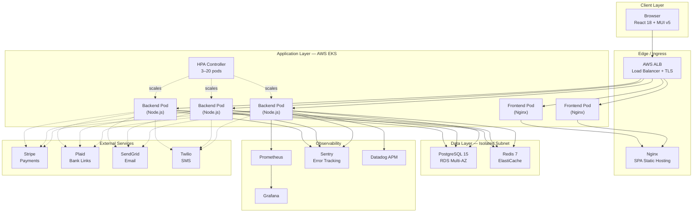
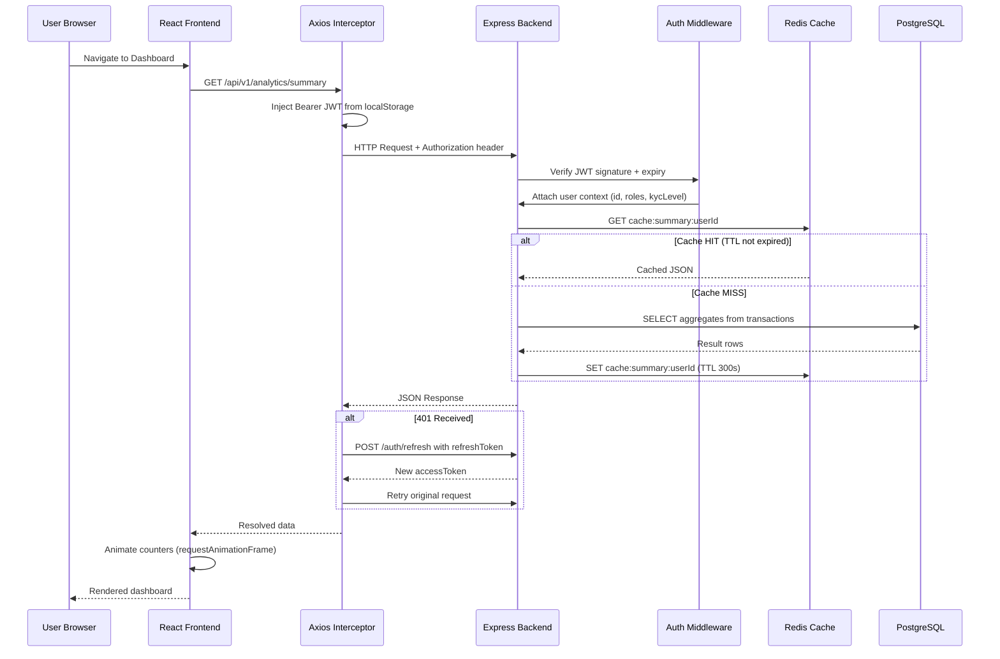
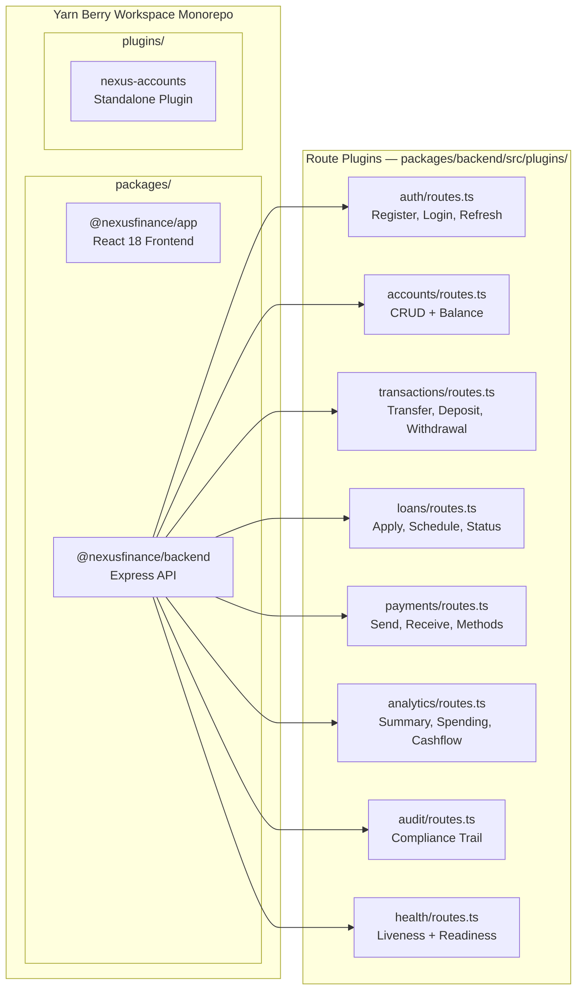
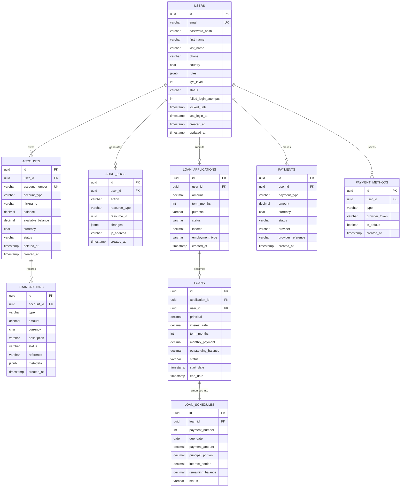
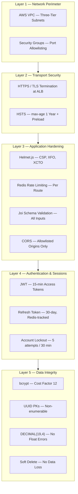
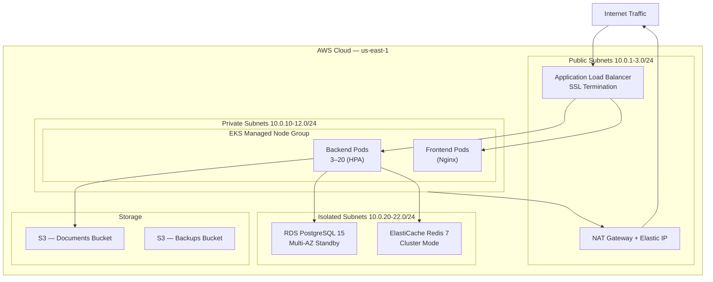
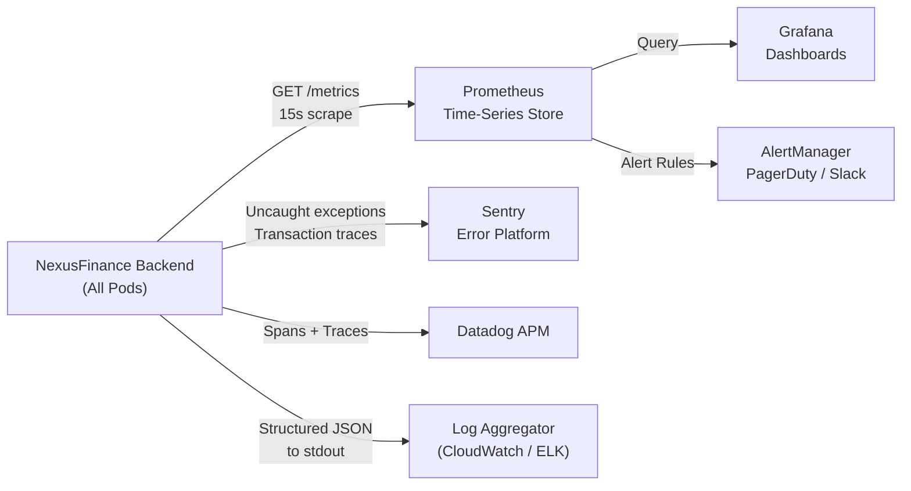

# NexusFinance — Enterprise Digital Banking Platform

> A production-grade, cloud-native digital banking and financial analytics platform built on a plugin-based monorepo architecture. Designed for scalability, regulatory compliance, and high availability.

[](https://github.com/Skillfyme-R/DevOps-Capstone-Projects/actions/workflows/ci.yml)


---

## Table of Contents

1. [Project Overview](#1-project-overview)
2. [Business Problem](#2-business-problem)
3. [Objectives](#3-objectives)
4. [Key Features](#4-key-features)
5. [Architecture](#5-architecture)
6. [Tech Stack](#6-tech-stack)
7. [Folder Structure](#7-folder-structure)
8. [Database Design](#8-database-design)
9. [API Documentation](#9-api-documentation)
10. [Security Implementation](#10-security-implementation)
11. [CI/CD Pipeline](#11-cicd-pipeline)
12. [Deployment Architecture](#12-deployment-architecture)
13. [Monitoring & Logging](#13-monitoring--logging)
14. [Installation & Setup](#14-installation--setup)
15. [Challenges & Learnings](#15-challenges--learnings)
16. [Future Enhancements](#16-future-enhancements)
17. [License](#17-license)

---

## 1. Project Overview

**NexusFinance** is an enterprise-grade digital banking platform that delivers core banking capabilities through a modern, cloud-native architecture. It provides retail banking customers with real-time account management, cross-account fund transfers, bill payments, loan applications with EMI calculation, and financial analytics — all within a secure, responsive web application.

| Attribute | Detail |
|-----------|--------|
| **Platform Name** | NexusFinance |
| **Version** | 1.0.0 |
| **Architecture** | Plugin-based Monorepo (Yarn Workspaces) |
| **Deployment Target** | AWS EKS (Kubernetes) |
| **Frontend Port** | `3003` (development) |
| **Backend Port** | `7008` (development) |
| **Supported Currencies** | USD, EUR, GBP, JPY, CAD, AUD, SGD, INR, AED |
| **Max Transaction Limit** | $500,000 / month |
| **Availability Target** | 99.9% uptime |

### Target Users

- **Retail Banking Customers** — individuals managing personal finances, transfers, loan applications, and bill payments
- **Engineering & DevOps Teams** — teams operating cloud-native financial infrastructure at scale
- **Hiring Managers & Technical Interviewers** — evaluating full-stack, DevOps, and cloud architecture competencies

### Business Value

NexusFinance demonstrates the complete engineering lifecycle required to build, deploy, and operate a financial-grade platform: secure JWT authentication with account lockout, double-entry transaction recording with ACID guarantees, Kubernetes autoscaling from 3 to 20 pods, Terraform infrastructure-as-code on AWS, and real-time Prometheus/Grafana observability — all from a single monorepo.

---

## 2. Business Problem

Traditional banking interfaces are fragmented, slow, and lack real-time visibility into personal financial health. Customers navigate multiple portals for accounts, transfers, bill payments, and loans. Backend systems are often monolithic, hard to scale, and difficult to monitor in production.

| Challenge | Business Impact |
|-----------|----------------|
| Fragmented banking portals | Poor customer experience, high drop-off rates |
| Monolithic backends | Inability to scale individual features under traffic spikes |
| No real-time analytics | Customers lack spending insights and net worth awareness |
| Weak observability | Slow incident response, undetected performance degradation |
| Manual infrastructure provisioning | Error-prone deployments, inconsistent environments across teams |
| Poor security posture | Exposure to brute-force, XSS, injection, and session attacks |
| No audit trail | Non-compliance with financial regulations (AML/KYC) |

NexusFinance addresses all of these by delivering a unified platform with plugin-based extensibility, real-time data, automated deployments, and a defense-in-depth security model.

---

## 3. Objectives

### Primary Objectives
- Deliver a fully functional digital banking experience in a single unified platform
- Implement production-grade security (JWT, bcrypt, rate limiting, account lockout, RBAC)
- Demonstrate enterprise DevOps practices across the full software delivery lifecycle

### Technical Objectives
- Build a type-safe, scalable monorepo using Yarn Berry workspaces and TypeScript
- Deploy on Kubernetes with Horizontal Pod Autoscaling (3–20 pods)
- Provision AWS cloud infrastructure with Terraform (VPC, EKS, RDS, Redis, S3)
- Automate build → test → deploy pipeline with GitHub Actions CI/CD
- Collect business and infrastructure metrics with Prometheus, visualise with Grafana

### Business Objectives
- Support 9 global currencies with configurable per-transaction and daily limits
- Enable loan applications up to $500,000 with real-time amortization scheduling
- Provide spending analytics by category, cashflow trends, and net worth tracking
- Enforce KYC-level access control for regulatory compliance

### Expected Outcomes
- Zero-downtime deployments via rolling update strategy (`maxUnavailable: 0`)
- Sub-10ms API responses on cache hits via Redis query caching
- Automatic scaling from 3 to 20 pods under traffic spikes via Kubernetes HPA
- Complete immutable audit trail for all financial operations

---

## 4. Key Features

### Core Banking Features

| Feature | Description | Business Benefit |
|---------|-------------|-----------------|
| Multi-Account Management | Create, view, and close Checking, Savings, and Investment accounts | All finances managed in one unified dashboard |
| Real-Time Balances | Live balance and available balance with Redis cache invalidation on every write | Accurate financial picture — no stale data |
| Fund Transfers | ACID-safe cross-account transfers with double-entry bookkeeping | Zero data inconsistency in money movement |
| Bill Payments | Pay bills by category (Electricity, Internet, Water, Gas, Mobile) with payee name and reference | Reduces manual payment friction with guided flow |
| Withdrawal (Debit) | Server-side insufficient funds check before every debit | Prevents overdrafts and data corruption |
| Transaction History | Filterable, searchable transaction log grouped by date with CSV export | Audit-ready financial records for customers |
| Loan Applications | Apply for loans $1,000–$500,000 with built-in EMI and amortization calculator | Transparent cost visibility drives faster credit decisions |
| Financial Analytics | Spending breakdown by category, cashflow trends, net worth sparkline | Actionable financial insights for better decision-making |

### Advanced UI Features

| Feature | Description | Business Benefit |
|---------|-------------|-----------------|
| Dark Mode | Full MUI theme toggle, persisted to `localStorage` | Accessibility and user preference support |
| Animated Balance Counters | `requestAnimationFrame` ease-out cubic animation on all monetary values | Premium, engaging user experience |
| Landing Page | Public marketing page with hero, stats grid, feature showcase, and CTA | Acquisition and onboarding conversion funnel |
| Profile Completeness Tracker | KYC progress bar with step-by-step completion actions | Drives KYC conversion and unlocks higher transaction limits |
| Grouped Transaction View | Transactions grouped by Today / Yesterday / This Week / Earlier | Fast transaction scanning without date parsing |
| EMI Calculator | Interactive sliders (amount $1K–$500K, term 12–360 months) pre-fill the loan application | Removes uncertainty; customers know their payment before applying |

### Security Features

| Feature | Description | Business Benefit |
|---------|-------------|-----------------|
| JWT Authentication | 15-minute access tokens + 30-day refresh tokens | Stateless, scalable auth with minimal blast radius on compromise |
| Silent Token Refresh | Axios interceptor silently refreshes expired tokens | Zero user interruption on token expiry |
| Account Lockout | 5 failed login attempts triggers 30-minute lockout | Brute-force protection without permanent account damage |
| Redis Rate Limiting | Per-route distributed rate limits (login: 5/min, payments: 10/min) | API abuse prevention at scale |
| Helmet.js Security Headers | CSP, HSTS, X-Frame-Options, X-Content-Type-Options | Full OWASP HTTP security hardening |
| bcrypt Password Hashing | Cost factor 12 (~250ms per hash operation) | Rainbow table and brute-force resistance |
| Joi Input Validation | Schema validation on every request body before processing | Prevents injection attacks and malformed inputs |
| Insufficient Funds Guard | Server-side balance check on every withdrawal and transfer | Prevents overdrafts and negative balance states |
| KYC Access Control | `requireKyc(level)` middleware gates high-value operations | Regulatory compliance for large transfers |

### DevOps & Scalability Features

| Feature | Description | Business Benefit |
|---------|-------------|-----------------|
| Kubernetes HPA | Auto-scales 3→20 pods on CPU (70%), memory (80%), and custom metrics | Handles traffic spikes with zero manual intervention |
| Rolling Deployments | `maxUnavailable: 0` zero-downtime rollouts | No customer-facing downtime during any release |
| Multi-Stage Docker Builds | Build stage compiles TypeScript; runtime stage is minimal Alpine image | Smaller attack surface, faster image pulls, lower storage cost |
| Terraform IaC | VPC, EKS, RDS, Redis, S3 provisioned as version-controlled code | Reproducible, auditable, and diff-able infrastructure |
| Prometheus Metrics | Custom business metrics + Node.js runtime metrics exposed at `/metrics` | Proactive incident detection before customers are impacted |
| Graceful Shutdown | 30-second SIGTERM grace period drains in-flight requests before exit | Zero dropped payment or transfer requests during pod termination |
| Request ID Tracing | UUID injected into every request, propagated through logs | Full trace correlation from client error to server log line |

---

## 5. Architecture

### High-Level System Architecture



### Request Flow — Authenticated API Call



### Backend Plugin Architecture



---

## 6. Tech Stack

### Frontend

| Technology | Version | Purpose |
|------------|---------|---------|
| React | 18.2 | Component-based UI framework |
| TypeScript | 5.1 | Static typing for compile-time reliability |
| Material UI (MUI) | 5.14 | Enterprise UI component library with theming |
| React Router | 6.15 | Client-side routing with protected route guards |
| React Query | 3.39 | Server state management, caching, and refetch control |
| Recharts | 2.7 | Financial charts — PieChart, LineChart, BarChart |
| Axios | 1.4 | HTTP client with JWT injection and refresh interceptors |
| React Hook Form | 7.45 | Performant form state and validation |
| Zustand | 4.4 | Lightweight global client state management |
| date-fns | 2.30 | Date formatting and range calculations |

### Backend

| Technology | Version | Purpose |
|------------|---------|---------|
| Node.js | 18 LTS | JavaScript server runtime |
| Express.js | 4.18 | HTTP framework with middleware chain |
| TypeScript | 5.1 | Type-safe server-side code |
| Knex.js | 3.0 | SQL query builder with migration support |
| Joi | 17.9 | Declarative request body schema validation |
| jsonwebtoken | 9.0 | JWT signing and verification |
| bcryptjs | 2.4 | Password hashing at cost factor 12 |
| Passport.js | 0.6 | Pluggable auth strategies (JWT, Google OAuth) |
| Winston | 3.10 | Structured JSON application logging |
| Morgan | 1.10 | HTTP access log middleware |
| Helmet.js | 7.0 | HTTP security headers (CSP, HSTS, XSS) |
| Compression | 1.7 | Gzip response compression |
| prom-client | 14.2 | Prometheus metrics exposure |
| rate-limiter-flexible | 3.0 | Redis-backed distributed rate limiting |
| Sentry Node SDK | 7.65 | Error tracking and performance monitoring |
| dd-trace | 4.14 | Datadog APM distributed tracing |
| Stripe | 13.4 | Payment processing SDK |
| node-cron | 3.0 | Scheduled background jobs |
| uuid | 9.0 | UUID v4 generation for all primary keys |

### Database & Cache

| Technology | Version | Purpose |
|------------|---------|---------|
| PostgreSQL | 15 | Primary ACID-compliant relational database |
| Redis | 7 | Query caching, session storage, rate limiting |

### DevOps & Infrastructure

| Technology | Purpose |
|------------|---------|
| Docker | Multi-stage containerisation for backend and frontend |
| Docker Compose | Local full-stack and infrastructure-only orchestration |
| Kubernetes | Production container orchestration with HPA |
| Terraform | AWS infrastructure provisioning as code |
| GitHub Actions | CI/CD — lint, type-check, test, build, deploy automation |
| AWS EKS | Managed Kubernetes cluster |
| AWS RDS | Managed PostgreSQL in isolated private subnet |
| AWS ElastiCache | Managed Redis cluster in isolated private subnet |
| AWS ALB | Application Load Balancer with SSL termination |
| AWS VPC | Three-tier network segmentation |
| AWS S3 | Document storage and automated database backups |
| Nginx | Reverse proxy and React SPA static file server |

### Monitoring & Observability

| Technology | Purpose |
|------------|---------|
| Prometheus | Metrics collection with custom business metrics and alert rules |
| Grafana | Operational dashboards and metrics visualisation |
| Sentry | Real-time error tracking with stack traces and release tracking |
| Datadog APM | Distributed tracing across services and pods |
| Winston | Structured JSON logging with per-service labels |
| Morgan | HTTP combined access log for request auditing |

---

## 7. Folder Structure

```text
DevOps-Capstone-Projects/
└── Project 1/                             # NexusFinance platform root
    ├── packages/
    │   ├── app/                           # React 18 frontend application
    │   │   ├── public/
    │   │   │   └── index.html             # SPA entry point
    │   │   └── src/
    │   │       ├── App.tsx                # Routes, lazy loading, protected paths
    │   │       ├── index.tsx              # Root — ThemeModeContext, QueryClient
    │   │       ├── components/
    │   │       │   ├── auth/
    │   │       │   │   └── ProtectedRoute.tsx   # JWT auth guard
    │   │       │   └── layout/
    │   │       │       ├── AppLayout.tsx        # Sidebar + TopHeader shell
    │   │       │       ├── Sidebar.tsx          # Navigation with active state
    │   │       │       └── TopHeader.tsx        # Dark mode toggle, notifications
    │   │       ├── hooks/
    │   │       │   ├── useAuth.ts         # Auth state, login/logout, token storage
    │   │       │   └── useCountUp.ts      # requestAnimationFrame counter animation
    │   │       ├── pages/
    │   │       │   ├── LandingPage.tsx    # Public marketing page
    │   │       │   ├── LoginPage.tsx      # Email + password auth form
    │   │       │   ├── RegisterPage.tsx   # Account creation
    │   │       │   ├── DashboardPage.tsx  # Net worth, quick actions, analytics
    │   │       │   ├── AccountsPage.tsx   # Account list and creation
    │   │       │   ├── AccountDetailPage.tsx   # Account statement view
    │   │       │   ├── TransactionsPage.tsx    # Search, filter, CSV export
    │   │       │   ├── PaymentsPage.tsx        # Send Money / Pay Bill (separate)
    │   │       │   ├── LoansPage.tsx           # Active loans overview
    │   │       │   ├── LoanApplyPage.tsx       # EMI calculator + application form
    │   │       │   ├── LoanDetailPage.tsx      # Amortization schedule
    │   │       │   ├── AnalyticsPage.tsx       # Advanced financial analytics
    │   │       │   ├── ProfilePage.tsx         # KYC progress tracker
    │   │       │   └── NotFoundPage.tsx        # 404 fallback
    │   │       ├── styles/
    │   │       │   └── theme.ts           # MUI theme — light/dark, brand colours
    │   │       └── utils/
    │   │           └── apiClient.ts       # Axios instance with JWT + refresh logic
    │   └── backend/                       # Express TypeScript API service
    │       ├── knexfile.js                # Knex config for CLI migration commands
    │       └── src/
    │           ├── index.ts               # Bootstrap: config → DB → Redis → Express
    │           ├── tracer.ts              # Datadog APM (must import first)
    │           ├── config/
    │           │   ├── loader.ts          # YAML + env var config loader
    │           │   └── knexfile.ts        # Knex TypeScript configuration
    │           ├── middleware/
    │           │   ├── authMiddleware.ts  # JWT verification, RBAC, KYC guards
    │           │   ├── errorHandler.ts    # Typed error classes + global handler
    │           │   ├── metrics.ts         # Prometheus counters, histograms, gauges
    │           │   ├── rateLimiter.ts     # Route-specific Redis rate limits
    │           │   └── requestId.ts       # UUID per request for distributed tracing
    │           ├── plugins/               # Domain route modules (extensible)
    │           │   ├── auth/routes.ts     # Register, login, refresh, logout, /me
    │           │   ├── accounts/routes.ts # CRUD accounts + balance management
    │           │   ├── transactions/routes.ts  # Transfer, deposit, withdrawal
    │           │   ├── loans/routes.ts    # Apply, approve, schedule, repay
    │           │   ├── payments/routes.ts # External payment processing
    │           │   ├── analytics/routes.ts # Summary, spending, cashflow
    │           │   ├── audit/routes.ts    # Compliance audit trail
    │           │   └── health/routes.ts   # Liveness and readiness probes
    │           ├── services/
    │           │   ├── database.ts        # Knex connection pool initialisation
    │           │   └── cache.ts           # Redis client, CACHE_KEYS, CACHE_TTL
    │           ├── migrations/            # Ordered, irreversible schema changes
    │           │   ├── 001_create_users.js
    │           │   ├── 002_create_accounts_transactions.js
    │           │   └── 003_create_loans.js
    │           ├── seeds/                 # Demo data for development environment
    │           │   └── 001_demo_data.js
    │           └── utils/
    │               └── logger.ts          # Winston structured logger factory
    ├── plugins/
    │   └── nexus-accounts/               # Standalone accounts plugin package
    │       └── src/index.ts
    ├── infrastructure/
    │   ├── docker/
    │   │   ├── Dockerfile.app            # Multi-stage: Node builder → Nginx runtime
    │   │   ├── Dockerfile.backend        # Multi-stage: TS compiler → Node runtime
    │   │   ├── docker-compose.yml        # Full stack: app + infra + monitoring
    │   │   ├── docker-compose.infra.yml  # Dev only: PostgreSQL + Redis
    │   │   └── nginx.conf                # SPA fallback routing (/index.html)
    │   ├── kubernetes/
    │   │   └── base/
    │   │       ├── backend-deployment.yaml   # 3 replicas, probes, resource limits
    │   │       └── backend-hpa.yaml          # HPA: CPU 70%, Memory 80%, 3–20 pods
    │   ├── terraform/
    │   │   └── modules/
    │   │       └── vpc/main.tf           # VPC, subnets, NAT, IGW, route tables
    │   └── monitoring/
    │       └── prometheus/
    │           ├── prometheus.yml         # Scrape targets + retention config
    │           └── alert-rules.yml        # Alerting rules for SLO breach
    ├── .github/
    │   └── workflows/
    │       ├── ci.yml                    # Lint → Type-check → Test → Build
    │       └── deploy.yml                # Staging → Approval Gate → Production
    ├── docs/
    │   ├── architecture/ARCHITECTURE.md
    │   ├── guides/GETTING_STARTED.md
    │   └── runbooks/INCIDENT_RESPONSE.md
    ├── app-config.yaml                   # Platform YAML config (env var references)
    ├── app-config.production.yaml        # Production config overrides
    ├── package.json                      # Monorepo root scripts and workspaces
    ├── tsconfig.json                     # Root TypeScript configuration
    ├── .eslintrc.js                      # ESLint rules for TS + React
    ├── .env.example                      # Environment variable template
    └── yarn.lock                         # Deterministic dependency lock file
```

---

## 8. Database Design

### Database Overview

PostgreSQL 15 with Knex.js migrations. All monetary values stored as `DECIMAL(19,4)` — never floating point — to guarantee precision across millions of transactions. All tables use UUID primary keys for distributed-safe, non-enumerable ID generation. The transaction table is **append-only** — no updates after insert, ensuring an immutable financial ledger.

### Entity Relationship Diagram



### Tables

| Table | Purpose | Key Design Decision |
|-------|---------|-------------------|
| `nexus_users` | User accounts with auth, roles, and KYC data | Lockout fields (attempts + locked_until) prevent brute-force without permanent bans |
| `nexus_accounts` | Bank accounts per user (Checking, Savings, Investment) | Soft delete via `deleted_at` preserves transaction history after account closure |
| `nexus_transactions` | Immutable financial ledger | Append-only design; no UPDATE after INSERT ensures tamper-proof records |
| `nexus_audit_logs` | Compliance audit trail for all state changes | Every mutation recorded with IP, timestamp, and before/after diff |
| `nexus_loan_applications` | Loan application pipeline tracking | State machine: pending → under_review → approved / rejected |
| `nexus_loans` | Active loan records linked to approved applications | Tracks outstanding balance for repayment status |
| `nexus_loan_schedules` | Pre-computed monthly amortization schedule | Calculated at loan origination using standard EMI formula |
| `nexus_payments` | External payment records (Stripe, Plaid) | Provider reference field enables reconciliation and dispute resolution |
| `nexus_payment_methods` | Saved payment instruments | Stores provider tokens only — raw card data never touches the system |

### Indexing Strategy

| Index | Table | Columns | Reason |
|-------|-------|---------|--------|
| `idx_users_email` | nexus_users | email (unique) | Login lookup — most frequent auth query |
| `idx_users_status` | nexus_users | status | Filters active-only users across all queries |
| `idx_accounts_user_id` | nexus_accounts | user_id | Fetching all accounts for a user |
| `idx_accounts_number` | nexus_accounts | account_number (unique) | Account lookup by number |
| `idx_transactions_account_id` | nexus_transactions | account_id | Statement generation |
| `idx_transactions_created_at` | nexus_transactions | created_at | Date range filtering for analytics |
| `idx_audit_user_id` | nexus_audit_logs | user_id | Compliance queries per user |
| `idx_loans_user_id` | nexus_loans | user_id | Loan dashboard fetch |

---

## 9. API Documentation

### API Overview

| Attribute | Value |
|-----------|-------|
| Base URL | `http://localhost:7008/api/v1` |
| Authentication | Bearer JWT in `Authorization` header |
| Content-Type | `application/json` |
| API Version | v1 |
| Rate Limiting | Per-route, Redis-backed distributed limits |
| Request Tracing | `X-Request-ID` header on every response |

### Endpoints

#### Authentication

| Method | Endpoint | Auth Required | Description |
|--------|----------|:---:|-------------|
| `POST` | `/auth/register` | No | Create new customer account |
| `POST` | `/auth/login` | No | Login → returns JWT access + refresh tokens |
| `POST` | `/auth/refresh` | No | Exchange refresh token for new access token |
| `POST` | `/auth/logout` | Yes | Revoke session from Redis |
| `GET` | `/auth/me` | Yes | Return authenticated user profile |

#### Accounts

| Method | Endpoint | Auth Required | Description |
|--------|----------|:---:|-------------|
| `GET` | `/accounts` | Yes | List all accounts for authenticated user |
| `POST` | `/accounts` | Yes | Open a new bank account |
| `GET` | `/accounts/:id` | Yes | Get account details and balance |
| `PATCH` | `/accounts/:id` | Yes | Update account nickname |
| `DELETE` | `/accounts/:id` | Yes | Close account (soft delete) |

#### Transactions

| Method | Endpoint | Auth Required | Description |
|--------|----------|:---:|-------------|
| `GET` | `/transactions` | Yes | List transactions (filter, paginate) |
| `GET` | `/transactions/:id` | Yes | Get single transaction details |
| `POST` | `/transactions/transfer` | Yes | ACID transfer between two accounts |
| `POST` | `/transactions/deposit` | Yes | Deposit funds into an account |
| `POST` | `/transactions/withdrawal` | Yes | Debit / bill payment from an account |

#### Loans

| Method | Endpoint | Auth Required | Description |
|--------|----------|:---:|-------------|
| `GET` | `/loans` | Yes | List all loans and applications |
| `POST` | `/loans/apply` | Yes | Submit a new loan application |
| `GET` | `/loans/:id` | Yes | Loan details with amortization schedule |
| `PATCH` | `/loans/:id` | Yes | Update loan status (admin) |

#### Payments

| Method | Endpoint | Auth Required | Description |
|--------|----------|:---:|-------------|
| `GET` | `/payments` | Yes | List payment history |
| `POST` | `/payments` | Yes | Initiate an external payment |
| `GET` | `/payments/:id` | Yes | Payment details and status |

#### Analytics

| Method | Endpoint | Auth Required | Description |
|--------|----------|:---:|-------------|
| `GET` | `/analytics/summary` | Yes | Net worth, total assets, liabilities |
| `GET` | `/analytics/spending` | Yes | Spending breakdown by category (1–6 months) |
| `GET` | `/analytics/cashflow` | Yes | Monthly income vs expense trend |
| `GET` | `/analytics/accounts` | Yes | Per-account performance metrics |

#### System

| Method | Endpoint | Auth Required | Description |
|--------|----------|:---:|-------------|
| `GET` | `/healthz/live` | No | Liveness probe (is process running?) |
| `GET` | `/healthz/ready` | No | Readiness probe (is DB + Redis connected?) |
| `GET` | `/metrics` | No | Prometheus scrape endpoint |

### Request & Response Examples

**Login Request:**

```bash
POST /api/v1/auth/login
Content-Type: application/json

{
  "email": "alex.johnson@demo.nexusfinance.io",
  "password": "password123"
}
```

**Login Response:**

```json
{
  "user": {
    "id": "3f7a1d2e-...",
    "email": "alex.johnson@demo.nexusfinance.io",
    "firstName": "Alex",
    "lastName": "Johnson",
    "roles": ["customer"],
    "kycLevel": 1
  },
  "accessToken": "eyJhbGciOiJIUzI1NiJ9...",
  "refreshToken": "eyJhbGciOiJIUzI1NiJ9..."
}
```

**Fund Transfer Request:**

```bash
POST /api/v1/transactions/transfer
Authorization: Bearer eyJhbGci...
Content-Type: application/json

{
  "fromAccountId": "uuid-checking-account",
  "toAccountId": "uuid-savings-account",
  "amount": 500.00,
  "description": "Monthly savings transfer"
}
```

**Transfer Response:**

```json
{
  "transactionId": "uuid-tx-here",
  "status": "completed",
  "amount": 500.00
}
```

### Error Response Format

All errors return a consistent envelope:

```json
{
  "error": {
    "code": "INSUFFICIENT_FUNDS",
    "message": "Insufficient funds in account",
    "statusCode": 422,
    "requestId": "req-uuid-here",
    "timestamp": "2026-01-01T10:00:00.000Z"
  }
}
```

| HTTP Code | Error Code | When Triggered |
|-----------|-----------|---------------|
| `400` | `VALIDATION_ERROR` | Invalid request body fields |
| `401` | `UNAUTHORIZED` | Missing, expired, or invalid JWT |
| `403` | `FORBIDDEN` | Insufficient role or KYC level |
| `404` | `NOT_FOUND` | Resource does not exist |
| `409` | `CONFLICT` | Email already registered |
| `422` | `BUSINESS_RULE_ERROR` | Insufficient funds, account closed |
| `429` | `RATE_LIMIT_EXCEEDED` | Too many requests on this route |
| `451` | `COMPLIANCE_ERROR` | AML/KYC restriction |

---

## 10. Security Implementation

### Defense-in-Depth Model



### JWT Token Lifecycle

| Token | Expiry | Storage | Refresh |
|-------|--------|---------|---------|
| Access Token | 15 minutes | `localStorage` | Via refresh endpoint |
| Refresh Token | 30 days | `localStorage` | — |
| Session (Redis) | 7 days | Server-side Redis | Cleared on logout |

### Rate Limiting Configuration

| Route | Limit | Window | Block Duration |
|-------|-------|--------|----------------|
| `POST /auth/login` | 5 requests | 1 minute | 2 minutes |
| `POST /auth/register` | 10 requests | 1 minute | 2 minutes |
| `POST /transactions/*` | 30 requests | 1 minute | 2 minutes |
| `POST /payments` | 10 requests | 1 minute | 2 minutes |
| All other routes | 100 requests | 1 minute | 2 minutes |

### HTTP Security Headers

| Header | Configured Value | Threat Mitigated |
|--------|-----------------|-----------------|
| `Content-Security-Policy` | `default-src 'self'` | XSS, data injection |
| `Strict-Transport-Security` | `max-age=31536000; includeSubDomains; preload` | SSL stripping |
| `X-Frame-Options` | `DENY` | Clickjacking |
| `X-Content-Type-Options` | `nosniff` | MIME type sniffing |
| `Referrer-Policy` | `no-referrer` | Information leakage |

### RBAC & KYC Middleware

```typescript
// Role-based access — only admins reach the audit trail
router.get('/audit', requireRole('admin'), auditHandler)

// KYC-level gating — Level 2+ required for high-value transfers
router.post('/transfer', requireKyc(2), transferHandler)
```

---

## 11. CI/CD Pipeline

### Pipeline Flow

```mermaid
flowchart LR
    subgraph Developer
        PUSH["git push\nto main / develop"]
    end

    subgraph CI["CI — GitHub Actions (on push / PR)"]
        LINT["1. ESLint\nMax 0 warnings"]
        TYPE["2. TypeScript\ntsc --noEmit"]
        TEST["3. Jest Tests\npassWithNoTests"]
        SEC["4. Yarn Audit\nSecurity scan"]
        BUILD["5. Build\nTS + React"]
        DOCK["6. Docker Build\nMulti-stage image"]
    end

    subgraph CD["CD — GitHub Actions (on main merge)"]
        STAGE["7. Staging Deploy\nEKS Rolling Update"]
        SMOKE["8. Smoke Tests\n/healthz/ready"]
        GATE["9. Manual Approval\nRequired"]
        PROD["10. Production Deploy\nEKS Rolling Update"]
        REL["11. GitHub Release\nVersion Tag"]
        NOTIFY["12. Slack Notification\nSuccess / Failure"]
    end

    PUSH --> LINT --> TYPE --> TEST --> SEC --> BUILD --> DOCK
    DOCK --> STAGE --> SMOKE --> GATE --> PROD --> REL --> NOTIFY
```



### CI Jobs

| Job | Tool | Failure Behaviour |
|-----|------|------------------|
| Lint | ESLint (max 0 warnings) | Blocks merge |
| Type Check | `tsc --noEmit` | Blocks merge |
| Tests | Jest with `--passWithNoTests` | Blocks merge |
| Security Audit | `yarn npm audit` | Advisory only |
| Build Backend | `tsc --project tsconfig.json` | Blocks merge |
| Build Frontend | `react-scripts build` | Blocks merge |
| Docker Build | Multi-stage build verification | Blocks merge |

### Deployment Strategy

```yaml
strategy:
  type: RollingUpdate
  rollingUpdate:
    maxSurge: 1          # One extra pod spun up during update
    maxUnavailable: 0    # Never remove a pod before the new one passes readiness
```

Database migrations are applied **before** the new code version is deployed — ensuring backward compatibility during the rolling window when both old and new pods coexist.

---

## 12. Deployment Architecture

### AWS Infrastructure



### Kubernetes Resource Specifications

| Resource | Specification |
|----------|--------------|
| Deployment Replicas | 3 (minimum for HA) |
| Max Replicas (HPA) | 20 |
| HPA CPU Threshold | 70% average utilisation |
| HPA Memory Threshold | 80% average utilisation |
| CPU Request | 250m |
| CPU Limit | 1000m (1 vCPU) |
| Memory Request | 512Mi |
| Memory Limit | 1Gi |
| Liveness Probe | `GET /healthz/live` — 15s interval, 3 failures = restart |
| Readiness Probe | `GET /healthz/ready` — 10s interval, 3 failures = remove from LB |
| Startup Probe | 30 polls × 10s = 5-minute budget for cold start |
| Termination Grace Period | 30 seconds |
| Security Context | `runAsUser: 1001` (non-root container) |

### Terraform Modules

| Module | AWS Resources Provisioned |
|--------|--------------------------|
| `vpc` | VPC (10.0.0.0/16), 9 subnets across 3 AZs, Internet Gateway, NAT Gateway, route tables |
| `eks` | EKS cluster, managed node groups, IAM roles, OIDC provider |
| `rds` | RDS PostgreSQL Multi-AZ, parameter group, subnet group, security group |
| `redis` | ElastiCache Redis cluster, subnet group, security group |
| `s3` | Documents bucket, backups bucket, lifecycle policies, bucket policies |

---

## 13. Monitoring & Logging

### Observability Architecture



### Custom Business Metrics

| Metric Name | Type | Labels | What It Measures |
|-------------|------|--------|-----------------|
| `nexusfinance_http_request_duration_seconds` | Histogram | method, route, status_code | API latency by endpoint — feeds SLO dashboards |
| `nexusfinance_transactions_total` | Counter | type, currency, status | Transaction throughput by type and outcome |
| `nexusfinance_active_sessions` | Gauge | — | Number of concurrent authenticated sessions |
| `nexusfinance_fraud_alerts_total` | Counter | severity | Fraud detection rate over time |
| `nexusfinance_loan_approval_rate_percent` | Gauge | — | Credit underwriting efficiency KPI |
| `nexusfinance_payment_volume_usd_total` | Counter | provider | Revenue-linked payment volume tracking |

### Prometheus Alert Rules

| Alert Name | Trigger Condition | Severity | Response |
|-----------|------------------|----------|---------|
| `HighErrorRate` | 5xx errors > 5% of requests for 5m | Critical | Page on-call engineer |
| `SlowAPIResponse` | p99 latency > 2s for 5 minutes | Warning | Investigate DB / cache |
| `PodCrashLoop` | CrashLoopBackOff detected | Critical | Auto-rollback deployment |
| `HighMemoryUsage` | Pod memory > 85% for 10 minutes | Warning | Review HPA scaling |
| `DBConnectionPoolExhausted` | Pool exhausted > 2 minutes | Critical | Page database team |
| `RateLimitSpike` | 429 responses > 100/min | Warning | Review for DDoS patterns |

### Logging Strategy

| Layer | Tool | Format | Purpose |
|-------|------|--------|---------|
| Application | Winston | Structured JSON with `requestId`, `userId`, level | Correlated log search across pods |
| HTTP Access | Morgan | Combined format (IP, method, path, status, duration) | Request audit trail |
| Kubernetes | Container stdout | JSON captured by node agent | Centralised aggregation |
| Infrastructure | AWS CloudWatch | VPC flow logs, EKS control plane | Network and cluster audit |

---

## 14. Installation & Setup

### Prerequisites

| Tool | Minimum Version | Install Check |
|------|----------------|---------------|
| Node.js | 18.x LTS | `node --version` |
| Yarn | 4.x (Berry) | `yarn --version` |
| Docker Desktop | Latest stable | `docker --version` |
| nvm | Any | `nvm --version` |
| AWS CLI | 2.x (for EKS) | `aws --version` |
| kubectl | 1.27+ (for K8s) | `kubectl version` |
| Terraform | 1.5+ (for IaC) | `terraform --version` |

### Clone the Repository

```bash
git clone https://github.com/Skillfyme-R/DevOps-Capstone-Projects.git
cd "DevOps-Capstone-Projects/Project 1"
```

### Environment Variables

```bash
cp .env.example .env
```

Edit `.env` with your local values:

```env
# Database
NEXUS_DB_HOST=localhost
NEXUS_DB_PORT=5432
NEXUS_DB_USER=nexus
NEXUS_DB_PASSWORD=nexus_dev_password
NEXUS_DB_NAME=nexusfinance_dev

# Cache
NEXUS_REDIS_URL=redis://localhost:6380

# Security
NEXUS_BACKEND_SECRET=your-jwt-secret-minimum-32-characters-long
NEXUS_SESSION_SECRET=your-session-secret-here

# Environment
NEXUS_ENVIRONMENT=development
```

### Step-by-Step Local Setup

**Step 1 — Enable Corepack and select Node 18**

```bash
corepack enable
source "$HOME/.nvm/nvm.sh" && nvm use 18
```

**Step 2 — Install all workspace dependencies**

```bash
yarn install --no-immutable
```

**Step 3 — Start PostgreSQL and Redis via Docker**

```bash
docker compose -f infrastructure/docker/docker-compose.infra.yml up -d

# Verify both containers are running
docker compose -f infrastructure/docker/docker-compose.infra.yml ps
```

**Step 4 — Run database migrations and seed demo data**

```bash
yarn db:migrate
yarn db:seed
```

**Step 5 — Start the backend API** (new terminal)

```bash
cd packages/backend
source "$HOME/.nvm/nvm.sh" && nvm use 18
yarn start:dev
```

Expected output:
```
✓ NexusFinance API listening on http://0.0.0.0:7008
✓ Environment: development
✓ Database: nexusfinance_dev
```

**Step 6 — Start the React frontend** (new terminal)

```bash
cd packages/app
source "$HOME/.nvm/nvm.sh" && nvm use 18
yarn start
```

Expected output:
```
Compiled successfully!
Local: http://localhost:3003
```

### Access Points

| URL | Description |
|-----|-------------|
| `http://localhost:3003` | React frontend application |
| `http://localhost:7008/healthz/live` | Backend liveness check |
| `http://localhost:7008/healthz/ready` | Backend readiness check |
| `http://localhost:7008/metrics` | Prometheus metrics endpoint |

### Demo Credentials

| Role | Email | Password |
|------|-------|----------|
| Customer | `alex.johnson@demo.nexusfinance.io` | `password123` |

### Full Docker Stack (Including Monitoring)

```bash
docker compose -f infrastructure/docker/docker-compose.yml up -d
```

| Service | URL | Credentials |
|---------|-----|-------------|
| Frontend | `http://localhost:3000` | — |
| Backend API | `http://localhost:7008` | — |
| Prometheus | `http://localhost:9090` | — |
| Grafana | `http://localhost:4000` | admin / admin |
| Adminer (DB UI) | `http://localhost:8080` | See .env |

### Kubernetes Deployment

```bash
# Set up AWS credentials and EKS context
aws configure
aws eks update-kubeconfig --region us-east-1 --name nexusfinance-production

# Deploy to cluster
kubectl apply -k infrastructure/kubernetes/overlays/prod

# Monitor rollout
kubectl rollout status deployment/nexusfinance-backend -n nexusfinance
```

### Terraform Infrastructure Provisioning

```bash
cd infrastructure/terraform/environments/dev
terraform init
terraform plan -out=tfplan
terraform apply tfplan
```

---

## 15. Challenges & Learnings

### Technical Challenges

| Challenge | Root Cause | Resolution |
|-----------|-----------|-----------|
| Yarn Berry PnP failing in GitHub Actions CI | Actions runners do not have `corepack` enabled by default | Added explicit `corepack enable` step before all `yarn` commands in every CI job |
| Redis cache returning stale balances after delete/deposit | Cache not invalidated on write operations | Added `cache.del(CACHE_KEY)` immediately after every mutation in backend route handlers |
| React Query serving stale account data across page navigation | Default `staleTime` caused cached responses to persist in memory across routes | Set `staleTime: 0, cacheTime: 0, refetchOnMount: true` on all financial data queries |
| Webpack chunk crash: `Cannot read properties of undefined (reading 'call')` | JSX elements (`<Icon />`) used in module-level constant arrays run `React.createElement` before React initialises in split chunks | Replaced JSX instances with component class references in constants; render with `<cat.Icon />` inside component functions |
| Spending chart rendering empty | API returns all monetary amounts as strings; Recharts requires numbers | Added `parseFloat()` on all amount fields before mapping to chart data structures |
| TypeScript compilation errors on API response types | Frontend interfaces didn't match actual API response shape | Defined explicit response interfaces (`SpendingResponse`, `SpendingChartItem`) matching exact API payload |
| Pay Bill and Send Money showing identical UI | Both quick actions navigated to `/payments` with no differentiation | Introduced `?tab=bill` URL query parameter; each flow conditionally renders only its own form — no shared tab bar |
| Git submodule conflict preventing push | Inner `.git` folder in Project 1 created a nested repository | Removed inner `.git`, ran `git rm --cached "Project 1"` then re-added as regular tracked files |

### Architecture Challenges & Decisions

| Decision Point | Option Chosen | Rationale |
|---------------|--------------|-----------|
| Repository structure | Yarn Berry monorepo with workspaces | Shared TypeScript types, unified CI pipeline, single dependency lock file |
| Backend extensibility | Plugin-based Express route modules | Each domain (auth, accounts, loans) is independently testable and can be extracted to a microservice |
| Authentication | Stateless JWT + Redis session tracking | Horizontal scaling without sticky sessions; Redis enables instant logout and token revocation |
| Data deletion | Soft delete via `deleted_at` timestamp | Transaction history is preserved post-closure; regulatory compliance requires immutable records |
| Currency storage | `DECIMAL(19,4)` in PostgreSQL | Float arithmetic introduces rounding errors that compound across millions of transactions |

### Performance Challenges

| Challenge | Solution | Measured Improvement |
|-----------|---------|---------------------|
| Analytics aggregation slow on large transaction tables | Redis cache with 5-minute TTL on all summary endpoints | ~200ms DB query → sub-10ms cache hit |
| Balance reads on every page navigation | Per-account cache key with invalidation on write | Eliminated redundant DB round-trips for unchanged balances |
| Dashboard re-renders causing API floods | React Query with `refetchOnWindowFocus: true` and deduplication | Single request per focus event; no duplicate concurrent calls |

### Key Engineering Learnings

- **Monetary precision is non-negotiable**: `DECIMAL(19,4)` vs `FLOAT` is not a performance trade-off — it is a correctness requirement. Floating-point rounding errors in financial systems lead to real money discrepancies.
- **Cache invalidation discipline**: Caching without explicit invalidation creates silent correctness bugs. Every write operation must identify and clear all affected cache keys.
- **Graceful shutdown in containers**: Kubernetes sends `SIGTERM` before killing a pod. Without a 30-second grace period, in-flight payment and transfer requests are dropped mid-transaction.
- **Module-level JSX is a webpack anti-pattern**: JSX is syntactic sugar for `React.createElement`. In webpack code-split chunks, calling it at module initialisation runs before React is available. Component class references must be used in constants; JSX only inside render functions.
- **Separate concerns at the URL level**: Using `?tab=bill` to differentiate Pay Bill from Send Money keeps routing clean, supports deep-linking, and eliminates shared state between two functionally distinct flows.
- **Migrations before code deployment**: In a rolling update, both old and new pod versions run simultaneously. Migrations must be backward-compatible with the previous code version during the rollout window.

---

## 16. Future Enhancements

| Enhancement | Description | Business Impact |
|-------------|-------------|----------------|
| Google / GitHub OAuth | Social login via Passport.js strategies (already scaffolded in config) | Reduces registration friction; increases signup conversion |
| Multi-Factor Authentication | TOTP (Google Authenticator) + SMS OTP via Twilio | Meets PSD2 Strong Customer Authentication requirements |
| Plaid Bank Aggregation | Link external bank accounts via Plaid (API keys configured) | Enables ACH transfers and full financial picture across all institutions |
| AI Spending Insights | ML-based transaction categorisation and anomaly detection | Proactive fraud alerts and personalised financial coaching |
| React Native Mobile App | Shared business logic and API client across web and mobile | Captures 70%+ mobile-first banking users |
| WebSocket Push Notifications | Real-time alerts for transactions, login events, payment confirmations | Eliminates polling; instant customer awareness of account activity |
| Stripe Payment Integration | Card payments and direct debit (Stripe SDK already installed) | Revenue from payment processing fees |
| Multi-Currency FX | Live exchange rates with cross-currency transfer support | Serves international and diaspora customer segments |
| Automated Credit Scoring | Cashflow-based underwriting using 12 months of transaction history | Faster, fairer loan decisions; expanded credit access |
| Kubernetes Service Mesh (Istio) | mTLS between all pods, traffic management, circuit breakers | Zero-trust internal network with fine-grained observability |
| Blue/Green Deployments | Two identical production environments; instant traffic switchover | Eliminates rolling update window risk; instant rollback capability |
| Database Read Replicas | RDS read replica handling all analytics and reporting queries | Offloads heavy aggregations from the transactional primary database |
| Event Sourcing | Append-only event log as the authoritative system of record | Complete temporal query capability; full regulatory audit trail replay |
| GDPR Compliance Tooling | One-click data export and right-to-erasure workflow | EU regulatory compliance; customer data rights management |
| Chaos Engineering | Scheduled fault injection via LitmusChaos on staging | Validates resilience before failures occur in production |

---

## 17. License

This project is developed and maintained by **Learnsyte Learning Private Limited (Skillfyme)**.

All rights reserved. Unauthorised reproduction, distribution, or modification of this codebase or its documentation is strictly prohibited without prior written consent from Learnsyte Learning Private Limited.

| | |
|---|---|
| **Organisation** | Learnsyte Learning Private Limited |
| **Brand** | Skillfyme |
| **Website** | [skillfyme.in](https://skillfyme.in) |
| **Repository** | [github.com/Skillfyme-R/DevOps-Capstone-Projects](https://github.com/Skillfyme-R/DevOps-Capstone-Projects) |

---

<div align="center">
  <strong>NexusFinance — Enterprise Digital Banking, built with production-grade engineering by Skillfyme</strong>
</div>
