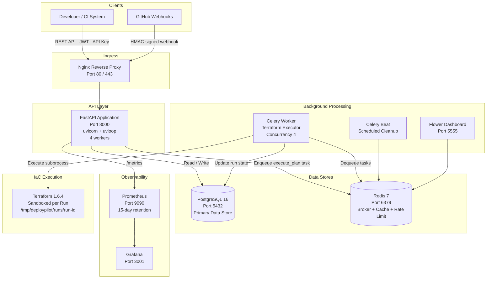
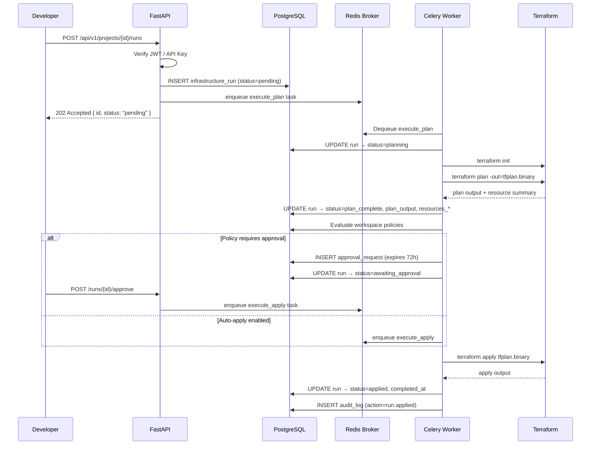
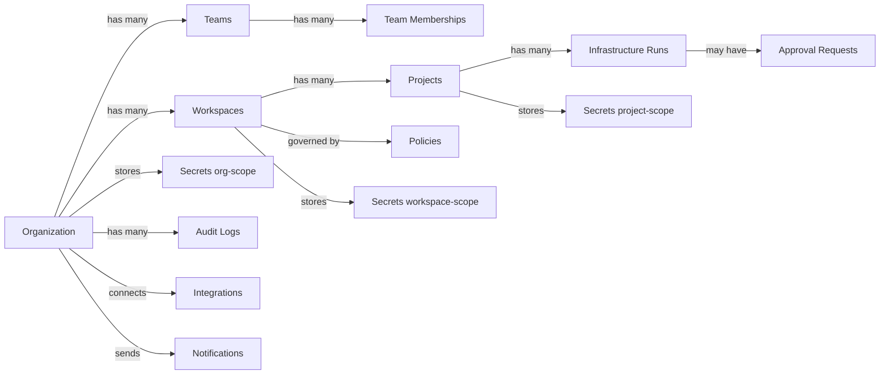
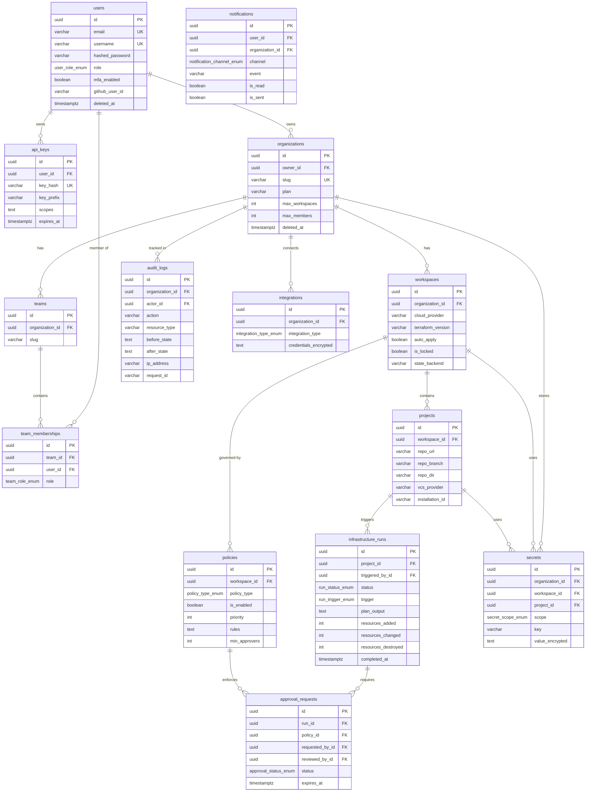
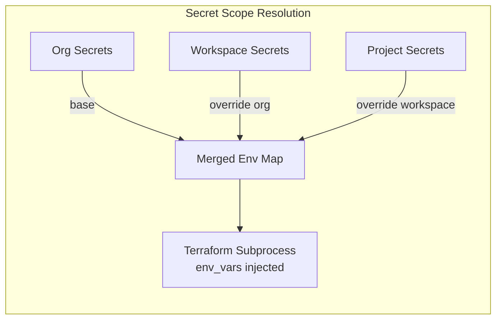
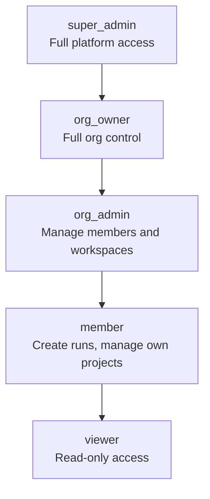
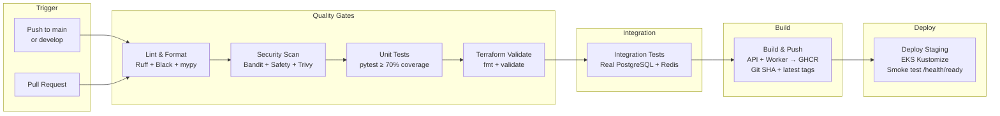
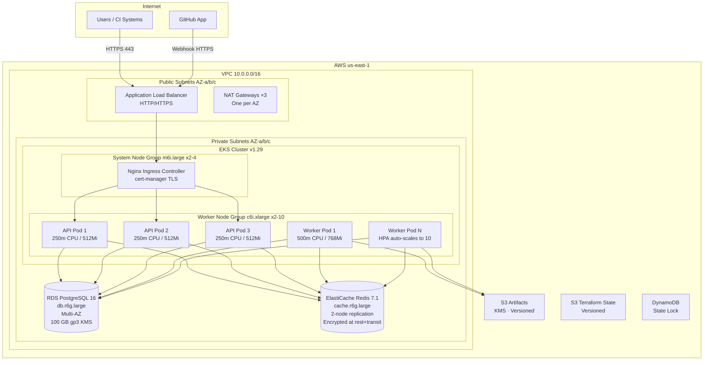

# DeployPilot — Cloud Infrastructure Automation SaaS Platform

> **CloudForge Technologies** | Enterprise-Grade Terraform Workflow Automation | GitOps-Driven Infrastructure Management

---

## 1. Project Overview

**DeployPilot** is a production-ready, multi-tenant SaaS platform that automates cloud infrastructure provisioning and management through GitOps-driven Terraform workflows. Built for **CloudForge Technologies**, the platform enables engineering teams to collaborate on infrastructure changes with the same rigour applied to application code — pull request reviews, policy gates, approval workflows, and full audit trails.

| Attribute | Detail |
|---|---|
| **Platform Type** | Cloud Infrastructure Automation SaaS |
| **Architecture** | Async REST API + Distributed Background Workers |
| **Primary Language** | Python 3.12 (async/await throughout) |
| **API Framework** | FastAPI with full OpenAPI documentation |
| **Background Processing** | Celery 5 + Redis 7 |
| **Database** | PostgreSQL 16 with async SQLAlchemy 2.x ORM |
| **IaC Engine** | Terraform 1.6.x (plan, apply, destroy) |
| **Target Users** | Platform Engineering, DevOps, SRE, Infrastructure Teams |
| **Deployment Targets** | Docker Compose (local) → AWS EKS (production) |

### Business Value

| Stakeholder | Value Delivered |
|---|---|
| Engineering Teams | Self-service infrastructure with guardrails — no waiting for ops tickets |
| Platform / SRE Teams | Centralised visibility, policy enforcement, and full audit trails |
| Compliance / Security | Immutable audit logs, secrets encryption, RBAC, approval gates |
| Engineering Leadership | Risk-free infrastructure changes with cost and resource controls |

---

## 2. Business Problem

Modern engineering organisations face a critical gap between application delivery velocity and infrastructure change management:

- **Ungoverned Terraform runs** — engineers run `terraform apply` locally with no review, no approval, and no audit trail
- **Secret sprawl** — AWS credentials, database passwords, and API keys stored in `.env` files, Slack messages, or shared drives
- **No policy enforcement** — costly or destructive changes (destroying production databases, provisioning expensive instance types) go unchecked
- **Broken collaboration** — infrastructure changes are not tied to pull requests, making it impossible to correlate a deployment with a code change
- **Zero observability** — teams have no visibility into who changed what, when, and whether it succeeded

DeployPilot solves all of these by providing a centralised platform where every Terraform operation is triggered through a structured workflow, gated by configurable policies, approved by designated reviewers, executed in an isolated container, and recorded in an immutable audit log.

---

## 3. Objectives

### Primary Objectives
- Provide a **production-grade SaaS API** that orchestrates Terraform plan and apply operations end-to-end
- Enforce **policy-based approval gates** before any infrastructure change is applied
- Maintain a **complete audit trail** of every infrastructure action and user event

### Technical Objectives
- Implement **async-first architecture** using Python asyncio, FastAPI, and asyncpg throughout the stack
- Build a **multi-tenant data model** with Organisation → Team → Workspace → Project → Run hierarchy
- Execute Terraform as **isolated async subprocesses** with secret injection and sandboxed working directories
- Deliver **Kubernetes-native deployment** with HPA, PDB, rolling updates, and IRSA-based IAM

### Business Objectives
- Reduce mean time to infrastructure change from days (manual review) to hours (automated workflow)
- Eliminate credential exposure through Fernet-encrypted secrets stored in the platform database
- Enable compliance teams to query structured audit logs rather than scraping terminal history

### Expected Outcomes
- Full GitOps workflow: PR → plan → review → approve → apply → audit
- Zero-downtime deployments via Kubernetes rolling update strategy (maxUnavailable: 0)
- SOC 2-ready audit logging and secrets management

---

## 4. Key Features

| Feature | Description | Business Benefit |
|---|---|---|
| **JWT + API Key Auth** | Dual authentication: short-lived JWT access tokens (60 min) + long-lived API keys with SHA-256 hashing | Supports both human users and programmatic CI/CD access |
| **RBAC — 5 Roles** | `super_admin`, `org_owner`, `org_admin`, `member`, `viewer` with hierarchical permissions | Principle of least privilege enforced at the API layer |
| **Team Roles** | 5 team-level roles: `owner`, `admin`, `maintainer`, `contributor`, `viewer` | Fine-grained access control within organisations |
| **Multi-Tenant Hierarchy** | Organisation → Team → Workspace → Project → InfrastructureRun | Each customer's data is logically isolated |
| **Async Terraform Engine** | Plan, apply, and destroy via `asyncio.create_subprocess_exec` — non-blocking, streamed output | No thread starvation under concurrent runs |
| **13-State Run Machine** | `pending → queued → planning → plan_complete → awaiting_approval → approved → applying → applied` | Clear lifecycle visibility and idempotent state transitions |
| **Policy Engine** | 5 policy types: `require_approval`, `cost_threshold`, `resource_block`, `auto_apply`, `merge_guard` | Prevents costly or destructive changes from auto-applying |
| **Approval Workflows** | Human approval gate between plan completion and apply execution, with expiry (72 hours) | Compliance requirement satisfied without process friction |
| **Secrets Management** | Fernet symmetric encryption at rest; secrets injected as environment variables at run time | No plaintext credentials in Terraform variable files |
| **GitHub App Integration** | Webhook handler with HMAC-SHA256 signature verification, push and PR event handling | Enables PR-driven GitOps infrastructure workflows |
| **Audit Logging** | Immutable event log for every resource mutation with actor, IP, before/after state snapshots | SOC 2 / ISO 27001 compliance evidence |
| **Celery Worker Fleet** | Background task processing with priority queues, retry logic, and idempotent task design | Decouples API latency from long-running Terraform operations |
| **Prometheus Metrics** | Custom business metrics: run totals, duration histograms, active run gauges, policy violation counters | Real-time operational visibility and SLA tracking |
| **Celery Flower Dashboard** | Web UI for monitoring Celery task queues and worker health | Operations team can investigate stuck or failed runs |
| **Kubernetes HPA** | Worker deployment scales from 2 to 10 replicas at 70% CPU threshold | Handles burst infrastructure provisioning automatically |
| **Multi-Stage Docker Builds** | Separate dependency and runtime layers; Terraform 1.6.4 binary bundled in image | Minimal image size, fully reproducible builds |
| **Rate Limiting** | Sliding-window per IP (100 req/60 s default) backed by Redis sorted sets | Prevents API abuse and protects Terraform operations |
| **Request ID Correlation** | Every request assigned a unique `X-Request-ID` bound to structlog context | Trace a single request across API logs, worker logs, and Prometheus |
| **Structured Logging** | JSON-formatted logs via `structlog` with context binding per request | Machine-parseable logs compatible with ELK, Datadog, and CloudWatch |

---

## 5. Architecture Diagram

### System Architecture



### Request Flow — Trigger an Infrastructure Run



### Multi-Tenant Data Model



---

## 6. Tech Stack

### Backend

| Technology | Version | Purpose |
|---|---|---|
| Python | 3.12 | Primary language — async/await throughout |
| FastAPI | 0.115.0 | REST API framework with automatic OpenAPI docs |
| SQLAlchemy | 2.0.36 | Async ORM with `mapped_column` and type annotations |
| asyncpg | 0.30.0 | Async PostgreSQL driver (runtime queries) |
| psycopg2-binary | 2.9.10 | Sync PostgreSQL driver (Alembic migrations only) |
| Alembic | 1.13.3 | Database schema migrations (raw idempotent SQL) |
| Pydantic v2 | 2.9.2 | Request / response validation |
| pydantic-settings | 2.5.2 | Environment-variable-backed configuration |
| python-jose | 3.3.0 | JWT creation and verification (HS256) |
| bcrypt | 4.2.0 | Password hashing (12 salt rounds) |
| cryptography | 43.0.3 | Fernet symmetric encryption for secrets at rest |
| structlog | 24.4.0 | Structured JSON logging with context binding |
| httpx | 0.27.2 | Async HTTP client for GitHub API integration |
| uvicorn + uvloop | 0.31.0 | High-performance ASGI server |

### Background Processing

| Technology | Version | Purpose |
|---|---|---|
| Celery | 5.4.0 | Distributed task queue |
| Redis (hiredis) | 5.1.1 | Celery broker + result backend + rate limit store |
| Flower | Latest | Celery task monitoring web UI |
| prometheus-fastapi-instrumentator | 7.0.0 | Automatic HTTP metrics instrumentation |
| prometheus-client | 0.21.0 | Custom business metrics (Counter, Histogram, Gauge) |

### Database

| Technology | Detail | Purpose |
|---|---|---|
| PostgreSQL | 16 | Primary relational data store |
| UUID primary keys | `gen_random_uuid()` | Globally unique, non-sequential IDs |
| Custom enum types | 9 PostgreSQL enums | Type-safe state machines enforced at DB level |
| TIMESTAMPTZ columns | All timestamps | Timezone-correct audit trail |
| Partial indexes | 9 strategic indexes | Optimised lookup patterns |
| Soft deletes | `deleted_at` column | Non-destructive user/org/project removal |

### DevOps

| Technology | Purpose |
|---|---|
| Docker | Multi-stage container builds (deps + runtime) |
| Docker Compose | 10-service local development stack |
| Kubernetes (EKS 1.29) | Production container orchestration |
| Kustomize | Kubernetes manifest templating (base + overlays) |
| Nginx | Reverse proxy, TLS termination, rate limiting |
| GitHub Actions | CI/CD pipeline automation |

### Cloud (AWS)

| Service | Configuration | Purpose |
|---|---|---|
| EKS 1.29 | System nodes (m6i.large ×2-4), Worker nodes (c6i.xlarge ×2-10) | Kubernetes cluster |
| RDS PostgreSQL 16 | db.r6g.large, Multi-AZ, 100 GB gp3, 14-day backups | Managed database |
| ElastiCache Redis 7.1 | cache.r6g.large, 2-node replication, at-rest + in-transit encryption | Managed cache / broker |
| VPC | Multi-AZ, public + private subnets, NAT Gateways ×3 | Network isolation |
| S3 | Versioning + KMS encryption | Artifacts and Terraform state |
| DynamoDB | PAY_PER_REQUEST | Terraform state locking |
| IAM (IRSA) | Pod-level role assumption | AWS permissions without node credentials |

### Monitoring

| Technology | Purpose |
|---|---|
| Prometheus | Metrics collection and storage (15-day retention) |
| Grafana | Metrics dashboards and alerting |
| structlog | Structured JSON logs with request ID correlation |
| Flower | Celery worker and queue health monitoring |
| K8s liveness / readiness probes | Automated pod health management |

---

## 7. Folder Structure

```text
Project 10/
├── deploypilot/                        # Main application package
│   ├── main.py                         # FastAPI app factory — middleware, routes, lifespan
│   ├── api/
│   │   └── v1/
│   │       ├── routes/                 # FastAPI route handlers
│   │       │   ├── auth.py             # Register, login, refresh, GitHub OAuth
│   │       │   ├── organizations.py    # Org CRUD + member management
│   │       │   ├── workspaces.py       # Workspace CRUD + lock/unlock
│   │       │   ├── runs.py             # Trigger, approve, reject, cancel runs
│   │       │   ├── audit.py            # Audit log queries
│   │       │   └── webhooks.py         # GitHub App webhook handler
│   │       └── schemas/                # Pydantic request / response models
│   │           ├── auth.py             # RegisterRequest, LoginRequest, UserResponse, TokenResponse
│   │           ├── organization.py     # CreateOrgRequest, OrgResponse
│   │           ├── workspace.py        # CreateWorkspaceRequest, WorkspaceResponse
│   │           └── run.py              # CreateRunRequest, RunResponse, ApproveRunRequest
│   ├── common/
│   │   ├── exceptions/
│   │   │   └── http.py                 # ConflictError, NotFoundError, UnauthorizedError, etc.
│   │   └── middleware/
│   │       ├── auth.py                 # JWT + API key extraction, CurrentUser dependency
│   │       ├── rate_limit.py           # Redis sliding-window rate limiter (100 req/60 s)
│   │       └── request_id.py           # X-Request-ID header injection + structlog binding
│   ├── core/
│   │   ├── config.py                   # Pydantic-settings (50+ env vars, typed, validated)
│   │   ├── database.py                 # Async SQLAlchemy engine + session factory
│   │   ├── redis.py                    # Async Redis connection pool
│   │   ├── security.py                 # JWT, bcrypt, API key, HMAC webhook utilities
│   │   └── logging.py                  # structlog JSON configuration
│   ├── db/
│   │   ├── alembic.ini                 # Alembic configuration
│   │   ├── env.py                      # Alembic env — sync psycopg2 connection for migrations
│   │   └── migrations/
│   │       └── 001_initial_schema.py   # All 14 tables + 9 enums in idempotent raw SQL
│   ├── models/                         # SQLAlchemy ORM models (14 models)
│   │   ├── base.py                     # UUID, Timestamp, SoftDelete mixins
│   │   ├── user.py                     # User + UserRole enum (5 roles)
│   │   ├── organization.py             # Organization
│   │   ├── team.py                     # Team + TeamMembership + TeamRole enum
│   │   ├── workspace.py                # Workspace
│   │   ├── project.py                  # Project (VCS-linked Terraform root module)
│   │   ├── run.py                      # InfrastructureRun + RunStatus (13 states) + RunTrigger
│   │   ├── policy.py                   # Policy + PolicyType enum (5 types)
│   │   ├── approval.py                 # ApprovalRequest + ApprovalStatus enum
│   │   ├── audit.py                    # AuditLog (immutable event stream)
│   │   ├── notification.py             # Notification + NotificationChannel enum
│   │   ├── integration.py              # Integration + IntegrationType enum (7 providers)
│   │   └── secret.py                   # Secret + SecretScope enum (org/workspace/project)
│   ├── modules/                        # Business logic services (domain-driven)
│   │   ├── auth/service.py             # Register, login, token refresh, GitHub OAuth
│   │   ├── organizations/service.py    # CRUD, slug generation, membership
│   │   ├── workspaces/service.py       # CRUD, lock/unlock
│   │   ├── projects/service.py         # CRUD
│   │   ├── runs/
│   │   │   ├── service.py              # Create, state transitions, concurrency guard
│   │   │   └── engine.py               # TerraformEngine: asyncio subprocess, plan/apply/destroy
│   │   ├── policies/service.py         # Policy evaluation against completed plans
│   │   ├── approvals/service.py        # Approve, reject, expire, request
│   │   ├── secrets/service.py          # Fernet encrypt/decrypt, scope resolution, env injection
│   │   ├── audit/service.py            # Structured event recording with before/after snapshots
│   │   ├── notifications/service.py    # Email, Slack, in-app notification dispatch
│   │   └── integrations/
│   │       ├── github_client.py        # GitHub App REST API client
│   │       └── webhook_handler.py      # Push / PR event routing
│   ├── workers/
│   │   ├── celery_app.py               # Celery factory (ack_late, prefetch=1, soft/hard limits)
│   │   └── tasks/
│   │       ├── run_tasks.py            # execute_plan, execute_apply (core infra tasks)
│   │       ├── notification_tasks.py   # Async notification delivery
│   │       └── cleanup_tasks.py        # Expire approvals (5 min), prune audit logs (daily)
│   └── monitoring/
│       ├── health.py                   # /health/live + /health/ready
│       └── metrics.py                  # Prometheus custom metrics + FastAPI instrumentator
├── docker/
│   ├── api/Dockerfile                  # Multi-stage: deps layer → runtime + Terraform 1.6.4
│   ├── worker/Dockerfile               # Same base, Celery CMD + git for VCS cloning
│   └── nginx/nginx.conf                # Reverse proxy with upstream health checks
├── k8s/base/
│   ├── namespace.yaml                  # deploypilot namespace
│   ├── api-deployment.yaml             # 3 replicas, RollingUpdate, non-root, read-only FS, PDB
│   ├── worker-deployment.yaml          # 2–10 replicas via HPA, terraform workdir emptyDir 5Gi
│   ├── ingress.yaml                    # Nginx ingress + cert-manager TLS + PodDisruptionBudget
│   └── kustomization.yaml              # Kustomize base definition
├── terraform/
│   ├── environments/production/
│   │   ├── main.tf                     # VPC + RDS + EKS + ElastiCache + S3 + DynamoDB
│   │   └── variables.tf
│   └── modules/
│       ├── networking/                 # Multi-AZ VPC, public/private subnets, NAT GWs, SGs
│       └── database/                   # RDS PostgreSQL, Multi-AZ, parameter group, backups
├── .github/workflows/
│   ├── ci.yml                          # Lint → Security → Test → Build → Deploy pipeline
│   └── terraform-plan.yml              # Auto-plan on terraform/** PR changes, post to PR
├── docs/operations/
│   └── prometheus.yml                  # Prometheus scrape configuration
├── tests/
│   ├── unit/                           # Unit tests with mocked dependencies
│   ├── integration/                    # Tests against real PostgreSQL + Redis
│   ├── e2e/                            # End-to-end API scenario tests
│   └── fixtures/factories.py           # Factory classes for test data generation
├── requirements.txt                    # Production dependencies (pinned)
├── requirements-dev.txt                # Development + test dependencies
├── pyproject.toml                      # Ruff, Black, mypy, pytest configuration
├── docker-compose.yml                  # 10-service local stack
└── .env.example                        # Environment variable template (50+ vars)
```

---

## 8. Database Design

### Database Overview

PostgreSQL 16 with 14 tables, 9 custom enum types, and UUID primary keys throughout. All timestamps use `TIMESTAMPTZ`. Soft deletes (`deleted_at`) on User, Organization, and Project. Migration is idempotent raw SQL — safe to re-run.

### Entity Relationship Diagram



### Tables

| Table | Purpose | Key Columns |
|---|---|---|
| `users` | Platform user accounts | `email` UK, `role`, `mfa_enabled`, `github_user_id`, soft-delete |
| `api_keys` | Programmatic access tokens | `key_hash` (SHA-256), `key_prefix`, `scopes`, `expires_at` |
| `organizations` | Top-level tenant unit | `slug` UK, `plan`, `max_workspaces`, `max_members`, `owner_id` |
| `teams` | Sub-groups within an organisation | `organization_id`, `slug` unique per org |
| `team_memberships` | User ↔ Team assignment | `role` (5 team-level roles), unique per team+user |
| `workspaces` | Cloud environment containers | `cloud_provider`, `terraform_version`, `auto_apply`, `is_locked` |
| `projects` | VCS-linked Terraform root modules | `repo_url`, `repo_branch`, `repo_dir`, `vcs_provider`, `installation_id` |
| `infrastructure_runs` | Terraform execution records | `status` (13-state machine), `plan_output`, `resources_*`, timing columns |
| `policies` | Governance rules per workspace | `policy_type` (5 types), `priority`, `rules` (JSON), `min_approvers` |
| `approval_requests` | Human review records | `status`, `expires_at` (72 h), `reviewed_by_id`, `comment` |
| `secrets` | Encrypted key-value pairs | `scope` (org/workspace/project), `value_encrypted` (Fernet) |
| `audit_logs` | Immutable event stream | `action`, `resource_type`, `before_state`, `after_state`, `ip_address`, `request_id` |
| `integrations` | External service connections | `integration_type` (7 providers), `credentials_encrypted` |
| `notifications` | User notification records | `channel` (4 types), `is_read`, `is_sent`, `metadata_json` |

### Enum Types

| Enum | Values |
|---|---|
| `user_role_enum` | `super_admin`, `org_owner`, `org_admin`, `member`, `viewer` |
| `team_role_enum` | `owner`, `admin`, `maintainer`, `contributor`, `viewer` |
| `run_status_enum` | `pending`, `queued`, `planning`, `plan_complete`, `awaiting_approval`, `approved`, `applying`, `applied`, `destroying`, `destroyed`, `failed`, `cancelled`, `discarded` |
| `run_trigger_enum` | `manual`, `vcs_push`, `pull_request`, `schedule`, `api` |
| `policy_type_enum` | `require_approval`, `cost_threshold`, `resource_block`, `auto_apply`, `merge_guard` |
| `approval_status_enum` | `pending`, `approved`, `rejected`, `expired` |
| `notification_channel_enum` | `email`, `slack`, `webhook`, `in_app` |
| `integration_type_enum` | `github`, `gitlab`, `bitbucket`, `slack`, `pagerduty`, `jira`, `datadog` |
| `secret_scope_enum` | `organization`, `workspace`, `project` |

### Indexing Strategy

| Index | Table | Purpose |
|---|---|---|
| `ix_users_email` | `users` | Login lookup — most frequent query |
| `ix_users_username` | `users` | Username availability check on registration |
| `ix_users_github_user_id` | `users` | GitHub OAuth user matching |
| `ix_organizations_slug` | `organizations` | Organisation lookup by URL slug |
| `ix_runs_project_id` | `infrastructure_runs` | List runs by project (paginated) |
| `ix_runs_status` | `infrastructure_runs` | Filter active runs for worker polling |
| `ix_audit_action` | `audit_logs` | Filter audit log by event type |
| `ix_audit_resource_type` | `audit_logs` | Filter by resource category |
| `ix_audit_org` | `audit_logs` | Per-organisation audit log queries |

---

## 9. API Documentation

### API Overview

All endpoints are versioned under `/api/v1`. Interactive documentation is available at `/docs` (Swagger UI) and `/redoc`.

### Authentication Methods

| Method | Header | Use Case |
|---|---|---|
| JWT Bearer Token | `Authorization: Bearer <token>` | Interactive user sessions |
| API Key | `X-API-Key: dp_<key>` | CI/CD pipelines and automation |

### Endpoints

#### Authentication — `/api/v1/auth`

| Method | Endpoint | Description | Auth |
|---|---|---|---|
| `POST` | `/api/v1/auth/register` | Register a new user (returns JWT pair) | None |
| `POST` | `/api/v1/auth/login` | Authenticate, receive JWT pair | None |
| `POST` | `/api/v1/auth/refresh` | Exchange refresh token for new access token | None |
| `GET` | `/api/v1/auth/me` | Get current authenticated user profile | JWT |
| `GET` | `/api/v1/auth/github/callback` | GitHub OAuth callback — auto-provision user | None |

#### Organizations — `/api/v1/organizations`

| Method | Endpoint | Description | Auth |
|---|---|---|---|
| `POST` | `/api/v1/organizations` | Create organisation (caller becomes owner) | JWT |
| `GET` | `/api/v1/organizations` | List organisations for current user | JWT |
| `GET` | `/api/v1/organizations/{org_id}` | Get organisation details | JWT |
| `PATCH` | `/api/v1/organizations/{org_id}` | Update organisation (owner / org_admin) | JWT |
| `DELETE` | `/api/v1/organizations/{org_id}` | Soft-delete organisation (owner only) | JWT |
| `GET` | `/api/v1/organizations/{org_id}/audit` | Query audit logs (filter by action, resource_type) | JWT |

#### Workspaces — `/api/v1/organizations/{org_id}/workspaces`

| Method | Endpoint | Description | Auth |
|---|---|---|---|
| `POST` | `/api/v1/organizations/{org_id}/workspaces` | Create workspace | JWT |
| `GET` | `/api/v1/organizations/{org_id}/workspaces` | List workspaces in organisation | JWT |
| `GET` | `/api/v1/organizations/{org_id}/workspaces/{ws_id}` | Get workspace details | JWT |
| `POST` | `/api/v1/organizations/{org_id}/workspaces/{ws_id}/lock` | Lock workspace (blocks new runs) | JWT |
| `POST` | `/api/v1/organizations/{org_id}/workspaces/{ws_id}/unlock` | Unlock workspace | JWT |
| `DELETE` | `/api/v1/organizations/{org_id}/workspaces/{ws_id}` | Delete workspace | JWT |

#### Infrastructure Runs — `/api/v1/projects/{project_id}/runs`

| Method | Endpoint | Description | Auth |
|---|---|---|---|
| `POST` | `/api/v1/projects/{project_id}/runs` | Trigger a new plan run (202 Accepted) | JWT |
| `GET` | `/api/v1/projects/{project_id}/runs` | List runs (paginated, limit 20) | JWT |
| `GET` | `/api/v1/projects/{project_id}/runs/{run_id}` | Get run details, output, and status | JWT |
| `POST` | `/api/v1/projects/{project_id}/runs/{run_id}/cancel` | Cancel run (pending/queued/awaiting only) | JWT |
| `POST` | `/api/v1/projects/{project_id}/runs/{run_id}/approve` | Approve run — triggers apply task | JWT |
| `POST` | `/api/v1/projects/{project_id}/runs/{run_id}/reject` | Reject run — transitions to discarded | JWT |

#### Webhooks & Health

| Method | Endpoint | Description |
|---|---|---|
| `POST` | `/api/v1/webhooks/github` | GitHub App webhook (HMAC-SHA256 verified) |
| `GET` | `/health/live` | Liveness probe — 200 if process running |
| `GET` | `/health/ready` | Readiness probe — 200 if DB + Redis healthy |
| `GET` | `/metrics` | Prometheus metrics exposition |

### Request / Response Examples

**Register User**
```bash
curl -X POST "http://localhost:8000/api/v1/auth/register" \
  -H "Content-Type: application/json" \
  -d '{"email":"engineer@cloudforge.io","username":"jsmith","display_name":"Jane Smith","password":"SecurePass123!"}'
```
```json
{
  "access_token": "eyJhbGciOiJIUzI1NiIsInR5cCI6IkpXVCJ9...",
  "refresh_token": "eyJhbGciOiJIUzI1NiIsInR5cCI6IkpXVCJ9...",
  "token_type": "bearer"
}
```

**Trigger Infrastructure Run**
```bash
curl -X POST "http://localhost:8000/api/v1/projects/$PROJECT_ID/runs" \
  -H "Authorization: Bearer $TOKEN" \
  -H "Content-Type: application/json" \
  -d '{"branch":"main"}'
```
```json
{
  "id": "e8c17d11-74b0-422c-bda4-88ee076f4d66",
  "project_id": "256bfceb-0d77-4c9a-a619-78c9b822efeb",
  "status": "pending",
  "trigger": "manual",
  "branch": "main",
  "resources_added": 0,
  "resources_changed": 0,
  "resources_destroyed": 0,
  "plan_output": null,
  "error_message": null,
  "created_at": "2026-07-08T07:35:48.004476Z",
  "completed_at": null
}
```

**Get Audit Logs**
```bash
curl "http://localhost:8000/api/v1/organizations/$ORG_ID/audit?limit=10" \
  -H "Authorization: Bearer $TOKEN"
```
```json
[
  {
    "id": "275bc048-d101-43ad-9179-26759a2beaf9",
    "action": "workspace.created",
    "resource_type": "workspace",
    "resource_id": "ced5f47e-e3a4-49a3-b167-c056942fb98c",
    "actor_id": "aa40f21a-9522-4cbc-986b-0217ec93435c",
    "ip_address": null,
    "created_at": "2026-07-08T07:29:24.279860Z"
  }
]
```

### Error Handling

| HTTP Status | Condition |
|---|---|
| `400 Bad Request` | Pydantic validation failure |
| `401 Unauthorized` | Missing, invalid, or expired JWT / API key |
| `403 Forbidden` | Authenticated but insufficient role |
| `404 Not Found` | Resource does not exist or is soft-deleted |
| `409 Conflict` | Duplicate email, username, or slug |
| `422 Unprocessable Entity` | Request schema mismatch |
| `429 Too Many Requests` | Rate limit exceeded (100 req/60 s) |
| `500 Internal Server Error` | Unhandled exception (details in structured logs, not response body) |

---

## 10. Security Implementation

### Authentication & Token Management

| Mechanism | Implementation | Detail |
|---|---|---|
| JWT Access Token | HS256, `python-jose` | 60-min expiry; claims: `sub`, `typ`, `iat`, `exp`, `jti` |
| JWT Refresh Token | HS256, `python-jose` | 30-day expiry; used only to obtain new access tokens |
| API Keys | SHA-256 hash stored | `dp_` prefix + 32-byte URL-safe random; compared via `hmac.compare_digest` |
| Password Hashing | bcrypt, 12 rounds | Computationally expensive to resist brute-force |
| Webhook Verification | HMAC-SHA256 | `X-Hub-Signature-256` header; timing-safe comparison |

### Secrets Management



- Fernet symmetric encryption (AES-128-CBC + HMAC-SHA256) for all secrets at rest
- Encryption key derived from application `SECRET_KEY` (production: AWS KMS envelope encryption)
- Secrets decrypted in-memory at run time — never written to disk or included in plan output
- Scope resolution: project secrets override workspace, workspace overrides organisation

### RBAC Hierarchy



### Container Security (Kubernetes)

- All pods run as **non-root user** (UID 1000, group `deploypilot`)
- `readOnlyRootFilesystem: true` on API pods
- `allowPrivilegeEscalation: false`
- All Linux capabilities dropped (`capabilities.drop: ["ALL"]`)
- Temporary storage via `emptyDir` volumes (not host mounts)

### OWASP Mitigations

| Threat | Mitigation |
|---|---|
| Injection | SQLAlchemy parameterised queries throughout; no raw SQL with user input |
| Broken Authentication | Short-lived JWTs; bcrypt passwords; timing-safe HMAC comparison |
| Sensitive Data Exposure | Fernet encryption at rest; TLS in transit (K8s ingress + ElastiCache) |
| Broken Access Control | RBAC checked on every endpoint; multi-tenant isolation by `organization_id` |
| Security Misconfiguration | Non-root containers; read-only filesystem; dropped capabilities |
| Vulnerable Components | Bandit SAST + Safety CVE scan + Trivy container scan in CI |

---

## 11. CI/CD Pipeline

### Pipeline Flow



### Pipeline Stages

| Stage | Tool | Gate Condition |
|---|---|---|
| **Lint** | Ruff (lint) + Black (format) + mypy (types) | Blocks on any lint, format, or type error |
| **SAST** | Bandit | Blocks on LOW+ severity findings in `deploypilot/` |
| **Dependency CVE** | Safety | Blocks on known vulnerabilities in requirements.txt |
| **Container Scan** | Trivy (filesystem) | Blocks on CRITICAL or HIGH CVEs |
| **Unit Tests** | pytest + coverage.py | Blocks if line coverage < 70% |
| **Integration Tests** | pytest against live PostgreSQL 16 + Redis 7 | Blocks on any test failure (120 s timeout) |
| **Terraform Validate** | `terraform fmt -check` + `terraform validate` | Blocks on formatting or schema errors |
| **Docker Build** | Docker Buildx → GHCR | Runs only on `main` after all gates pass; layer-cached |
| **Deploy Staging** | `kubectl apply -k k8s/overlays/staging` | Waits for rollout completion (5 m timeout) + smoke test |

### Terraform PR Workflow

A dedicated workflow (`terraform-plan.yml`) triggers on PRs that modify `terraform/**`:
- Runs `terraform init` → `validate` → `plan`
- Posts the full plan output as a PR comment via GitHub Script
- AWS credentials obtained via OIDC role assumption (no long-lived keys stored in CI)

---

## 12. Deployment Architecture

### AWS Production Infrastructure



### Kubernetes Resources

| Resource | Config | Notes |
|---|---|---|
| API Deployment | 3 replicas, RollingUpdate (maxSurge 1, maxUnavailable 0) | Zero-downtime deploys |
| Worker Deployment | 2–10 replicas (HPA at 70% CPU) | Scales for burst provisioning |
| API PodDisruptionBudget | minAvailable: 2 | Ensures availability during node drains |
| Nginx Ingress | TLS (cert-manager letsencrypt-prod), rate limit 100/min | TLS termination + edge rate limiting |
| API resources | Request: 250m/512Mi · Limit: 1000m/1Gi | |
| Worker resources | Request: 500m/768Mi · Limit: 2000m/2Gi | Higher limit for Terraform subprocess |

### Local Development Stack (Docker Compose)

| Service | Image | Port | Notes |
|---|---|---|---|
| `postgres` | postgres:16-alpine | 5432 | Health-checked, persistent volume |
| `redis` | redis:7-alpine | 6379 | AOF persistence enabled |
| `api` | Built locally | 8000 | Hot-reload via volume mount |
| `worker` | Built locally | — | Celery 4-concurrency |
| `beat` | Built locally | — | Cleanup task scheduler |
| `flower` | Built locally | 5555 | Task monitoring UI |
| `nginx` | nginx:1.25-alpine | 80 | Reverse proxy |
| `prometheus` | prom/prometheus | 9090 | 15-day retention |
| `grafana` | grafana/grafana | 3001 | Dashboards (admin/admin) |
| `migrate` | Built locally | — | Profile: `migrate`, runs once |

---

## 13. Monitoring & Logging

### Custom Prometheus Metrics

| Metric | Type | Labels | Description |
|---|---|---|---|
| `deploypilot_runs_total` | Counter | `trigger`, `status` | Total infrastructure runs created |
| `deploypilot_run_duration_seconds` | Histogram | `status` | End-to-end run duration (30 s–3600 s buckets) |
| `deploypilot_active_runs` | Gauge | — | Runs in non-terminal state |
| `deploypilot_approvals_pending` | Gauge | — | Approval requests awaiting review |
| `deploypilot_policy_violations_total` | Counter | `policy_type` | Policy violations during plan evaluation |
| `deploypilot_inprogress_requests` | Gauge | `method`, `path` | In-flight HTTP requests |
| HTTP request duration / count / size | Histogram/Counter | `method`, `path`, `status` | Auto-instrumented by FastAPI instrumentator |

### Structured Log Format

```json
{
  "timestamp": "2026-07-08T07:35:48.123Z",
  "level": "info",
  "event": "user_registered",
  "request_id": "550e8400-e29b-41d4-a716-446655440000",
  "user_id": "aa40f21a-9522-4cbc-986b-0217ec93435c",
  "email": "engineer@cloudforge.io"
}
```

### Health Probe Responses

| Endpoint | Healthy Response | Unhealthy Response |
|---|---|---|
| `GET /health/live` | `200 {"status": "ok"}` | Never (liveness = process is up) |
| `GET /health/ready` | `200 {"database": "ok", "redis": "ok"}` | `503 {"database": "error", "redis": "ok"}` |

---

## 14. Installation & Setup

### Prerequisites

| Requirement | Version |
|---|---|
| Docker Desktop | 24.x+ |
| Docker Compose | v2 (included with Docker Desktop) |
| Git | Any recent version |

### Clone Repository

```bash
git clone https://github.com/Skillfyme-R/DevOps-Capstone-Projects.git
cd "DevOps-Capstone-Projects/Project 10"
```

### Environment Setup

```bash
cp .env.example .env
# Minimum change for local dev: generate a SECRET_KEY
# python3 -c "import secrets; print(secrets.token_hex(32))"
# All other defaults work with Docker Compose
```

### Start Local Stack

```bash
# 1 — Start core services
docker compose up postgres redis -d

# 2 — Run database migrations (one-time)
docker compose --profile migrate run --rm migrate

# 3 — Start API and Worker
docker compose up api worker -d

# 4 — Verify health
curl -s http://localhost:8000/health/ready | jq .
# Expected: {"database": "ok", "redis": "ok"}
```

### Full Verification Walkthrough

```bash
# Register a user
curl -s -X POST http://localhost:8000/api/v1/auth/register \
  -H "Content-Type: application/json" \
  -d '{"email":"admin@example.com","username":"admin","display_name":"Admin","password":"Password123!"}' \
  | jq .

export TOKEN="<access_token from response>"

# Create an organisation
export ORG_ID=$(curl -s -X POST http://localhost:8000/api/v1/organizations \
  -H "Authorization: Bearer $TOKEN" \
  -H "Content-Type: application/json" \
  -d '{"name":"CloudForge","description":"Infrastructure org"}' | jq -r '.id')

# Create a workspace
export WORKSPACE_ID=$(curl -s -X POST \
  "http://localhost:8000/api/v1/organizations/$ORG_ID/workspaces" \
  -H "Authorization: Bearer $TOKEN" \
  -H "Content-Type: application/json" \
  -d '{"name":"production","cloud_provider":"aws","terraform_version":"1.6.4"}' \
  | jq -r '.id')

# View audit log (shows workspace.created + organization.created events)
curl -s "http://localhost:8000/api/v1/organizations/$ORG_ID/audit" \
  -H "Authorization: Bearer $TOKEN" | jq .
```

### Service URLs

| Service | URL |
|---|---|
| REST API | `http://localhost:8000` |
| Swagger UI | `http://localhost:8000/docs` |
| ReDoc | `http://localhost:8000/redoc` |
| Prometheus Metrics | `http://localhost:8000/metrics` |
| Flower (Celery) | `http://localhost:5555` |
| Prometheus | `http://localhost:9090` |
| Grafana | `http://localhost:3001` (admin/admin) |

### Stop the Stack

```bash
docker compose down          # Stop containers, preserve data volumes
docker compose down -v       # Stop containers and delete all data (clean reset)
```

---

## 15. Challenges & Learnings

### Technical Challenges

**1. PostgreSQL Enum Idempotency**

PostgreSQL does not support `CREATE TYPE IF NOT EXISTS` (unlike tables). This caused `DuplicateObjectError` when migrations were partially applied and re-run. Solved by wrapping every enum in a PL/pgSQL anonymous block that first queries `pg_type`:

```sql
DO $$ BEGIN
  IF NOT EXISTS (SELECT 1 FROM pg_type WHERE typname = 'run_status_enum') THEN
    CREATE TYPE run_status_enum AS ENUM (...);
  END IF;
END $$;
```

**2. SQLAlchemy Enum Member Names vs. Database Values**

SQLAlchemy by default sends Python enum *member names* (e.g., `MEMBER`) to PostgreSQL, but the database stores enum *values* (e.g., `member`). This caused `invalid input value for enum` errors across all 8 enum columns. Fixed by adding `values_callable` to every `Enum` column:

```python
role: Mapped[UserRole] = mapped_column(
    Enum(UserRole, name="user_role_enum",
         values_callable=lambda x: [e.value for e in x])
)
```

**3. Alembic + asyncpg Incompatibility**

Alembic is synchronous and cannot drive asyncpg connections. The initial `env.py` attempted to use asyncpg and raised `no running event loop` errors. Resolved by maintaining two drivers: asyncpg for the runtime API, psycopg2 exclusively for Alembic migrations.

**4. Pydantic v2 UUID Serialisation**

Pydantic v2 with `from_attributes=True` raises `ResponseValidationError` when response schema fields are typed as `str` but the ORM returns `uuid.UUID` objects. Fixed systematically across all 6 response schemas by changing `id: str` → `id: UUID`.

**5. Celery + asyncio Bridge**

Celery tasks are synchronous functions but call async SQLAlchemy service methods. Bridged using `asyncio.get_event_loop().run_until_complete(coro)` inside each task — allows Celery to drive async business logic without requiring a full async task executor.

**6. Async Terraform Execution**

Running `terraform plan` without blocking the asyncio event loop required `asyncio.create_subprocess_exec` rather than `subprocess.run`. Each run gets an isolated working directory created at task start and cleaned up on completion or failure via `engine.cleanup()`.

### Architecture Challenges

- **Multi-tenancy isolation**: Every database query must be scoped to the correct `organization_id` — implemented at the service layer with explicit `where` clauses, not global filters
- **13-state machine correctness**: Idempotent task design — re-running `execute_plan` on an already-finished run must be a no-op, not a state corruption — enforced by status guards at the start of each task
- **Secret scope resolution**: Project secrets must override workspace secrets, which override organisation secrets — resolved with a merge strategy in `SecretService.collect_env_for_run()`

### Key Learnings

| Learning | Impact |
|---|---|
| PostgreSQL enum types are first-class schema objects, not column metadata | Treat them with the same migration discipline as tables |
| Pydantic v2 is strict about exact type matching in response models | Type every UUID field as `uuid.UUID`, never `str` |
| Multi-stage Docker builds should bundle runtime binaries (Terraform) in the image | Eliminates sidecar containers and version drift |
| IRSA (IAM Roles for Service Accounts) is the correct AWS permissions pattern for EKS | Avoids node-level credential exposure entirely |
| `values_callable` is essential when Python enum values differ from member names | Required any time enum values use lowercase and members use uppercase |

---

## 16. Future Enhancements

| Enhancement | Priority | Business Impact |
|---|---|---|
| **React Frontend Dashboard** | High | Self-service UI for non-technical stakeholders to view run status and approve changes without curl commands |
| **Drift Detection** | High | Scheduled runs comparing live AWS state against Terraform state, alerting on unexpected manual changes |
| **Cost Estimation** | High | Infracost integration to display estimated monthly cost delta in plan output and enforce cost-threshold policies |
| **OPA Policy Engine** | Medium | Replace custom policy logic with Open Policy Agent for Rego-based governance rules sharable across teams |
| **Multi-Cloud Support** | Medium | Extend workspace model to support Azure (azurerm) and GCP (google) providers alongside AWS |
| **SSO / SAML 2.0** | Medium | Enterprise identity provider integration (Okta, Azure AD, Google Workspace) |
| **Terraform State Visualiser** | Medium | Parse and render live Terraform state as an interactive infrastructure graph |
| **VCS-Native PR Comments** | Medium | Post plan summaries directly to GitHub PR threads (similar to Atlantis / Terrateam) |
| **Webhook Retry Queue** | Low | Dead-letter queue with exponential backoff for failed webhook deliveries |
| **Plan Diff Viewer** | Low | Structured diff UI showing exactly which resource attributes change per run |
| **Audit Log Export** | Low | Streaming export to S3 or SIEM systems (Splunk, Datadog) for long-term compliance reporting |
| **Team-Based Workspace ACL** | Low | Assign workspace access permissions to teams rather than individual users |

---

## License

© Learnsyte Learning Private Limited (Skillfyme). All rights reserved.
