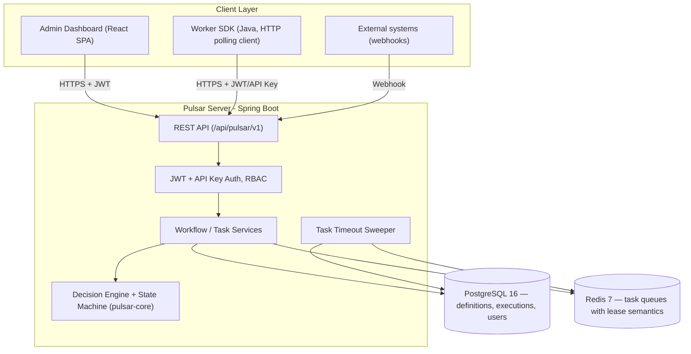
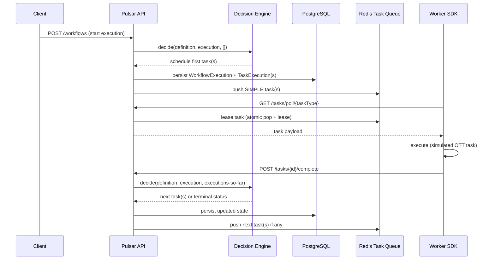
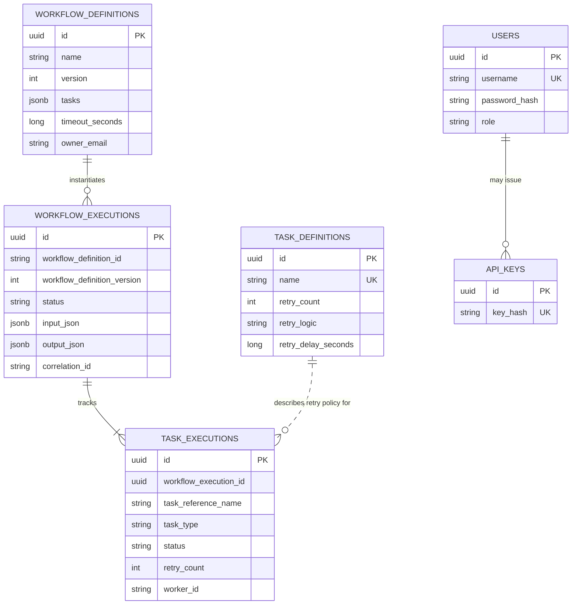
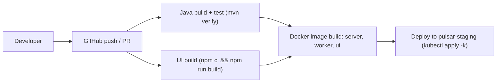
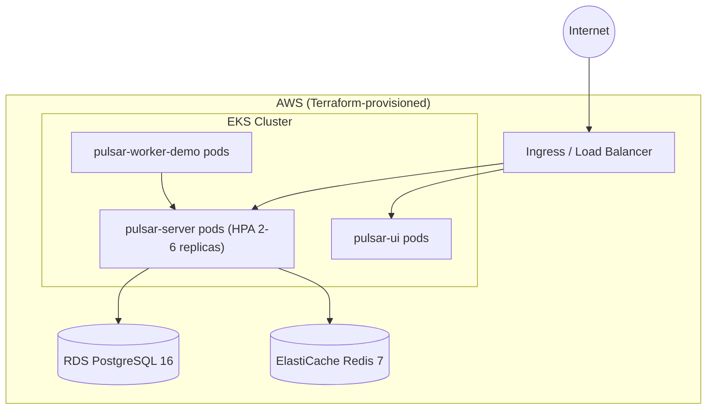

# Pulsar

**Orchestrate every frame, from ingest to stream.**

> Pulsar is a workflow orchestration engine built by **Reelforge Media**, a fictional OTT/media-technology company, architecturally inspired by [Netflix Conductor](https://github.com/Netflix/conductor). It is an original, independent implementation — no Conductor source code is reused — applying the same class of DAG-based orchestration concepts to a media-operations domain (transcoding, DRM, subtitling, content moderation, CDN publishing).


---

## Table of Contents

1. [Project Overview](#1-project-overview)
2. [Business Problem](#2-business-problem)
3. [Objectives](#3-objectives)
4. [Key Features](#4-key-features)
5. [Architecture Diagram](#5-architecture-diagram)
6. [Tech Stack](#6-tech-stack)
7. [Folder Structure](#7-folder-structure)
8. [Database Design](#8-database-design)
9. [API Documentation](#9-api-documentation)
10. [Security Implementation](#10-security-implementation)
11. [CI/CD Pipeline](#11-cicd-pipeline)
12. [Deployment Architecture](#12-deployment-architecture)
13. [Monitoring & Logging](#13-monitoring--logging)
14. [Installation & Setup](#14-installation--setup)
15. [Challenges & Learnings](#15-challenges--learnings)
16. [Future Enhancements](#16-future-enhancements)
17. [License](#17-license)

---

## 1. Project Overview

**Pulsar** is a domain-agnostic **workflow orchestration engine**: a control plane that lets an organization define multi-step business processes as JSON DAGs (Directed Acyclic Graphs), execute them reliably at scale, and observe their progress in real time. It is not a media-streaming *consumer* product — it is internal infrastructure a company like Reelforge Media would run to coordinate the backend jobs a streaming platform depends on.

| Attribute | Detail |
|-----------|--------|
| Project Name | Pulsar |
| Built By | Reelforge Media (fictional company) |
| Project Type | Workflow orchestration engine / distributed task scheduler |
| Architectural Inspiration | Netflix Conductor |
| Primary Language | Java 21 |
| Backend Framework | Spring Boot 3.3.4 |
| Frontend | React 18 + TypeScript (Vite) |
| Target Users | Platform/DevOps engineers, backend engineers automating multi-step pipelines, engineering leadership needing execution visibility |

**Business value:** Pulsar centralizes orchestration logic that would otherwise be scattered across cron jobs, message-queue glue code, and tribal knowledge. A workflow author declares *what* should happen and in what order; Pulsar's engine — not application code — handles scheduling, retries, parallel fan-out/fan-in, conditional branching, and failure recovery.

**High-level summary:** Pulsar ships as four Java modules (a portable orchestration core, a REST API server, a worker SDK, and shared utilities), a React admin dashboard, and a complete deployment stack (Docker Compose for local development, Kubernetes manifests for production, Terraform for AWS infrastructure, and a GitHub Actions CI/CD pipeline). A library of 12 simulated OTT task workers and 4 pre-built workflow definitions demonstrate the engine against a realistic media-operations domain.

---

## 2. Business Problem

Media platforms depend on long chains of backend processing that must happen in a specific order, with retries, and with parallelism where possible — for example, ingesting a video requires validation, transcoding into multiple renditions, thumbnail generation, subtitle generation and localization, DRM packaging, content moderation, and finally CDN publishing.

**Existing challenges this class of problem creates without an orchestrator:**
- Pipeline steps are wired together with ad-hoc scripts, cron jobs, or message-queue consumers that each need to reimplement retry and failure-handling logic.
- There is no single place to see which step a given job is stuck on, why it failed, or how many times it has retried.
- Parallel work (e.g., running transcoding and thumbnail generation simultaneously) and synchronization points (waiting for both to finish before continuing) are difficult to express and verify without a purpose-built execution model.
- Conditional business logic (e.g., "if content moderation flags this asset, stop and do not publish") ends up hardcoded into whichever service happens to run last, rather than being an explicit, auditable part of the process definition.

**Business impact:** without centralized orchestration, engineering teams spend disproportionate time debugging pipeline state instead of building features, and operational incidents (a stuck or silently-failed job) go undetected until a downstream team notices missing output.

**Why the solution was needed:** Pulsar provides a single execution model — a JSON-defined DAG, a persistent execution record, and a standard worker-polling contract — so that adding a new pipeline step means registering a new task type and wiring it into a workflow definition, not writing new orchestration logic from scratch.

---

## 3. Objectives

**Primary objectives**
- Provide a generic, JSON-defined workflow DAG format capable of expressing linear sequences, parallel fan-out/fan-in (FORK/JOIN), conditional branching (DECISION), and early termination (TERMINATE).
- Persist every workflow and task execution's state, input, and output for full auditability.
- Provide a standard HTTP polling contract so that worker processes in any language could integrate (this implementation ships a Java SDK).

**Technical objectives**
- Keep the orchestration algorithm (`pulsar-core`) free of any framework dependency, so the decision-making logic is independently testable and portable.
- Implement task queueing with lease-based (visibility-timeout-style) delivery semantics over Redis, so a crashed or slow worker's task is automatically reclaimed rather than lost.
- Enforce role-based access control so that workflow authors, operators, and worker processes each have the minimum access they need.

**Business objectives**
- Demonstrate an internal-tooling investment that reduces pipeline engineering effort across multiple product teams (transcoding, moderation, licensing, CDN operations) by centralizing the orchestration primitive they all need.
- Provide operational visibility (a live DAG execution view) that shortens incident response time when a pipeline stalls.

**Expected outcomes**
- A running system where a workflow can be registered, started, executed by a fleet of polling workers, and observed to completion (or controlled failure) entirely through the REST API and admin dashboard.

---

## 4. Key Features

| Feature | Description | Business Benefit |
|---------|-------------|-------------------|
| JSON-defined workflow DAGs | Workflows are authored as versioned JSON documents describing task nodes and their forward edges | Pipeline logic becomes declarative, versioned, and reviewable — not buried in application code |
| Fork/Join parallel execution | `FORK` task nodes fan out into multiple parallel branches; the paired `JOIN` node waits for all branches to reach a terminal state before continuing | Independent steps (e.g. transcoding and thumbnail generation) run concurrently, reducing end-to-end pipeline latency |
| Decision (conditional) branching | `DECISION` nodes evaluate a workflow input/output value and route execution down exactly one of several declared branches, skipping the others | Business rules (e.g. "flagged content is rejected, not published") are explicit and auditable in the workflow definition itself |
| Workflow termination | `TERMINATE` nodes end a workflow immediately with a specified terminal status | Rejection/early-exit paths are first-class citizens of the DAG, not exceptions bolted on afterward |
| Sub-workflow support | A task node can start a nested child workflow execution | Complex processes can be composed from smaller, independently-registered workflow definitions |
| Configurable retry policies | Each task definition specifies a retry count and one of three backoff strategies (fixed, linear, exponential) | Transient failures self-heal without custom retry code in every worker |
| Redis-backed task queue with lease semantics | Workers poll a per-task-type queue; a polled task is leased for a bounded duration and automatically reclaimed if not acknowledged in time (via an atomic Lua-scripted dequeue-and-lease operation, backed by a scheduled sweeper as a second line of defense) | A crashed worker process cannot silently strand a task — the system self-recovers |
| Standard worker polling contract | Any process (this repo ships a Java SDK) can integrate by polling `GET /tasks/poll/{taskType}` and calling complete/fail/extend-lease endpoints | New task types and worker implementations can be added without modifying the orchestration engine |
| Workflow lifecycle control | Running executions can be paused, resumed, terminated, retried, or rerun via API/UI | Operators can intervene in a live pipeline without redeploying code |
| JWT + API key dual authentication | Human operators authenticate with JWT (access + refresh tokens); worker processes authenticate with a static or database-issued API key | Interactive users and automated worker fleets are authenticated through mechanisms appropriate to each |
| Role-based access control | Four roles (`ADMIN`, `OPERATOR`, `WORKER`, `VIEWER`) gate reads, writes, and the worker-only task-polling surface | Least-privilege access across human operators and machine clients |
| Live DAG execution viewer | The admin dashboard renders a workflow's task graph and colors each node by its live execution status, polling automatically while a run is active | Operators can visually diagnose exactly where a pipeline is stuck or why it failed, without reading raw logs |
| Prometheus metrics | Workflow-started, workflow-completed, and task-polled counters are exposed at `/actuator/prometheus`, alongside standard JVM/HTTP metrics | Pipeline throughput and health are observable in existing monitoring stacks |
| Horizontal scalability | The API server is stateless (JWT-based auth, externalized Postgres/Redis state) and ships with a Kubernetes HorizontalPodAutoscaler | The control plane scales out under load without architectural changes |

---

## 5. Architecture Diagram

### System Components



### Workflow Execution Sequence



**Component interactions:** the admin dashboard and worker SDK both talk to the same stateless REST API over HTTPS, authenticated differently (JWT for human operators, JWT or API key for workers). The API delegates all "what happens next" decisions to the framework-free `DecisionEngine` in `pulsar-core`, then persists the result and pushes newly-scheduled `SIMPLE` tasks onto Redis.

**Request flow:** starting a workflow synchronously computes and persists the first schedulable task(s); everything after that is driven by workers polling, completing, and the engine being re-invoked to compute the next step — the same `decide()` call is reused for every step of a workflow's life, from the first task to the terminal one.

**Data flow:** workflow/task definitions and execution state live in PostgreSQL as the system of record; Redis holds only the transient, per-task-type queue of work waiting to be polled.

---

## 6. Tech Stack

### Backend (`pulsar-common`, `pulsar-core`, `pulsar-server`, `pulsar-worker-sdk`)

| Technology | Purpose |
|------------|---------|
| Java 21 | Primary implementation language across all backend modules |
| Spring Boot 3.3.4 | REST API, dependency injection, security, actuator |
| Spring Data JPA / Hibernate 6.5 | ORM persistence layer for `pulsar-server` entities |
| Spring Data Redis | Redis client for the task queue implementation |
| Spring Security | JWT + API key authentication filters, RBAC authorization |
| jjwt 0.12.6 | JWT issuing/parsing (HS256) |
| Flyway | Versioned database schema migrations |
| Micrometer + Prometheus registry | Application metrics |
| springdoc-openapi | OpenAPI/Swagger UI generation from controller annotations |
| Lombok | Boilerplate reduction in `pulsar-server` entities/DTOs (not used in `pulsar-core`, which is a dependency-free library module) |
| JUnit 5, AssertJ, Mockito | Unit and integration testing |
| Testcontainers | Ephemeral PostgreSQL/Redis containers for integration tests |

### Frontend (`pulsar-ui`)

| Technology | Purpose |
|------------|---------|
| React 18.3 | UI component model |
| TypeScript 5.6 | Static typing across the SPA |
| Vite 5.4 | Build tooling and dev server |
| React Router 6.26 | Client-side routing |
| TanStack React Query 5.59 | Server-state fetching, caching, and polling for live execution status |
| Hand-rolled SVG DAG renderer | Workflow graph visualization without a heavyweight graph library dependency |

### Database

| Technology | Purpose |
|------------|---------|
| PostgreSQL 16 | System of record for workflow/task definitions, executions, users, and API keys |
| JSONB columns | Store workflow DAG structure and task input/output as native queryable JSON |
| Redis 7 | Task queue with lease-based (visibility-timeout) delivery |

### DevOps

| Technology | Purpose |
|------------|---------|
| Docker | Multi-stage builds for the server, worker demo, and UI images |
| Docker Compose | Local multi-service development stack |
| Kustomize (Kubernetes) | Base manifests for namespace, deployments, services, ingress, HPA, PDB |
| GitHub Actions | CI pipeline (build, test, image build) and Terraform plan-on-PR |
| Maven | Multi-module Java build and dependency management |

### Cloud (Terraform, AWS-targeted)

| Technology | Purpose |
|------------|---------|
| Amazon EKS | Kubernetes cluster hosting the production deployment |
| Amazon RDS (PostgreSQL) | Managed production database |
| Amazon ElastiCache (Redis) | Managed production task queue backing store |
| Amazon S3 | Terraform remote state backend |

### Monitoring

| Technology | Purpose |
|------------|---------|
| Micrometer | Metrics instrumentation library |
| Prometheus | Metrics scraping, exposed via Spring Boot Actuator |
| Grafana | Dashboard definition provided under `docs/operations/` |

---

## 7. Folder Structure

```text
Project 11/
├── pulsar-common/                # Shared exception types and error codes used across all modules
├── pulsar-core/                  # Framework-free orchestration engine: domain model, DAG decider,
│                                  # state machine, retry policies, task queue interface
├── pulsar-server/                # Spring Boot REST API: persistence, Redis queue impl, auth, controllers
│   └── src/main/resources/
│       └── db/migration/         # Flyway schema migrations
├── pulsar-worker-sdk/             # HTTP polling client + worker execution framework + 12 demo OTT
│                                  # task workers + 4 seed workflow/task definition JSON files
├── pulsar-ui/                     # React + TypeScript admin dashboard (Vite)
├── docker/                        # Dockerfiles for the server and worker-demo images
├── docker-compose.yml             # Local multi-service stack (Postgres, Redis, server, worker, UI)
├── k8s/base/                      # Kustomize base manifests for Kubernetes deployment
├── terraform/                     # AWS infrastructure modules (networking, database, cache) + environments
├── .github/workflows/             # CI pipeline and Terraform plan-on-PR workflow
└── docs/                          # Architecture, installation, deployment, API, security, and ops guides
```

**`pulsar-core`** is the architectural centerpiece: it has no Spring or JPA dependency by design, so the DAG-evaluation algorithm can be unit-tested in isolation and reasoned about independently of the web/persistence layer that consumes it.

**`pulsar-server`** implements the hexagonal "port and adapter" pattern against `pulsar-core`'s repository interfaces — `pulsar-core` defines what persistence operations the engine needs; `pulsar-server` provides the JPA-backed implementation.

---

## 8. Database Design

### Database Overview

Pulsar's system of record is PostgreSQL 16, managed through two Flyway migrations. Workflow DAG structure and task input/output payloads are stored as native `jsonb` columns rather than normalized relational structures, since a workflow definition's task graph is read as a whole unit by the decision engine, not queried piecemeal.

### Entity Relationship Diagram



### Tables

| Table | Purpose |
|-------|---------|
| `workflow_definitions` | Versioned, immutable workflow DAG blueprints (unique on name + version) |
| `task_definitions` | Reusable task-type metadata: retry count, retry backoff strategy, timeout |
| `workflow_executions` | One row per workflow run: status, input, output, correlation ID |
| `task_executions` | One row per task attempt within a workflow execution: status, retry count, worker assignment |
| `users` | Human operator accounts (username, bcrypt password hash, role) |
| `api_keys` | Database-issued API keys for worker authentication (SHA-256 hashed) |

### Relationships

A `workflow_execution` is created from exactly one `(workflow_definition name, version)` pair (referenced by name/version rather than a foreign key, since `pulsar-core`'s repository ports are name-keyed). Each `workflow_execution` owns many `task_executions`, one per DAG node reached during that run. `task_executions` reference `task_definitions` by task name to resolve retry policy at failure time.

### Indexing Strategy

| Index | Table | Rationale |
|-------|-------|-----------|
| `uq_workflow_definitions_name_version` | `workflow_definitions` | Enforces one row per definition version; supports latest-version lookup |
| `idx_workflow_executions_correlation_id` | `workflow_executions` | Supports lookup of a run by an external system's correlation ID |
| `idx_workflow_executions_status` | `workflow_executions` | Supports the timeout sweeper's scan for active runs |
| `idx_task_executions_workflow_execution_id` | `task_executions` | Supports the engine's bulk fetch of all tasks for one execution |
| `idx_task_executions_wfid_status` | `task_executions` | Composite index supporting status-filtered queries scoped to one execution |

### Database Optimization

JSONB storage for DAG/input/output data avoids a wide, sparsely-populated relational schema for an inherently variable-shape structure (a workflow's task list), while still allowing native Postgres JSON querying if needed. `workflowExecutionId` on `task_executions` is a plain indexed UUID column rather than a JPA `@ManyToOne` relationship, since the engine always bulk-fetches all tasks for one execution rather than navigating the relationship task-by-task.

---

## 9. API Documentation

### API Overview

All endpoints are served under the base path `/api/pulsar/v1`. A live, interactive OpenAPI/Swagger UI is available at `/swagger-ui.html` when the server is running.

### Authentication Method

Two mechanisms, selected per caller type:
- **JWT (Bearer token)** — issued via `/auth/login`, used by human operators (the admin dashboard) and by the bundled demo worker fleet (which authenticates as an admin user to register definitions, a privilege the API-key mechanism intentionally does not grant).
- **API Key (`X-Pulsar-Api-Key` header)** — a static or database-issued key mapping to the `WORKER` role, intended for third-party worker processes that should only be able to poll/complete tasks, not manage workflow definitions.

### Endpoints

| Method | Endpoint | Description |
|--------|----------|--------------|
| POST | `/auth/login` | Authenticate and receive an access + refresh JWT pair |
| POST | `/auth/refresh` | Exchange a refresh token for a new access token |
| POST | `/workflow-definitions` | Register a new workflow definition (or a new version of an existing one) |
| GET | `/workflow-definitions/{name}` | Fetch the latest version of a named workflow definition |
| GET | `/workflow-definitions/{name}/versions/{version}` | Fetch a specific version of a workflow definition |
| GET | `/workflow-definitions/{name}/versions` | List all registered versions of a workflow definition |
| POST | `/task-definitions` | Register a reusable task definition (retry policy, timeout) |
| GET | `/task-definitions/{name}` | Fetch a task definition by name |
| POST | `/workflows` | Start a new workflow execution |
| GET | `/workflows/{id}` | Fetch a workflow execution's status, input/output, and task list |
| PUT | `/workflows/{id}/pause` | Pause a running workflow execution |
| PUT | `/workflows/{id}/resume` | Resume a paused workflow execution |
| PUT | `/workflows/{id}/terminate` | Terminate a running workflow execution |
| POST | `/workflows/{id}/retry` | Retry a failed workflow execution |
| POST | `/workflows/{id}/rerun` | Start a new execution as a rerun of a prior one |
| GET | `/tasks/poll/{taskType}` | Worker-facing poll for the next available task of a given queue topic |
| POST | `/tasks/{id}/complete` | Mark a polled task complete with its output |
| POST | `/tasks/{id}/fail` | Mark a polled task failed (retryable or terminal) |
| PUT | `/tasks/{id}/lease` | Extend a long-running task's lease (heartbeat) |
| POST | `/webhooks/{source}` | Generic inbound webhook endpoint that can trigger a workflow start |

### Request Examples

```http
POST /api/pulsar/v1/workflows
Authorization: Bearer <jwt>
Content-Type: application/json

{
  "workflowName": "video-ingest-pipeline",
  "input": { "assetId": "reel-2026-0042" },
  "correlationId": "title-reel-2026-0042"
}
```

### Response Examples

```json
{
  "workflowExecutionId": "5fada688-0acf-49c8-b2dc-2eaf6e31386a"
}
```

### Error Handling

A `@RestControllerAdvice`-based global exception handler maps every `PulsarException` (each carrying a canonical error code, e.g. `PULSAR-1001` for a not-found workflow definition) to an appropriate HTTP status — 404 for not-found conditions, 409 for duplicate/illegal-transition conditions, 400 for validation failures, 401/403 for authentication/authorization failures — with a structured JSON body: `{errorCode, message, timestamp, path}`.

### API Security

Every mutating endpoint (other than `/auth/**` and `/webhooks/**`) requires authentication. Read (`GET`) endpoints accept `VIEWER`, `OPERATOR`, `ADMIN`, or `WORKER` roles; mutating endpoints require `OPERATOR` or `ADMIN`; the task-polling surface (`/tasks/**`) accepts `WORKER`, `OPERATOR`, or `ADMIN`. CORS is explicitly configured (allowed origins are environment-configurable) so the browser-based admin dashboard can call the API from its own origin.

---

## 10. Security Implementation

- **Authentication:** dual-mode — JWT (HS256, configurable access/refresh TTLs) for interactive/admin use, and API keys (SHA-256 hashed at rest) for worker processes.
- **Authorization / RBAC:** four roles (`ADMIN`, `OPERATOR`, `WORKER`, `VIEWER`) enforced via Spring Security path-based authorization rules.
- **Password encryption:** user passwords are stored as bcrypt hashes (`BCryptPasswordEncoder`), never in plaintext.
- **JWT implementation:** access tokens (default 60-minute TTL) and refresh tokens (default 30-day TTL), signed HS256, secret injected via the `PULSAR_JWT_SECRET` environment variable — never hardcoded in a deployed environment.
- **Secrets management:** local development uses `.env`/Compose environment variables with documented dev-only defaults; the Kubernetes manifests reference a `Secret` resource with placeholder values and an explicit comment that real deployments must inject secrets via a proper secrets manager (e.g. AWS Secrets Manager, Kubernetes External Secrets) rather than committing real values.
- **Input validation:** Bean Validation (`jakarta.validation`) annotations on all request DTOs, with validation failures mapped to structured 400 responses by the global exception handler.
- **CORS:** explicitly configured allow-list (not a wildcard), so only the configured admin UI origin can make authenticated cross-origin requests.
- **Security headers:** Spring Security's default header suite is enabled (`X-Content-Type-Options`, `X-Frame-Options`, cache-control headers on authenticated responses).
- **Data protection:** JSON web tokens are held in the browser's `sessionStorage` rather than `localStorage` in the admin UI, reducing the window of persistence available to a potential XSS payload.

**Known, explicitly-documented dev-only shortcut:** a bootstrap `admin` account is seeded via a Flyway migration purely so the system is demoable without a manual setup step. This account and its password must be rotated or removed before any real deployment — it is not a production credential.

---

## 11. CI/CD Pipeline

### Pipeline Flow



**Build process:** the pipeline (`pulsar-ci`) builds the Java multi-module reactor and the React UI in parallel jobs.

**Testing stages:** `mvn verify` runs the full JUnit test suite, including Testcontainers-backed integration tests against ephemeral PostgreSQL and Redis containers (GitHub-hosted runners provide native Docker support for this).

**Deployment stages:** on a successful build, Docker images for the server, worker-demo, and UI are built and tagged with the commit SHA; a gated deployment job applies the Kubernetes manifests to the `pulsar-staging` environment.

**Automation:** a second workflow (`terraform-plan.yml`) runs `terraform plan` on any pull request touching the `terraform/` directory and posts the resulting plan as a PR comment for review before merge.

---

## 12. Deployment Architecture

### Infrastructure Overview

Pulsar supports two deployment paths: a single-host Docker Compose stack for local development and demonstration, and a Kubernetes-based production deployment provisioned by Terraform on AWS.

### Hosting Platform

Amazon EKS (Kubernetes 1.30), with Amazon RDS (PostgreSQL) and Amazon ElastiCache (Redis) as managed data-tier services.

### Cloud Architecture



The production deployment includes:
- **Load balancing:** an NGINX Ingress resource routing `/api/pulsar` to the server Service and `/` to the UI Service.
- **Application servers:** stateless `pulsar-server` pods behind a HorizontalPodAutoscaler (2–6 replicas on CPU utilization) with a PodDisruptionBudget ensuring availability during node maintenance.
- **Containers:** all three application images (server, worker-demo, UI) are built via multi-stage Dockerfiles and run as non-root users.
- **Databases:** Amazon RDS PostgreSQL, Multi-AZ configurable via Terraform variable.
- **Cache/queue store:** Amazon ElastiCache Redis, backing the task queue.
- **Secrets:** referenced from a Kubernetes `Secret` resource, intended to be populated by a real secrets manager in production rather than the placeholder values in version control.

---

## 13. Monitoring & Logging

**Monitoring tools:** Micrometer instruments the application; Spring Boot Actuator exposes a Prometheus-format scrape endpoint at `/actuator/prometheus`. A Prometheus scrape configuration and a Grafana dashboard definition are provided under `docs/operations/`.

**Metrics collected:** in addition to standard JVM/HTTP metrics, three custom counters are registered directly in the service layer: `pulsar.workflow.started`, `pulsar.workflow.completed`, and `pulsar.task.polled` — all tagged with `application=pulsar-server` for disambiguation in a shared Prometheus instance.

**Logging:** structured application logging via Spring Boot's logging configuration, with a request-ID correlation filter (`X-Request-Id`) propagated through the MDC so a single request can be traced across log lines.

**Alerting:** `docs/operations/alerting-rules.md` documents suggested alert conditions (server unreachable, elevated task failure rate, growing queue depth, sweeper backlog) with example thresholds, as a starting point for wiring into a real Alertmanager configuration.

**Dashboards:** `docs/operations/grafana-dashboard.json` provides a starter Grafana dashboard covering JVM memory, HTTP request rate, and the three custom Pulsar counters.

---

## 14. Installation & Setup

### Prerequisites

| Requirement | Version |
|--------------|---------|
| Java (JDK) | 21 |
| Apache Maven | 3.9+ |
| Node.js | 20.x |
| Docker & Docker Compose | Current stable |
| PostgreSQL (if running outside Docker) | 16 |
| Redis (if running outside Docker) | 7 |

### Clone Repository

```bash
git clone <repository-url>
cd "Project 11"
```

### Environment Variables

| Variable | Default | Purpose |
|----------|---------|---------|
| `PULSAR_SERVER_PORT` | `8080` | API server HTTP port |
| `PULSAR_DB_URL` | `jdbc:postgresql://localhost:5432/pulsar` | Database connection string |
| `PULSAR_DB_USERNAME` / `PULSAR_DB_PASSWORD` | `pulsar` / `pulsar` | Database credentials |
| `PULSAR_REDIS_HOST` / `PULSAR_REDIS_PORT` | `localhost` / `6379` | Redis connection |
| `PULSAR_JWT_SECRET` | dev-only placeholder | JWT signing secret — must be overridden outside local development |
| `PULSAR_WORKER_API_KEY` | dev-only placeholder | Static API key accepted for the `WORKER` role |
| `PULSAR_CORS_ALLOWED_ORIGINS` | `http://localhost:5173` | Comma-separated browser origins permitted to call the API |

### Docker Setup (recommended path)

```bash
docker compose up --build
```

This builds and starts PostgreSQL, Redis, the Pulsar server, the demo worker fleet, and the admin UI as a single stack.

- Admin dashboard: `http://localhost:5173`
- API + Swagger UI: `http://localhost:8080/swagger-ui.html`
- Default bootstrap login: username `admin` (see the seeded bootstrap migration for the password — rotate before any non-local use)

### Build Commands (manual path, without Docker)

```bash
mvn -pl pulsar-common,pulsar-core,pulsar-server,pulsar-worker-sdk -am clean install
cd pulsar-ui && npm install && npm run build
```

### Run Commands (manual path)

```bash
java -jar pulsar-server/target/pulsar-server-exec.jar
```

### Kubernetes Setup

```bash
kubectl apply -k k8s/base
```

Applies the namespace, ConfigMap, Secret (replace placeholder values first), Deployments, Services, Ingress, HorizontalPodAutoscaler, and PodDisruptionBudget for the server, UI, and worker-demo images.

### Verification Steps

1. `curl http://localhost:8080/actuator/health` should return `{"status":"UP"}`.
2. Log in to the admin dashboard and confirm the four seeded workflow definitions (`video-ingest-pipeline`, `content-moderation-review`, `regional-licensing-check`, `cdn-refresh-pipeline`) are retrievable.
3. Start a workflow execution and confirm its DAG view progresses to a terminal state (`COMPLETED` or `TERMINATED`).

---

## 15. Challenges & Learnings

### Technical Challenges

- **Fork/Join synchronization:** correctly determining when a `JOIN` node's prerequisites are satisfied — across an arbitrary number of parallel branches, each independently completing at different times — required the decision engine to be re-invoked idempotently after every single task completion, recomputing the full "what's ready now" answer rather than tracking incremental state.
- **Preserving audit timestamps across updates:** the JPA persistence layer initially regenerated a fresh entity object on every save (including status-transition updates), which meant a `NOT NULL` `created_at` audit column was overwritten with `null` on any update after the initial insert, since `@PrePersist` does not re-fire for updates. This was found and fixed by having the repository adapter look up and preserve the original `created_at` value before every update.
- **Cross-origin authentication:** Spring Security rejects all cross-origin browser requests by default; the admin UI (served from its own origin) could not reach the API until an explicit CORS configuration was added, since the failure surfaced as a generic "cannot reach server" error rather than an authentication failure.

### Architecture Challenges

- **Keeping the orchestration engine framework-free:** `pulsar-core` was deliberately built with zero Spring/JPA dependency so its DAG-evaluation logic could be unit-tested as pure Java. This required `pulsar-server` to explicitly register the engine's stateless classes (`DecisionEngine`, `WorkflowGraphValidator`) as Spring beans itself, since Spring's component scanning has no visibility into an unannotated library module — a wiring step that is easy to miss and was in fact missed on first integration, surfacing as a `UnsatisfiedDependencyException` at server startup.
- **Long-running worker process lifecycle:** the worker SDK's polling threads are intentionally daemon threads (so the SDK never blocks a caller's JVM from exiting) — but this meant the standalone demo worker launcher process exited immediately after starting its poll loop, since daemon threads alone cannot keep a JVM alive. Fixed by having the launcher's main thread block explicitly, with a shutdown hook for graceful termination.

### Performance Challenges

- Redis lease-based task delivery uses an atomic Lua script for the combined "reclaim expired leases, then dequeue" operation, avoiding a race window that a naive two-step (check-then-pop) implementation would introduce under concurrent worker polling.

### Security Challenges

- Balancing a zero-setup local development experience (a seeded bootstrap admin account, a default worker API key) against the risk of those defaults leaking into a real deployment — resolved by making every default explicitly environment-overridable and documenting the rotation requirement prominently rather than silently.

### Key Learnings

- A component that "compiles cleanly and passes unit tests" is not the same as a component that has been proven to run end-to-end; several of the defects above (bean wiring, CORS, the audit-timestamp bug) only surfaced once the full stack was exercised together through a real browser and a real database, not through unit or mocked-dependency tests alone.

### Improvements Made

All of the above were identified and fixed during end-to-end verification of the running system, with the fix, root cause, and verification step documented at the point of discovery rather than deferred.

---

## 16. Future Enhancements

| Enhancement | Business Impact |
|-------------|-------------------|
| Paginated "list workflow executions" endpoint (filterable by name/status/correlation ID) | Removes the current limitation where an execution can only be located by its UUID; enables a true execution-history browsing experience in the admin UI |
| Wait-for-completion sub-workflow semantics | Enables composed workflows where a parent genuinely blocks on a child's terminal outcome, beyond the current fire-and-forget model |
| Elasticsearch-backed execution search | Enables full-text and faceted search across historical executions at scale, beyond what relational indexing supports efficiently |
| JWT refresh handling in the worker SDK | Removes the current constraint that a long-running worker fleet's access token must outlive the process, by adding automatic refresh-token renewal |
| Infrastructure-as-code Grafana provisioning | Moves the dashboard definition from a manually-imported JSON file to a version-controlled, automatically-provisioned Grafana instance |

---

## 17. License

Learnsyte Learning Private Limited (Skillfyme)
