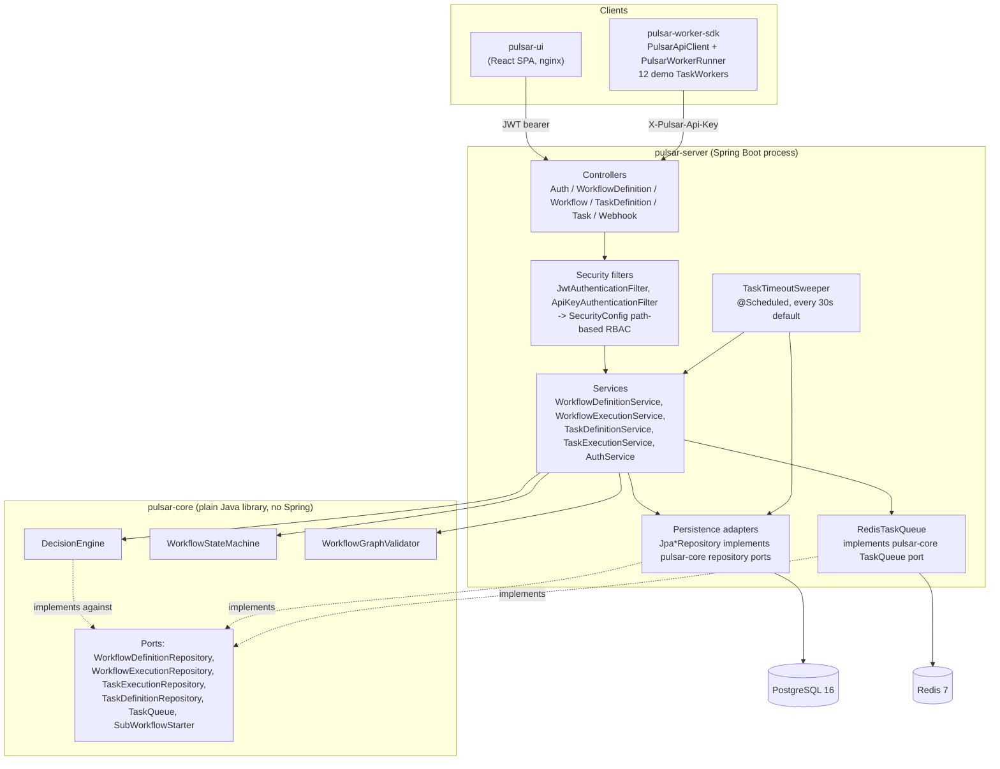
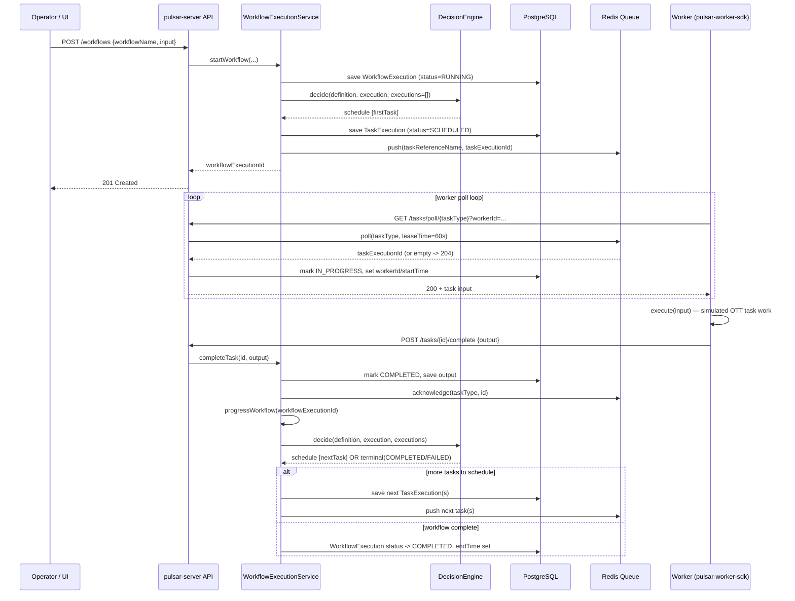
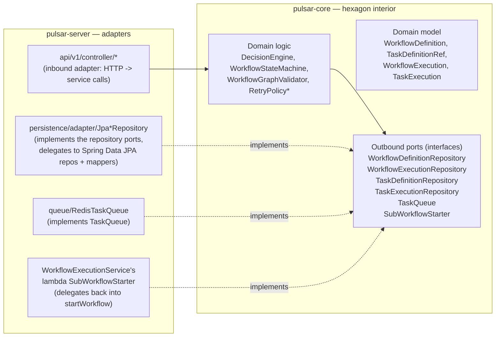

# Architecture

This document goes one level deeper than the README's system diagram: the component breakdown,
the request/decision lifecycle of a single workflow execution, and the hexagonal port/adapter
relationship between `pulsar-core` and `pulsar-server`.

## Component diagram

`pulsar-core` defines the ports (`*Repository`, `TaskQueue`, `SubWorkflowStarter`) and the pure
logic that reasons about them (`DecisionEngine`, `WorkflowStateMachine`, `WorkflowGraphValidator`).
It has no knowledge that Postgres, Redis, or Spring exist. `pulsar-server` is the only module that
implements those ports for real infrastructure and the only module with a REST surface.

## Workflow execution sequence

This traces one `SIMPLE`-task step through the whole system: a workflow starts, the engine decides
what's runnable, a task lands on the queue, a worker polls/executes/completes it, and the engine
decides again.

Two details worth calling out:

- **The decide/schedule loop is re-entrant, not a single pass.** `progressWorkflow()` (private
  overload in `WorkflowExecutionService`) loops `while (cascade)`: every control-flow task
  (`FORK`/`JOIN`/`DECISION`/`TERMINATE`/`SUB_WORKFLOW`) auto-completes synchronously in the same
  call, which sets `cascade = true` and triggers another `decide()` — because a `JOIN`'s
  successors, or a `DECISION`'s chosen branch, are only knowable *after* that node's own status is
  written. The loop naturally terminates once the only remaining scheduled item is a
  worker-polled `SIMPLE`/`DYNAMIC` task.
- **Failure re-enters the same path.** `TaskExecutionService.failTask` either marks a task
  `FAILED_WITH_TERMINAL_ERROR` (terminal, retries exhausted or explicit) or `FAILED` →
  immediately `SCHEDULED` again with an incremented `retryCount` and a delay computed by the
  task's `RetryPolicy` — then calls `progressWorkflow()` just like `completeTask` does.

## Hexagonal port/adapter relationship

Why this matters in practice: `pulsar-core`'s test suite (`DecisionEngineTest`,
`WorkflowGraphValidatorTest`, `WorkflowStateMachineTest`, `InMemoryTaskQueueTest`,
`RetryPolicyTest`) runs as plain JUnit — no Spring context, no database, no Docker. The engine's
hardest logic (fork/join resolution, decision branching, cycle detection) is verified in
milliseconds. `InMemoryTaskQueue` doubles as both a reference implementation of the `TaskQueue`
port and a fast test double — it isn't test-only scaffolding, it's a real, complete implementation
that happens to be convenient for tests too.

See also: [`developer-guide.md`](developer-guide.md) for how to add a new adapter or extend the
domain model, and the root [`README.md`](../README.md#system-architecture) for the higher-level
system diagram.
