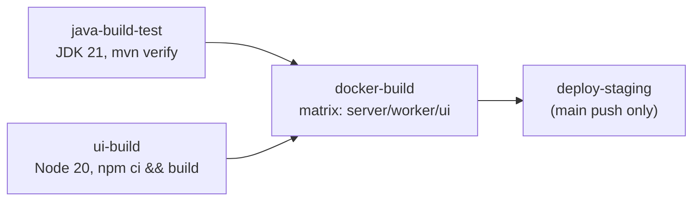
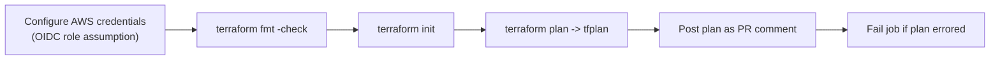

# CI/CD Pipelines

Two GitHub Actions workflows exist: `pulsar-ci.yml` (application build/test/deploy) and
`terraform-plan.yml` (infrastructure change review). Both are read directly from
`.github/workflows/` below — no stage described here is aspirational.

## `pulsar-ci.yml`

Triggers: `push` to `main`, and any `pull_request` targeting `main`.

### Job 1 — `java-build-test`

- Checks out, sets up Temurin JDK 21 with Maven dependency caching.
- Runs `mvn -pl pulsar-common,pulsar-core,pulsar-server,pulsar-worker-sdk -am clean verify`.
- `verify` (not just `test`) means the Testcontainers-tagged integration test in `pulsar-server`
  (`WorkflowEndToEndTest`) runs here too — GitHub-hosted runners ship with a working Docker daemon,
  so this executes even though it could not be run in this project's local build sandbox (see
  [`troubleshooting.md`](troubleshooting.md#testcontainers--docker-connectivity-issues)).

### Job 2 — `ui-build`

- Checks out, sets up Node 20 with npm caching keyed to `pulsar-ui/package-lock.json`.
- `npm ci && npm run build` inside `pulsar-ui/` — a strict, lockfile-exact install followed by the
  `tsc -b && vite build` production build script.

### Job 3 — `docker-build`

- **Needs**: `java-build-test` and `ui-build` (both must pass first).
- Matrix build across all three images:

  | Image | Dockerfile | Build context |
  |---|---|---|
  | `pulsar-server` | `docker/server/Dockerfile` | repo root |
  | `pulsar-worker-sdk-demo` | `docker/worker/Dockerfile` | repo root |
  | `pulsar-ui` | `pulsar-ui/Dockerfile` | `pulsar-ui/` |

- Uses `docker/setup-buildx-action` + `docker/build-push-action`, tagged
  `reelforge/<image>:<git-sha>`. **`push: false`** — images are built to prove the Dockerfiles
  work, not published to a registry. Wiring a real push (with registry login) is left for whoever
  stands up a real image registry for this project.

### Job 4 — `deploy-staging`

- **Needs**: `docker-build`. **Condition**: only runs on a `push` to `main` (not on pull requests),
  and only against the `pulsar-staging` GitHub Environment (which is where
  `PULSAR_STAGING_KUBECONFIG` as a secret would live).
- Installs `kubectl` v1.30.0, decodes the staging kubeconfig secret into `~/.kube/config`, then
  runs `kubectl apply -k k8s/base`.
- The workflow's own comment is explicit that this step "just shows the structural pattern" — real
  cluster credentials come from the environment's secrets, never hardcoded.
- **There is no separate production-deploy job.** Promoting a build to production is a manual step
  today — see [`deployment.md`](deployment.md#environment-promotion).

## `terraform-plan.yml`

Trigger: `pull_request` targeting `main`, but **only** when the diff touches `terraform/**` (path
filter) — this workflow doesn't run on every PR, just infra-affecting ones.

Steps, in order:

1. Checkout, set up Terraform 1.9.0.
2. **AWS credentials via OIDC** — `aws-actions/configure-aws-credentials` assumes
   `secrets.PULSAR_TERRAFORM_PLAN_ROLE_ARN`, not long-lived access keys. This is the modern,
   credential-free pattern: GitHub's OIDC token is exchanged for temporary AWS credentials scoped
   to whatever IAM role that ARN grants (presumably plan-only permissions, though the actual IAM
   policy attached to that role lives in AWS, not in this repo).
3. `terraform fmt -check -recursive ../../` — fails the job if any `.tf` file isn't
   `terraform fmt`-clean.
4. `terraform init` against the `terraform/environments/production` working directory (the
   workflow's `defaults.run.working-directory`).
5. `terraform plan -no-color -input=false -out=tfplan`, with `TF_VAR_pulsar_db_password` supplied
   from `secrets.PULSAR_STAGING_DB_PASSWORD` (note: named "staging" secret feeding the
   *production* environment's plan — worth double-checking this is intentional and not a
   copy-paste artifact if you're maintaining this pipeline; it's what the workflow file actually
   does). `continue-on-error: true` so a failed plan doesn't stop the workflow before...
6. ...the plan output is posted as a PR comment via `actions/github-script`, so reviewers see the
   full `terraform plan` diff inline without needing local Terraform access.
7. A final step explicitly fails the job if the plan step's outcome was a failure — so the PR
   still shows red even though step 5 was allowed to continue.

**This workflow only plans — it never applies.** Applying production Terraform changes is a
deliberate manual step; see [`deployment.md`](deployment.md#deployment-sequence).

## What's intentionally not automated (yet)

- No automated production deploy (application or infrastructure) — both are manual, by design at
  this phase.
- No automated rollback on failed deploy — `deploy-staging` doesn't check post-deploy health and
  auto-revert.
- No image vulnerability scanning step (e.g. Trivy/Grype) in `docker-build`.
- No automated `terraform apply` even for staging — only `plan` runs in CI; apply is manual
  everywhere.
