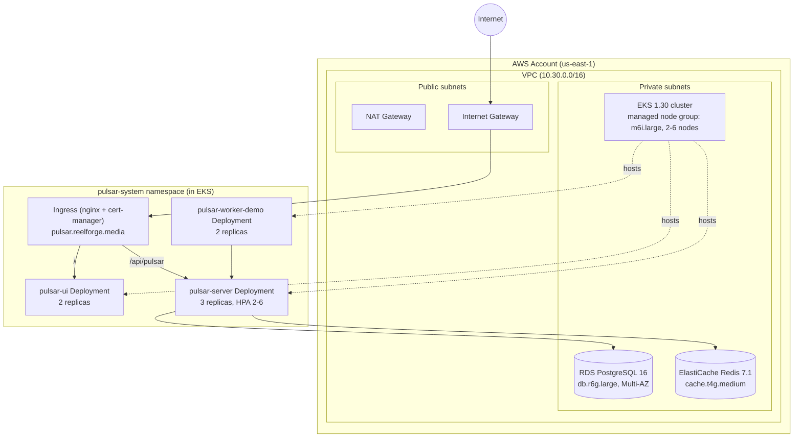

# Production Deployment Guide

Pulsar's production path is: build container images in CI → provision AWS infrastructure with
Terraform → apply the Kubernetes manifests to the resulting EKS cluster. This document ties those
pieces together; see [`infrastructure.md`](infrastructure.md) and
[`kubernetes-deployment.md`](kubernetes-deployment.md) for the deep dive on each half.

## Deployment topology



## Deployment sequence

1. **Provision infrastructure** (once per environment, or whenever `terraform/` changes):
   ```bash
   cd terraform/environments/production
   terraform init
   terraform plan -out=tfplan   # or let terraform-plan.yml do this on a PR
   terraform apply tfplan
   ```
   This creates the VPC, RDS instance, ElastiCache replication group, and EKS cluster/node group
   (see [`infrastructure.md`](infrastructure.md) for exact resources). `terraform apply` is
   **not** wired into the CI pipeline described in [`ci-cd.md`](ci-cd.md) — only `plan` runs
   automatically, on PRs touching `terraform/**`. Applying is a deliberate, manual step, gated by
   whoever holds the `PULSAR_TERRAFORM_PLAN_ROLE_ARN`-equivalent apply role.

2. **Build and publish images.** `pulsar-ci.yml`'s `docker-build` job builds all three images
   (`pulsar-server`, `pulsar-worker-sdk-demo`, `pulsar-ui`) but does not push them (`push: false`)
   — pushing to a real registry and tagging for a specific environment is left for the deploying
   team's registry conventions to wire in (swap `push: false` → `true` with real registry
   credentials once one exists).

3. **Point kubectl at the EKS cluster.**
   ```bash
   aws eks update-kubeconfig --name pulsar-production --region us-east-1
   ```
   (cluster name comes from the `eks_cluster_name` Terraform output).

4. **Provide real secrets.** `k8s/base/secret.yaml` ships with placeholder values
   (`REPLACE_ME_*`) — see [`security.md`](security.md) for the recommended replacement mechanism
   (K8s-native secret injected by CI, External Secrets Operator, or Sealed Secrets, backed by AWS
   Secrets Manager or SSM Parameter Store in a real deployment).

5. **Apply the Kubernetes manifests.**
   ```bash
   kubectl apply -k k8s/base
   ```
   This is exactly what `pulsar-ci.yml`'s `deploy-staging` job does against staging on every push
   to `main`. Production rollout uses the same Kustomize base; point kubectl at the production
   cluster's kubeconfig and apply the same way (there is currently no separate
   `k8s/overlays/production` — the base manifests are environment-agnostic aside from secrets and
   the DNS name baked into `ingress.yaml`).

6. **Verify.**
   ```bash
   kubectl -n pulsar-system get pods
   kubectl -n pulsar-system logs deploy/pulsar-server-deployment
   curl https://pulsar.reelforge.media/actuator/health
   ```

## Rollback

Kustomize-applied manifests roll back the same way any `kubectl apply`-managed Deployment does:

```bash
kubectl -n pulsar-system rollout undo deployment/pulsar-server-deployment
```

For a database-affecting rollback (a bad migration), see the Flyway guidance in
[`operations-guide.md`](operations-guide.md) — Pulsar has no automated migration-rollback
tooling; Flyway migrations are forward-only by convention here (`V1__`, `V2__`, ...).

## Environment promotion

The CI pipeline as built only wires up a **staging** deploy target
(`deploy-staging` job, `environment: pulsar-staging`). There is no separate production-deploy job
in `pulsar-ci.yml` — promoting a build to production is a manual `kubectl apply -k k8s/base`
against the production cluster's kubeconfig using the same rendered manifests, after whatever
manual verification staging gives you. This is a deliberate scope boundary for this phase, not an
oversight to silently paper over — see [Future Enhancements](../README.md#future-enhancements) if
you're deciding what to build next.

## Related documents

- [`infrastructure.md`](infrastructure.md) — Terraform module structure and instance sizing
- [`kubernetes-deployment.md`](kubernetes-deployment.md) — Kustomize resource walkthrough
- [`ci-cd.md`](ci-cd.md) — pipeline stage detail
- [`security.md`](security.md) — secrets management recommendations
