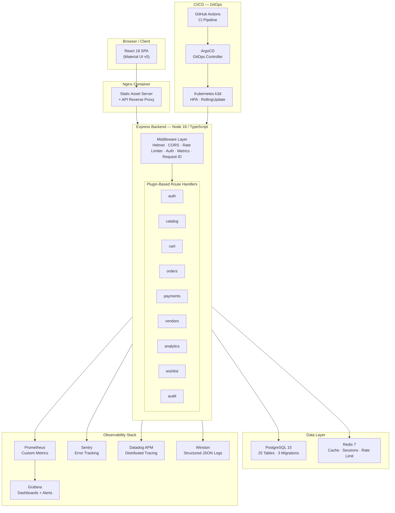
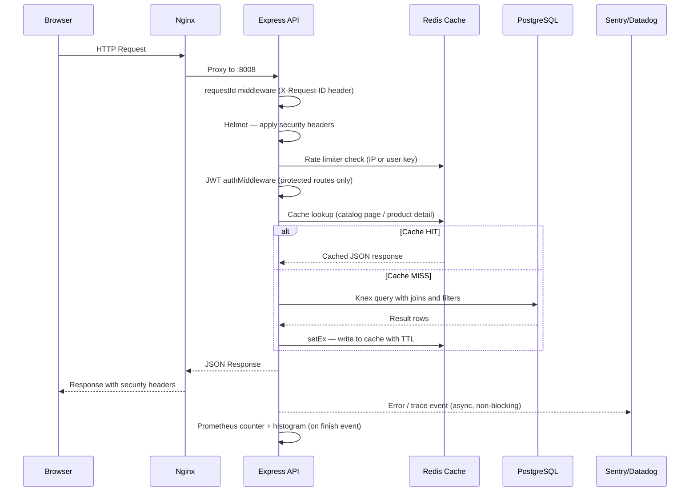
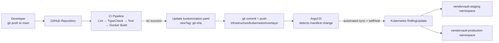
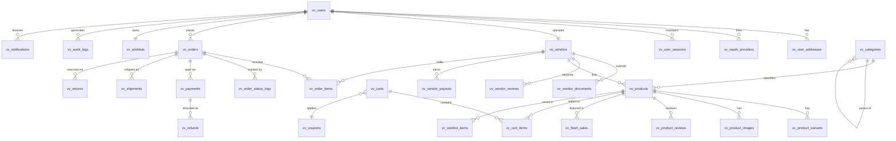
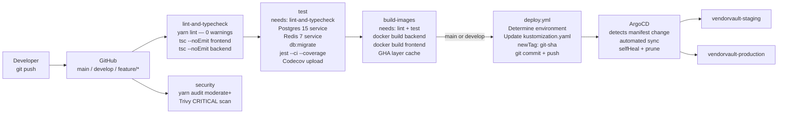
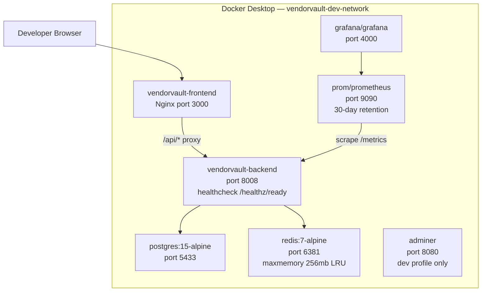
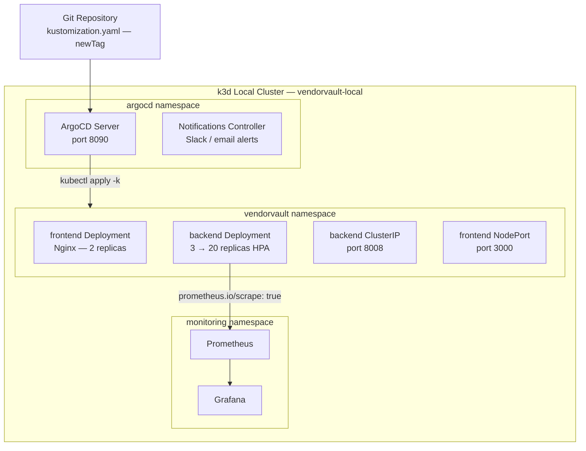

# VendorVault — Enterprise Multi-Vendor Marketplace Platform

<div align="center">


**A production-grade, full-stack multi-vendor marketplace with GitOps-driven deployment, plugin-based backend architecture, and enterprise-grade observability.**

</div>

---

## 1. Project Overview

**VendorVault** is a full-stack, enterprise-grade multi-vendor e-commerce platform engineered from the ground up using a modern TypeScript monorepo. It enables businesses to operate a marketplace where multiple independent vendors can onboard, list products, manage inventory, process orders, and receive automated payouts — all from a single unified platform.

The project spans the full engineering lifecycle: a React 18 single-page application with Material UI v5, a plugin-based Express/TypeScript REST API, a PostgreSQL relational database with three migration layers, Redis-backed caching and rate limiting, Docker Compose for local development, Kubernetes manifests with HPA for production scaling, and a fully automated GitOps CI/CD pipeline using GitHub Actions and ArgoCD.

| Attribute | Detail |
|---|---|
| **Platform Name** | VendorVault |
| **Version** | 1.0.0 |
| **Architecture** | Yarn Workspaces Monorepo |
| **Backend Port** | 8008 |
| **Frontend Port** | 3000 (dev) / 80 (Nginx production) |
| **Database** | PostgreSQL 15 on port 5433 |
| **Cache / Rate Limiter** | Redis 7 on port 6381 |
| **Target Users** | Multi-vendor marketplace operators, independent vendors, and end customers |

---

## 2. Business Problem

Traditional e-commerce platforms present a fundamental challenge for businesses seeking to host third-party vendors: they either rely on expensive proprietary SaaS platforms (Shopify Plus, Mirakl) that charge high transaction fees and lock teams into vendor-specific tooling, or require bespoke in-house development that takes years and costs significant engineering resources.

Specifically:

- **Vendor fragmentation**: Businesses managing multiple sellers have no unified interface for onboarding, catalog management, order routing, or payout scheduling.
- **Operational visibility gaps**: Without real-time analytics per vendor and per order, marketplace operators cannot identify underperforming stores, fulfilment bottlenecks, or payment failures.
- **Deployment complexity**: Most marketplace backends are monolithic, making it expensive and risky to update individual capabilities (e.g., the payment gateway or the search API) without affecting the whole system.
- **Observability debt**: Without structured logging, distributed tracing, and alerting on business-level metrics (e.g., zero orders in an hour), engineering teams operate blindly in production.

VendorVault addresses all of these by delivering a self-hosted, open-architecture marketplace platform with full DevOps automation and production-ready observability.

---

## 3. Objectives

### Primary Objectives
- Build a complete, deployable multi-vendor marketplace that can be operated in production with zero reliance on external SaaS platforms.
- Demonstrate end-to-end engineering ownership: from React UI to database migrations to Kubernetes deployments.

### Technical Objectives
- Implement a **plugin-based backend** where each domain (auth, catalog, cart, orders, payments, analytics, wishlist, audit) is an independently mounted Express router.
- Use **Knex.js migrations** to version-control all 25 database tables across three migration files.
- Achieve **GitOps deployment** with ArgoCD watching the Git repository and automatically syncing Kubernetes manifests on every CI-approved commit.
- Enforce **zero-downtime deployments** using Kubernetes RollingUpdate strategy and Horizontal Pod Autoscaling (3–20 replicas).
- Implement **production-grade observability** with Prometheus custom metrics, Grafana dashboards, Winston structured logging, and Sentry/Datadog APM integration.

### Business Objectives
- Reduce vendor onboarding friction with a dedicated vendor dashboard, KYC document management, and automated payout scheduling.
- Increase buyer trust through verified vendor badges, product reviews, wishlist persistence, and real-time order tracking.
- Enable platform monetisation through a configurable commission rate (default 12%) applied per vendor and tracked per order item.

### Expected Outcomes
- A deployable platform demonstrating full-stack, DevOps, and cloud-native engineering competencies.
- A codebase structured to the standard expected in enterprise platform engineering teams.

---

## 4. Key Features

| Feature | Description | Business Benefit |
|---|---|---|
| **Multi-Vendor Onboarding** | Vendors register with `storeName`, receive a dedicated store profile with KYC document upload (ID, business license, tax certificate) and verification status | Reduces manual vendor onboarding effort; creates an auditable compliance trail |
| **Product Catalog** | Full CRUD for products with category hierarchy, SKU management, product variants (size/colour), multi-image support, flash sale scheduling, and PostgreSQL full-text search | Enables vendors to independently manage rich product listings without platform intervention |
| **Shopping Cart** | Persistent cart backed by PostgreSQL with coupon/discount code application, session-aware checkout state, and abandoned cart tracking | Reduces cart abandonment; enables re-engagement campaigns |
| **Order Management** | Complete order lifecycle (pending → confirmed → shipped → delivered → returned) with per-vendor order item fulfilment tracking, status logs, and shipment carrier + AWB tracking | Gives both operators and customers full visibility into order progress |
| **Payment Processing** | Stripe Marketplace Connect integration for payment capture, refund processing, and scheduled vendor payouts with configurable delay (default 7 days) and Stripe Transfer IDs | Automates revenue distribution to vendors; supports dispute and refund management |
| **Vendor Dashboard** | Dedicated vendor portal with sales analytics, payout history, product management, and store settings | Empowers vendors to self-serve; reduces platform support overhead |
| **Real-Time Analytics** | Recharts-powered analytics page with revenue trends, top-selling products, order volume over time, and vendor performance comparisons | Enables data-driven merchandising and vendor relationship decisions |
| **Wishlist with Persistence** | Customer wishlists persisted to `localStorage` with removal state maintained across navigation | Improves repeat purchase rate; enables restock notifications |
| **Tax Invoice Generation** | In-browser professional PDF invoice with HSN codes, GST (CGST/SGST) breakdown, itemised totals, amount in words, and digital stamp — print-ready without third-party services | Provides customers with legally-compliant purchase documentation |
| **Notification System** | Real-time in-app notifications with read/unread state and contextual navigation on click (order notification → order detail; price drop → catalog) | Keeps users informed; drives re-engagement directly from the notification panel |
| **Role-Based Access Control** | Three roles (customer, vendor, admin) enforced at both JWT middleware and API route level with `requireVendor()` guards | Prevents unauthorised data access; enforces principle of least privilege |
| **Rate Limiting** | Redis-backed rate limiter (120 requests/60 seconds per user or IP) with automatic 60-second block on violation | Protects the API from abuse and DDoS-style request floods |
| **Security Headers** | Helmet.js with strict CSP, HSTS (1 year, preload), X-Frame-Options, and CORS allowlist | Hardens the application against OWASP Top 10 web vulnerabilities |
| **Audit Logging** | Immutable audit trail in `vv_audit_logs` for all user actions (login, registration, etc.) with actor ID, IP address, and entity change diffs | Provides regulatory compliance evidence and forensic investigation capability |
| **GitOps CI/CD** | GitHub Actions pipeline (lint → type-check → test → Docker build → ArgoCD image tag update) with automated ArgoCD sync for staging and production | Eliminates manual deployments; ensures every merge to `main` is automatically and safely deployed |
| **Kubernetes HPA** | HorizontalPodAutoscaler scales backend from 3 to 20 replicas based on 70% CPU / 80% memory thresholds | Handles traffic spikes without manual intervention; reduces idle infrastructure costs |
| **Infrastructure as Code** | AWS VPC Terraform module with multi-AZ public/private subnets, NAT Gateways, and VPC Flow Logs to CloudWatch | Reproducible, version-controlled infrastructure; eliminates environment drift |
| **Profile Photo Upload** | Client-side photo upload with `FileReader` API, file type/size validation (JPG/PNG/WebP, max 5 MB), and `localStorage` persistence across sessions | Personalises user experience without requiring a file storage backend |

---

## 5. Architecture

### High-Level System Architecture



### Request Flow



### GitOps Deployment Flow



---

## 6. Tech Stack

### Frontend

| Technology | Version | Purpose |
|---|---|---|
| React | 18.2 | UI component framework with concurrent rendering |
| TypeScript | 5.x | Static typing across all components and hooks (`moduleResolution: bundler`, `ignoreDeprecations: "6.0"`) |
| Material UI (MUI) | v5.14 | Component library with custom `VV_COLORS` design token system |
| React Router DOM | v6.15 | Client-side routing with lazy-loaded pages and protected routes |
| Zustand | 4.4 | Lightweight global state management for cart |
| React Query | 3.x | Server state caching and synchronisation |
| Recharts | 2.7 | Analytics charts (revenue, orders, vendor performance) |
| React Hook Form | 7.x | Performant form state management |
| Axios | 1.4 | HTTP client with interceptors |
| React Toastify | 9.x | Toast notification system |
| date-fns | 2.x | Date formatting and manipulation |

### Backend

| Technology | Version | Purpose |
|---|---|---|
| Node.js | 18 LTS | Runtime environment |
| Express | 4.18 | HTTP server framework |
| TypeScript | 5.x | Full type safety across all plugins and middleware (`moduleResolution: node16` for CommonJS compatibility) |
| Knex.js | 3.x | SQL query builder and migration runner |
| bcryptjs | 2.4 | Password hashing (cost factor 12) |
| jsonwebtoken | 9.x | JWT signing and verification (7-day expiry, HS256) |
| Joi | 17.x | Request schema validation |
| Helmet | 7.x | HTTP security headers (CSP, HSTS, X-Frame-Options) |
| prom-client | 14.x | Prometheus metrics (HTTP counter + duration histogram) |
| rate-limiter-flexible | 3.x | Redis-backed sliding window rate limiting |
| Winston | 3.10 | Structured logging — coloured in dev, JSON in production |
| Passport.js | 0.6 | OAuth 2.0 strategy framework (Google, JWT) |
| Stripe | 13.x | Payment capture, refunds, and vendor payouts |
| Morgan | 1.10 | HTTP access logging (combined format) |
| Compression | 1.7 | Gzip response compression |
| @sentry/node | 7.x | Error tracking with 10% production trace sampling |
| dd-trace | 4.x | Datadog APM distributed tracing (must load first) |
| node-cron | 3.x | Scheduled background jobs |
| Multer | 1.4 | Multipart file upload handling |
| express-promise-router | 4.x | Async error propagation in route handlers |

### Database

| Technology | Version | Purpose |
|---|---|---|
| PostgreSQL | 15-alpine | Primary relational database (25 tables, 3 migrations) |
| Redis | 7-alpine | Catalog cache, session storage, rate limiting (LRU, 256 MB max) |
| Adminer | 4 | Database management UI (dev Docker profile only) |

### DevOps & Infrastructure

| Technology | Version | Purpose |
|---|---|---|
| Docker | 24.x | Containerisation of all services |
| Docker Compose | v3.9 | Local full-stack environment orchestration |
| Kubernetes | 1.28 | Production container orchestration with HPA (3–20 replicas) |
| k3d | latest | Lightweight local Kubernetes — no cloud account required |
| Kustomize | built-in | Environment-specific manifest overlays (staging / production) |
| ArgoCD | v2.9.3 | GitOps controller — automated sync from Git to Kubernetes |
| Terraform | >= 1.5 | AWS VPC infrastructure provisioning (IaC) |
| GitHub Actions | — | CI/CD pipeline automation |
| Nginx | alpine | Frontend static asset serving and API reverse proxy |

### Monitoring & Observability

| Technology | Purpose |
|---|---|
| Prometheus | Metrics scraping with custom `vv_http_requests_total` and `vv_http_request_duration_seconds` |
| Grafana | Dashboards visualising request rate, latency percentiles, error rates, and business metrics |
| Winston | Structured logging with per-service labels; JSON in production, coloured output in development |
| Sentry | Real-time error tracking with environment tagging and configurable trace sampling |
| Datadog APM (dd-trace) | Distributed request tracing initialised before all other imports |

---

## 7. Folder Structure

```text
vendorvault-platform/
│
├── .github/
│   └── workflows/
│       ├── ci.yml                    # Lint → TypeCheck → Test → Docker Build
│       └── deploy.yml                # ArgoCD GitOps image tag update pipeline
│
├── packages/
│   ├── app/                          # React 18 frontend (SPA)
│   │   └── src/
│   │       ├── components/
│   │       │   ├── auth/             # ProtectedRoute — redirects unauthenticated users
│   │       │   └── layout/           # AppLayout — sidebar, topbar, notifications popover
│   │       ├── hooks/                # useAuth.ts, useCart.ts (Zustand store)
│   │       ├── pages/                # 16 lazy-loaded page components
│   │       │   ├── LandingPage.tsx
│   │       │   ├── LoginPage.tsx / RegisterPage.tsx
│   │       │   ├── DashboardPage.tsx
│   │       │   ├── CatalogPage.tsx / ProductDetailPage.tsx
│   │       │   ├── VendorsPage.tsx / VendorStorePage.tsx
│   │       │   ├── VendorDashboardPage.tsx
│   │       │   ├── CartPage.tsx / CheckoutPage.tsx
│   │       │   ├── OrdersPage.tsx / OrderDetailPage.tsx
│   │       │   ├── WishlistPage.tsx
│   │       │   ├── AnalyticsPage.tsx
│   │       │   ├── ProfilePage.tsx
│   │       │   └── NotFoundPage.tsx
│   │       ├── styles/               # MUI theme with VV_COLORS design token system
│   │       └── utils/                # currency.ts (INR formatter), apiClient.ts
│   │
│   └── backend/                      # Express / TypeScript API
│       └── src/
│           ├── config/               # YAML config loader, Knex configuration
│           ├── middleware/           # auth, errorHandler, rateLimiter, metrics, requestId
│           ├── migrations/           # 3 versioned Knex migration files (25 tables total)
│           ├── plugins/              # 10 domain route plugins
│           │   ├── auth/             # Register, login, logout, /me, token refresh
│           │   ├── catalog/          # Products, search, categories, flash sales
│           │   ├── cart/             # Cart CRUD with coupon application
│           │   ├── orders/           # Order placement and lifecycle management
│           │   ├── payments/         # Stripe PaymentIntent and webhook handler
│           │   ├── vendors/          # Vendor profiles and store management
│           │   ├── analytics/        # Sales KPIs and vendor performance metrics
│           │   ├── wishlist/         # Add/remove/list wishlist items
│           │   ├── audit/            # Audit log query API
│           │   └── health/           # /healthz/live and /healthz/ready probes
│           ├── seeds/                # Demo data seed (vendors, products, orders)
│           ├── services/             # database.ts (Knex client), cache.ts (Redis client)
│           ├── utils/                # logger.ts (Winston with rotation)
│           ├── tracer.ts             # Datadog APM — must be first import
│           └── index.ts              # Bootstrap: config → DB → Redis → Express → plugins
│
├── infrastructure/
│   ├── docker/
│   │   ├── Dockerfile.app            # Multi-stage: Node build → Nginx serve
│   │   ├── Dockerfile.backend        # Node 18 Alpine production image
│   │   ├── docker-compose.yml        # Full stack (all 7 services)
│   │   ├── docker-compose.infra.yml  # Infrastructure only (Postgres + Redis)
│   │   └── nginx.conf                # SPA fallback routing + /api proxy
│   │
│   ├── kubernetes/
│   │   ├── base/
│   │   │   ├── backend-deployment.yaml   # Deployment + Service + HPA (3–20 replicas)
│   │   │   └── frontend-deployment.yaml  # Nginx Deployment + Service
│   │   └── overlays/
│   │       ├── staging/kustomization.yaml
│   │       └── production/kustomization.yaml
│   │
│   ├── argocd/
│   │   ├── apps/
│   │   │   ├── vendorvault-staging.yaml
│   │   │   └── vendorvault-production.yaml
│   │   └── idp/
│   │       ├── project.yaml          # ArgoCD AppProject with RBAC scoping
│   │       ├── applicationset.yaml   # Multi-environment ApplicationSet
│   │       ├── rbac-config.yaml      # Team role assignments (developer, vendor-lead, admin)
│   │       └── notifications.yaml    # Sync success/failure Slack alerts
│   │
│   ├── monitoring/
│   │   └── prometheus/
│   │       ├── prometheus.yml        # Scrape config (backend + Postgres + Redis)
│   │       └── alert-rules.yml       # 8 alerting rules across API, DB, Redis, business
│   │
│   └── terraform/
│       └── modules/vpc/main.tf       # AWS VPC: multi-AZ subnets, NAT GW, Flow Logs
│
├── scripts/
│   └── local-cluster-setup.sh        # One-shot: k3d + ArgoCD + IDP (no cloud required)
│
├── docs/
│   ├── architecture/overview.md
│   ├── guides/getting-started.md
│   └── runbooks/incident-response.md
│
├── package.json                      # Monorepo root — workspace scripts and shared deps
├── tsconfig.json                     # Root TypeScript config — ignoreDeprecations "6.0", shared strict options
├── .env.example                      # Documented environment variable template
├── app-config.yaml                   # YAML platform configuration (development)
└── app-config.production.yaml        # YAML platform configuration (production)
```

---

## 8. Database Design

### Overview

All tables use the `vv_` prefix and are created through three sequential, rollback-capable Knex migrations. Every primary key is a UUID generated by PostgreSQL's native `gen_random_uuid()`. Timestamps are managed automatically. Foreign keys enforce referential integrity with explicit `onDelete` behaviour (`CASCADE` for owned data, `RESTRICT` for financial records).

### Entity Relationship Diagram



### Table Reference

| Table | Migration | Purpose |
|---|---|---|
| `vv_users` | 001 | Core identity — customers, vendors, admins with email, role, active status |
| `vv_user_addresses` | 001 | Multiple shipping addresses per user with default flag |
| `vv_oauth_providers` | 001 | Google/GitHub OAuth link records with uniqueness constraint |
| `vv_user_sessions` | 001 | Session records for Redis fallback and multi-device tracking |
| `vv_audit_logs` | 001 | Immutable action log: actor, entity, change diff, IP address |
| `vv_vendors` | 002 | Store profile: commission rate, payout delay, rating, Stripe account ID |
| `vv_vendor_documents` | 002 | KYC documents (ID, license, tax cert) with approval status |
| `vv_vendor_reviews` | 002 | Customer-written store ratings (1–5) with text comment |
| `vv_categories` | 002 | Self-referential hierarchical category tree with slug and sort order |
| `vv_products` | 002 | Full product entity: SKU, price, compare price, stock, weight, tags, attributes |
| `vv_product_variants` | 002 | Size/colour variants with per-variant price modifier and stock |
| `vv_product_images` | 002 | Multi-image per product with sort order and primary flag |
| `vv_product_reviews` | 002 | Verified purchase reviews with uniqueness constraint per user-product pair |
| `vv_flash_sales` | 002 | Time-bounded sale pricing with quantity limits and sold counter |
| `vv_coupons` | 003 | Discount codes — percentage, fixed amount, or free shipping |
| `vv_carts` | 003 | Per-user cart with active/checked-out/abandoned status and coupon link |
| `vv_cart_items` | 003 | Cart line items with unit price snapshot and variant reference |
| `vv_wishlists` | 003 | One wishlist per user (1:1 relationship) |
| `vv_wishlist_items` | 003 | Products saved to wishlist with uniqueness constraint |
| `vv_payment_methods` | 003 | Saved cards with Stripe payment method ID, last4, brand, expiry |
| `vv_orders` | 003 | Full order with subtotal, tax, shipping, discount, and lifecycle timestamps |
| `vv_order_items` | 003 | Per-vendor line items with independent fulfilment status |
| `vv_order_status_logs` | 003 | Append-only status history for order lifecycle auditing |
| `vv_payments` | 003 | Payment records with Stripe PaymentIntent ID, currency, and status |
| `vv_refunds` | 003 | Refund records linked to payments with Stripe Refund ID |
| `vv_vendor_payouts` | 003 | Scheduled vendor payouts with Stripe Transfer ID and status |
| `vv_shipments` | 003 | Carrier, tracking number, and JSON tracking events array |
| `vv_returns` | 003 | Return requests with reason and approval workflow |
| `vv_notifications` | 003 | User notification inbox with type, title, body, and read flag |

### Indexing Strategy

| Table | Indexed Columns | Rationale |
|---|---|---|
| `vv_products` | `vendor_id`, `category_id`, `is_active`, `is_featured`, `price`, `avg_rating` | Supports all catalog filter and sort combinations without full table scans |
| `vv_orders` | `user_id`, `status`, `created_at` | Order listing, status filtering, and date-range analytics queries |
| `vv_order_items` | `order_id`, `vendor_id`, `product_id` | Vendor fulfilment queries and sales aggregation |
| `vv_carts` | `(user_id, status)` composite | Active cart lookup per user in a single index scan |
| `vv_vendors` | `user_id`, `is_active`, `avg_rating` | Vendor listing, verification checks, and featured store queries |
| `vv_audit_logs` | `(entity_type, entity_id)`, `actor_id`, `created_at` | Compliance queries and per-user activity reports |

---

## 9. API Documentation

### Overview

All API endpoints are versioned under `/api/v1/`. Public endpoints (catalog, vendors, auth) require no token. Protected endpoints require a `Bearer` JWT in the `Authorization` header. Each request receives a unique `X-Request-ID` header for distributed tracing correlation.

### Authentication

```
Authorization: Bearer <JWT>
```

JWTs are signed with `VV_BACKEND_SECRET` (HS256), expire after 7 days, and carry `{ id, email, name, role, vendorId }`. Token revocation is handled via Redis blocklist on logout (`vv:token:revoked:<suffix>` with 24-hour TTL).

### Endpoints

| Method | Endpoint | Auth | Description |
|---|---|---|---|
| `POST` | `/api/v1/auth/register` | None | Create customer or vendor account (Joi validated) |
| `POST` | `/api/v1/auth/login` | None | Email/password login → JWT + audit log entry |
| `POST` | `/api/v1/auth/logout` | JWT | Revoke token via Redis blocklist |
| `GET` | `/api/v1/auth/me` | JWT | Current user profile (password hash stripped) |
| `GET` | `/api/v1/catalog/products` | None | Paginated products — filter by category, vendor, price range, stock; sort by price/rating/date |
| `GET` | `/api/v1/catalog/products/:id` | None | Single product with images, variants, and latest reviews |
| `GET` | `/api/v1/catalog/search` | None | PostgreSQL full-text search (`tsvector` + `plainto_tsquery`) |
| `GET` | `/api/v1/catalog/categories` | None | Full category tree ordered by `sort_order` |
| `GET` | `/api/v1/catalog/featured` | None | Featured products ordered by `avg_rating` descending |
| `GET` | `/api/v1/catalog/flash-sales` | None | Time-bounded active sale items with server timestamp |
| `POST` | `/api/v1/catalog/products` | JWT (vendor) | Create product listing |
| `PATCH` | `/api/v1/catalog/products/:id` | JWT (vendor) | Update own product (allowlisted fields only) |
| `DELETE` | `/api/v1/catalog/products/:id` | JWT (vendor) | Soft-delete own product; cache invalidation |
| `GET` | `/api/v1/vendors` | None | All active vendor profiles |
| `GET` | `/api/v1/vendors/:id` | None | Vendor profile with store statistics |
| `GET` | `/api/v1/cart` | JWT | Current user's active cart with items |
| `POST` | `/api/v1/cart/items` | JWT | Add item to cart |
| `PATCH` | `/api/v1/cart/items/:id` | JWT | Update cart item quantity |
| `DELETE` | `/api/v1/cart/items/:id` | JWT | Remove item from cart |
| `GET` | `/api/v1/orders` | JWT | Paginated order history |
| `POST` | `/api/v1/orders` | JWT | Place order from active cart |
| `GET` | `/api/v1/orders/:id` | JWT | Full order detail with items, shipment, and status log |
| `POST` | `/api/v1/payments/intent` | JWT | Create Stripe PaymentIntent |
| `POST` | `/api/v1/payments/webhook` | Stripe Sig | Handle Stripe events (payment success, refunds, payouts) |
| `GET` | `/api/v1/analytics/summary` | JWT | Platform-wide KPIs |
| `GET` | `/api/v1/wishlist` | JWT | User's wishlist items |
| `POST` | `/api/v1/wishlist/:productId` | JWT | Add product to wishlist |
| `DELETE` | `/api/v1/wishlist/:productId` | JWT | Remove product from wishlist |
| `GET` | `/api/v1/audit` | JWT | Audit log query (admin only) |
| `GET` | `/healthz/live` | None | Liveness probe — returns 200 if process is alive |
| `GET` | `/healthz/ready` | None | Readiness probe — checks DB and Redis connectivity |
| `GET` | `/metrics` | None | Prometheus scrape endpoint |

### Error Response Envelope

```json
{
  "error": {
    "code": "VALIDATION_ERROR",
    "message": "\"email\" must be a valid email address",
    "requestId": "req_f3a1b2c4"
  }
}
```

| HTTP Status | Error Class | Common Trigger |
|---|---|---|
| 400 | `ValidationError` | Joi schema validation failure |
| 401 | `UnauthorizedError` | Missing, expired, or revoked JWT |
| 403 | `ForbiddenError` | Authenticated but insufficient role |
| 404 | `NotFoundError` | Resource does not exist or is inactive |
| 409 | `ConflictError` | Duplicate email on registration |
| 429 | `RateLimitError` | Exceeded 120 requests per 60 seconds |
| 500 | `errorHandler` middleware | Unhandled exception — logged to Winston + Sentry |

---

## 10. Security Implementation

### Authentication & Authorisation

- **JWT HS256** signed with a 64-character `VV_BACKEND_SECRET`. Token payload: `{ id, email, name, role, vendorId }`.
- **bcryptjs** with cost factor 12 for password hashing — resistant to GPU-accelerated brute-force attacks.
- **Token revocation** via Redis blocklist on logout — revoked tokens are checked before any authenticated request is processed.
- **Role enforcement** at route level: `authMiddleware` (validates JWT signature and expiry) and `requireVendor()` (asserts `role === 'vendor'`).

### HTTP Security Headers (Helmet.js)

| Header | Configuration |
|---|---|
| Content-Security-Policy | `defaultSrc: 'self'`, restricted `scriptSrc`, `imgSrc` (Cloudinary only), `connectSrc` (API domain only) |
| Strict-Transport-Security | `maxAge: 31,536,000`, `includeSubDomains: true`, `preload: true` |
| X-Frame-Options | `DENY` |
| X-Content-Type-Options | `nosniff` |
| Referrer-Policy | `no-referrer` |

### Rate Limiting

Redis-backed sliding window limiter: 120 requests per 60 seconds per authenticated user ID or anonymous IP address. Violations result in a 60-second block and a `429` response. Implemented via `rate-limiter-flexible` with the Redis `storeClient` for distributed enforcement across multiple API replicas.

### Input Validation

All request bodies are validated with Joi schemas before any database interaction. Type-specific rules (e.g., `price: Joi.number().positive()`, `role: Joi.string().valid('customer', 'vendor')`) prevent injection of unexpected data types. The field allowlist in `PATCH /catalog/products/:id` (`name`, `description`, `price`, `stock`, `is_active`) ensures mass assignment is impossible.

### CORS

Explicit origin allowlist (`localhost:3000`, `app.vendorvault.io`, environment-configurable). Credentials permitted. All other origins receive a CORS rejection.

### Secrets Management

All secrets (database credentials, JWT secret, Stripe keys, session secret, OAuth credentials) are injected via environment variables. In Kubernetes, secrets are mounted from a `vendorvault-secrets` Kubernetes Secret object using `secretKeyRef` — never from ConfigMaps or image layers.

### Audit Trail

Authentication events (register, login) write immutable records to `vv_audit_logs` with `actor_id`, `ip_address`, `entity_type`, and `action`. The audit log has no update or delete API endpoints — append-only by design.

### Infrastructure Security (AWS / Terraform)

- Application nodes run in **private subnets** — not directly reachable from the internet.
- Load balancers are in **public subnets** exclusively.
- **NAT Gateways** (one per Availability Zone for redundancy) provide outbound internet access from private subnets.
- **VPC Flow Logs** capture all network traffic to CloudWatch with a 90-day retention policy.

---

## 11. CI/CD Pipeline

### Pipeline Overview



### CI Jobs Detail

| Job | Trigger | Key Steps |
|---|---|---|
| `lint-and-typecheck` | All pushes and PRs | ESLint (zero warnings tolerance) + TypeScript `--noEmit` for both packages |
| `security` | All pushes | `yarn audit --level moderate` + Trivy filesystem scan (exits 1 on CRITICAL) |
| `test` | After lint passes | Spins up Postgres 15 + Redis 7 as service containers, runs Knex migrations, executes Jest with coverage, uploads to Codecov |
| `build-images` | After lint + test pass | Builds both Docker images with GHA build cache (`type=gha,mode=max`); `push: false` — verifies buildability without a registry |

### CD (GitOps) Detail

| Step | Description |
|---|---|
| Trigger | `workflow_run` on successful CI against `main` or `develop`; also `workflow_dispatch` for manual environment-targeted deploys |
| Environment detection | `main` branch → `production` overlay; `develop` → `staging` overlay |
| Image tag update | Writes `newTag: <git-sha>` into `infrastructure/kubernetes/overlays/<env>/kustomization.yaml` |
| Git commit | CI bot commits the manifest change to the repository |
| ArgoCD sync | Detects the manifest change, applies `RollingUpdate`, prunes removed resources, self-heals configuration drift |
| Retry policy | 3 attempts with exponential backoff (10s base, ×2 factor, 5-minute max duration) |
| Concurrency control | `cancel-in-progress: true` per workflow+ref group — prevents race conditions on rapid pushes |

---

## 12. Deployment Architecture

### Local Development Stack (Docker Compose)



### Kubernetes Production Architecture (k3d + ArgoCD)



### Kubernetes Resource Configuration

| Resource | Value |
|---|---|
| Backend minimum replicas | 3 |
| Backend maximum replicas | 20 (HPA) |
| HPA CPU scale trigger | 70% average utilisation |
| HPA Memory scale trigger | 80% average utilisation |
| Rolling update — maxUnavailable | 1 |
| Rolling update — maxSurge | 1 |
| Liveness probe | `GET /healthz/live` every 10s, threshold 3 failures |
| Readiness probe | `GET /healthz/ready` every 5s, threshold 3 failures |
| Container security context | `runAsNonRoot: true`, `runAsUser: 1001` |
| Resource requests | 200m CPU, 256Mi memory |
| Resource limits | 1000m CPU, 1Gi memory |
| Graceful shutdown | 30-second `terminationGracePeriodSeconds` |
| Secrets injection | Kubernetes `Secret` → `secretKeyRef` (never ConfigMap) |

---

## 13. Monitoring & Logging

### Prometheus Custom Metrics

Exposed at `GET /metrics` (Prometheus scrape format):

| Metric | Type | Labels | Description |
|---|---|---|---|
| `vv_http_requests_total` | Counter | `method`, `route`, `status` | Total HTTP requests counted per route and status code |
| `vv_http_request_duration_seconds` | Histogram | `method`, `route`, `status` | Latency buckets from 5ms to 5s for p50/p95/p99 calculations |
| `vv_*` (Node.js defaults) | Various | — | Event loop lag, heap usage, GC duration, active handles |

### Alerting Rules (8 production rules)

| Alert Name | Group | Severity | Condition |
|---|---|---|---|
| `HighErrorRate` | API | Critical | 5xx rate exceeds 5% of total requests over 5 minutes |
| `SlowAPIResponse` | API | Warning | p99 latency exceeds 2 seconds over 5 minutes |
| `BackendDown` | API | Critical | Backend unreachable for 1 minute |
| `PostgresDown` | Database | Critical | `pg_up == 0` for 1 minute |
| `PostgresHighConnections` | Database | Warning | Connection pool utilisation above 80% |
| `RedisDown` | Cache | Critical | `redis_up == 0` for 1 minute |
| `RedisHighMemory` | Cache | Warning | Memory utilisation above 90% |
| `NoOrdersInLastHour` | Business | Warning | Zero successful order POSTing returning 201 in 60 minutes |

The `NoOrdersInLastHour` alert is a **business-level signal** — it fires not because infrastructure failed, but because the checkout flow may be broken or the payment processor may be experiencing an outage.

### Structured Logging (Winston)

Every log entry carries `service`, `platform: 'vendorvault'`, `version`, and `env` metadata fields. Development output is coloured and human-readable. Production output is newline-delimited JSON for ingestion by log aggregation systems (Datadog Logs, CloudWatch, ELK). Log files rotate at 10 MB (error log) and 50 MB (combined log) with up to 10 retained files per type.

---

## 14. Installation & Setup

### Prerequisites

| Tool | Minimum Version | Purpose |
|---|---|---|
| Node.js | 18.12.0 | Runtime (enforced in `package.json` engines) |
| Yarn | 3.6.0 | Package manager (enforced in `packageManager` field) |
| Docker Desktop | 24.x | Container runtime |
| Git | 2.x | Version control |
| kubectl | 1.28 (optional) | Kubernetes deployment |
| k3d | latest (optional) | Local Kubernetes cluster |

### Clone Repository

```bash
git clone https://github.com/your-org/vendorvault-platform.git
cd vendorvault-platform
```

### Environment Variables

```bash
cp .env.example .env
```

Minimum required for local development:

| Variable | Example Value | Required |
|---|---|---|
| `VV_DB_HOST` | `localhost` | Yes |
| `VV_DB_PORT` | `5433` | Yes |
| `VV_DB_USER` | `vv_user` | Yes |
| `VV_DB_PASSWORD` | `vv_dev_password` | Yes |
| `VV_DB_NAME` | `vendorvault_dev` | Yes |
| `VV_REDIS_URL` | `redis://:password@localhost:6381` | Yes |
| `VV_BACKEND_SECRET` | 64+ random characters | Yes |
| `STRIPE_SECRET_KEY` | `sk_test_...` | For payments |
| `SENTRY_DSN` | `https://...` | For error tracking |

### Option A — Local Development (Hot Reload)

```bash
# Start PostgreSQL and Redis only
yarn infra:up

# Install all workspace dependencies
yarn install

# Run database migrations (creates all 25 tables)
yarn db:migrate

# Load demo data
yarn db:seed

# Start frontend (:3000) and backend (:8008) concurrently
yarn start
```

### Option B — Full Docker Compose

```bash
# Start all 7 services
yarn docker:up

# Run migrations against the Dockerised database
yarn db:migrate && yarn db:seed

# Access points:
# Frontend:   http://localhost:3000
# Backend:    http://localhost:8008
# Prometheus: http://localhost:9090
# Grafana:    http://localhost:4000  (admin / vv_grafana_admin)
# Adminer:    http://localhost:8080  (dev profile)
```

### Option C — Local Kubernetes with GitOps

```bash
# One-time setup: installs k3d, ArgoCD v2.9.3, IDP layer
chmod +x scripts/local-cluster-setup.sh
./scripts/local-cluster-setup.sh

# ArgoCD UI: https://localhost:8090
# ArgoCD auto-syncs vendorvault-staging and vendorvault-production
# Monitor: argocd app get vendorvault-staging
```

### Demo Accounts

| Role | Email | Password |
|---|---|---|
| Customer | `customer@vendorvault.in` | `demo1234` |
| Vendor | `vendor@vendorvault.in` | `demo1234` |

### Available Scripts

| Script | Description |
|---|---|
| `yarn start` | Start both packages in development mode |
| `yarn build` | Build all packages for production |
| `yarn lint` | Run ESLint across all `.ts` and `.tsx` files |
| `yarn type-check` | Run TypeScript `--noEmit` across all packages |
| `yarn test` | Run Jest test suite across all packages |
| `yarn db:migrate` | Apply all pending Knex migrations |
| `yarn db:rollback` | Roll back the last migration batch |
| `yarn db:seed` | Load demo data |
| `yarn docker:up` | Start full Docker Compose stack |
| `yarn docker:down` | Stop all Docker services |
| `yarn infra:up` | Start infrastructure only (Postgres + Redis) |
| `yarn k8s:deploy:staging` | Apply staging Kubernetes manifests |
| `yarn k8s:deploy:prod` | Apply production Kubernetes manifests |

---

## 15. Challenges & Learnings

### Technical Challenges

**MUI Contained Button Background Override**
Material UI's `variant="contained"` buttons apply background via the theme's CSS `background` property with high specificity. The `bgcolor` prop in `sx` resolves to `backgroundColor`, which is silently overridden. Resolution: use `background: 'value !important'` in the `sx` prop when a colour override is required against a MUI themed button.

**React `overflow: hidden` Clipping Positioned Children**
The hero banner's `overflow: 'hidden'` was clipping absolutely-positioned buttons that extended beyond the parent's paint boundary. Resolution: applied `overflow: 'visible'` on the outer banner container and moved decorative orbs into a nested `position: absolute, inset: 0` element with its own `overflow: 'hidden'` — isolating the clip exclusively to decorative elements.

**Wishlist State Resetting on Navigation**
`useState(WISHLIST_ITEMS)` reinitialises on component unmount/remount during React Router navigation because the component is re-mounted from scratch on each route visit. Resolution: persisted removed item IDs to `localStorage` under `vv-wishlist-removed` and used the lazy initialiser form `useState(() => getPersistedItems())` to read from storage exactly once on mount.

**TypeScript StepIconProps Conflict with MUI**
A custom `StepIconProps` interface with `icon: number` conflicted with MUI's built-in exported `StepIconProps` which types `icon` as `ReactNode`. Resolution: removed the custom interface and used an inline anonymous type, narrowing the `icon` value at usage with `typeof icon === 'number'`.

**Stale ESLint Cache Causing False Errors**
After removing unused imports, ESLint continued to report the same errors because the transformation cache had not been invalidated. Resolution: deleted `packages/app/node_modules/.cache/.eslintcache` and restarted the development server.

**TypeScript `moduleResolution` Deprecation Across Monorepo Packages**
As TypeScript 5.x approaches TypeScript 7.0, the `node` alias for `moduleResolution` (which maps to the legacy `node10` strategy) became a deprecation error in the IDE. Similarly, the `baseUrl` option on both the root config and the frontend package triggered the same warning. Resolution: updated `packages/app/tsconfig.json` to use `moduleResolution: "bundler"` (correct for a React/ESNext/Vite-style app) and replaced `baseUrl` with the `paths` compiler option; updated `packages/backend/tsconfig.json` to use `moduleResolution: "node16"` (correct for a CommonJS Node.js backend); replaced `baseUrl: "."` in the root `tsconfig.json` with `"ignoreDeprecations": "6.0"` to silence inherited warnings through the TypeScript 7.0 transition.

**Public Pages Rendering Outside AppLayout**
`/catalog` and `/vendors` were defined outside the `<Route element={<AppLayout />}>` wrapper in `App.tsx`, causing them to render on a blank white page with no sidebar or topbar. The root cause was a routing architecture gap, not a CSS issue. Resolution: restructured `App.tsx` to nest all application pages inside `<AppLayout>`, with `<ProtectedRoute>` wrapping only the routes that require authentication.

### Architecture Challenges

**Plugin-Based Backend Composition Without Tight Coupling**
Designing 10 independently testable route plugins that share database and cache connections required injecting `db`, `cache`, and `config` onto the Express request object in a single shared middleware layer rather than importing singletons in each plugin. This keeps plugins stateless, easily mockable in tests, and free from circular dependency concerns.

**GitOps Without a Container Registry**
Implementing GitOps without a cloud container registry (ECR, GCR) required building Docker images with `push: false` in CI (verifying buildability) and updating Kustomize image tags in Git. ArgoCD then resolves the image from whichever registry is available in the cluster environment — cleanly separating build verification (CI) from deployment (CD).

### Key Learnings

- **GitOps separates concerns correctly**: CI proves the code is correct; CD proves the infrastructure matches the desired state. Merging these two concerns into a single pipeline step creates fragile deployments.
- **Business-level alerts are as important as infrastructure alerts**: Knowing the API process is running is necessary but not sufficient. Knowing that zero orders were placed in the last hour is what tells you whether the business is actually functioning.
- **Database schema versioning is non-negotiable from day one**: All 25 tables being defined in sequential, rollback-capable Knex migrations means any environment can be reproduced identically from scratch in seconds.
- **Monorepo workspace tooling reduces operational overhead significantly**: A single `yarn start` command that boots both packages, shared ESLint and TypeScript configurations, and unified CI scripts reduce the cognitive and maintenance cost of running two separate services.
- **MUI's styling system has non-obvious specificity rules**: The difference between `bgcolor` (CSS `background-color`) and `background` (CSS `background` shorthand) in the `sx` prop is invisible in code but critical for overriding theme-applied gradient backgrounds on contained buttons.

---

## 16. Future Enhancements

| Enhancement | Description | Business Impact |
|---|---|---|
| **Elasticsearch Integration** | Replace PostgreSQL `tsvector` full-text search with Elasticsearch for faceted search, typo tolerance, autocomplete, and synonym support | Significantly improves product discoverability; reduces zero-result search rates |
| **Real-Time Notifications (WebSocket)** | Replace in-app polling with Socket.IO push events for order status changes and price alerts | Improves user engagement; eliminates unnecessary HTTP polling load |
| **AI Product Recommendations** | Collaborative filtering model recommending products based on purchase history and co-browsing patterns | Increases average order value through contextual cross-sells |
| **Multi-Currency Support** | Extend Stripe integration to support USD, EUR, GBP alongside INR with automatic currency detection | Opens platform to international vendors and customers without architectural changes |
| **Vendor Mobile App (React Native)** | Dedicated vendor mobile app for inventory management and on-the-go order fulfilment | Increases vendor retention; supports vendors operating from mobile-first contexts |
| **SSO / OAuth Login Completion** | Complete the Google and GitHub OAuth flows (Passport strategies are already wired; only callback routes remain) | Reduces registration friction; improves top-of-funnel conversion rate |
| **Admin Dashboard** | Platform-wide admin panel for vendor verification, category management, coupon creation, and payout override | Eliminates the need for direct database access for routine operational tasks |
| **Automated Payout Scheduling** | `node-cron` job to process `vv_vendor_payouts` with `scheduled` status past their `scheduled_for` date via the Stripe Transfers API | Automates the highest-volume manual marketplace operations task |
| **Vendor Commission Tiers** | Dynamic commission rates based on vendor GMV performance tier (Bronze / Silver / Gold / Platinum) | Incentivises higher-performing vendors; increases total platform GMV |
| **Order Tracking Webhooks** | Integrate FedEx/DHL/BlueDart carrier APIs to push real-time shipment events into `vv_shipments.tracking_events` | Reduces customer support queries about delivery status by providing self-service tracking |
| **AWS EKS Production Deployment** | Complete the Terraform stack with EKS cluster, RDS PostgreSQL, and ElastiCache Redis modules building on the existing VPC module | Production-grade, fully managed cloud infrastructure with AWS SLAs |
| **CDN Asset Serving (CloudFront)** | Serve React build assets through AWS CloudFront with long-lived cache headers and edge locations | Reduces global page load times; removes Nginx as a scaling bottleneck |
| **GDPR Data Export and Deletion** | `/api/v1/account/export` and `/api/v1/account/delete` endpoints processing all user data | Ensures regulatory compliance for European customers and B2B enterprise deals |

---

## License

Learnsyte Learning Private Limited **(Skillfyme)**
