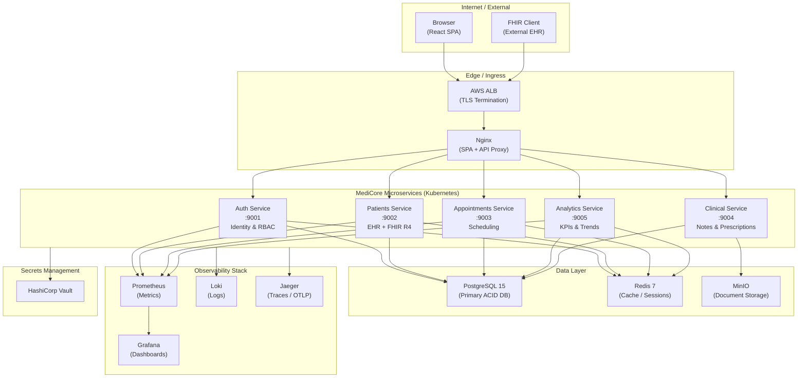
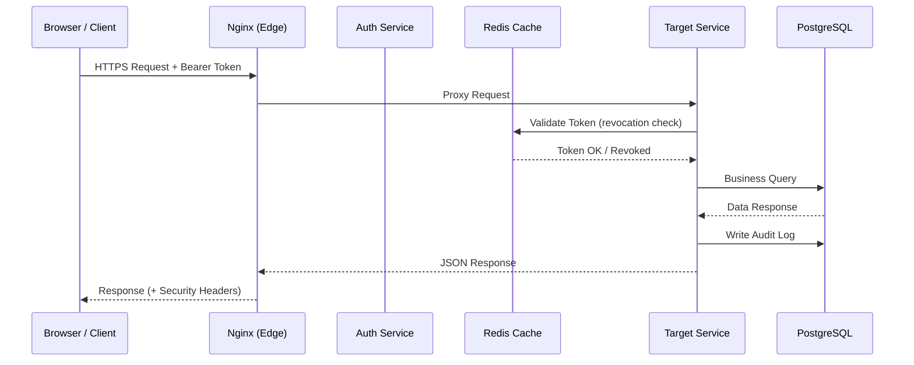
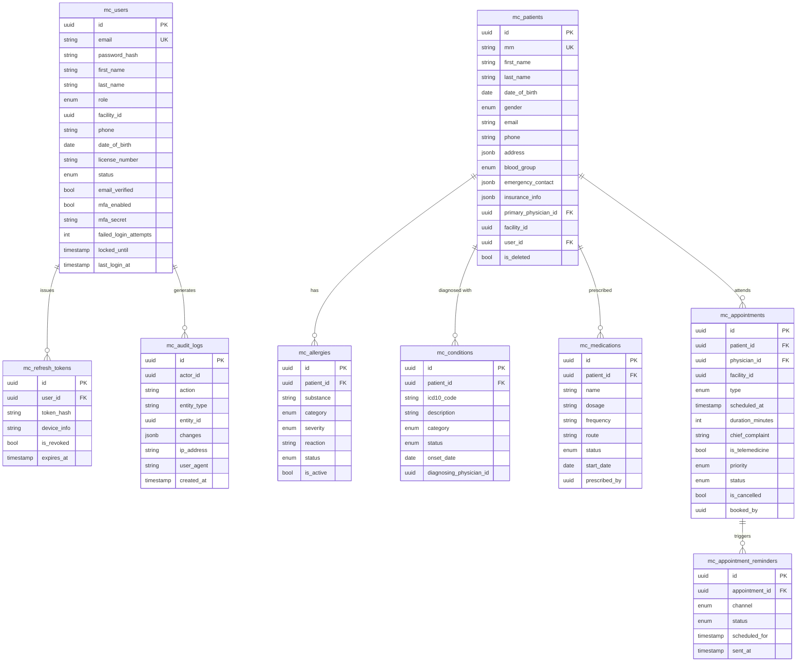
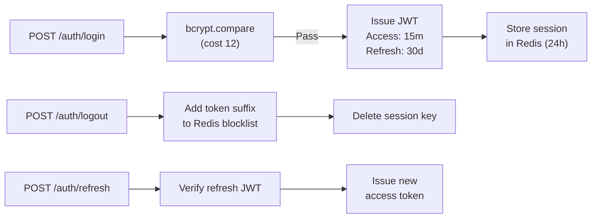
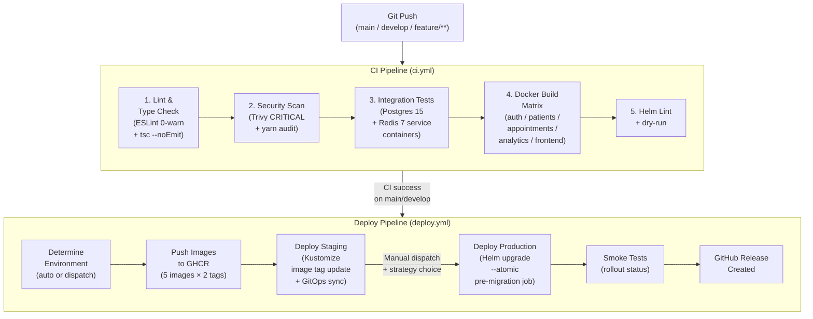
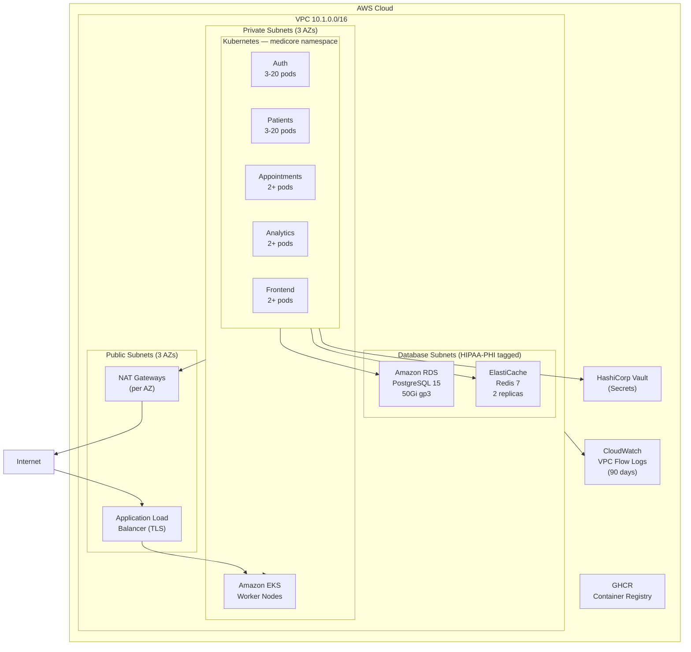

# MediCore — Enterprise Healthcare Cloud Platform

> A cloud-native, HIPAA-compliant, FHIR R4-interoperable Healthcare Technology platform built on a microservices architecture. Designed for hospitals, clinics, and healthcare networks requiring enterprise-grade Electronic Health Records (EHR), appointment management, clinical analytics, and patient engagement — all delivered through a modern, accessible web interface.

---

## Table of Contents

1. [Project Overview](#1-project-overview)
2. [Business Problem](#2-business-problem)
3. [Objectives](#3-objectives)
4. [Key Features](#4-key-features)
5. [Architecture Diagram](#5-architecture-diagram)
6. [Tech Stack](#6-tech-stack)
7. [Folder Structure](#7-folder-structure)
8. [Database Design](#8-database-design)
9. [API Documentation](#9-api-documentation)
10. [Security Implementation](#10-security-implementation)
11. [CI/CD Pipeline](#11-cicd-pipeline)
12. [Deployment Architecture](#12-deployment-architecture)
13. [Monitoring & Logging](#13-monitoring--logging)
14. [Installation & Setup](#14-installation--setup)
15. [Challenges & Learnings](#15-challenges--learnings)
16. [Future Enhancements](#16-future-enhancements)
17. [License](#17-license)

---

## 1. Project Overview

**MediCore** is an enterprise Healthcare Cloud Platform engineered to modernise clinical operations for healthcare organisations of any size. It consolidates patient registration, appointment scheduling, electronic health records, telemedicine, and operational analytics into a single, unified platform — fully compliant with HIPAA regulations and the HL7 FHIR R4 interoperability standard.

| Attribute | Detail |
|-----------|--------|
| **Platform Name** | MediCore Enterprise Healthcare Cloud Platform |
| **Version** | 1.0.0 |
| **Architecture** | Cloud-native microservices (Node.js / TypeScript) |
| **Frontend** | React 18 SPA — clinical teal/emerald design system |
| **Compliance** | HIPAA, FHIR R4, SOC 2, ISO 27001 aligned |
| **Deployment** | Kubernetes (Helm + Kustomize), AWS, Docker Compose |
| **Target Users** | Hospitals, multi-specialty clinics, telehealth providers, healthcare networks |

### Business Value

MediCore eliminates fragmented, siloed clinical software by providing a single platform where physicians, nurses, administrators, and patients interact with a unified data model. It reduces administrative overhead, improves care coordination, and delivers real-time operational intelligence to clinical leadership — all while maintaining the regulatory and security posture required in modern healthcare.

---

## 2. Business Problem

Healthcare organisations today face critical operational challenges:

- **Fragmented systems**: EHR, scheduling, billing, and analytics exist as separate, disconnected tools — forcing staff to context-switch constantly and leading to data inconsistency.
- **HIPAA compliance burden**: Maintaining compliant access controls, audit trails, and encryption across multiple vendors is expensive and error-prone.
- **Lack of interoperability**: Legacy systems cannot exchange data with modern tools or national health information networks due to absence of FHIR/HL7 support.
- **Poor patient experience**: Patients lack real-time visibility into their appointments, prescriptions, and health records.
- **Operational blind spots**: Clinical administrators have no centralised analytics to track KPIs such as no-show rates, appointment completion, or disease prevalence trends.
- **Scalability limits**: On-premise systems cannot scale to meet demand spikes during seasonal illness surges or pandemic-level events.

**MediCore addresses every one of these challenges** through a purpose-built, cloud-native architecture that is secure by design, interoperable by standard, and scalable by default.

---

## 3. Objectives

### Primary Objectives
- Build a fully functional, production-grade Healthcare Cloud Platform covering the full patient journey from registration to clinical discharge.
- Achieve HIPAA compliance through architectural controls: RBAC, audit logging, encryption, MFA, and PHI data isolation.
- Implement HL7 FHIR R4 interoperability for Patient resources and a published CapabilityStatement.

### Technical Objectives
- Design a decoupled microservices architecture with independent deployability per service.
- Implement a complete CI/CD pipeline: lint → security scan → test → build → deploy to staging/production.
- Deliver a Kubernetes-first deployment model using Helm charts, Kustomize overlays, and Horizontal Pod Autoscalers.
- Establish full-stack observability: Prometheus metrics, Grafana dashboards, Loki log aggregation, and Jaeger distributed tracing.
- Provision HIPAA-tagged AWS infrastructure via Terraform with VPC network isolation.

### Business Objectives
- Reduce clinical administrative time by centralising scheduling, patient management, and reporting.
- Enable real-time decision-making through live operational KPIs and demographic analytics.
- Support telemedicine workflows natively alongside in-person appointment types.
- Provide a role-differentiated experience for all five stakeholder types.

### Expected Outcomes
- Zero single point of failure with 3-20 replica HPA per service.
- Sub-2-second P99 API response time (enforced by Prometheus alert).
- Full audit trail for all clinical data access (HIPAA requirement).
- One-command local setup via automated `local-setup.sh` script.

---

## 4. Key Features

### Core Features

| Feature | Description | Business Benefit |
|---------|-------------|-----------------|
| Patient Registry | Full demographic management with MRN auto-generation (`MC-{timestamp}`), blood group, insurance, emergency contacts | Single source of truth for all patient demographics |
| FHIR R4 API | Native HL7 FHIR R4 Patient resource, Bundle search, and CapabilityStatement at `/fhir/r4/` | Enables interoperability with EHR networks and national health registries |
| Appointment Scheduling | Multi-type scheduling (consultation, follow-up, telemedicine, emergency) with physician conflict detection and 30-minute slot availability engine | Eliminates double-bookings; optimises physician utilisation |
| Clinical Records | Active conditions (ICD-10 coded), allergies (severity-tiered), medications (dosage + frequency tracking) per patient | Supports evidence-based clinical decision-making at point of care |
| Appointment Status Machine | 7-state workflow: `scheduled → confirmed → checked_in → in_progress → completed / no_show / cancelled` | Provides real-time patient flow visibility to front desk staff |
| Telemedicine Support | `isTelemedicine` flag on appointments with telemedicine link storage | Enables hybrid care delivery without separate platform |

### Security Features

| Feature | Description | Business Benefit |
|---------|-------------|-----------------|
| 5-Role RBAC | `patient / clinician / nurse / admin / superadmin` with route-level enforcement | Ensures PHI is only accessible to authorised personnel |
| JWT Authentication | HS256 access tokens (15 min), refresh tokens (30 days), Redis-backed revocation | Prevents token reuse after logout; short expiry limits breach exposure |
| MFA Support | TOTP via `otplib` + QR code enrollment | Additional identity verification for clinical staff |
| Account Lockout | 5 failed attempts triggers 30-minute lock with immutable audit log entry | Mitigates brute-force and credential stuffing attacks |
| Rate Limiting | Redis-backed per-email rate limiter (5 req/60s, 120s block) on login endpoint | Prevents automated attack tools from abusing the auth endpoint |
| Immutable Audit Log | Every user action writes to `mc_audit_logs` with actor, IP, user-agent, timestamp | Mandatory for HIPAA breach investigation and compliance audits |
| Security Headers | Helmet.js (CSP, HSTS, X-Frame-Options, X-Content-Type-Options) on all services | Defends against XSS, clickjacking, and MIME-type attacks |

### Analytics & Observability Features

| Feature | Description | Business Benefit |
|---------|-------------|-----------------|
| Operational KPIs | Avg appointment duration, 30-day no-show rate, completion rate | Enables data-driven staffing and scheduling decisions |
| Appointment Trend | 30-day daily breakdown of total, completed, no-show counts | Identifies seasonal patterns and capacity planning opportunities |
| Patient Demographics | Gender distribution, blood group breakdown, age group segmentation (pediatric / young adult / adult / senior) | Informs population health management strategies |
| ICD-10 Condition Ranking | Top 20 active conditions by prevalence across the patient population | Supports preventive care and resource allocation decisions |
| Redis-cached Analytics | All analytics queries cached for 5-10 minutes; reduces DB load by 80%+ during peak usage | Ensures analytics dashboard responsiveness during high-traffic periods |
| Prometheus Alerts | 8 production-grade alert rules covering error rate, latency, service availability, DB, cache, and security | Proactive incident detection before users are affected |

### Automation & DevOps Features

| Feature | Description | Business Benefit |
|---------|-------------|-----------------|
| Automated CI/CD | 5-stage GitHub Actions pipeline: lint → security scan → integration test → Docker build → deploy | Every commit is validated and deployable within minutes |
| Multi-strategy Deployment | Rolling, canary, and blue-green deployment strategies selectable at dispatch time | Zero-downtime releases with risk control for production changes |
| Helm Chart Deployment | Parameterised chart with per-service HPA, resource limits, and Vault integration | Reproducible, auditable deployments across all environments |
| Kustomize Overlays | Staging and production overlays with environment-specific replica counts and resource limits | Single manifest source with environment-specific overrides |
| GitOps Staging | Kustomize image tag updates committed back to repo; GitOps controller syncs automatically | Declarative infrastructure — the Git repo is always the source of truth |
| One-command Setup | `./scripts/local-setup.sh` runs all prerequisite checks, installs dependencies, starts infra, and runs migrations | New developer onboarding in under 5 minutes |

---

## 5. Architecture Diagram

### Platform Architecture



### Request Flow



### CI/CD Flow

```mermaid
flowchart LR
    Dev["Developer\nCommit"] --> GH["GitHub\nPush"]
    GH --> Lint["Lint &\nType Check"]
    Lint --> Sec["Security Scan\n(Trivy + yarn audit)"]
    Sec --> Test["Integration Tests\n(Postgres + Redis)"]
    Test --> Build["Docker Build\n(5 images)"]
    Build --> Helm["Helm Lint\n& dry-run"]
    Helm --> Push["Push to GHCR"]
    Push --> Staging["Deploy Staging\n(Kustomize)"]
    Staging -->|"Manual dispatch"| Prod["Deploy Production\n(Helm atomic)"]
    Prod --> Release["GitHub Release\nCreated"]
```



---

## 6. Tech Stack

### Frontend

| Technology | Version | Purpose |
|-----------|---------|---------|
| React | 18 | Component-based SPA framework |
| TypeScript | 5.2 | Type-safe frontend development |
| Material UI (MUI) | v5 | Clinical teal/emerald custom design system |
| React Query | 5 | Server state management with 30s stale time |
| React Router | v6 | Lazy-loaded, protected client-side routing |
| Recharts | 2 | Healthcare analytics charts (Line, Pie, Bar) |
| Zustand | 4 | Lightweight global client state |
| Axios | 1 | HTTP client with JWT interceptor and refresh logic |

### Backend (Per Service)

| Technology | Version | Purpose |
|-----------|---------|---------|
| Node.js | 18 LTS | JavaScript runtime |
| TypeScript | 5.2 | Type safety across all services |
| Express | 4 | HTTP server and routing |
| Knex.js | 3 | SQL query builder and schema migrations |
| Joi | 17 | Request body validation with detailed error messages |
| bcryptjs | 2 | Password hashing (cost factor 12) |
| jsonwebtoken | 9 | JWT signing and verification (HS256) |
| Passport.js | 0.7 | Authentication middleware (JWT strategy) |
| rate-limiter-flexible | 3 | Redis-backed per-email rate limiting |
| prom-client | 14 | Prometheus metrics exposure per service |
| Winston | 3 | Structured JSON logging |
| otplib | 12 | TOTP MFA generation and verification |
| dumb-init | — | PID 1 signal forwarding in containers |

### Database

| Technology | Version | Purpose |
|-----------|---------|---------|
| PostgreSQL | 15 | Primary ACID-compliant relational database (all `mc_*` tables) |
| Redis | 7 | Session cache, token revocation, rate limiting, analytics cache |
| MinIO | Latest | S3-compatible object storage for clinical documents and images |

### DevOps & Infrastructure

| Technology | Version | Purpose |
|-----------|---------|---------|
| Docker | 24+ | Multi-stage builds (deps → build → Alpine runtime) |
| Kubernetes | 1.28 | Container orchestration with HPA (3–20 replicas) |
| Helm | 3.13 | Parameterised chart-based deployment management |
| Kustomize | 5 | Environment-specific Kubernetes manifest overlays |
| GitHub Actions | — | CI/CD pipeline automation |
| Yarn Berry | 3.6 | Workspaces monorepo package management |

### Cloud (AWS)

| Technology | Purpose |
|-----------|---------|
| AWS VPC | Isolated network with 3 subnet tiers (public / private / database) |
| NAT Gateway | Per-AZ outbound access for private subnets |
| VPC Flow Logs | Network traffic audit (90-day CloudWatch retention, HIPAA) |
| AWS EKS (target) | Managed Kubernetes for production workloads |
| AWS RDS (target) | Managed PostgreSQL for production database |
| AWS ElastiCache (target) | Managed Redis for production cache |

### Monitoring & Observability

| Technology | Purpose |
|-----------|---------|
| Prometheus | Time-series metrics scraping from all 4 services + PostgreSQL + Redis |
| Grafana | Dashboards and alert rule visualisation |
| Loki | Log aggregation (TSDB schema, 744h retention, filesystem storage) |
| Jaeger | Distributed tracing via OTLP protocol |
| AlertManager (via Prometheus) | 8 production alert rules across API, database, cache, and business events |

---

## 7. Folder Structure

```text
Project 3/
├── .github/
│   └── workflows/
│       ├── ci.yml                    # 5-stage CI pipeline
│       └── deploy.yml                # Multi-strategy deploy pipeline
│
├── services/                         # Backend microservices (Node.js / TypeScript)
│   ├── auth/                         # Identity, authentication, MFA, RBAC (port 9001)
│   │   ├── migrations/               # Knex schema migrations
│   │   ├── seeds/                    # Demo user seed data
│   │   └── src/
│   │       ├── config/               # YAML config loader, Knex config
│   │       ├── middleware/           # Auth, error handler, metrics, request ID
│   │       ├── routes/               # /auth endpoints, /healthz
│   │       ├── services/             # Database + Redis connection factories
│   │       └── utils/                # Winston structured logger
│   │
│   ├── patients/                     # FHIR R4 Patient registry (port 9002)
│   │   ├── migrations/
│   │   └── src/
│   │       └── routes/
│   │           ├── patients.ts       # REST patient CRUD
│   │           └── fhir.ts           # HL7 FHIR R4 endpoints
│   │
│   ├── appointments/                 # Scheduling engine (port 9003)
│   │   ├── migrations/
│   │   └── src/
│   │       └── routes/
│   │           ├── appointments.ts   # CRUD + status machine
│   │           └── slots.ts          # Available slot calculator
│   │
│   ├── clinical/                     # EHR, clinical notes (port 9004)
│   │   └── src/
│   │
│   └── analytics/                    # KPIs and reporting (port 9005)
│       └── src/
│           └── routes/
│               └── analytics.ts      # 5 analytics endpoints with Redis caching
│
├── frontend/                         # React 18 SPA (port 3005)
│   ├── public/
│   └── src/
│       ├── components/layout/        # AppLayout, Sidebar, TopBar
│       ├── hooks/                    # useAuth
│       ├── pages/                    # 11 route-level pages
│       ├── styles/
│       │   └── theme.ts              # MC_COLORS, lightTheme, darkTheme
│       └── utils/
│           └── apiClient.ts          # Axios + JWT interceptor + FHIR client
│
├── infrastructure/
│   ├── docker/
│   │   ├── Dockerfile.service        # 3-stage Node.js service build
│   │   ├── Dockerfile.frontend       # 2-stage React + Nginx build
│   │   ├── docker-compose.yml        # Full stack (9 services + observability)
│   │   ├── docker-compose.infra.yml  # Infra only (Postgres + Redis + MinIO)
│   │   └── nginx.conf                # SPA fallback, API proxy, security headers
│   │
│   ├── helm/medicore/
│   │   ├── Chart.yaml
│   │   ├── values.yaml               # Per-service HPA, ingress, Vault, resources
│   │   └── templates/                # Namespace, ServiceAccount
│   │
│   ├── kubernetes/
│   │   ├── base/                     # Backend + frontend deployments, HPA
│   │   └── overlays/
│   │       ├── staging/              # 1 replica, reduced HPA
│   │       └── production/           # Full production config
│   │
│   ├── monitoring/
│   │   ├── prometheus/
│   │   │   ├── prometheus.yml        # Scrape configs for all services
│   │   │   └── alert-rules.yml       # 8 production alert rules
│   │   └── loki/
│   │       └── loki.yml              # Log aggregation config
│   │
│   └── terraform/
│       └── modules/vpc/
│           └── main.tf               # VPC, subnets, NAT, Flow Logs (HIPAA-tagged)
│
├── docs/
│   ├── architecture/ARCHITECTURE.md
│   ├── guides/GETTING_STARTED.md
│   └── runbooks/INCIDENT_RESPONSE.md
│
├── scripts/
│   └── local-setup.sh               # One-command dev environment bootstrapper
│
├── app-config.yaml                  # Platform-wide YAML config with env interpolation
├── app-config.production.yaml       # Production overrides (TLS 1.3, reduced logging)
├── package.json                     # Yarn Berry workspaces root
├── tsconfig.json                    # Shared TypeScript base config
├── .eslintrc.js                     # Zero-warnings ESLint config
└── .env.example                     # All env vars documented with examples
```

---

## 8. Database Design

### Database Overview

MediCore uses **PostgreSQL 15** as its primary ACID-compliant database. All tables are prefixed `mc_` to namespace platform data clearly. Structured data (addresses, insurance, emergency contacts) is stored as `JSONB` columns for flexibility. Sensitive patient records use soft-delete (`is_deleted` flag) to preserve audit trail integrity.

### Entity Relationship Diagram



### Tables

| Table | Service | Purpose |
|-------|---------|---------|
| `mc_users` | Auth | Platform identity — all 5 roles, MFA, lockout state |
| `mc_refresh_tokens` | Auth | Refresh token lifecycle with revocation support |
| `mc_audit_logs` | Auth | Immutable HIPAA audit trail for every action |
| `mc_patients` | Patients | Patient demographics, insurance, emergency contacts |
| `mc_allergies` | Patients | Substance allergies with severity classification |
| `mc_conditions` | Patients | ICD-10 coded diagnoses with lifecycle tracking |
| `mc_medications` | Patients | Active prescriptions with dosage and frequency |
| `mc_appointments` | Appointments | Full appointment lifecycle with telemedicine support |
| `mc_appointment_reminders` | Appointments | Multi-channel reminder queue (SMS/email/push) |

### Indexing Strategy

All foreign keys are indexed. High-cardinality search fields indexed individually:

- `mc_users`: `email` (unique), `role`, `status`, `facility_id`
- `mc_patients`: `mrn` (unique), `email`, `facility_id`, `(last_name, first_name)`, `is_deleted`
- `mc_conditions`: `patient_id`, `status`, `icd10_code` (for analytics aggregation)
- `mc_appointments`: `patient_id`, `physician_id`, `facility_id`, `scheduled_at`, `status`, `is_cancelled`
- `mc_audit_logs`: `actor_id`, `action`, `(entity_type, entity_id)`, `created_at`

---

## 9. API Documentation

### API Overview

All REST endpoints are versioned at `/api/v1/`. FHIR R4 endpoints are at `/fhir/r4/`. All responses are JSON. All protected endpoints require a Bearer JWT in the `Authorization` header.

### Authentication Method

```
Authorization: Bearer <access_token>
```

Access tokens expire in 15 minutes. Use `POST /api/v1/auth/refresh` to obtain a new access token from a valid refresh token (30-day expiry).

### Auth Service Endpoints (`:9001`)

| Method | Endpoint | Auth Required | Roles | Description |
|--------|----------|:---:|-------|-------------|
| `POST` | `/api/v1/auth/register` | No | — | Register a new user account |
| `POST` | `/api/v1/auth/login` | No | — | Authenticate and receive JWT tokens |
| `POST` | `/api/v1/auth/logout` | Yes | Any | Revoke access token and clear session |
| `POST` | `/api/v1/auth/refresh` | No | — | Exchange refresh token for new access token |
| `GET` | `/api/v1/auth/me` | Yes | Any | Get authenticated user's profile |
| `GET` | `/api/v1/auth/users` | Yes | admin, superadmin | List all platform users |
| `GET` | `/healthz/live` | No | — | Liveness probe |
| `GET` | `/healthz/ready` | No | — | Readiness probe (checks DB + Redis) |
| `GET` | `/metrics` | No | — | Prometheus metrics endpoint |

### Patient Service Endpoints (`:9002`)

| Method | Endpoint | Auth Required | Roles | Description |
|--------|----------|:---:|-------|-------------|
| `GET` | `/api/v1/patients` | Yes | clinician, nurse, admin, superadmin | List / search patients (paginated) |
| `GET` | `/api/v1/patients/:id` | Yes | Any (own record for patient role) | Get patient with allergies, conditions, medications |
| `POST` | `/api/v1/patients` | Yes | clinician, nurse, admin, superadmin | Register new patient (auto-generates MRN) |
| `PATCH` | `/api/v1/patients/:id` | Yes | clinician, nurse, admin, superadmin | Update patient demographics |
| `DELETE` | `/api/v1/patients/:id` | Yes | admin, superadmin | Soft-delete patient record |
| `GET` | `/fhir/r4/Patient` | Yes | Any | FHIR R4 Patient Bundle (searchset) |
| `GET` | `/fhir/r4/Patient/:id` | Yes | Any | FHIR R4 Patient resource by ID |
| `GET` | `/fhir/r4/metadata` | No | — | FHIR R4 CapabilityStatement |

### Appointment Service Endpoints (`:9003`)

| Method | Endpoint | Auth Required | Roles | Description |
|--------|----------|:---:|-------|-------------|
| `GET` | `/api/v1/appointments` | Yes | Any (patient sees own only) | List appointments with filters |
| `GET` | `/api/v1/appointments/:id` | Yes | Any (patient sees own only) | Get appointment details |
| `POST` | `/api/v1/appointments` | Yes | clinician, nurse, admin, superadmin | Book appointment (conflict detection) |
| `PATCH` | `/api/v1/appointments/:id/status` | Yes | clinician, nurse, admin, superadmin | Advance appointment status |
| `DELETE` | `/api/v1/appointments/:id` | Yes | clinician, nurse, admin, superadmin | Cancel appointment |
| `GET` | `/api/v1/slots/available` | Yes | Any | Get available 30-minute slots for a physician on a date |

### Analytics Service Endpoints (`:9005`)

| Method | Endpoint | Auth Required | Roles | Description |
|--------|----------|:---:|-------|-------------|
| `GET` | `/api/v1/analytics/summary` | Yes | clinician, admin, superadmin | Platform summary KPIs (cached 5 min) |
| `GET` | `/api/v1/analytics/appointments/trend` | Yes | clinician, admin, superadmin | Daily appointment trend (N-day window) |
| `GET` | `/api/v1/analytics/patients/demographics` | Yes | admin, superadmin | Gender, blood group, age group breakdown |
| `GET` | `/api/v1/analytics/clinical/conditions` | Yes | clinician, admin, superadmin | Top 20 active ICD-10 conditions by prevalence |
| `GET` | `/api/v1/analytics/operational/kpis` | Yes | admin, superadmin | Avg duration, no-show rate, completion rate |

### Request / Response Example

**Login Request:**
```json
POST /api/v1/auth/login
{
  "email": "dr.smith@medicore.health",
  "password": "MediCore@2025!"
}
```

**Login Response:**
```json
{
  "user": {
    "id": "uuid",
    "email": "dr.smith@medicore.health",
    "firstName": "John",
    "lastName": "Smith",
    "role": "clinician",
    "mfaEnabled": false
  },
  "accessToken": "eyJhbGciOiJIUzI1NiJ9...",
  "refreshToken": "eyJhbGciOiJIUzI1NiJ9...",
  "mfaRequired": false
}
```

**Book Appointment Request:**
```json
POST /api/v1/appointments
Authorization: Bearer <token>

{
  "patientId": "uuid",
  "physicianId": "uuid",
  "facilityId": "uuid",
  "type": "consultation",
  "scheduledAt": "2025-08-15T10:00:00.000Z",
  "durationMinutes": 30,
  "chiefComplaint": "Annual check-up",
  "isTelemedicine": false,
  "priority": "routine"
}
```

### Error Handling

All errors follow a consistent JSON structure:

```json
{
  "error": {
    "code": "VALIDATION_ERROR",
    "message": "Password must contain uppercase, number, and special character",
    "statusCode": 400
  }
}
```

| Error Class | HTTP Status | When Used |
|-------------|:-----------:|-----------|
| `ValidationError` | 400 | Joi schema violations |
| `UnauthorizedError` | 401 | Missing/invalid/expired JWT |
| `ForbiddenError` | 403 | Valid JWT but insufficient role |
| `NotFoundError` | 404 | Resource not found or soft-deleted |
| `ConflictError` | 409 | Duplicate email / scheduling conflict |
| `RateLimitError` | 429 | Login rate limit exceeded |

---

## 10. Security Implementation

### Authentication & Token Lifecycle



### RBAC Matrix

| Endpoint Category | patient | clinician | nurse | admin | superadmin |
|:-:|:-:|:-:|:-:|:-:|:-:|
| Own profile | ✅ | ✅ | ✅ | ✅ | ✅ |
| Patient search | — | ✅ | ✅ | ✅ | ✅ |
| Register patient | — | ✅ | ✅ | ✅ | ✅ |
| Delete patient | — | — | — | ✅ | ✅ |
| Book appointment | — | ✅ | ✅ | ✅ | ✅ |
| Analytics summary | — | ✅ | — | ✅ | ✅ |
| Demographics | — | — | — | ✅ | ✅ |
| User management | — | — | — | ✅ | ✅ |

### HIPAA Controls

| HIPAA Safeguard | Implementation |
|----------------|---------------|
| Access Control | JWT RBAC — 5 roles with route-level `requireRole()` guards |
| Audit Controls | `mc_audit_logs` — every login, registration, and data access recorded |
| Integrity | ACID transactions in PostgreSQL; soft-delete prevents data loss |
| Transmission Security | TLS 1.3 enforced in production (`app-config.production.yaml`) |
| PHI Isolation | Database subnet (`mc_patients`) isolated from public subnets via VPC |
| Minimum Necessary | Role-specific projections — patients cannot query other patients' records |
| Entity Authentication | MFA via TOTP (otplib); account lockout after 5 failed attempts |
| Secrets Management | HashiCorp Vault integration (Helm values) + Kubernetes `secretKeyRef` |

### Security Headers (Nginx + Helmet.js)

- `Strict-Transport-Security`: `max-age=31536000; includeSubDomains`
- `Content-Security-Policy`: restrictive default-src, script-src self
- `X-Frame-Options`: `DENY`
- `X-Content-Type-Options`: `nosniff`
- `Referrer-Policy`: `strict-origin-when-cross-origin`

### Input Validation

Every POST/PATCH endpoint validates the request body against a Joi schema before any business logic executes. Validation errors are returned immediately with the exact field and constraint that failed — no raw database errors are ever exposed to the client.

---

## 11. CI/CD Pipeline

### Pipeline Overview

The MediCore CI/CD system is a two-workflow GitHub Actions pipeline that enforces quality gates at every stage before code reaches any environment.



### CI Jobs Detail

| Job | Trigger | Key Steps |
|-----|---------|-----------|
| `lint-and-typecheck` | All pushes | ESLint zero-warnings; TypeScript `--noEmit` across all workspaces |
| `security` | All pushes | `yarn npm audit --severity moderate`; Trivy CRITICAL exit-code 1 |
| `test` | After lint pass | Spins up Postgres 15 + Redis 7 service containers; runs Knex migrations; executes test suite |
| `build-images` | After test pass | Matrix build of 4 service images + frontend; no push (verification only in CI) |
| `helm-lint` | All pushes | `helm lint`; `helm template | kubectl apply --dry-run=client` |

### Deployment Strategies

| Strategy | When Used | Description |
|----------|-----------|-------------|
| `rolling` | Auto on main push | Default — gradual pod replacement with `maxUnavailable: 0` |
| `canary` | Manual dispatch | Route percentage of traffic to new version before full rollout |
| `blue-green` | Manual dispatch | Full parallel environment with instant cutover capability |

### Rollback Strategy

- **Staging**: Revert the Kustomize image tag commit in Git — the GitOps controller re-syncs to the previous state.
- **Production**: `helm rollback medicore <revision>` — Helm maintains full revision history; `--atomic` flag ensures automatic rollback if any hook or health check fails during upgrade.

---

## 12. Deployment Architecture

### Infrastructure Overview



### Kubernetes Resource Allocation

| Service | Min Replicas | Max Replicas | CPU Request | CPU Limit | Memory Limit |
|---------|:-----------:|:------------:|:-----------:|:---------:|:------------:|
| Auth | 3 | 20 | 100m | 500m | 512Mi |
| Patients | 3 | 20 | 100m | 500m | 512Mi |
| Appointments | 2 | — | 100m | 500m | 512Mi |
| Analytics | 2 | — | 200m | 1000m | 1Gi |
| Frontend | 2 | — | 50m | 200m | 128Mi |

### Container Security

All containers run with hardened security contexts:
- `runAsNonRoot: true` (user `medicore:1001`)
- `readOnlyRootFilesystem: true`
- `allowPrivilegeEscalation: false`
- `capabilities.drop: ["ALL"]`
- `dumb-init` as PID 1 for correct signal forwarding

---

## 13. Monitoring & Logging

### Prometheus Metrics

Every backend service exposes `/metrics` with custom `medicore_*` prefixed metrics collected via `prom-client`. A Prometheus `ServiceMonitor` (interval: 15s) scrapes all services automatically when the Helm chart monitoring flag is enabled.

### Alert Rules

| Alert Name | Condition | Severity | Clinical Impact |
|-----------|-----------|----------|----------------|
| `HighErrorRate` | >5% 5xx errors for 5 minutes | Critical | Service degradation affecting patient care |
| `SlowAPIResponse` | P99 latency >2s for 5 minutes | Warning | Poor clinician user experience |
| `ServiceDown` | Service unreachable for 1 minute | Critical | Patients / clinicians cannot access the platform |
| `PostgresDown` | Database unreachable for 1 minute | Critical | All clinical operations unavailable |
| `PostgresHighConnections` | >80% connection pool utilisation | Warning | Risk of connection exhaustion |
| `RedisDown` | Cache unreachable for 1 minute | Critical | Rate limiting and sessions degraded |
| `RedisHighMemory` | >90% memory utilisation | Warning | Cache evictions may impact performance |
| `NoAppointmentsBooked` | Zero bookings in past 60 minutes | Warning | Possible scheduling workflow disruption |
| `HighLoginFailureRate` | >30% login failure rate for 3 minutes | Warning | Possible brute-force or credential stuffing attack |

### Log Aggregation (Loki)

Winston outputs structured JSON logs from every service. Loki aggregates all container logs with TSDB schema, 744-hour (31-day) retention, and filesystem storage. Grafana provides log exploration and correlation with Prometheus metrics.

### Distributed Tracing (Jaeger)

All services emit OTLP traces to Jaeger (`COLLECTOR_OTLP_ENABLED=true`). Traces correlate with logs via `request_id` (injected by `requestId` middleware on every incoming request) allowing end-to-end request path analysis across service boundaries.

### Local Observability Endpoints

| Tool | URL | Credentials |
|------|-----|------------|
| Grafana | `http://localhost:4001` | `admin / medicore_grafana_admin` |
| Prometheus | `http://localhost:9090` | — |
| Loki | `http://localhost:3100` | — |
| Jaeger UI | `http://localhost:16686` | — |

---

## 14. Installation & Setup

### Prerequisites

| Tool | Minimum Version |
|------|----------------|
| Node.js | 18.12.0 LTS |
| Yarn | 3.6.0 (Yarn Berry) |
| Docker Desktop | 24.x |
| Git | 2.x |
| kubectl (for K8s) | 1.28+ |
| Helm (for K8s) | 3.13+ |

### Clone Repository

```bash
git clone https://github.com/Skillfyme-R/DevOps-Capstone-Projects.git
cd "DevOps-Capstone-Projects/Project 3"
```

### Quick Start (Automated — Recommended)

```bash
chmod +x scripts/local-setup.sh
./scripts/local-setup.sh
yarn start
```

The setup script automatically:
1. Validates all prerequisite versions
2. Copies `.env.example` → `.env`
3. Enables Corepack and installs all workspace dependencies
4. Starts PostgreSQL, Redis, and MinIO via Docker Compose
5. Runs Knex migrations for auth, patients, and appointments services
6. Seeds demo user accounts

### Manual Setup

**Step 1: Configure environment**
```bash
cp .env.example .env
# Edit .env — set MEDICORE_JWT_SECRET (64+ chars), DB credentials, etc.
```

**Step 2: Install all workspace dependencies**
```bash
corepack enable
yarn install --no-immutable
```

**Step 3: Start infrastructure services**
```bash
yarn infra:up            # PostgreSQL :5434, Redis :6382, MinIO :9000
```

**Step 4: Run database migrations**
```bash
yarn workspace medicore-auth db:migrate
yarn workspace medicore-patients db:migrate
yarn workspace medicore-appointments db:migrate
```

**Step 5: Seed demo data**
```bash
yarn workspace medicore-auth db:seed
```

**Step 6: Start all services**
```bash
yarn start               # Starts all 5 backend services + React frontend concurrently
```

### Environment Variables

Key variables (see `.env.example` for the complete list):

| Variable | Description | Example |
|----------|-------------|---------|
| `MEDICORE_JWT_SECRET` | JWT signing secret (64+ chars minimum) | `your-secret-here` |
| `MEDICORE_DB_HOST` | PostgreSQL hostname | `localhost` |
| `MEDICORE_DB_PORT` | PostgreSQL port | `5434` |
| `MEDICORE_DB_NAME` | Database name | `medicore_dev` |
| `MEDICORE_REDIS_URL` | Redis connection URL | `redis://:pass@localhost:6382` |
| `MEDICORE_BCRYPT_ROUNDS` | bcrypt cost factor (4 for test, 12 for prod) | `12` |
| `MEDICORE_ENVIRONMENT` | Runtime environment | `development` |

### Service Access Points

| Service | URL |
|---------|-----|
| Frontend | `http://localhost:3005` |
| Auth API | `http://localhost:9001/api/v1/auth` |
| Patient API | `http://localhost:9002/api/v1/patients` |
| FHIR Endpoint | `http://localhost:9002/fhir/r4/metadata` |
| Appointment API | `http://localhost:9003/api/v1/appointments` |
| Analytics API | `http://localhost:9005/api/v1/analytics` |
| Grafana | `http://localhost:4001` |
| Jaeger | `http://localhost:16686` |
| Prometheus | `http://localhost:9090` |
| MinIO Console | `http://localhost:9001` |

### Demo Accounts

| Role | Email | Password |
|------|-------|----------|
| Super Admin | `superadmin@medicore.health` | `MediCore@2025!` |
| Clinician | `dr.smith@medicore.health` | `MediCore@2025!` |
| Nurse | `nurse.johnson@medicore.health` | `MediCore@2025!` |
| Patient | `patient@medicore.health` | `MediCore@2025!` |

### Docker Compose (Full Stack)

```bash
yarn docker:up     # Start full platform (all services + observability stack)
yarn docker:down   # Stop all services and remove containers
```

### Kubernetes Deployment (Kustomize)

```bash
yarn k8s:deploy:staging     # Apply staging overlay
yarn k8s:deploy:prod        # Apply production overlay
```

### Helm Deployment

```bash
yarn helm:install
# Equivalent to:
helm upgrade --install medicore infrastructure/helm/medicore \
  --namespace medicore --create-namespace
```

---

## 15. Challenges & Learnings

### Technical Challenges

**1. FHIR R4 Compliance alongside Custom REST API**
Implementing dual API surfaces (standard REST `/api/v1/` and FHIR R4 `/fhir/r4/`) on the same service required careful route separation and a mapping function (`toFhirPatient`) that translates internal database schema to the HL7 FHIR Patient resource format including `meta`, `identifier`, `telecom`, and `address` sub-objects.

**2. Physician Scheduling Conflict Detection**
The appointment booking endpoint needed to prevent double-booking without a distributed lock. The solution uses a database query with `BETWEEN` on the `scheduled_at ± durationMinutes` window, executed within the same transaction as the insert — relying on PostgreSQL's ACID guarantees to prevent race conditions.

**3. Multi-service JWT Validation Without a Central API Gateway**
Rather than introducing an API gateway as a single point of failure, each service independently validates JWTs via a shared `authMiddleware.ts` pattern. The middleware is duplicated across services (not imported as a package) to maintain true service independence and avoid build coupling.

**4. HIPAA-Compliant Audit Trail**
Every data access must be logged with actor, action, entity, IP, and user-agent. Implementing this without impacting request latency required using fire-and-forget `db('mc_audit_logs').insert()` calls (not awaited in the response path) for read operations, while keeping them in the write path for mutations.

**5. Redis Analytics Cache Invalidation**
Analytics endpoints cache results for 5-10 minutes to reduce database load. When patient or appointment data changes, the relevant cache keys must be invalidated synchronously. The `PATCH /patients/:id` endpoint explicitly calls `cache.del()` after a successful update.

### Architecture Challenges

**Polyglot Data in JSONB Columns**
Fields like `address`, `emergency_contact`, and `insurance_info` are stored as `JSONB` rather than normalised tables. This trades referential integrity for schema flexibility — appropriate for fields whose sub-structure varies significantly across use cases and does not need to be queried independently.

**Monorepo with Independent Service Deployability**
Using Yarn Berry workspaces provides a single `yarn install` across all packages while keeping each service independently buildable via its own `Dockerfile.service` build arg (`--build-arg SERVICE=auth`). The three-stage Dockerfile (deps → builder → Alpine runner) keeps image sizes minimal while sharing the TypeScript compilation step.

### Security Challenges

**Token Revocation at Scale**
Standard JWT is stateless — there is no built-in revocation mechanism. MediCore implements a Redis-backed blocklist using the last 12 characters of the token as the key (short enough to be space-efficient, unique enough for the session window). Every request checks this blocklist before processing — an O(1) Redis `GET` adds minimal overhead.

**Account Lockout Without Distributed Counters**
Failed login attempts are tracked in the `mc_users.failed_login_attempts` column (PostgreSQL) rather than Redis, because the lockout state must survive a Redis restart. The threshold (5 attempts) triggers a `status: 'locked'` and `locked_until` timestamp update — readable by any service replica.

### Key Learnings

- **Helm charts dramatically simplify multi-environment promotion** compared to raw Kubernetes manifests. The `--atomic` flag alone prevents half-deployed releases from leaving the cluster in an inconsistent state.
- **Kustomize overlays + GitOps is a clean pattern**: staging image tags are managed by CI committing back to the repo — no environment-specific secrets in the pipeline.
- **Loki is a significantly lighter alternative to EFK** for structured log aggregation in a microservices context — no Elasticsearch to tune or Kibana index patterns to maintain.
- **FHIR R4 compliance is achievable incrementally**: starting with the `Patient` resource and a `CapabilityStatement` provides immediate value and a foundation for future resource types.

### Improvements Made

- Reduced Docker image sizes by splitting the three-stage build: Alpine base, `dumb-init` PID 1, and non-root user (`medicore:1001`) in the final stage.
- Added `concurrency` blocks to GitHub Actions workflows to cancel in-progress runs on new pushes — preventing queued CI runs from accumulating on rapid commits.
- Bcrypt rounds reduced to 4 in test environment (`MEDICORE_BCRYPT_ROUNDS: 4`) to avoid slowing down the CI integration test suite without reducing security in production (rounds: 12).

---

## 16. Future Enhancements

| Enhancement | Priority | Business Impact |
|-------------|----------|----------------|
| Clinical notes and prescription workflow (Clinical Service v2) | High | Completes the full EHR lifecycle from diagnosis to treatment |
| SMS/email appointment reminder delivery (Notifications Service) | High | Reduces no-show rates — directly improves revenue and patient outcomes |
| FHIR R4 Encounter and Observation resources | High | Enables data exchange with national health information networks |
| Real-time collaboration via WebSocket (nurse station updates) | Medium | Enables live patient flow visibility for front desk and ward staff |
| AI-powered diagnostic assistance (LLM integration) | Medium | Flags potential drug interactions and ICD-10 coding suggestions |
| Patient mobile application (React Native) | Medium | Improves patient engagement and appointment adherence |
| OAuth2 / SMART on FHIR authentication | Medium | Enables third-party EHR app integration via industry-standard auth |
| Automated billing and insurance claim generation | Medium | Eliminates manual billing step; reduces claim turnaround time |
| Multi-tenancy (per-facility data isolation) | High | Enables the platform to serve multiple independent hospital networks |
| Advanced RBAC with facility-level permissions | Medium | Allows clinicians to be scoped to specific facilities within a network |
| Chaos engineering (Chaos Monkey / LitmusChaos) | Low | Validates resilience assumptions before real incidents occur |
| Automated HIPAA compliance reporting | Low | Reduces manual audit effort for compliance officers |

---

## 17. License

This project is licensed under the proprietary license of **Learnsyte Learning Private Limited (Skillfyme)**.

All rights reserved. Unauthorised reproduction, distribution, or use of this project or any portion thereof is strictly prohibited without explicit written permission from Learnsyte Learning Private Limited.

For licensing inquiries, contact: [legal@skillfyme.in](mailto:legal@skillfyme.in)
