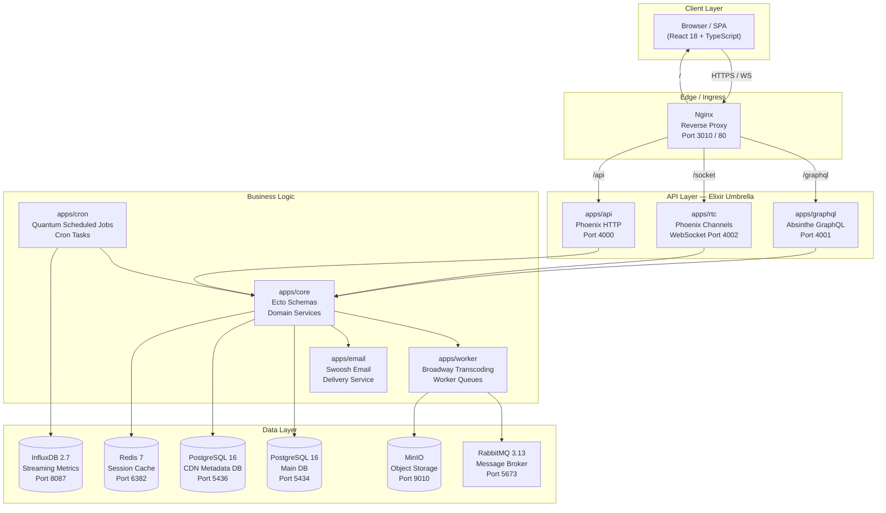
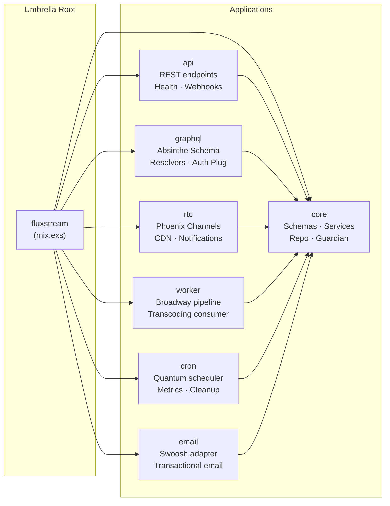
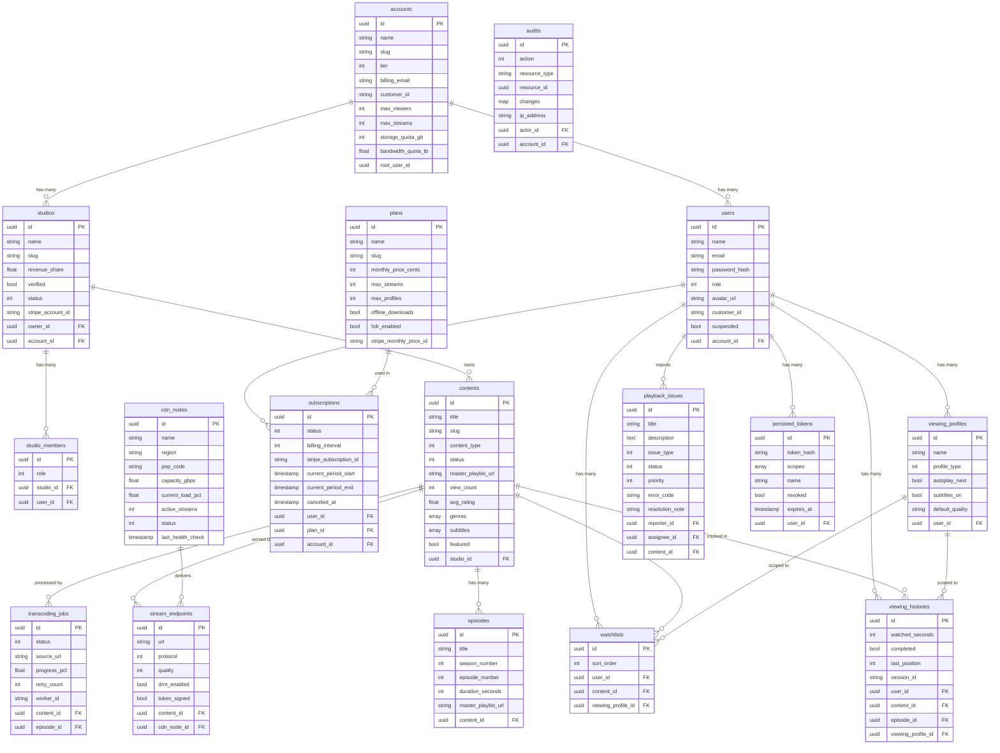
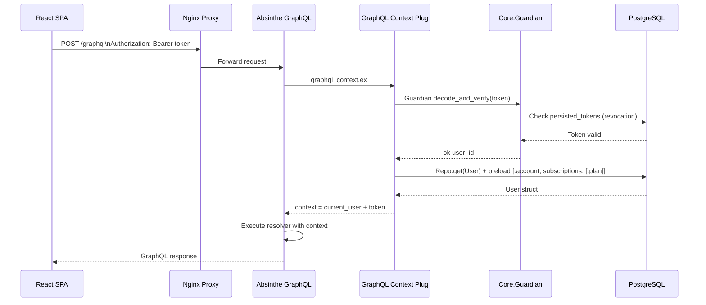
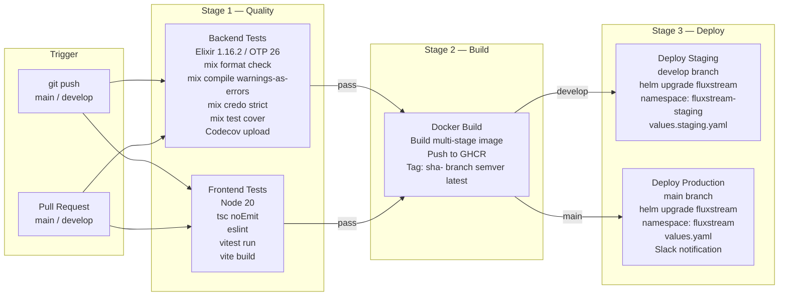
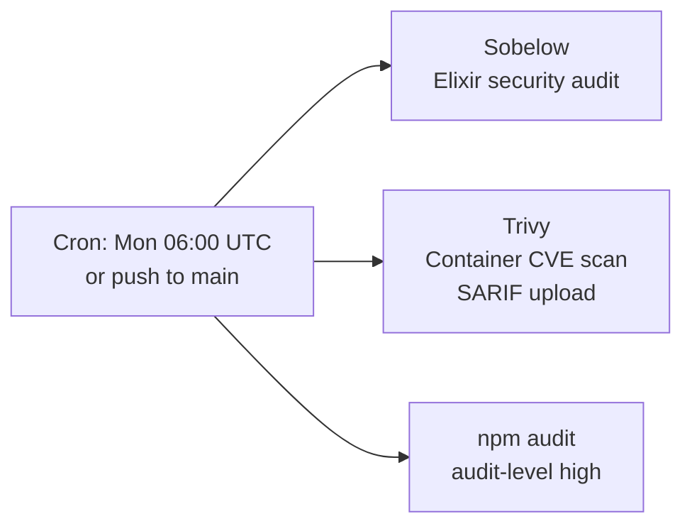
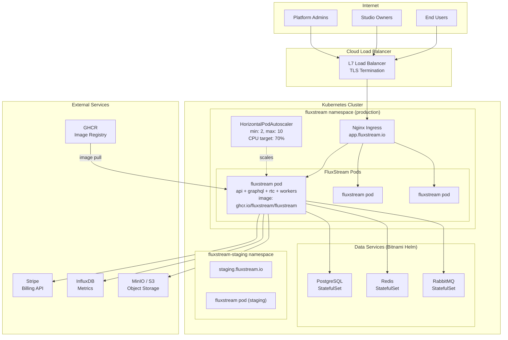

# FluxStream — Enterprise OTT Streaming Platform

<div align="center">


**A production-grade, multi-tenant OTT streaming SaaS — built on an Elixir umbrella architecture with a React TypeScript frontend, GraphQL API, real-time WebSocket channels, and a full Kubernetes deployment pipeline.**

</div>

---

## Table of Contents

1. [Project Overview](#1-project-overview)
2. [Business Problem & Objectives](#2-business-problem--objectives)
3. [Key Features](#3-key-features)
4. [System Architecture](#4-system-architecture)
5. [Tech Stack](#5-tech-stack)
6. [Folder Structure](#6-folder-structure)
7. [Database Design](#7-database-design)
8. [GraphQL API Reference](#8-graphql-api-reference)
9. [Security Implementation](#9-security-implementation)
10. [CI/CD Pipeline](#10-cicd-pipeline)
11. [Deployment Architecture](#11-deployment-architecture)
12. [Installation & Local Setup](#12-installation--local-setup)
13. [Environment Variables](#13-environment-variables)
14. [Challenges & Learnings](#14-challenges--learnings)
15. [Future Enhancements](#15-future-enhancements)
16. [License](#16-license)

---

## 1. Project Overview

**FluxStream** is a fully functional, enterprise-grade OTT (Over-the-Top) streaming platform designed as a SaaS product. It enables media companies, studios, and content creators to host, transcode, and distribute video content to subscribers globally — with multi-tenant account isolation, tiered subscription billing, a real-time CDN orchestration dashboard, and a creator studio portal.

The platform is built on an **Elixir/Phoenix umbrella** application composed of 7 independent OTP applications, served through an **Absinthe GraphQL** API, with a **React 18 TypeScript** single-page frontend. The entire stack is containerized with Docker and deployable to Kubernetes via Helm.

---

## 2. Business Problem & Objectives

### The Problem

Building an OTT streaming platform from scratch requires solving a complex intersection of distributed systems challenges:

- **Video transcoding pipelines** that must handle large files asynchronously without blocking web processes
- **Multi-tenant content isolation** where studios and accounts must never see each other's data
- **Real-time delivery metrics** requiring sub-second CDN health updates across global PoPs
- **Subscription billing lifecycle** with plan changes, cancellations, trial periods, and Stripe webhooks
- **Viewer experience** with adaptive bitrate streaming, watchlists, viewing history, and multi-profile support

### Objectives

| Objective | Implementation |
|---|---|
| Multi-tenant SaaS architecture | Account-scoped data isolation across all entities |
| Video content lifecycle management | Studio portal → upload → transcode → publish workflow |
| Adaptive bitrate streaming | HLS/DASH master playlists via CDN node routing |
| Real-time platform monitoring | WebSocket channels push CDN metrics & stream counts |
| Subscription billing engine | Stripe integration with plan tiers & trial management |
| Admin & support operations | Ticket management, audit logs, role-based access |
| Cloud-native deployment | Docker Compose (dev) → Kubernetes with Helm (prod) |

---

## 3. Key Features

### Viewer Features

| Feature | Description |
|---|---|
| Content Catalog | Browse movies, series, shorts, documentaries, and live streams by genre, type, and studio |
| Adaptive Streaming | HLS player with automatic quality switching (4K / 1080p / 720p / 480p / Auto) |
| Watchlist | Add/remove titles; per-profile watchlist support |
| Viewing History | Resume playback from last position; completion tracking |
| Multi-Profile | Up to N profiles per account; per-profile preferences and watchlists |
| Content Search | Full-text search with Fuse.js fuzzy matching and genre filtering |
| Ratings & Reviews | Star ratings and text reviews per title |
| Subtitle Support | Per-profile subtitle language preference; multi-language tracks |

### Studio & Creator Features

| Feature | Description |
|---|---|
| Studio Portal | Create and manage a branded content studio |
| Content Upload | Upload video files (or provide source URLs) with metadata tagging |
| Publish Workflow | Draft → Processing → Published state machine |
| Episode Management | Season/episode structure for series content |
| Studio Analytics | View counts, ratings, and revenue tracking |
| Revenue Share | Configurable revenue share percentage per studio (default 70%) |

### Platform Admin Features

| Feature | Description |
|---|---|
| CDN Dashboard | Real-time map of global CDN PoPs with load, latency, and active stream counts |
| Platform Capacity | Aggregate bandwidth (Gbps), load %, and total active streams |
| Support Tickets | View, filter, and action all user-raised playback issues |
| Status Transitions | Move tickets through OPEN → IN_PROGRESS → RESOLVED → CLOSED |
| User Management | Role assignment, suspension, account tier control |
| Audit Log | Immutable audit trail of all sensitive platform actions |

### Platform-Wide Features

| Feature | Description |
|---|---|
| Authentication | Email/password with Argon2 hashing + OAuth (Google / GitHub) social login |
| JWT Sessions | 30-day tokens; per-token revocation; Guardian-based verification |
| Role-Based Access | `viewer`, `studio_owner`, `studio_member`, `platform_admin` roles |
| Settings | Per-user quality, autoplay, subtitle, notification preferences (localStorage) |
| Notifications | Real-time in-app notification bell via React NotificationContext |
| Live Support Chat | In-app simulated support chat with agent typing indicators |
| Dark Mode | Full dark-mode-only UI with FluxStream's purple/slate design system |

---

## 4. System Architecture

### High-Level Architecture



### Elixir Umbrella App Structure



### Frontend Component Architecture

```mermaid
graph TD
    App["App.tsx\nReact Router v6\nLazy Routes"]

    subgraph "Global Contexts"
        Auth["AuthContext\nJWT · User · logout()"]
        Notif["NotificationContext\nBell count · items"]
        Theme["ThemeContext\nDark mode"]
    end

    subgraph "Layout"
        Layout["MainLayout\nSidebar + TopNav"]
        Sidebar["Sidebar\nNav items · Admin items"]
        TopNav["TopNav\nSearch · Bell · Avatar Menu"]
    end

    subgraph "Feature Pages"
        Dashboard["Dashboard\nFeatured · Continue Watching"]
        Catalog["Catalog\nContent grid · Filters"]
        Player["VideoPlayer\nhls.js · Progress tracking"]
        Studio["StudioPortal\nUpload · My Content"]
        CDN["CDN Dashboard\nNodes map · Capacity"]
        Support["Support\nTickets · Live Chat"]
        Admin["Admin Tickets\nAll issues · Status ops"]
        Settings["Settings\nPlayback · Notifs · Admin"]
        Billing["Billing\nPlans · Subscriptions"]
        Auth2["Login / Register\nOAuth · Email/Password"]
    end

    App --> Auth
    App --> Notif
    App --> Theme
    App --> Layout
    Layout --> Sidebar
    Layout --> TopNav
    App --> Dashboard
    App --> Catalog
    App --> Player
    App --> Studio
    App --> CDN
    App --> Support
    App --> Admin
    App --> Settings
    App --> Billing
    App --> Auth2
```

---

## 5. Tech Stack

### Backend

| Technology | Version | Purpose |
|---|---|---|
| Elixir | 1.16.2 | Primary backend language |
| Erlang/OTP | 26.2.3 | Runtime (BEAM VM) |
| Phoenix Framework | 1.7.x | HTTP server, WebSocket channels |
| Absinthe | ~> 1.7 | GraphQL schema & execution engine |
| Ecto | ~> 3.11 | Database ORM and query DSL |
| Guardian | ~> 2.3 | JWT authentication & token management |
| Argon2 | ~> 4.0 | Password hashing (Argon2id) |
| Broadway | ~> 1.0 | Concurrent message processing pipeline |
| Quantum | ~> 3.5 | Cron-style job scheduling |
| Swoosh | ~> 1.15 | Email composition and delivery |
| ExCoveralls | ~> 0.18 | Test coverage reporting |
| Credo | ~> 1.7 | Static analysis / code style |
| Dialyxir | ~> 1.4 | Type checking via Dialyzer |
| Sobelow | ~> 0.13 | Phoenix security audit tool |

### Frontend

| Technology | Version | Purpose |
|---|---|---|
| React | 18.3.1 | UI framework |
| TypeScript | 5.3.3 | Type safety |
| Vite | 5.0.12 | Build tool & dev server |
| Apollo Client | 3.10.3 | GraphQL client with caching |
| Styled Components | 6.1.13 | CSS-in-JS component styling |
| React Router DOM | 6.30.3 | Client-side routing |
| hls.js | ^1.6.16 | HLS adaptive streaming player |
| react-player | 2.12.0 | Video player wrapper |
| @absinthe/socket | 0.2.1 | Absinthe WebSocket transport |
| Phoenix | 1.7.3 | Phoenix Channels JS client |
| Fuse.js | 6.6.2 | Client-side fuzzy search |
| Stripe React | 2.1.0 | Payment UI components |
| Workbox | 7.0.0 | Service Worker / PWA support |
| Vitest | 1.2.1 | Unit test runner |

### Databases & Infrastructure

| Technology | Version | Purpose |
|---|---|---|
| PostgreSQL | 16-alpine | Primary relational database |
| PostgreSQL | 16-alpine | CDN metadata database (separate instance) |
| Redis | 7-alpine | Session cache, APQ response cache |
| RabbitMQ | 3.13-management | Transcoding job message queue |
| InfluxDB | 2.7-alpine | Time-series streaming analytics & metrics |
| MinIO | latest | S3-compatible object storage (video files) |
| Nginx | 1.25-alpine | Reverse proxy, static file serving |

### DevOps & Cloud

| Technology | Version / Detail | Purpose |
|---|---|---|
| Docker | Compose v2 | Local development environment |
| Docker Buildx | v3 | Multi-stage image builds |
| GitHub Actions | v4 | CI/CD automation |
| Kubernetes | 1.28+ | Production container orchestration |
| Helm | v3.14.0 | Kubernetes package management |
| GHCR | ghcr.io | Container image registry |
| Bitnami Charts | PostgreSQL 13.x, Redis 18.x, RabbitMQ 12.x | Managed Helm chart dependencies |

### Monitoring & Security

| Technology | Purpose |
|---|---|
| Codecov | Code coverage reporting (backend + frontend) |
| Trivy | Container vulnerability scanning (SARIF → GitHub Security) |
| Sobelow | Elixir/Phoenix static security analysis |
| npm audit | Frontend dependency vulnerability audit |
| GitHub SARIF | Security findings upload to GitHub Advanced Security |

---

## 6. Folder Structure

```
Project 5/
├── apps/                          # Elixir umbrella applications
│   ├── core/                      # Domain models, schemas, services
│   │   ├── lib/core/
│   │   │   ├── schema/            # Ecto schemas (User, Content, Studio …)
│   │   │   ├── services/          # Business logic (Users, Content, Support …)
│   │   │   ├── repo.ex            # Ecto Repo
│   │   │   └── guardian.ex        # JWT Guardian config
│   │   └── priv/repo/
│   │       ├── migrations/        # 8 Ecto migration files
│   │       └── seeds.exs          # Seed data (admin user, plans, studios, content)
│   ├── api/                       # Phoenix REST API (health, webhooks)
│   ├── graphql/                   # Absinthe GraphQL server (port 4001)
│   │   └── lib/
│   │       ├── graphql/resolvers/ # User, Content, Studio, CDN, Support resolvers
│   │       └── graphql_web/
│   │           ├── schema.ex      # Absinthe schema (types, queries, mutations)
│   │           ├── router.ex      # Plug router
│   │           └── graphql_context.ex  # JWT → current_user plug
│   ├── rtc/                       # Phoenix Channels WebSocket server (port 4002)
│   ├── worker/                    # Broadway transcoding pipeline consumer
│   ├── cron/                      # Quantum scheduled jobs
│   └── email/                     # Swoosh email service
│
├── www/                           # React TypeScript SPA
│   ├── src/
│   │   ├── components/
│   │   │   ├── account/           # Account settings page
│   │   │   ├── admin/             # AdminTicketsPage — platform admin panel
│   │   │   ├── auth/              # LoginPage, RegisterPage — OAuth + email auth
│   │   │   ├── billing/           # Billing & subscription management
│   │   │   ├── catalog/           # Content catalog, detail, search
│   │   │   ├── dashboard/         # Home dashboard with featured content
│   │   │   ├── layout/            # Sidebar, TopNav, MainLayout
│   │   │   ├── player/            # VideoPlayer with hls.js + progress tracking
│   │   │   ├── settings/          # SettingsPage — preferences & admin toggles
│   │   │   ├── studio/            # StudioPortal, StudioUpload, StudioContent
│   │   │   └── support/           # SupportPage — tickets + live chat widget
│   │   ├── contexts/
│   │   │   ├── AuthContext.tsx    # JWT state, user, login/logout
│   │   │   ├── NotificationContext.tsx  # In-app notification bell state
│   │   │   └── ThemeContext.tsx   # Theme provider
│   │   ├── App.tsx                # Root router with lazy-loaded routes
│   │   └── main.tsx               # React entry point, Apollo Provider
│   ├── nginx.conf                 # Nginx config: SPA fallback + /graphql proxy
│   └── package.json               # npm dependencies
│
├── config/                        # Elixir environment configs
│   ├── config.exs
│   ├── dev.exs
│   ├── prod.exs
│   └── runtime.exs
│
├── helm/fluxstream/               # Kubernetes Helm chart
│   ├── Chart.yaml                 # Chart metadata & Bitnami dependencies
│   ├── values.yaml                # Production values
│   ├── values.staging.yaml        # Staging overrides
│   └── templates/                 # K8s Deployment, Service, Ingress, HPA manifests
│
├── dockerfiles/
│   └── Dockerfile.web             # Standalone frontend Nginx image
│
├── bin/
│   └── docker-entrypoint.sh       # Container startup: migrate → seed → start
│
├── .github/workflows/
│   ├── ci.yml                     # Main CI/CD: test → build → deploy
│   └── security.yml               # Security scans: Sobelow, Trivy, npm audit
│
├── Dockerfile                     # Multi-stage: Elixir build + Node build + Alpine runtime
├── docker-compose.yml             # Full local dev stack (8 services)
└── mix.exs                        # Umbrella root — release config, aliases, coverage
```

---

## 7. Database Design

### Entity Relationship Diagram



### Database Instances

| Instance | Database | Port (Host) | Tables |
|---|---|---|---|
| `db` | `fluxstream_dev` | 5434 | All core tables (users, content, billing…) |
| `cdn_db` | `fluxstream_cdn_dev` | 5436 | CDN metadata, stream routing |

### Key Schema Decisions

- **All primary keys** are `binary_id` (UUID v4 via `gen_random_uuid()`) — prevents enumeration attacks
- **Enums as integers** stored in the DB (Ecto enum); Absinthe resolvers upcase atoms for the GraphQL response (`open` → `OPEN`)
- **Array columns** for `genres`, `tags`, `subtitles`, `allowed_countries` with GIN indexes for containment queries
- **Logical replication** enabled on PostgreSQL (`wal_level=logical`) for change-data-capture capability
- **Dual database** pattern: main operational DB is isolated from CDN edge metadata DB for independent scaling

---

## 8. GraphQL API Reference

**Endpoint:** `POST /graphql` (port 4031 externally, proxied by Nginx from port 3010)

**Authentication:** Bearer token in `Authorization` header — `Authorization: Bearer <jwt>`

### Queries

| Query | Auth | Description |
|---|---|---|
| `health` | No | API health check, returns `"FluxStream GraphQL API"` |
| `me` | Yes | Returns current authenticated user with account and subscriptions |
| `featuredContent(limit)` | No | Returns featured/highlighted content items |
| `contents(genre, contentType, status, studioId, orderBy, limit)` | No | Paginated content catalog with filters |
| `content(id, slug)` | No | Single content item by ID or slug |
| `searchContent(query, genre, limit)` | No | Full-text content search |
| `myWatchlist` | Yes | Authenticated user's watchlist with content details |
| `cdnNodes(status, region, limit)` | Yes | CDN PoP nodes with health metrics |
| `platformCapacity` | Yes | Aggregate platform bandwidth, load, and stream stats |
| `myIssues` | Yes | Support tickets raised by the current user |
| `allIssues(status, priority, limit)` | Admin | All platform support tickets (admin only) |
| `myStudios` | Yes | Studios owned by the current user |
| `studioContents(studioId)` | Yes | Content library for a specific studio |

### Mutations

| Mutation | Auth | Description |
|---|---|---|
| `login(email, password)` | No | Email/password login; returns `AuthPayload` |
| `register(name, email, password)` | No | Create new user account; returns `AuthPayload` |
| `socialLogin(provider, name, email)` | No | OAuth login — finds or creates user; returns `AuthPayload` |
| `logout` | Yes | Revokes current JWT token |
| `updateProfile(name, avatarUrl)` | Yes | Update user display name or avatar |
| `changePassword(currentPassword, newPassword)` | Yes | Password change with current password verification |
| `subscribeToPlan(planSlug)` | Yes | Subscribe to a plan (cancels existing active subscriptions) |
| `cancelSubscription(subscriptionId)` | Yes | Cancel a specific subscription |
| `deleteAccount(password)` | Yes | Permanently delete account with password confirmation |
| `addToWatchlist(contentId)` | Yes | Add a title to the user's watchlist |
| `removeFromWatchlist(contentId)` | Yes | Remove a title from the user's watchlist |
| `recordView(contentId, episodeId, watchedSeconds, lastPosition, completed, sessionId)` | Yes | Record viewing progress and position |
| `createContent(studioId, title, description, contentType, genres, thumbnailUrl)` | Yes | Create new content under a studio |
| `publishContent(id)` | Yes | Transition content from draft/processing to published |
| `reportIssue(subject, description, contentId)` | Yes | Submit a support/playback issue ticket |
| `updateIssueStatus(id, status)` | Admin | Transition ticket status (admin only) |

### Example: Authentication

```graphql
mutation Login {
  login(email: "admin@fluxstream.io", password: "FluxAdmin2024!") {
    token
    user {
      id
      name
      email
      role
      account {
        name
        tier
      }
      subscriptions {
        status
        plan {
          name
          slug
        }
      }
    }
  }
}
```

### Example: Content Catalog

```graphql
query FeaturedContent {
  featuredContent(limit: 10) {
    id
    title
    slug
    contentType
    thumbnailUrl
    avgRating
    viewCount
    genres
    studio {
      name
      verified
    }
  }
}
```

### Example: Support Ticket

```graphql
mutation ReportIssue {
  reportIssue(
    subject: "Video buffering on 4K content"
    description: "Content stops buffering after 2 minutes on the latest episode."
  ) {
    id
    subject
    status
    priority
    insertedAt
  }
}
```

---

## 9. Security Implementation

### Authentication & Authorization



### Security Layers

| Layer | Implementation |
|---|---|
| Password hashing | Argon2id via `argon2_elixir ~> 4.0` |
| JWT tokens | Guardian 2.x; 30-day TTL; per-token revocation in `persisted_tokens` |
| Social login | Server-side user lookup by email; random 32-byte password for new OAuth accounts |
| Input validation | Ecto changesets validate all DB-bound input at the schema level |
| GraphQL auth | Context plug runs on every request; resolver pattern-matches `%{context: %{current_user: user}}` |
| Admin-only operations | `allIssues` and `updateIssueStatus` verify `role == :platform_admin` in resolver |
| SQL injection | Ecto parameterized queries; no raw SQL interpolation |
| CORS | Phoenix CORS plug; configurable allowed origins |
| Secrets | All secrets in environment variables; no secrets committed to source |
| Container scanning | Trivy scans GHCR image on every push to `main`; SARIF uploaded to GitHub Security |
| Dependency audits | `npm audit --audit-level=high` runs in CI on every push |
| Elixir security | `mix sobelow --config` runs weekly + on push to `main` |
| Audit trail | `audits` table records all sensitive actions with actor, IP, and change diff |

---

## 10. CI/CD Pipeline

### Pipeline Overview



### Security Pipeline (Weekly + main pushes)



### CI Service Matrix

| Stage | Tool | Trigger | Cache |
|---|---|---|---|
| Backend tests | `erlef/setup-beam@v1` | push, PR | `deps/` + `_build/` keyed on `mix.lock` |
| Frontend tests | `actions/setup-node@v4` | push, PR | `npm` cache on `www/package.json` |
| Docker build | `docker/build-push-action@v5` | push only | GitHub Actions cache (GHA mode) |
| Staging deploy | `azure/setup-helm@v3` | develop push | — |
| Prod deploy | `azure/setup-helm@v3` | main push | — |
| Security scan | `aquasecurity/trivy-action` | main + schedule | — |

---

## 11. Deployment Architecture

### Kubernetes Architecture



### Docker Compose (Local Development)

| Service | Image | Host Port | Purpose |
|---|---|---|---|
| `db` | postgres:16-alpine | 5434 | Main PostgreSQL database |
| `cdn_db` | postgres:16-alpine | 5436 | CDN metadata database |
| `rabbitmq` | rabbitmq:3.13-management-alpine | 5673 / 15673 | Message broker + management UI |
| `influxdb` | influxdb:2.7-alpine | 8087 | Time-series metrics |
| `redis` | redis:7-alpine | 6382 | Cache & session store |
| `minio` | quay.io/minio/minio | 9010 / 9011 | Object storage + console |
| `api` | (built from `Dockerfile`) | 4030 / 4031 / 4032 | Elixir backend |
| `web` | (built from `Dockerfile.web`) | 3010 | React SPA via Nginx |

### Multi-Stage Dockerfile

The single `Dockerfile` produces a compact production image through 3 stages:

1. **`elixir-builder`** — Compiles Elixir umbrella release on `hexpm/elixir:1.16.2-erlang-26.2.3-alpine-3.19.1`
2. **`frontend-builder`** — Builds Vite/React SPA on `node:20-alpine`
3. **`runtime`** — Alpine 3.19.1 base; copies only the compiled release + frontend dist; runs Nginx + Elixir in a single container

---

## 12. Installation & Local Setup

### Prerequisites

| Requirement | Version |
|---|---|
| Docker Desktop | 24.x+ |
| Docker Compose | v2.x |
| Git | 2.x |

> The entire stack runs inside Docker — no local Elixir, Node, or PostgreSQL installation required.

### Quick Start

```bash
# 1. Clone the repository
git clone https://github.com/Skillfyme-R/DevOps-Capstone-Projects.git
cd "DevOps-Capstone-Projects/Project 5"

# 2. Build the API image (first time: ~5-8 minutes)
docker compose build api

# 3. Start all services
docker compose up -d

# 4. Run database migrations and seed data
docker exec project5-api-1 /app/bin/fluxstream eval "Core.ReleaseTasks.migrate()"

# 5. Open the application
open http://localhost:3010
```

### Default Credentials

| Role | Email | Password |
|---|---|---|
| Platform Admin | `admin@fluxstream.io` | `FluxAdmin2024!` |
| Viewer (demo) | `viewer@fluxstream.io` | `Viewer2024!` |

### Service URLs

| Service | URL |
|---|---|
| Web Application | http://localhost:3010 |
| GraphQL API | http://localhost:3010/graphql |
| RabbitMQ Management | http://localhost:15673 (user: `fluxstream` / pass: `fluxstream_dev`) |
| MinIO Console | http://localhost:9011 (user: `fluxstream` / pass: `fluxstream_dev_secret`) |
| InfluxDB UI | http://localhost:8087 |

### Rebuilding After Backend Changes

```bash
# Rebuild the API image and restart
docker compose build api && docker compose up -d api

# Run Elixir code directly in the running container
docker exec project5-api-1 /app/bin/fluxstream rpc "IO.inspect(Core.Repo.all(Core.Schema.User))"
```

### Rebuilding After Frontend Changes

```bash
# Build the SPA
cd www && npm install && npm run build

# Copy dist into the running web container (hot-swap without full rebuild)
docker cp dist/. project5-web-1:/var/www/fluxstream/
```

---

## 13. Environment Variables

| Variable | Description | Default (Dev) |
|---|---|---|
| `MIX_ENV` | Elixir build environment | `prod` |
| `SECRET_KEY_BASE` | Phoenix session encryption key | `dev-secret-key-base-…` |
| `JWT_SECRET` | Guardian JWT signing secret | `dev-jwt-secret-please-change` |
| `HOST` | Application hostname | `localhost` |
| `DB_HOST` | PostgreSQL host | `db` |
| `DB_PORT` | PostgreSQL port | `5432` |
| `DB_USER` | PostgreSQL user | `postgres` |
| `DB_PASS` | PostgreSQL password | `postgres` |
| `DB_NAME` | PostgreSQL database | `fluxstream_dev` |
| `CDN_DB_HOST` | CDN metadata DB host | `cdn_db` |
| `CDN_DB_NAME` | CDN metadata DB name | `fluxstream_cdn_dev` |
| `RABBITMQ_URL` | AMQP connection URL | `amqp://fluxstream:…@rabbitmq:5672/fluxstream` |
| `REDIS_URL` | Redis connection URL | `redis://:fluxstream_dev@redis:6379` |
| `S3_ENDPOINT` | S3/MinIO endpoint | `http://minio:9000` |
| `STORAGE_BUCKET` | Object storage bucket | `fluxstream-dev` |
| `AWS_ACCESS_KEY_ID` | S3 access key | `fluxstream` |
| `AWS_SECRET_ACCESS_KEY` | S3 secret key | `fluxstream_dev_secret` |
| `CDN_HOST` | Public CDN base URL | `http://localhost:9000/fluxstream-dev` |
| `INFLUX_HOST` | InfluxDB host | `http://influxdb:8086` |
| `INFLUX_TOKEN` | InfluxDB auth token | `fluxstream_dev` |
| `STRIPE_SECRET_KEY` | Stripe secret key | `sk_test_placeholder` |
| `STRIPE_WEBHOOK_SECRET` | Stripe webhook signing secret | `whsec_test_placeholder` |

> **Production note:** Replace all `dev-*` and `*_placeholder` values with cryptographically secure secrets. Use Kubernetes Secrets or a secrets manager — never commit real values to source control.

---

## 14. Challenges & Learnings

### 1. Elixir Umbrella App Wiring

**Challenge:** Coordinating 7 OTP applications in an umbrella project — ensuring each app only declares its own dependencies while sharing the `Core` domain layer without circular references.

**Learning:** Elixir umbrella projects require explicit `[applications: [...]]` dependencies between apps in each `mix.exs`. The release config in the root `mix.exs` must list every app as `:permanent` so OTP restarts them on crash. Compile-time config (`config.exs`) flows down to all apps, but runtime config (`runtime.exs`) must explicitly reference each app's namespace.

---

### 2. Absinthe GraphQL Enum Serialization

**Challenge:** Ecto enums serialize as lowercase atoms (`:open`, `:medium`) but the React frontend `STATUS_COLOR` and `PRIORITY_COLOR` maps were keyed on uppercase strings (`"OPEN"`, `"MEDIUM"`), causing all status badges to render unstyled.

**Learning:** Absinthe resolvers return atom values directly from Ecto structs. Custom field resolvers using `to_string() |> String.upcase()` are necessary to normalize the output contract at the GraphQL boundary, keeping the DB layer and API contract independently evolvable.

---

### 3. Apollo Cache Staleness on Ticket Submission

**Challenge:** After submitting a support ticket, `myIssues` query returned an empty list even though the record was saved in the database. Apollo's in-memory cache was returning the previous empty result.

**Learning:** Apollo Client's default `cache-first` policy serves stale data after mutations that don't return updated list fields. The fix requires `fetchPolicy: 'network-only'` on queries that must reflect recent mutations, combined with an `await refetch()` call after the mutation completes. This is a critical pattern for any real-time data page.

---

### 4. Multi-Stage Docker Build with Umbrella Apps

**Challenge:** The standard single-app Elixir Dockerfile pattern fails for umbrella projects because each sub-app has its own `mix.exs`. Docker layer caching must be set up to cache the dependency install step without invalidating when application source changes.

**Learning:** Each sub-app's `mix.exs` must be copied explicitly before `mix deps.get` to maximize cache hits. The multi-stage approach (elixir-builder → frontend-builder → alpine runtime) reduces the final image to only the compiled release + static assets, cutting the image size by ~80% vs. a single-stage build.

---

### 5. JWT Token Persistence Across Container Rebuilds

**Challenge:** When rebuilding the API container, previously issued JWT tokens became invalid if `SECRET_KEY_BASE` or `JWT_SECRET` changed, silently logging out all active users.

**Learning:** JWT secrets must be stable across deployments. In Docker Compose dev, hardcoding these values in `docker-compose.yml` ensures they survive `docker compose build`. In production, they must be stored in Kubernetes Secrets and mounted as environment variables — not regenerated on pod restart.

---

### 6. GraphQL Context and Association Preloading

**Challenge:** GraphQL resolvers accessing nested fields (e.g., `user.account.name`, `user.subscriptions[0].plan.name`) caused `UndefinedFunctionError` because Ecto associations are lazy and return `#Ecto.Association.NotLoaded{}` by default.

**Learning:** The `graphql_context.ex` plug must preload every association that resolvers will access: `Core.Repo.preload(user, [:account, subscriptions: [:plan]])`. Missing preloads only manifest at runtime when the resolver tries to access the association field, making them easy to miss in testing but immediately visible in production.

---

### 7. Helm Chart for Multi-Component Deployment

**Challenge:** Deploying a service that runs Nginx + Elixir together in one container meant the Kubernetes health checks, resource limits, and readiness probes needed to account for the longer Elixir startup time (60+ seconds for migrations + seed + BEAM boot).

**Learning:** Kubernetes `startupProbe` with a generous `failureThreshold` (e.g., 30 × 10s = 5 minutes) is the correct tool for applications with slow boot sequences, rather than inflating `initialDelaySeconds` on the `readinessProbe`. This allows Kubernetes to distinguish slow-start containers from genuinely failed ones.

---

## 15. Future Enhancements

| Enhancement | Description |
|---|---|
| Real video transcoding | Integrate FFmpeg worker pool via Broadway; process actual uploaded video files to HLS segments at multiple quality levels |
| DRM & signed URLs | Implement Widevine/FairPlay DRM + time-limited signed CDN URLs for secure content delivery |
| Real-time CDN metrics | Push live InfluxDB time-series data to the CDN dashboard via Phoenix Channels WebSocket subscriptions |
| Stripe billing integration | Wire `subscribeToPlan` mutation to the real Stripe API; handle webhooks for payment failures, renewals, and cancellations |
| Email delivery | Connect Swoosh to a real SMTP/SendGrid adapter; send registration confirmation, subscription, and notification emails |
| OIDC SSO | Activate the `oidc_providers` schema for enterprise SSO login (Google Workspace, Okta, Azure AD) |
| AI content recommendations | Use viewing history and ratings to build a collaborative filtering recommendation engine |
| Mobile apps | React Native apps for iOS and Android using the existing GraphQL API |
| Analytics dashboard | Studio owner analytics (views, watch time, revenue) backed by InfluxDB time-series data |
| Offline downloads | Per-plan offline download feature using the `offline_downloads` plan flag and service worker caching |
| Multi-region deployment | Deploy separate Kubernetes clusters per region; route users to the nearest cluster via GeoDNS |

---

## 16. License

Copyright © Learnsyte Learning Private Limited (**Skillfyme**)

All rights reserved. This software and its associated documentation are proprietary to Learnsyte Learning Private Limited (Skillfyme). Unauthorized reproduction, distribution, or use in any form is strictly prohibited.
