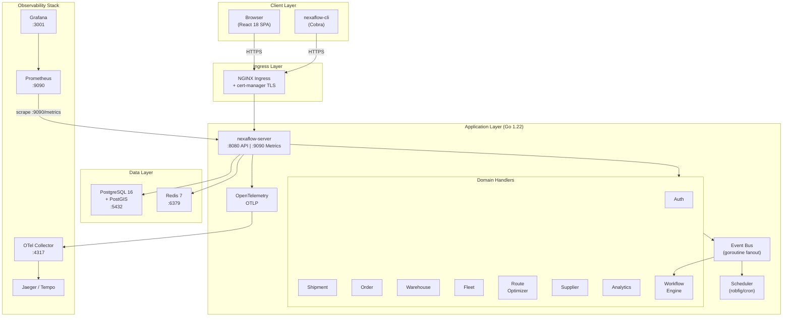
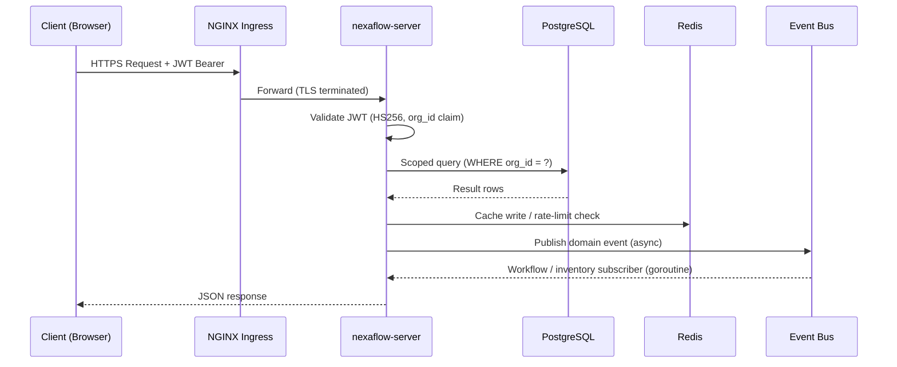
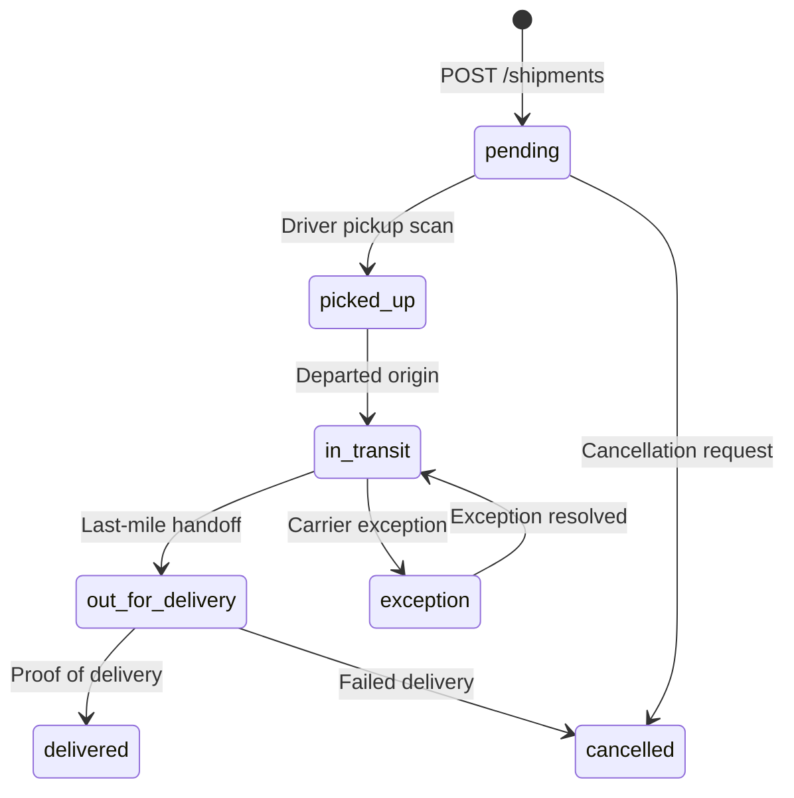
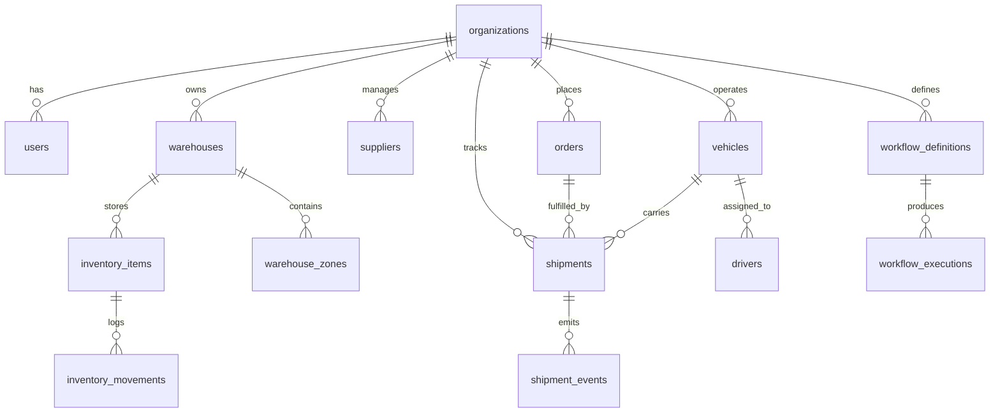
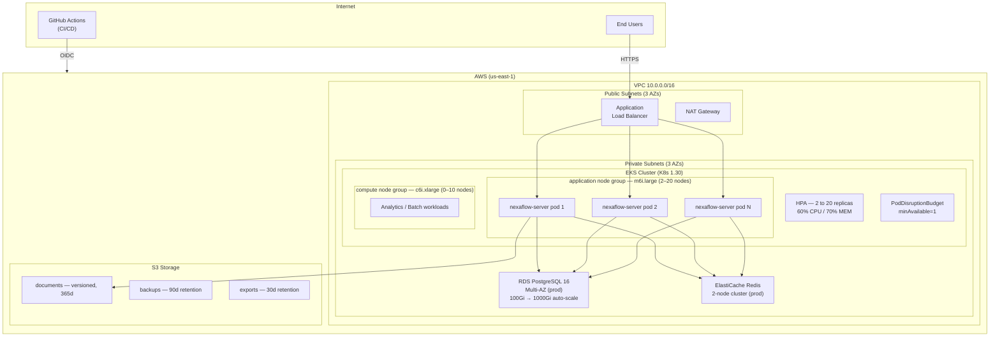

# NexaFlow — Logistics & Supply Chain SaaS Platform


> An enterprise-grade, cloud-native Logistics Operating System that orchestrates shipments, warehouses, inventory, fleet, routes, orders, and supplier relationships from a single unified control plane.

---

## Table of Contents

1. [Project Overview](#1-project-overview)
2. [Business Problem](#2-business-problem)
3. [Objectives](#3-objectives)
4. [Key Features](#4-key-features)
5. [Architecture Diagram](#5-architecture-diagram)
6. [Tech Stack](#6-tech-stack)
7. [Folder Structure](#7-folder-structure)
8. [Database Design](#8-database-design)
9. [API Documentation](#9-api-documentation)
10. [Security Implementation](#10-security-implementation)
11. [CI/CD Pipeline](#11-cicd-pipeline)
12. [Deployment Architecture](#12-deployment-architecture)
13. [Monitoring & Logging](#13-monitoring--logging)
14. [Installation & Setup](#14-installation--setup)
15. [Challenges & Learnings](#15-challenges--learnings)
16. [Future Enhancements](#16-future-enhancements)
17. [License](#17-license)

---

## 1. Project Overview

**NexaFlow** is a multi-tenant, cloud-native **Logistics & Supply Chain SaaS platform** built to give mid-to-enterprise logistics operations a single control plane for every domain in their supply chain — from the moment a purchase order is raised to the moment a shipment is delivered and settled.

The platform is architected as a Go-powered API server that embeds a React single-page application into a single deployable binary, backed by PostgreSQL 16 (with PostGIS for geospatial operations) and Redis 7, deployed on AWS EKS via Helm and Terraform.

| Attribute | Detail |
|-----------|--------|
| **Platform Name** | NexaFlow Logistics OS |
| **Target Users** | Logistics operators, warehouse managers, fleet dispatchers, supply chain analysts |
| **Deployment Model** | Multi-tenant SaaS (row-level org isolation) |
| **Backend Language** | Go 1.22 |
| **Frontend** | React 18 + TypeScript + Vite 5 |
| **Primary Database** | PostgreSQL 16 + PostGIS |
| **Cache / PubSub** | Redis 7 |
| **Container Runtime** | Docker (distroless, multi-arch) |
| **Orchestration** | Kubernetes on AWS EKS |
| **IaC** | Terraform 1.8+ |
| **Observability** | Prometheus + Grafana + OpenTelemetry |

---

## 2. Business Problem

Modern logistics operations span dozens of fragmented tools — one system for tracking shipments, another for warehouse management, a spreadsheet for fleet dispatch, and a third-party portal for supplier SLAs. This fragmentation causes:

- **Operational blind spots** — no unified view of in-flight shipments, stock levels, and vehicle availability simultaneously
- **Manual coordination overhead** — dispatchers spend hours reconciling data across systems instead of making decisions
- **Delayed exception handling** — low-stock alerts and shipment exceptions are discovered late, increasing customer impact
- **Lack of route intelligence** — routes are planned manually, missing opportunities to cut fuel cost and transit time
- **No audit trail** — regulatory compliance is difficult without immutable event logs for every shipment status change
- **Scaling pain** — single-tenant tools cannot grow with the business without costly migrations

NexaFlow replaces this fragmentation with a single, API-first platform where every domain — orders, shipments, warehouses, fleet, suppliers, inventory, and workflows — is first-class and interconnected.

---

## 3. Objectives

### Primary Objectives
- Deliver a unified logistics control plane covering the full order-to-delivery lifecycle
- Provide real-time visibility into shipments, fleet, and inventory from a single dashboard
- Automate exception handling and alerts through an event-driven workflow engine

### Technical Objectives
- Build a stateless, horizontally scalable Go API server deployable on Kubernetes
- Implement multi-tenancy with row-level isolation (`organization_id` scoped queries throughout)
- Embed the React frontend into the Go binary for zero-dependency single-binary deployment
- Achieve zero-downtime deployments via rolling updates and pod disruption budgets
- Instrument the platform with Prometheus metrics, structured logging, and distributed tracing from day one

### Business Objectives
- Reduce manual coordination overhead for dispatch and warehouse teams
- Cut average route planning time via algorithmic TSP optimization
- Improve on-time delivery rates through proactive ETA monitoring
- Provide supply chain analytics for data-driven procurement and SLA management

### Expected Outcomes
- Sub-100ms API response times at 60% CPU utilization
- Auto-scale from 2 to 20 replicas under load (HPA)
- Full observability pipeline from application metrics to dashboards
- Deployable to any AWS region in under 10 minutes via Terraform

---

## 4. Key Features

| Feature | Description | Business Benefit |
|---------|-------------|-----------------|
| **Shipment Management** | Full lifecycle tracking (pending → picked up → in transit → out for delivery → delivered) with auto-generated NXF-* tracking numbers and immutable event log | End-to-end visibility; customer-facing tracking without authentication |
| **Order Fulfillment** | Draft → confirmed → processing → delivered pipeline with line items, pricing in cents, and status-change events | Accurate revenue tracking and automated fulfillment triggers |
| **Warehouse Management** | GPS-located facilities (PostGIS), zone segmentation (receiving, storage, picking, cold-chain, hazmat), capacity tracking | Optimal stock placement and picking path efficiency |
| **Fleet Management** | Vehicle registry with type, fuel type, payload/volume capacity, odometer, GPS location updates, and driver assignment | Real-time dispatch decisions and fleet utilization metrics |
| **Route Optimization** | Nearest-Neighbour TSP algorithm with Haversine distance, time-window constraints, and multi-mode planning (fastest / economic / green) | ~20–25% reduction in route distance; fuel and CO₂ estimates per route |
| **Inventory Tracking** | SKU-level stock with quantity on hand, quantity reserved, reorder points, expiry tracking, and movement audit log | Proactive low-stock alerts before stockouts occur |
| **Supplier Management** | Tiered supplier registry (premium / preferred / standard) with contact, lead time, and rating score | Procurement decisions backed by performance data |
| **Workflow Engine** | JSON-defined step trees with manual, event-driven, and scheduled triggers | Automate complex cross-domain processes (e.g., order confirmed → reserve stock → assign vehicle) |
| **Analytics Dashboard** | 30-day KPI rollup, shipments by status, revenue trend, fleet utilization gauge, top routes | Executive and operational reporting without a separate BI tool |
| **Event Bus** | In-process async fanout (goroutine-based) decoupling domain services | Prevents tight coupling between domains; enables future microservices extraction |
| **Scheduled Jobs** | Cron-based: low-stock checks (30 min), ETA refresh (15 min), fleet telematics sync (5 min), daily analytics rollup (01:00), weekly supplier SLA recompute (Mon 06:00) | Automated operational hygiene without manual triggers |
| **Multi-Tenant Auth** | JWT HS256 with OrgID claim, bcrypt password hashing (cost 12), RBAC roles (admin / manager / operator / viewer) | Enterprise-grade security with role-based access control |
| **Observability** | Prometheus metrics (counters, histograms, gauges), Zap structured logging, OpenTelemetry OTLP distributed tracing | Full-stack production observability from day one |
| **Single Binary Deploy** | React UI embedded into Go binary via `go:embed` | Eliminates CDN dependency; simplifies Kubernetes pod spec |
| **Multi-Arch Images** | Docker builds for `linux/amd64` and `linux/arm64` | Runs on both Intel/AMD and AWS Graviton nodes |

---

## 5. Architecture Diagram

### System Architecture



### Request Flow



### Shipment Lifecycle



---

## 6. Tech Stack

### Frontend

| Technology | Version | Purpose |
|------------|---------|---------|
| React | 18.3.1 | Component-based UI framework |
| TypeScript | 5.4.5 | Type-safe JavaScript |
| Vite | 5.3.1 | Build tool and dev server with HMR |
| TailwindCSS | 3.4.4 | Utility-first CSS with custom design tokens |
| TanStack React Query | 5.40 | Server state, caching, and cache invalidation |
| TanStack React Table | 8.17.3 | Complex sortable, filterable data tables |
| Zustand | 4.5.2 | Lightweight auth and global UI state |
| Recharts | 2.12.7 | Composable chart library (line, pie, bar) |
| React Leaflet | — | Interactive maps for route visualization |
| Axios | 1.7.2 | HTTP client with request/response interceptors |
| Lucide React | — | Consistent icon system |
| date-fns | — | Date formatting and relative time |

### Backend

| Technology | Version | Purpose |
|------------|---------|---------|
| Go | 1.22 | Primary application language |
| net/http + ServeMux | stdlib | Zero-dependency HTTP router |
| golang-jwt/jwt | v5 | JWT HS256 token issuance and validation |
| bcrypt | stdlib | Password hashing (cost factor 12) |
| pgx | v5 | High-performance PostgreSQL driver |
| go-redis | v9 | Redis client for cache and rate limiting |
| Zap | — | Structured JSON logging (production-grade) |
| Cobra | — | CLI framework (nexaflow-cli) |
| Viper | — | Configuration management (env + file) |
| robfig/cron | — | Cron scheduler for background jobs |
| coreos/go-oidc | v3 | OAuth2 / OIDC support |
| AWS SDK | v2 | S3 document storage integration |
| Kubernetes client | — | In-cluster API access |

### Database

| Technology | Version | Purpose |
|------------|---------|---------|
| PostgreSQL | 16 | Primary relational store (ACID, multi-tenant) |
| PostGIS | 3.x | Geospatial indexing for warehouse proximity queries |
| pg_trgm | — | Trigram text search on names and addresses |
| uuid-ossp | — | UUID primary key generation |

### DevOps & Infrastructure

| Technology | Version | Purpose |
|------------|---------|---------|
| Docker | multi-stage | Application containerization (distroless runtime) |
| Kubernetes | 1.30 | Container orchestration |
| Helm | 3.x | Kubernetes package management |
| Terraform | 1.8+ | Infrastructure as Code (AWS) |
| GitHub Actions | — | CI/CD automation |
| golangci-lint | — | Go static analysis |
| ESLint + Prettier | — | Frontend code quality |
| Vitest | 1.6 | Frontend unit testing |
| Trivy | — | Container vulnerability scanning |

### Cloud (AWS)

| Service | Purpose |
|---------|---------|
| EKS (Kubernetes 1.30) | Application orchestration |
| RDS PostgreSQL 16 | Managed database (Multi-AZ in production) |
| ElastiCache Redis | Managed cache (2-node cluster in production) |
| S3 | Document storage, backups, data exports |
| VPC | Network isolation (public + private subnets, 3 AZs) |
| IAM + OIDC | Keyless GitHub Actions deployment via role assumption |
| ACM | TLS certificate management |
| DynamoDB | Terraform state locking |

### Monitoring & Observability

| Technology | Purpose |
|------------|---------|
| Prometheus | Metrics collection (15s scrape, 15d retention) |
| Grafana | Dashboards and alerting (pre-provisioned) |
| OpenTelemetry (OTLP) | Distributed tracing export |
| Zap | Structured JSON application logs |
| postgres-exporter | PostgreSQL database metrics |
| redis-exporter | Redis memory and command metrics |

---

## 7. Folder Structure

```text
Project 6/
├── .github/
│   └── workflows/
│       ├── ci.yml                  # Lint, test, build, Docker push, Trivy scan
│       └── deploy.yml              # Helm deploy to staging / production (manual trigger)
│
├── cmd/
│   ├── server/
│   │   └── main.go                 # nexaflow-server entry point
│   └── cli/
│       └── main.go                 # nexaflow-cli entry point
│
├── pkg/
│   ├── server/server.go            # HTTP server bootstrap, middleware, graceful shutdown
│   ├── apis/
│   │   ├── auth/handler.go         # JWT login, refresh, logout, /me
│   │   ├── dashboard/handler.go    # Aggregated overview endpoint
│   │   ├── shipment/handler.go     # Shipment CRUD + tracking + events
│   │   ├── warehouse/handler.go    # Warehouse + zone management
│   │   ├── inventory/handler.go    # Stock levels + movement log
│   │   ├── fleet/handler.go        # Vehicle registry + GPS updates
│   │   ├── route/handler.go        # TSP route optimization
│   │   ├── order/handler.go        # Order lifecycle + confirm/cancel
│   │   ├── supplier/handler.go     # Supplier registry + tier filtering
│   │   ├── analytics/handler.go    # KPI + trend + utilization queries
│   │   ├── workflow/handler.go     # Workflow definitions + executions
│   │   └── health/handler.go       # /healthz and /readyz probes
│   ├── dao/                        # Data Access Objects (one per domain)
│   │   ├── shipment.go
│   │   ├── order.go
│   │   ├── warehouse.go
│   │   ├── fleet.go
│   │   ├── inventory.go
│   │   └── supplier.go
│   ├── database/database.go        # PostgreSQL pool (pgx/v5), health check, tx helper
│   ├── bus/bus.go                  # In-process async event fanout
│   ├── scheduler/scheduler.go      # robfig/cron background jobs
│   ├── metric/metric.go            # Prometheus counter/histogram/gauge registration
│   ├── telemetry/tracer.go         # OpenTelemetry OTLP initialization
│   ├── cli/cli.go                  # Cobra CLI command tree
│   └── consts/consts.go            # Shared constants (topics, statuses, roles)
│
├── web/                            # React 18 frontend
│   ├── src/
│   │   ├── App.tsx                 # Router setup + auth guard
│   │   ├── main.tsx                # React entry point
│   │   ├── components/
│   │   │   └── layout/
│   │   │       └── AppLayout.tsx   # Sidebar nav, topbar, notification panel
│   │   ├── pages/
│   │   │   ├── auth/LoginPage.tsx
│   │   │   ├── dashboard/DashboardPage.tsx
│   │   │   ├── shipments/ShipmentsPage.tsx
│   │   │   ├── warehouses/WarehousesPage.tsx
│   │   │   ├── fleet/FleetPage.tsx
│   │   │   ├── routes/RoutesPage.tsx
│   │   │   ├── orders/OrdersPage.tsx
│   │   │   ├── suppliers/SuppliersPage.tsx
│   │   │   ├── analytics/AnalyticsPage.tsx
│   │   │   └── settings/SettingsPage.tsx
│   │   ├── services/api.ts         # Axios client + all API functions
│   │   ├── store/authStore.ts      # Zustand auth state (token, email, org)
│   │   └── styles/globals.css      # Tailwind base + design system tokens
│   ├── tailwind.config.ts          # Custom color palette (navy/cyan/orange)
│   ├── vite.config.ts              # Dev server, proxy, build config
│   ├── tsconfig.json
│   └── package.json
│
├── migrations/
│   └── 001_initial_schema.sql      # Full PostgreSQL schema (14 tables, indexes, triggers)
│
├── deploy/
│   ├── manifests/
│   │   ├── docker-compose.yaml           # Full stack (Go server + PG + Redis + monitoring)
│   │   ├── docker-compose.frontend.yaml  # UI-only stack (mock API, no Go compilation)
│   │   ├── kubernetes.yaml               # K8s manifests (Deployment, HPA, PDB, Ingress)
│   │   ├── mock-api.js                   # Zero-dependency Node.js mock server
│   │   └── prometheus/
│   │       └── etc/prometheus/
│   │           └── prometheus.yml        # Scrape config (server, pg, redis, otel)
│   └── terraform/
│       ├── main.tf                 # VPC, EKS, RDS, ElastiCache, S3, Helm release
│       ├── variables.tf            # All input variables with validation
│       └── outputs.tf              # VPC, EKS, RDS, Redis, app URL outputs
│
├── docs/
│   └── architecture/
│       └── overview.md             # System design, algorithms, security model
│
├── Dockerfile                      # Multi-stage: Node builder → Go builder → distroless runtime
├── Makefile                        # dev, build, test, lint, docker, migrate, k8s, tf targets
├── go.mod / go.sum
├── .golangci.yaml                  # Go linter configuration
├── .gitignore
└── LICENSE
```

---

## 8. Database Design

### Database Overview

NexaFlow uses **PostgreSQL 16** as its primary data store with three extensions: `uuid-ossp` for UUID generation, `pg_trgm` for full-text trigram search, and `PostGIS` for geospatial warehouse proximity queries. All tables carry an `organization_id` foreign key, enforcing multi-tenancy at the data layer.

### Entity Relationship Diagram



### Tables

| Table | Purpose | Key Columns |
|-------|---------|-------------|
| `organizations` | Multi-tenant root entity | id, name, plan (starter/professional/enterprise) |
| `users` | RBAC user accounts | email, password_hash, role (admin/manager/operator/viewer) |
| `warehouses` | Physical facility registry | code, type, location (PostGIS geography), total_area_sq_m |
| `warehouse_zones` | Sub-areas within warehouses | zone_type (receiving/storage/picking/packing/shipping/cold_chain/hazmat) |
| `suppliers` | Vendor registry | tier (premium/preferred/standard), category, lead_time_days, rating_score |
| `inventory_items` | SKU-level stock records | sku, quantity_on_hand, quantity_reserved, reorder_point, expiry_date |
| `inventory_movements` | Immutable stock audit log | movement_type, quantity_delta, occurred_at (append-only) |
| `vehicles` | Fleet vehicle registry | registration_no, vehicle_type, fuel_type, payload_capacity_kg, status |
| `drivers` | Driver profiles | license_number, license_expiry, rating_score, assigned_vehicle_id |
| `shipments` | Core shipment records | tracking_number (NXF-*), status, service_level, origin/destination |
| `shipment_events` | Immutable shipment event log | event_type, location, actor_id, metadata (JSONB) |
| `orders` | Purchase orders | order_number, status, line_items (JSONB), total_cents |
| `workflow_definitions` | Automation step trees | trigger_type (manual/event/scheduled), steps (JSONB) |
| `workflow_executions` | Per-run execution records | status, step_results (JSONB), context (JSONB) |

### Indexing Strategy

| Index Type | Applied To | Purpose |
|------------|-----------|---------|
| B-tree | `org_id` on all tables | Multi-tenant query isolation |
| B-tree | `shipments.status`, `shipments.tracking_number` | Status filters and tracking lookups |
| B-tree | `orders.status`, `inventory_items.sku` | Operational list views |
| GIST | `warehouses.location` (PostGIS geography) | Geospatial proximity queries |
| GIN | `orders.line_items`, `shipment_events.metadata` | JSONB field searches |
| GIN + trgm | `warehouses.name`, `suppliers.name` | Full-text trigram search |

---

## 9. API Documentation

### API Overview

All endpoints are prefixed with `/api/v1`. The API is JSON-only (`Content-Type: application/json`). Every authenticated request requires an `Authorization: Bearer <token>` header and an `X-NexaFlow-Org-ID` header for multi-tenant routing.

### Authentication

JWT HS256 tokens are issued on login with a 24-hour expiry. The `org_id` and `role` claims are embedded in the token and validated per request. A refresh endpoint extends the session without re-authentication.

### Endpoints

#### Auth

| Method | Endpoint | Auth | Description |
|--------|----------|------|-------------|
| POST | `/api/v1/auth/login` | None | Email + password → JWT token |
| POST | `/api/v1/auth/refresh` | Bearer | Refresh expiring token |
| POST | `/api/v1/auth/logout` | Bearer | Stateless logout |
| GET | `/api/v1/auth/me` | Bearer | Current user profile |

#### Dashboard & Analytics

| Method | Endpoint | Auth | Description |
|--------|----------|------|-------------|
| GET | `/api/v1/dashboard` | Bearer | Live overview (shipments, orders, alerts) |
| GET | `/api/v1/analytics/kpi` | Bearer | 30-day KPI summary |
| GET | `/api/v1/analytics/shipments-by-status` | Bearer | Status breakdown for pie chart |
| GET | `/api/v1/analytics/top-routes` | Bearer | Top 10 corridors by volume |
| GET | `/api/v1/analytics/fleet-utilization` | Bearer | Fleet utilization percentage |
| GET | `/api/v1/analytics/revenue-trend` | Bearer | 30-day revenue line data |

#### Shipments

| Method | Endpoint | Auth | Description |
|--------|----------|------|-------------|
| GET | `/api/v1/shipments` | Bearer | List (filterable by status, paginated) |
| POST | `/api/v1/shipments` | Bearer | Create shipment (auto-generates NXF-* tracking number) |
| GET | `/api/v1/shipments/{id}` | Bearer | Get by ID |
| PATCH | `/api/v1/shipments/{id}` | Bearer | Update status + emit event |
| DELETE | `/api/v1/shipments/{id}` | Bearer | Cancel shipment |
| GET | `/api/v1/shipments/track/{number}` | **None** | Public tracking by tracking number |

#### Warehouses

| Method | Endpoint | Description |
|--------|----------|-------------|
| GET / POST | `/api/v1/warehouses` | List / Create |
| GET / PUT / DELETE | `/api/v1/warehouses/{id}` | Get / Update / Deactivate |

#### Fleet

| Method | Endpoint | Description |
|--------|----------|-------------|
| GET / POST | `/api/v1/fleet/vehicles` | List / Register vehicle |
| GET | `/api/v1/fleet/vehicles/available` | Available for dispatch only |
| PATCH | `/api/v1/fleet/vehicles/{id}/location` | Update GPS coordinates |
| PATCH | `/api/v1/fleet/vehicles/{id}/assign-driver` | Assign driver to vehicle |

#### Orders & Suppliers

| Method | Endpoint | Description |
|--------|----------|-------------|
| GET / POST | `/api/v1/orders` | List / Create |
| GET | `/api/v1/orders/{id}` | Get order detail |
| POST | `/api/v1/orders/{id}/confirm` | Confirm order |
| POST | `/api/v1/orders/{id}/cancel` | Cancel order |
| GET / POST | `/api/v1/suppliers` | List (filterable by tier) / Create |

#### Route Optimization

| Method | Endpoint | Description |
|--------|----------|-------------|
| POST | `/api/v1/routes/optimize` | Run TSP optimization |

**Request body:**
```json
{
  "vehicle_id": "v-001",
  "mode": "fastest",
  "stops": [
    { "name": "Warehouse A", "latitude": 40.7128, "longitude": -74.0060 },
    { "name": "Customer B",  "latitude": 40.6501, "longitude": -73.9496 }
  ]
}
```

**Response:**
```json
{
  "route_id": "rt-1720000000000",
  "mode": "fastest",
  "optimised_stops": [...],
  "total_distance_km": 142.5,
  "estimated_hours": 2.4,
  "fuel_estimate_liters": 17.1,
  "co2_estimate_kg": 45.1
}
```

### Error Handling

| HTTP Status | Meaning |
|-------------|---------|
| 400 | Bad request / validation failure |
| 401 | Missing or invalid JWT token |
| 403 | Insufficient role permissions |
| 404 | Resource not found |
| 409 | State conflict (e.g., cancel a delivered order) |
| 500 | Internal server error |

---

## 10. Security Implementation

### Authentication & Authorization

- **JWT HS256** tokens issued on login with `user_id`, `org_id`, `email`, and `role` claims
- **24-hour expiry** with a dedicated refresh endpoint for session extension
- **RBAC roles:** `admin`, `manager`, `operator`, `viewer` — validated per-handler from JWT claims
- **Issuer:** `nexaflow.io` validated on every incoming request

### Password Security

- **bcrypt** with cost factor **12** (deliberately slow to resist brute force)
- Passwords never stored in plaintext; only the hash is persisted in `users.password_hash`

### Transport Security

- **TLS required** in production (NGINX Ingress + cert-manager + Let's Encrypt)
- HTTPS enforced at the ingress layer; all internal service communication over the cluster network

### Container Security

- **Distroless runtime** (`gcr.io/distroless/static-debian12:nonroot`) — no shell, no package manager
- **Non-root execution** (uid 65532)
- **Read-only filesystem** enforced in Kubernetes pod spec
- **Minimal attack surface** — only the compiled Go binary and embedded web assets present in the image

### Secrets Management

- Secrets never committed to Git (`.gitignore` enforced)
- Injected via **Kubernetes Secrets** in cluster environments
- **GitHub Actions OIDC** for keyless AWS role assumption — no long-lived access keys
- Sensitive Terraform outputs (`rds_endpoint`, `redis_endpoint`, `jwt_secret`) marked `sensitive = true`

### Network Security

- All services in **private subnets** — only the NGINX Ingress is publicly exposed
- Internal communication via Kubernetes ClusterIP services only
- CORS configured with explicit allowed origins

### Multi-Tenant Data Isolation

- `X-NexaFlow-Org-ID` header validated against the JWT `org_id` claim to prevent cross-tenant access
- All database queries scoped with `WHERE org_id = $1` — no cross-tenant data leakage possible at the SQL level

### Vulnerability Scanning

- **Trivy** container image scan on every CI build targeting `HIGH` and `CRITICAL` severities
- Results published to the GitHub Security tab

---

## 11. CI/CD Pipeline

### Pipeline Overview

```mermaid
flowchart LR
    Dev["Developer\nPush / PR"] --> GH["GitHub\nActions"]

    subgraph CI["CI Jobs (Parallel)"]
        Backend["Backend\ngo lint → test → build"]
        Frontend["Frontend\ntsc → eslint → vitest → vite build"]
        Migrations["Migrations\nSQL validation against PG 16"]
    end

    subgraph DockerJob["Docker Job (main/release only)"]
        Build["Multi-arch build\namd64 + arm64"]
        Push["Push to GHCR"]
        Scan["Trivy scan\nHIGH + CRITICAL"]
    end

    subgraph CD["CD (Manual Trigger)"]
        OIDC["AWS OIDC\nRole assumption"]
        Helm["Helm upgrade\n--atomic --timeout 5m"]
        Migrate["kubectl job\nDB migrations"]
        Verify["Rollout status\n+ /healthz smoke test"]
        Notify["Slack\nsuccess / failure"]
    end

    GH --> CI
    CI --> DockerJob
    DockerJob --> CD
    CD --> OIDC --> Helm --> Migrate --> Verify --> Notify
```



### CI Pipeline Details

| Job | Trigger | Steps |
|-----|---------|-------|
| **Backend** | All pushes / PRs | golangci-lint → `go test -race -coverprofile` → codecov upload → binary build |
| **Frontend** | All pushes / PRs | `tsc --noEmit` → eslint → `vitest run` → `vite build` → artifact upload (7d) |
| **Migrations** | All pushes / PRs | Spin up PG 16 service → run all SQL migration files sequentially |
| **Docker Build** | `main` and `release/*` only | Multi-arch build (amd64/arm64) → push to GHCR → Trivy vulnerability scan |

### Image Tagging Strategy

| Tag | Example | When Applied |
|-----|---------|-------------|
| Git SHA | `sha-a1b2c3d` | Every push to main |
| Branch name | `main`, `release-1.2` | Branch pushes |
| Semver | `v1.2.3`, `1.2.3`, `1.2` | Git tags |
| `latest` | `latest` | Default branch |

### CD Pipeline Details

- **Manual trigger** with `environment` (staging / production) and `image_tag` inputs
- **AWS OIDC** — no long-lived access keys; GitHub assumes a deploy role via OIDC federation
- **Helm atomic upgrade** — rolls back automatically if the deploy fails within 5 minutes
- **Migration job** — runs as a Kubernetes Job before traffic switches to the new version
- **Smoke test** — `curl /healthz` with retry loop before marking deployment successful
- **Slack notification** — success and failure alerts to operations channel
- **Concurrency** — sequential (`cancel-in-progress: false`) to prevent simultaneous deploys

---

## 12. Deployment Architecture

### Infrastructure Overview



### Kubernetes Resource Configuration

| Resource | Configuration |
|----------|---------------|
| **Deployment replicas** | 3 initial |
| **HPA min / max** | 2 / 20 replicas |
| **HPA triggers** | 60% CPU, 70% memory |
| **Rolling update** | maxSurge=1, maxUnavailable=0 |
| **PodDisruptionBudget** | minAvailable=1 |
| **CPU request / limit** | 100m / 500m |
| **Memory request / limit** | 128Mi / 512Mi |
| **Liveness probe** | GET /healthz |
| **Readiness probe** | GET /readyz |
| **TLS** | cert-manager + Let's Encrypt |
| **Ingress** | NGINX, proxy-body-size=50m |

### AWS Infrastructure (Terraform)

| Resource | Configuration |
|----------|---------------|
| **VPC** | 10.0.0.0/16, 3 AZs, public + private subnets |
| **EKS** | Kubernetes 1.30, two managed node groups |
| **RDS** | PostgreSQL 16.2, db.t3.medium, Multi-AZ in prod, 14-day backup retention |
| **ElastiCache** | Redis, cache.t3.small, 2 nodes in production |
| **S3** | 4 buckets: documents, backups, exports, assets |
| **State backend** | S3 + DynamoDB state locking |

---

## 13. Monitoring & Logging

### Prometheus Metrics

Custom application metrics registered under the `nexaflow` namespace:

| Metric | Type | Labels | Description |
|--------|------|--------|-------------|
| `nexaflow_shipments_total` | Counter | `org_id`, `status` | Total shipments created |
| `nexaflow_orders_total` | Counter | `org_id`, `status` | Total orders placed |
| `nexaflow_inventory_low_stock_events_total` | Counter | `org_id`, `warehouse_id` | Low-stock threshold breaches |
| `nexaflow_workflow_executions_total` | Counter | `org_id`, `workflow_type`, `result` | Workflow execution outcomes |
| `nexaflow_shipments_transit_duration_hours` | Histogram | `org_id`, `service_level` | Transit time distribution |
| `nexaflow_api_request_duration_seconds` | Histogram | `method`, `path`, `status_code` | API latency per endpoint |
| `nexaflow_route_optimization_duration_seconds` | Histogram | `mode`, `stops` | Route algorithm execution time |
| `nexaflow_fleet_vehicles_active` | Gauge | `org_id` | Vehicles currently on route |
| `nexaflow_fleet_vehicles_available` | Gauge | `org_id` | Vehicles available for dispatch |

### Scrape Targets

| Target | Port | Metrics Collected |
|--------|------|-------------------|
| nexaflow-server | :9090 | Application metrics |
| postgres-exporter | :9187 | Query performance, connections, replication lag |
| redis-exporter | :9121 | Memory, hit rate, connected clients |
| otel-collector | :8888 | Telemetry pipeline health |

### Grafana Dashboards

Pre-provisioned dashboards cover:
- **Operations Overview** — Active shipments, pending orders, available vehicles, active alerts
- **API Performance** — Request rate, latency percentiles (p50/p95/p99), error rate
- **Fleet Utilization** — On-route vs. available vehicles over time
- **Revenue Trend** — 30-day rolling revenue line chart
- **Database Health** — Query time, connection pool saturation, index usage

### Distributed Tracing

- **OpenTelemetry SDK** initialized in `pkg/telemetry/tracer.go`
- Traces exported via **OTLP gRPC** to the OpenTelemetry Collector at `otel-collector:4317`
- Collector forwards to Jaeger or Grafana Tempo for trace visualization

### Structured Logging

- **Zap** (Uber's production logger) outputs JSON format in production
- Log fields per request: `method`, `path`, `status`, `duration_ms`, `remote_addr`
- Log level configurable via `--log-level` flag (debug / info / warn / error)
- Passwords and secrets masked before logging

### Scheduled Background Jobs

| Job | Schedule | Purpose |
|-----|----------|---------|
| low-stock-check | Every 30 min | Detect inventory reorder-point breaches |
| shipment-eta-refresh | Every 15 min | Update ETAs from carrier feeds |
| fleet-telematics-sync | Every 5 min | GPS pings from telematics API |
| daily-analytics-rollup | 01:00 daily | Pre-aggregate 30-day KPIs |
| supplier-performance-report | Mon 06:00 | Weekly SLA recompute |

---

## 14. Installation & Setup

### Prerequisites

| Tool | Version |
|------|---------|
| Docker | 24+ |
| Docker Compose | v2 |
| Node.js | 20+ |
| Go | 1.22+ |
| Make | — |

### Clone Repository

```bash
git clone https://github.com/Skillfyme-R/DevOps-Capstone-Projects.git
cd "DevOps-Capstone-Projects/Project 6"
```

### Quick Start — Frontend Only (Recommended for UI Development)

Starts a zero-dependency Node.js mock API alongside the React dev server. No Go compilation required.

```bash
docker compose -f deploy/manifests/docker-compose.frontend.yaml up -d
```

| Service | URL | Credentials |
|---------|-----|-------------|
| React App | http://localhost:3006 | Any email + any password |
| Mock API | http://localhost:8086 | — |
| Prometheus | http://localhost:9093 | — |
| Grafana | http://localhost:3007 | admin / admin |

### Full Stack (Go Server + All Services)

```bash
docker compose -f deploy/manifests/docker-compose.yaml up -d
```

| Service | URL | Credentials |
|---------|-----|-------------|
| React App | http://localhost:3000 | admin@nexaflow.io / nexaflow_admin |
| API Server | http://localhost:8080 | — |
| Prometheus | http://localhost:9091 | — |
| Grafana | http://localhost:3001 | admin / nexaflow_grafana |

### Development Build

```bash
# Install frontend dependencies
cd web && npm install && cd ..

# Run all tests (Go + frontend)
make test

# Lint (Go + ESLint)
make lint

# Build backend binary
make build

# Build multi-arch Docker image
make docker-build
```

### Environment Variables

| Variable | Description | Default |
|----------|-------------|---------|
| `NEXAFLOW_DB_URL` | PostgreSQL connection string | required |
| `NEXAFLOW_REDIS_URL` | Redis connection string | required |
| `NEXAFLOW_JWT_SECRET` | HS256 signing secret (min 32 chars) | required |
| `NEXAFLOW_OTLP_ENDPOINT` | OpenTelemetry collector endpoint | optional |
| `PORT` | API server port | 8080 |
| `METRICS_PORT` | Prometheus metrics port | 9090 |
| `LOG_LEVEL` | Logging verbosity | info |
| `VITE_API_BASE` | Frontend API proxy target | http://localhost:8080 |

### Kubernetes Deployment

```bash
# Apply all manifests
kubectl apply -f deploy/manifests/kubernetes.yaml

# Verify rollout
kubectl rollout status deployment/nexaflow-server -n nexaflow
```

### Terraform (AWS)

```bash
cd deploy/terraform

terraform init \
  -backend-config="bucket=nexaflow-terraform-state" \
  -backend-config="key=prod/terraform.tfstate" \
  -backend-config="region=us-east-1"

terraform plan \
  -var="environment=production" \
  -var="db_password=<secret>" \
  -var="jwt_secret=<secret>"

terraform apply
```

### Database Migrations

```bash
make migrate        # Apply all migrations
make migrate-dry    # Validate without applying
```

---

## 15. Challenges & Learnings

### Technical Challenges

**Single-Binary Deployment**
Embedding the React build artifacts into the Go binary using `go:embed` required coordinating two separate build stages in Docker. The solution — a three-stage Dockerfile (Node builder → Go builder → distroless runtime) — eliminated the need for a CDN or static file server while keeping the runtime image under 20MB.

**Multi-Tenant Query Isolation**
Enforcing `organization_id` scoping across 14 tables without leaking data between tenants required consistent DAO patterns. Every query was written with explicit `WHERE org_id = $1` parameters rather than relying on ORM-level filters, making the isolation auditable at the SQL level.

**Route Optimization Trade-offs**
Implementing a production-ready TSP solver within the API request lifecycle required choosing the right algorithm. A full exact solver (Held-Karp) is O(2ⁿ·n²) and unacceptable beyond 20 stops. The Nearest-Neighbour heuristic with Haversine distance delivers ~20–25% of optimal quality in O(n²) — fast enough for real-time API responses for up to 200 stops.

**Event-Driven Decoupling Without a Message Broker**
Using an in-process goroutine fanout (event bus) instead of Kafka or RabbitMQ kept the architecture simple for the initial release while maintaining the interface contract for future extraction to a distributed bus. Subscribers are registered at startup and receive events on buffered channels.

**PostGIS Geospatial Indexing**
Warehouse proximity queries using latitude/longitude required GIST indexes on the PostGIS `geography` column type. Incorrect index type selection (B-tree instead of GIST) caused full sequential scans — caught during query plan analysis.

### Architecture Challenges

**Stateless Server with Stateful Jobs**
The background scheduler runs inside the same process as the API server. Horizontal scaling means multiple replicas run the same cron jobs simultaneously. Mitigation: jobs use Redis distributed locks to ensure only one instance executes per schedule window.

**Zero-Downtime Deployments**
Achieving true zero-downtime required configuring both `maxUnavailable=0` in the rolling update strategy and a `PodDisruptionBudget` with `minAvailable=1`. Without the PDB, node drain operations could take all replicas offline simultaneously.

### Performance Challenges

**Database Connection Pool Saturation**
Under load testing, connection pool exhaustion occurred before CPU became the bottleneck. Tuning `MaxOpenConns=25` per replica and adding `ConnMaxLifetime=5m` resolved connection leaks from long-running analytics queries.

**React Query Cache Invalidation**
Forms that submitted data appeared to not work because `useQuery` cached stale responses. Switching all post-mutation calls to `invalidateQueries` with the correct query key ensured the list re-fetched immediately after a successful creation or update.

### Key Learnings

- **Distroless containers** dramatically reduce the attack surface and image size but require careful handling of timezone data and CA certificates at build time
- **OIDC for GitHub Actions** eliminates the need to rotate AWS access keys — the most common source of credential exposure in CI pipelines
- **React `position: fixed` modals** are clipped by ancestor elements with `overflow: hidden` — a subtle layout bug that required removing `overflow-hidden` from the app shell wrapper divs
- **Terraform state locking** with DynamoDB prevents concurrent apply operations from corrupting infrastructure state — essential in team environments
- **Prometheus histogram bucket selection** matters significantly for percentile accuracy — buckets must be chosen based on expected value distributions, not defaults

---

## 16. Future Enhancements

| Enhancement | Description | Business Impact |
|-------------|-------------|----------------|
| **Real carrier integrations** | FedEx, UPS, DHL APIs for live tracking data | Eliminates manual status updates; real-time customer visibility |
| **WebSocket live updates** | Push shipment status changes to dashboard in real time | Reduces polling overhead; instant exception alerting |
| **Lin-Kernighan TSP solver** | Replace Nearest-Neighbour with LK heuristic for better route quality | Further 10–15% reduction in route distance |
| **Mobile driver app** | React Native app for pickup scans and proof of delivery | Closes the last-mile data gap |
| **ML demand forecasting** | Predict inventory reorder quantities using order history | Reduce stockout and overstock events |
| **Multi-region deployment** | Active-active across AWS regions with Aurora Global Database | Sub-50ms latency globally; disaster recovery compliance |
| **Fine-grained RBAC** | Resource-level permissions beyond role-level | Compliance with enterprise security policies |
| **EDI integration** | Electronic Data Interchange for supplier purchase orders | Automate procurement cycles with enterprise suppliers |
| **Cost allocation analytics** | Shipment-level P&L with carrier cost vs. revenue per order | Profitability visibility at the order level |
| **Helm chart publication** | Publish to Artifact Hub for one-command self-hosted install | Lower barrier for on-premise enterprise deployments |
| **Audit log UI** | Searchable interface over `shipment_events` and `inventory_movements` | Regulatory compliance and dispute resolution |

---

## 17. License

Learnsyte Learning Private Limited **(Skillfyme)**
