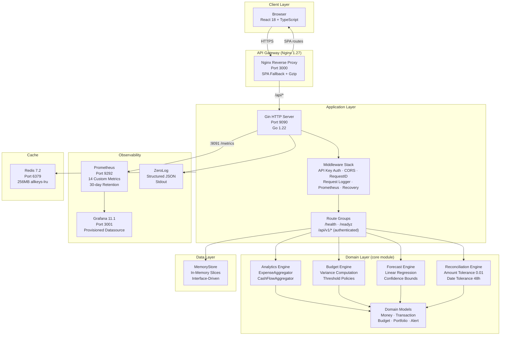
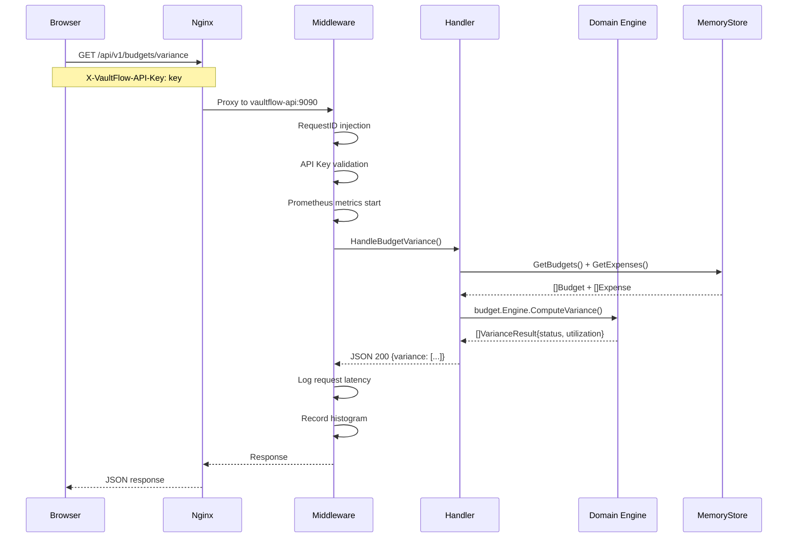
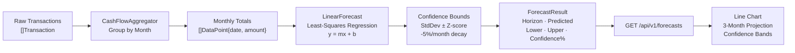
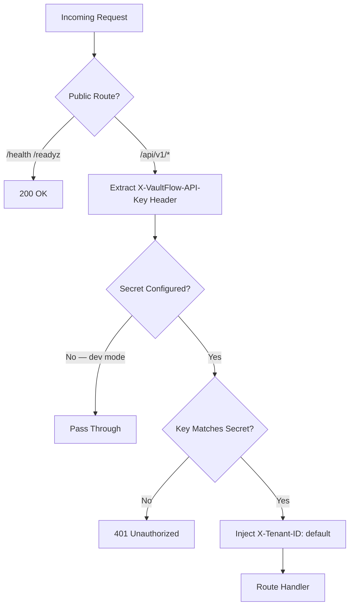
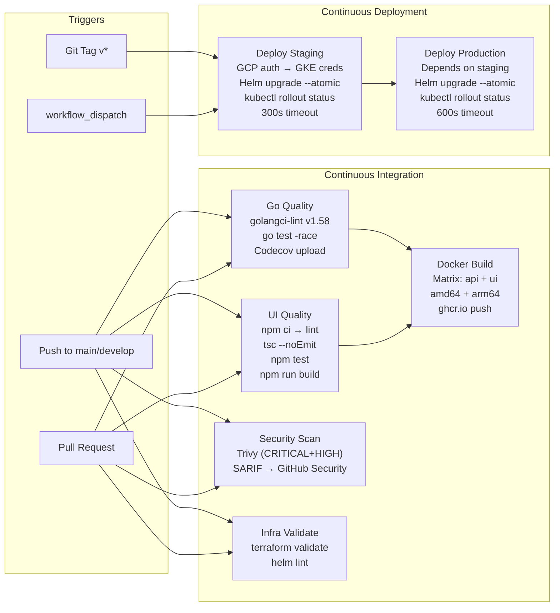
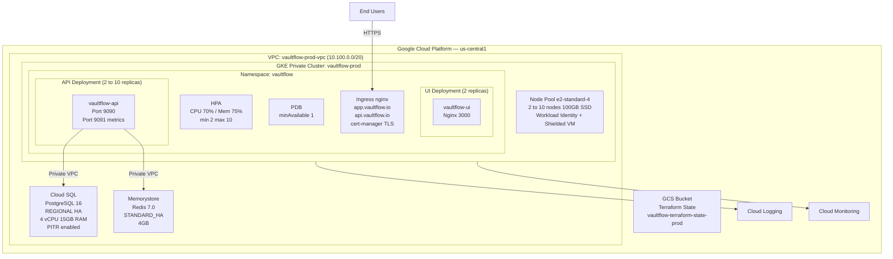
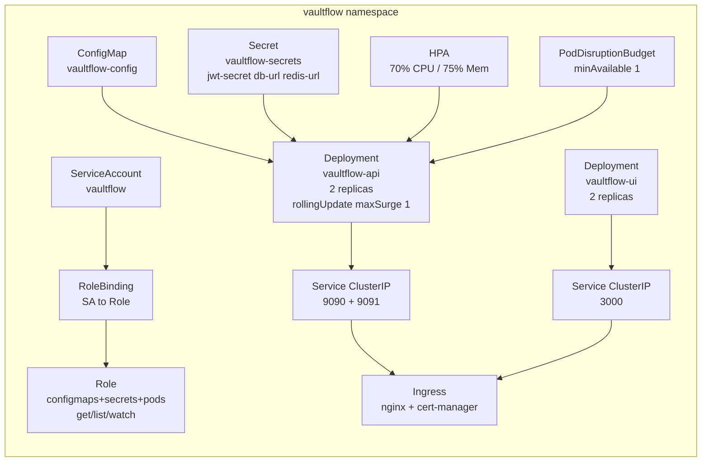
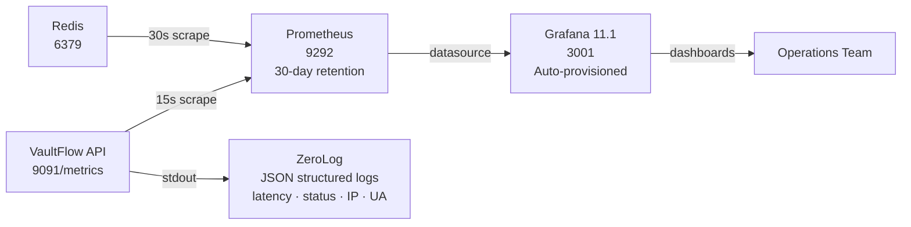

# VaultFlow — Financial Intelligence Platform

> **Every dollar. Every decision. In focus.**

[](https://github.com/Skillfyme-R/DevOps-Capstone-Projects/actions)
[](https://go.dev)
[](https://react.dev)
[](LICENSE)
[](https://cloud.google.com)

VaultFlow is a production-grade **FinTech SaaS platform** delivering real-time financial intelligence across expense management, budget tracking, AI-driven forecasting, payment reconciliation, and portfolio analytics. Built on a cloud-native Go + React stack and deployed to Google Kubernetes Engine via Helm and Terraform, it demonstrates the complete DevOps engineering lifecycle from local development through enterprise-scale production.

---

## Table of Contents

1. [Business Problem](#business-problem)
2. [Objectives](#objectives)
3. [Key Features](#key-features)
4. [Architecture Overview](#architecture-overview)
5. [Technology Stack](#technology-stack)
6. [Folder Structure](#folder-structure)
7. [API Reference](#api-reference)
8. [Security Implementation](#security-implementation)
9. [CI/CD Pipeline](#cicd-pipeline)
10. [Deployment Architecture](#deployment-architecture)
11. [Monitoring & Observability](#monitoring--observability)
12. [Local Setup](#local-setup)
13. [Challenges & Learnings](#challenges--learnings)
14. [Future Enhancements](#future-enhancements)
15. [License](#license)

---

## Business Problem

Finance and operations teams at mid-market companies struggle with fragmented financial data spread across banking portals, accounting software, and spreadsheets. The result: slow month-end closes, undetected budget overruns, no forecasting visibility, and manual reconciliation consuming dozens of analyst hours per cycle.

**VaultFlow solves this** by providing a unified, API-driven financial intelligence platform that ingests transaction data, runs real-time analytics, enforces budget policies, projects future spend with confidence bounds, and auto-reconciles payment records — all accessible through a secure, role-aware SaaS dashboard.

---

## Objectives

| # | Objective | Outcome |
|---|-----------|---------|
| 1 | Unified financial data layer | Single REST API for transactions, expenses, budgets, forecasts, alerts |
| 2 | Real-time budget enforcement | Variance engine with warning (80%) and exceeded thresholds |
| 3 | Predictive spend forecasting | Linear regression with 3-month horizon and confidence intervals |
| 4 | Payment reconciliation | Automated external-vs-internal matching within 0.01 tolerance |
| 5 | Enterprise observability | 14 Prometheus metrics, Grafana dashboards, structured ZeroLog |
| 6 | Zero-downtime deployments | Kubernetes RollingUpdate, PDB, HPA on GKE |
| 7 | Infrastructure as code | Full GCP stack (GKE + Cloud SQL + Memorystore) via Terraform |
| 8 | Security-first design | Distroless images, RBAC, private networking, API key auth |

---

## Key Features

| Feature | Description | Endpoint |
|---------|-------------|----------|
| **Expense Analytics** | Category + vendor breakdown with daily totals and proportional charts | `GET /api/v1/expenses/summary` |
| **Budget Variance Engine** | Compares allocated vs. actual spend per category; statuses: on_track / warning / exceeded / underspend | `GET /api/v1/budgets/variance` |
| **AI Spend Forecasting** | Linear regression over historical monthly totals; 3-month horizon with upper/lower bounds | `GET /api/v1/forecasts` |
| **Payment Reconciliation** | Matches external payment records to internal transactions within configurable amount and date tolerances | Core domain engine |
| **Transaction Ledger** | Full CRUD for financial transactions with multi-currency support (USD / EUR / GBP / INR / JPY) | `GET POST /api/v1/transactions` |
| **Portfolio Insights** | Holdings across equity, fixed_income, cash, alternative, crypto with unrealized P&L and weight | `GET /api/v1/portfolio` |
| **Alert Management** | Severity-tiered (info / warning / critical) alert system with source attribution | `GET /api/v1/alerts` |
| **Real-time Health** | Live endpoint status bar in UI with latency display; `/health` and `/readyz` probes | `GET /health` |
| **Demo Data Seeding** | One-click API-triggered seed of 30 transactions, 22 expenses, 6 budgets, 5 alerts, 12 months of history | `POST /api/v1/demo/seed` |
| **Multi-tenancy** | `X-Tenant-ID` header enables namespace isolation across all financial data | All authenticated endpoints |

---

## Architecture Overview

### System Architecture



### Request Flow



### Data Flow — Forecasting



---

## Technology Stack

### Backend

| Layer | Technology | Version | Purpose |
|-------|-----------|---------|---------|
| Language | Go | 1.22 | Primary application language |
| HTTP Framework | Gin | 1.9.1 | High-performance REST routing |
| CLI Framework | Cobra | 1.8.1 | `serve` and `version` commands |
| Configuration | Viper | 1.19.0 | YAML + environment variable binding |
| Logging | ZeroLog | 1.33.0 | Zero-allocation structured JSON logs |
| Metrics | Prometheus Client Go | 1.19.1 | Custom financial metrics registry |
| Decimal Math | Shopspring Decimal | 1.4.0 | Arbitrary-precision financial arithmetic |
| ID Generation | Google UUID | 1.6.0 | Transaction and entity IDs |

### Frontend

| Layer | Technology | Version | Purpose |
|-------|-----------|---------|---------|
| Framework | React | 18.2.0 | Component-based UI |
| Language | TypeScript | 4.9.5 | Type-safe frontend development |
| Data Fetching | TanStack React Query | 4.36.1 | Server state, caching (60s stale / 300s cache) |
| HTTP Client | Axios | 1.6.8 | API requests with interceptors |
| Charts | Chart.js | 4.4.2 | Bar, Doughnut, Line visualizations |
| Icons | Lucide React | 1.23.0 | Professional SVG icon library |
| Routing | React Router | 6.22.3 | Client-side navigation |

### Infrastructure

| Layer | Technology | Version | Purpose |
|-------|-----------|---------|---------|
| Container Runtime | Docker | 29.x | Multi-stage builds (distroless API + nginx UI) |
| Container Orchestration | Kubernetes | 1.29+ | GKE production cluster |
| Package Manager | Helm | 3.x | Kubernetes application packaging |
| Infrastructure as Code | Terraform | 1.7.x | GCP resource provisioning |
| Cloud Platform | Google Cloud Platform | — | GKE, Cloud SQL, Memorystore, VPC |
| Reverse Proxy | Nginx | 1.27-alpine | SPA serving + API proxy |
| Caching | Redis | 7.2-alpine | Session and data caching |
| Metrics | Prometheus | v2.53.0 | Metrics collection and storage |
| Dashboards | Grafana | 11.1.0 | Visualization and alerting |

### CI/CD

| Tool | Version | Purpose |
|------|---------|---------|
| GitHub Actions | — | CI/CD pipeline orchestration |
| golangci-lint | v1.58 | Go static analysis (5-minute timeout) |
| Trivy | latest | Container and filesystem vulnerability scanning |
| Docker Buildx | — | Multi-platform builds (linux/amd64 + linux/arm64) |
| GHCR | — | Container image registry |
| Codecov | — | Test coverage reporting |

---

## Folder Structure

```
Project 7/
│
├── cmd/vaultflow/
│   └── main.go                        # Binary entry point
│
├── core/                              # Domain logic (separate Go module)
│   ├── go.mod
│   └── pkg/
│       ├── model/finance.go           # Money, Transaction, Budget, Portfolio, Alert
│       ├── analytics/aggregator.go    # ExpenseAggregator, CashFlowAggregator
│       ├── budget/engine.go           # Variance engine, WarningThreshold(80%)
│       ├── forecast/model.go          # Linear regression, confidence bounds
│       └── reconcile/reconciler.go    # Payment matching, tolerance engine
│
├── pkg/
│   ├── api/
│   │   ├── router.go                  # Gin route registration + middleware wiring
│   │   ├── handlers.go                # HTTP handlers (transactions, expenses, budgets, etc.)
│   │   ├── store.go                   # MemoryStore + store interfaces
│   │   └── seed.go                    # Demo data loader (POST /api/v1/demo/seed)
│   ├── cmd/root.go                    # Cobra CLI (serve, version commands)
│   ├── config/config.go               # Viper config loading (YAML + env override)
│   ├── metrics/metrics.go             # Prometheus registry (14 collectors)
│   └── middleware/middleware.go        # Auth, CORS, logging, Prometheus, recovery
│
├── ui/
│   ├── src/
│   │   ├── App.tsx                    # Root component, login gate, QueryClient
│   │   ├── components/
│   │   │   ├── Sidebar.tsx            # Navigation with 8 sections + logout
│   │   │   ├── MetricCard.tsx         # KPI card with trend and accent color
│   │   │   ├── StatusBar.tsx          # Live endpoint health + latency panel
│   │   │   └── DemoDataBanner.tsx     # Section status grid + seed button
│   │   ├── pages/
│   │   │   ├── Login.tsx              # API key authentication gate
│   │   │   ├── Overview.tsx           # Dashboard: KPIs + charts + alerts
│   │   │   ├── Transactions.tsx       # Ledger with search and status pills
│   │   │   ├── Budgets.tsx            # Variance cards with utilization bars
│   │   │   └── Forecasts.tsx          # 3-month projection with confidence bands
│   │   ├── services/api.ts            # Axios client, authed() helper, sessionStorage
│   │   └── styles/theme.ts            # Design system: colors, fonts, spacing, shadows
│   ├── public/index.html
│   └── package.json
│
├── deploy/
│   ├── nginx/nginx.conf               # Reverse proxy, SPA fallback, cache headers
│   ├── kubernetes/base/
│   │   ├── namespace.yaml             # vaultflow namespace
│   │   ├── deployment.yaml            # API (2 replicas) + UI deployments
│   │   ├── service.yaml               # ClusterIP services (9090, 9091, 3000)
│   │   ├── ingress.yaml               # nginx ingress + cert-manager TLS
│   │   └── rbac.yaml                  # SA, Role, RoleBinding, HPA, PDB, ConfigMap, Secret
│   ├── helm/vaultflow/
│   │   ├── Chart.yaml                 # Chart metadata (v1.0.0)
│   │   └── values.yaml                # Defaults (replicas, resources, autoscaling, ingress)
│   └── terraform/
│       ├── modules/gcp/
│       │   ├── main.tf                # VPC, GKE, Cloud SQL (PostgreSQL 16), Memorystore
│       │   ├── variables.tf           # Environment-aware input variables
│       │   └── outputs.tf             # Sensitive endpoints and cluster info
│       └── environments/production/
│           └── main.tf                # Prod sizing, GCS backend, Helm release
│
├── configs/
│   ├── vaultflow.yaml                 # Application config (all defaults)
│   ├── prometheus.yml                 # Scrape configs (15s interval)
│   └── grafana/provisioning/datasources/prometheus.yaml
│
├── .github/workflows/
│   ├── ci.yml                         # Go quality + UI quality + security + Docker + Terraform
│   └── cd.yml                         # Staging → Production deploy via Helm + GKE
│
├── Dockerfile                         # Multi-stage: golang:1.22-alpine → distroless/nonroot
├── Dockerfile.ui                      # Multi-stage: node:20-alpine → nginx:1.27-alpine
├── docker-compose.yml                 # Full local stack (API, UI, Redis, Prometheus, Grafana)
├── check.sh                           # Terminal health check (18 assertions)
├── Makefile                           # Build, test, lint, docker targets
└── go.mod                             # Main module with core replace directive
```

---

## API Reference

### Authentication

All `/api/v1/*` endpoints require:

```http
X-VaultFlow-API-Key: <your-api-key>
X-Tenant-ID: default
```

The API key is validated against the `VAULTFLOW_AUTH_JWT_SECRET` environment variable. If the secret is empty, authentication is bypassed (development mode only).

### Public Endpoints

| Method | Path | Description |
|--------|------|-------------|
| `GET` | `/health` | Service health with version and uptime |
| `GET` | `/readyz` | Kubernetes readiness probe |

**Health Response:**
```json
{
  "status": "ok",
  "version": "1.0.0",
  "timestamp": "2026-07-07T12:00:00Z"
}
```

### Transactions

| Method | Path | Description |
|--------|------|-------------|
| `GET` | `/api/v1/transactions` | List transactions with optional date range |
| `POST` | `/api/v1/transactions` | Create a new transaction |

**Query Parameters (GET):** `start` (RFC3339), `end` (RFC3339), `tenant_id`

**List Response:**
```json
{
  "transactions": [
    {
      "id": "uuid",
      "account_id": "acc-001",
      "tenant_id": "default",
      "type": "debit",
      "status": "cleared",
      "amount": { "amount": "4250.00", "currency": "USD" },
      "description": "AWS Infrastructure",
      "category": "Infrastructure",
      "tags": ["cloud", "production"],
      "occurred_at": "2026-07-01T00:00:00Z",
      "created_at": "2026-07-01T00:00:00Z"
    }
  ],
  "count": 30
}
```

**Supported statuses:** `pending`, `cleared`, `failed`, `reversed`  
**Supported types:** `debit`, `credit`  
**Supported currencies:** `USD`, `EUR`, `GBP`, `INR`, `JPY`

### Expenses

| Method | Path | Description |
|--------|------|-------------|
| `GET` | `/api/v1/expenses/summary` | Aggregated expense analytics by category and vendor |

**Summary Response:**
```json
{
  "window": { "Start": "2026-06-07T00:00:00Z", "End": "2026-07-07T00:00:00Z" },
  "total_spend": { "amount": "145320.50", "currency": "USD" },
  "categories": [
    {
      "category": "Infrastructure",
      "total": { "amount": "52400.00", "currency": "USD" },
      "count": 8,
      "percentage": 36.06
    }
  ],
  "top_vendors": [...],
  "daily_totals": [
    { "date": "2026-07-01", "total": { "amount": "8200.00", "currency": "USD" } }
  ]
}
```

### Budgets

| Method | Path | Description |
|--------|------|-------------|
| `GET` | `/api/v1/budgets` | List all budgets |
| `GET` | `/api/v1/budgets/variance` | Variance analysis vs actual spend |

**Variance Response:**
```json
{
  "variance": [
    {
      "budget": {
        "id": "uuid",
        "name": "Infrastructure Q3",
        "category": "Infrastructure",
        "period": "monthly",
        "allocated": { "amount": "60000.00", "currency": "USD" },
        "spent": { "amount": "52400.00", "currency": "USD" },
        "remaining": { "amount": "7600.00", "currency": "USD" },
        "start_date": "2026-07-01",
        "end_date": "2026-07-31"
      },
      "actual": { "amount": "52400.00", "currency": "USD" },
      "variance": { "amount": "7600.00", "currency": "USD" },
      "utilization": 87.33,
      "status": "warning"
    }
  ]
}
```

**Variance statuses:** `on_track` (< 80%), `warning` (80–99%), `exceeded` (≥ 100%), `underspend` (actual < 0)

### Forecasts

| Method | Path | Description |
|--------|------|-------------|
| `GET` | `/api/v1/forecasts` | 3-month spend forecast with confidence bounds |

**Forecast Response:**
```json
{
  "forecasts": [
    {
      "horizon": "2026-08",
      "predicted": { "amount": "148200.00", "currency": "USD" },
      "lower_bound": { "amount": "138400.00", "currency": "USD" },
      "upper_bound": { "amount": "158000.00", "currency": "USD" },
      "confidence": 90
    }
  ],
  "horizon_months": 3
}
```

### Portfolio

| Method | Path | Description |
|--------|------|-------------|
| `GET` | `/api/v1/portfolio` | Holdings with P&L and asset class weights |

**Asset classes:** `equity`, `fixed_income`, `cash`, `alternative`, `crypto`

### Alerts

| Method | Path | Description |
|--------|------|-------------|
| `GET` | `/api/v1/alerts` | Unresolved alerts filtered by tenant |

**Severities:** `info`, `warning`, `critical`

### Demo Data

| Method | Path | Description |
|--------|------|-------------|
| `POST` | `/api/v1/demo/seed` | Seed realistic financial data (requires auth) |

Seeds: 30 transactions · 22 expenses with 12-month history · 6 budgets · 5 alerts

### Metrics

| Method | Path | Port | Description |
|--------|------|------|-------------|
| `GET` | `/metrics` | `9091` | Prometheus exposition format |

---

## Security Implementation

### Authentication Flow



### Security Controls

| Control | Implementation |
|---------|---------------|
| **API Authentication** | `X-VaultFlow-API-Key` header validated in middleware; configurable via `VAULTFLOW_AUTH_JWT_SECRET` |
| **Secret Storage** | API key in session storage only (cleared on tab close); never in localStorage or source code |
| **Container Security** | Distroless base image (`gcr.io/distroless/static-debian12:nonroot`); runs as UID 65532 |
| **Pod Security** | `runAsNonRoot`, `readOnlyRootFilesystem`, `allowPrivilegeEscalation: false`, no capabilities |
| **Network Isolation** | Private GKE cluster; Cloud SQL on private VPC; Memorystore via Private Service Access |
| **TLS** | Ingress TLS via cert-manager with Let's Encrypt (prod issuer) |
| **RBAC** | Kubernetes ServiceAccount with minimal Role (configmaps, secrets, pods — get/list/watch only) |
| **Vulnerability Scanning** | Trivy on filesystem (CRITICAL + HIGH) with SARIF upload to GitHub Security tab |
| **Multi-arch Images** | `linux/amd64` + `linux/arm64` — no architecture-specific vulnerabilities |
| **Image Hardening** | CGO disabled, binary stripped (`-w -s`), no shell in distroless image |
| **CORS** | Configurable `allowed_origins`; preflight handled in middleware |
| **Database** | Cloud SQL `ipv4_enabled: false`; only accessible via private VPC |

---

## CI/CD Pipeline

### Pipeline Architecture



### CI Jobs Detail

| Job | Runtime | Steps | Gate |
|-----|---------|-------|------|
| **go-quality** | ubuntu-latest | checkout → go 1.22 setup → golangci-lint → `go test ./... -race` → codecov | Blocks docker-build |
| **ui-quality** | ubuntu-latest | checkout → node 20 → npm ci → lint → tsc → test → build | Blocks docker-build |
| **security** | ubuntu-latest | checkout → Trivy fs scan → SARIF upload | Informational |
| **docker-build** | ubuntu-latest | Buildx setup → GHCR login → metadata → build+push (matrix) | Requires go+ui pass |
| **terraform-validate** | ubuntu-latest | TF 1.7.x → init -backend=false → validate → helm lint | Informational |

### CD Secrets Required

| Secret | Used By |
|--------|---------|
| `GCP_SA_KEY_STAGING` | GCP authentication for staging |
| `GCP_SA_KEY_PROD` | GCP authentication for production |
| `GCP_PROJECT_STAGING` | GKE cluster project (staging) |
| `GCP_PROJECT_PROD` | GKE cluster project (production) |
| `JWT_SECRET_STAGING` | API key for staging deployment |
| `JWT_SECRET_PROD` | API key for production deployment |
| `DATABASE_URL_STAGING` | Cloud SQL connection (staging) |
| `DATABASE_URL_PROD` | Cloud SQL connection (production) |
| `REDIS_URL_STAGING` | Memorystore connection (staging) |
| `REDIS_URL_PROD` | Memorystore connection (production) |
| `CODECOV_TOKEN` | Coverage upload |

---

## Deployment Architecture

### GCP Infrastructure (Terraform)



### Environment Sizing

| Resource | Staging | Production |
|----------|---------|-----------|
| **GKE Node Machine** | e2-standard-2 | e2-standard-4 |
| **GKE Node Count** | 1–5 | 2–10 |
| **GKE Node Disk** | 50 GB SSD | 100 GB SSD |
| **Cloud SQL Tier** | db-f1-micro | db-custom-4-15360 |
| **Cloud SQL HA** | ZONAL | REGIONAL |
| **SQL Backups** | Disabled | 30 retained + PITR |
| **Redis Tier** | BASIC | STANDARD_HA |
| **Redis Memory** | 1 GB | 4 GB |
| **API Replicas** | 2–10 (HPA) | 2–10 (HPA) |
| **Helm Timeout** | 10 minutes | 15 minutes |

### Kubernetes Resources



### Helm Deployment

```bash
helm upgrade --install vaultflow deploy/helm/vaultflow \
  --namespace vaultflow \
  --create-namespace \
  --atomic \
  --timeout 15m \
  --set api.image.tag=v1.0.0 \
  --set ui.image.tag=v1.0.0 \
  --set api.secrets.jwtSecret="$JWT_SECRET" \
  --set api.secrets.databaseUrl="$DATABASE_URL" \
  --set api.secrets.redisUrl="$REDIS_URL" \
  -f deploy/helm/vaultflow/values.yaml
```

---

## Monitoring & Observability

### Prometheus Metrics

| Metric | Type | Labels | Description |
|--------|------|--------|-------------|
| `vaultflow_http_requests_total` | Counter | method, path, status | Total HTTP requests by outcome |
| `vaultflow_http_request_duration_seconds` | Histogram | method, path | Request latency (p50/p95/p99) |
| `vaultflow_http_active_requests` | Gauge | — | In-flight requests |
| `vaultflow_transactions_processed_total` | Counter | type, status, currency | Transactions by type and outcome |
| `vaultflow_transaction_amount` | Histogram | — | Amount distribution ($1–$50k, 9 buckets) |
| `vaultflow_reconciliation_runs_total` | Counter | — | Reconciliation cycle count |
| `vaultflow_reconciliation_duration_seconds` | Histogram | — | Reconciliation run time |
| `vaultflow_alerts_generated_total` | Counter | severity, source | Alerts by severity |
| `vaultflow_budget_utilization_percent` | Gauge | tenant_id, category | Live budget consumption % |
| `vaultflow_forecast_accuracy_percent` | Histogram | — | Model accuracy (50–100%, 10 buckets) |
| `vaultflow_cache_hits_total` | Counter | key_type | Cache hit rate numerator |
| `vaultflow_cache_misses_total` | Counter | key_type | Cache miss rate numerator |
| `vaultflow_provider_sync_duration_seconds` | Histogram | provider | Data provider sync latency |
| `vaultflow_provider_sync_errors_total` | Counter | provider, error_type | Sync failure tracking |

### Observability Stack



### Log Format

```json
{
  "level": "info",
  "caller": "middleware/middleware.go:45",
  "time": "2026-07-07T12:00:00Z",
  "method": "GET",
  "path": "/api/v1/transactions",
  "status": 200,
  "latency_ms": 3,
  "ip": "10.0.0.1",
  "user_agent": "Mozilla/5.0...",
  "request_id": "uuid"
}
```

---

## Local Setup

### Prerequisites

| Tool | Version | Install |
|------|---------|---------|
| Docker | 25.x+ | [docs.docker.com](https://docs.docker.com/get-docker/) |
| Docker Compose | v2 | Included with Docker Desktop |
| curl | any | System package manager |
| Python 3 | 3.x | For `check.sh` JSON parsing |

### Quick Start

```bash
# 1. Navigate to Project 7
cd "Project 7"

# 2. Set your API key (or use the default for local dev)
export VAULTFLOW_API_KEY=vf-local-dev-key

# 3. Start the full stack
docker compose up --build -d

# 4. Verify all services are healthy
bash check.sh
```

Expected output:
```
┌─────────────────────────────────────────┐
│         VaultFlow Health Check          │
└─────────────────────────────────────────┘

── Containers ──────────────────────────────
  [OK]   vaultflow-api is running
  [OK]   vaultflow-ui is running
  [OK]   vaultflow-redis is running
  [OK]   vaultflow-prometheus is running
  [OK]   vaultflow-grafana is running

── API ─────────────────────────────────────
  [OK]   GET /health → 200

── Authenticated Endpoints ─────────────────
  [OK]   GET /api/v1/transactions → 200
  ...

  Result: 18 passed, 0 failed
  Status: ALL SYSTEMS OPERATIONAL
```

### Service Endpoints

| Service | URL | Default Credentials |
|---------|-----|-------------------|
| **VaultFlow UI** | http://localhost:3000 | API Key: `vf-local-dev-key` |
| **REST API** | http://localhost:9090 | Header: `X-VaultFlow-API-Key: vf-local-dev-key` |
| **Prometheus** | http://localhost:9292 | None |
| **Grafana** | http://localhost:3001 | `vaultflow` / `vaultflow` |
| **Redis** | localhost:6379 | None |

### Loading Demo Data

**Via UI:** Click "Load Demo Data" on the banner shown on first login.

**Via API:**
```bash
curl -s -X POST \
  -H "X-VaultFlow-API-Key: vf-local-dev-key" \
  http://localhost:9090/api/v1/demo/seed
```

This seeds: 30 transactions · 22 expenses (12-month history) · 6 budgets · 5 alerts

### Makefile Targets

```bash
make build          # Build Go binary
make test           # Run all Go tests with race detector
make lint           # Run golangci-lint
make docker-build   # Build both Docker images
make docker-up      # Start docker-compose
make docker-down    # Stop docker-compose
make health         # Run check.sh
```

### Environment Variables

| Variable | Default | Description |
|----------|---------|-------------|
| `VAULTFLOW_API_KEY` | `vf-local-dev-key` | API key (used by docker-compose) |
| `VAULTFLOW_AUTH_JWT_SECRET` | _(from API_KEY)_ | Internal secret for middleware |
| `VAULTFLOW_SERVER_PORT` | `9090` | API listen port |
| `VAULTFLOW_METRICS_PORT` | `9091` | Prometheus metrics port |
| `VAULTFLOW_CACHE_REDIS_URL` | `redis://redis:6379` | Redis connection |
| `VAULTFLOW_LOG_LEVEL` | `info` | Log verbosity (debug/info/warn/error) |

---

## Challenges & Learnings

### 1. Go Module Monorepo with Separate Domain Logic

**Challenge:** Separating domain logic (`core/`) from the application layer (`pkg/`) as independent Go modules while sharing types across both without import cycles.

**Solution:** Used the `replace` directive in `go.mod` (`replace github.com/vaultflow/vaultflow/core => ./core`). This allows the `core` package to be developed as a standalone module — independently testable, importable — while still building from the same repo. The pattern mirrors how large Go monorepos (like Kubernetes) structure their internal packages.

**Learning:** Go module boundaries are the right tool for enforcing domain separation. Treating domain models as a separate module from day one prevents the common anti-pattern of handler logic leaking into business logic.

---

### 2. Arbitrary-Precision Financial Arithmetic

**Challenge:** Using `float64` for monetary values causes silent rounding errors. `$12.50 + $7.50` can produce `$19.999999999998` in floating-point arithmetic — catastrophic for ledger accuracy.

**Solution:** Adopted `github.com/shopspring/decimal` throughout the `Money` type in the domain model. All arithmetic operations (`Add`, `Sub`, `Mul`) use Decimal internally; the API serializes to string (`"12.50"`) to preserve precision through JSON.

**Learning:** Financial software must never use float. Decimal libraries add a small performance cost but the correctness guarantee is non-negotiable. This also informed the API design — all `amount` fields are strings, not numbers.

---

### 3. Distroless Container Security

**Challenge:** Standard Alpine-based Go images contain shells, package managers, and system utilities that expand the attack surface unnecessarily.

**Solution:** Multi-stage build: compile on `golang:1.22-alpine`, copy binary to `gcr.io/distroless/static-debian12:nonroot`. The final image has no shell, no package manager, no writable filesystem, and runs as UID 65532.

**Learning:** Distroless images break standard debugging workflows (no `exec` shell, no `curl`). Docker health checks must use `CMD-SHELL echo ok` instead of curl. This enforced discipline around external observability — metrics and logs had to be the sole debugging surface, which is correct production practice.

---

### 4. Browser Cache vs. Content-Addressed Assets

**Challenge:** React's production build generates content-hashed JS/CSS filenames (`main.3c717844.js`). Setting `Cache-Control: immutable` on all static assets means the browser never re-fetches updated bundles because the HTML entrypoint (`index.html`) is also cached immutably — making the hash reference stale.

**Solution:** Split nginx cache rules by file type: images and fonts get `expires 1y; immutable`; JS and CSS get `no-cache, must-revalidate`; HTML always gets `no-store`. The browser always fetches fresh HTML (tiny), which references the correct hashed bundle URLs (served from cache).

**Learning:** `immutable` should only be applied to truly content-addressed files whose URLs change when content changes. The HTML entrypoint is the boot loader — it must never be cached aggressively.

---

### 5. Linear Regression Forecasting with Sparse Data

**Challenge:** Financial forecasting models typically require large datasets (ARIMA, LSTM). A SaaS platform starting with limited historical data cannot use these models without cold-start problems.

**Solution:** Implemented simple linear regression over monthly expense totals. Confidence bounds are computed from the standard deviation of residuals and decay by 5% per month into the future (reflecting increasing uncertainty). The model gracefully returns an empty result when fewer than 2 data points exist.

**Learning:** Simple, interpretable models outperform complex ones when data is sparse. The confidence interval visualization is more valuable to the user than a more sophisticated point estimate, because it honestly communicates uncertainty. This is a core principle in financial modeling.

---

### 6. Kubernetes Zero-Downtime Deployments

**Challenge:** Rolling deployments can serve traffic to terminating pods if readiness gates are not configured correctly, causing transient 502 errors during releases.

**Solution:** Configured `maxUnavailable: 0` and `maxSurge: 1` on the API deployment, combined with readiness probes on `/readyz` (5-second initial delay, 10-second period) and a PodDisruptionBudget with `minAvailable: 1`. Helm's `--atomic` flag auto-rolls back if the rollout times out.

**Learning:** Zero-downtime deployments require coordination between the scheduler (RollingUpdate), the load balancer (readiness probe gates traffic), and the orchestrator (PDB prevents simultaneous pod termination). Getting all three right independently produces reliable rolling releases.

---

### 7. Multi-tenant Architecture Without Schema Changes

**Challenge:** Designing for multi-tenancy without committing to a database schema at the prototype stage.

**Solution:** `X-Tenant-ID` header is injected by middleware and threaded through all store method calls. The MemoryStore filters data by `tenant_id` at read time. This means multi-tenancy is enforced at the application layer — no schema partitioning required for the prototype, but the interface is ready for row-level security (PostgreSQL RLS) in production.

**Learning:** Tenant isolation concerns should be visible at the interface level from day one, even if the implementation is simple. Retrofitting tenant filtering after the fact requires touching every query in the codebase.

---

## Future Enhancements

| Enhancement | Priority | Description |
|-------------|----------|-------------|
| **PostgreSQL Persistence** | High | Replace MemoryStore with `pgx/v5` driver and `goose` migrations against Cloud SQL |
| **Bank Feed Integration** | High | Plaid / Open Banking API connectors for automatic transaction ingestion |
| **RBAC Roles** | High | Owner / Admin / Viewer / Auditor roles with JWT claims |
| **Real-time Alerts** | Medium | WebSocket endpoint for push-based alert delivery to the UI |
| **ARIMA Forecasting** | Medium | Replace linear regression with ARIMA for seasonality-aware predictions |
| **Multi-currency Reporting** | Medium | FX rate integration (ECB / Open Exchange Rates) for USD-normalized reports |
| **Audit Log** | Medium | Immutable append-only log of all write operations with actor attribution |
| **Export API** | Low | CSV / PDF export endpoints for transaction reports and budget summaries |
| **Mobile Companion** | Low | React Native app consuming the same REST API |
| **SSO Integration** | Low | OIDC provider support (Google Workspace, Okta, Azure AD) |

---

## License

&copy; 2026 Learnsyte Learning Private Limited **(Skillfyme)**. All rights reserved.
