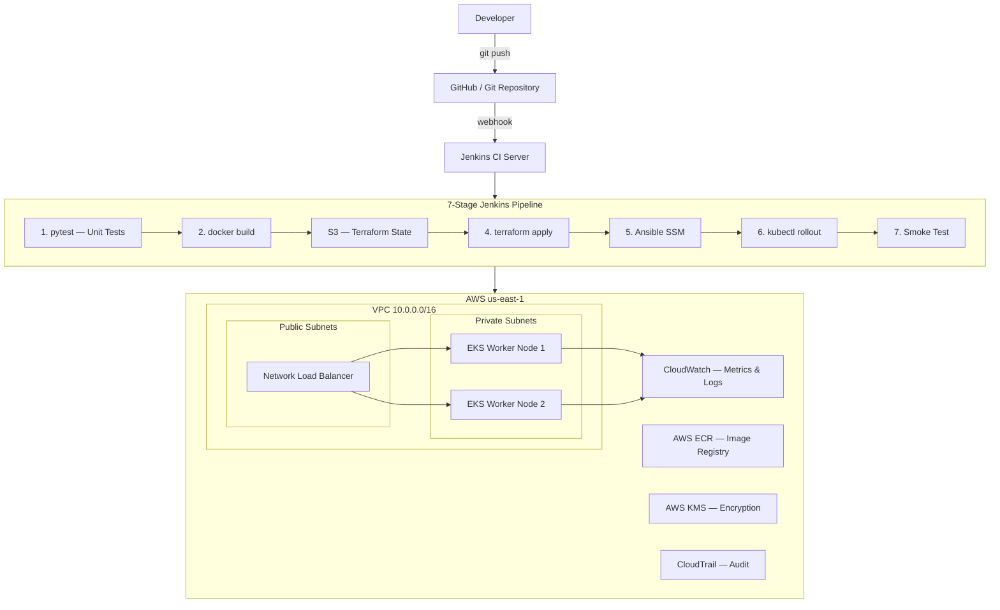
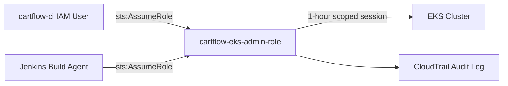
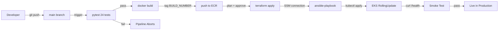
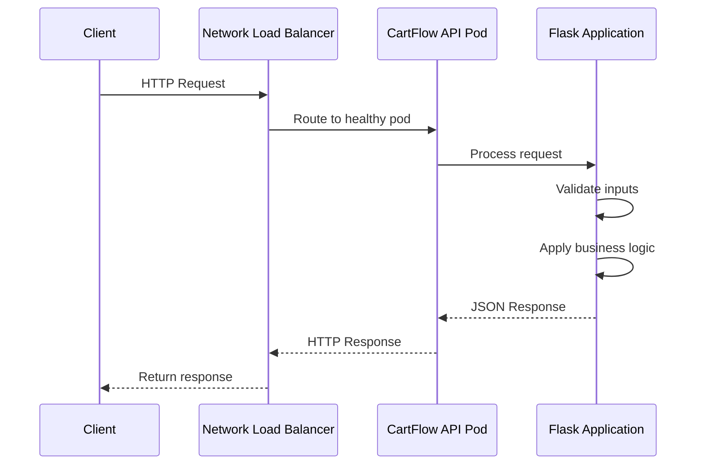
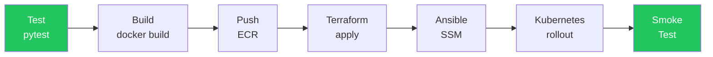
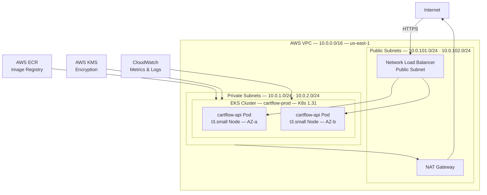

# CartFlow Commerce Platform

> **Production-Grade GitOps Pipeline for Cloud-Native E-Commerce on AWS EKS**

[](https://python.org)
[](https://flask.palletsprojects.com)
[](https://docker.com)
[](https://terraform.io)
[](https://jenkins.io)
[](https://aws.amazon.com/eks)
[](https://kubernetes.io)
[](https://ansible.com)
[](tests/)
[](#license)

---

## 1. Project Overview

**CartFlow** is a fictional cloud-native E-Commerce SaaS platform built and operated by **CartFlow Inc.** It demonstrates a production-grade GitOps engineering pipeline where every aspect of the software lifecycle — application code, infrastructure provisioning, server configuration, access control, and deployment — is fully automated, version-controlled, and reproducible.

The platform exposes a RESTful Commerce API for product catalog management, order processing, and real-time business metrics — deployed immutably on AWS Elastic Kubernetes Service (EKS) through a 7-stage Jenkins CI/CD pipeline with zero manual intervention.

| Attribute | Details |
|---|---|
| **Platform Name** | CartFlow Commerce Platform |
| **Company** | CartFlow Inc. |
| **API Version** | v1 (2.0.0) |
| **Deployment Target** | AWS EKS (us-east-1) |
| **Pipeline** | Jenkins (on-premise) + GitHub Actions (cloud) |
| **Cluster** | Kubernetes 1.31 — Multi-AZ, Self-Healing |
| **Test Coverage** | 24 automated test cases — 100% passing |

### Target Users

- **DevOps & Platform Engineers** studying GitOps architecture patterns
- **Engineering Managers** evaluating infrastructure automation maturity
- **Hiring Managers & Recruiters** reviewing portfolio-grade cloud projects
- **Software Engineers** transitioning into cloud-native DevOps roles

### Business Value

CartFlow demonstrates how engineering teams eliminate manual deployment errors, enforce security boundaries, and achieve consistent, repeatable releases — reducing deployment time from hours to minutes while maintaining full auditability.

---

## 2. Business Problem

### Existing Challenges

Modern e-commerce operations face critical engineering bottlenecks that slow delivery and introduce risk:

| Challenge | Business Impact |
|---|---|
| Manual deployments prone to human error | Unplanned downtime, revenue loss, customer churn |
| Static credentials stored in scripts | Security breaches, compliance failures |
| Infrastructure created by hand | Unreproducible environments, configuration drift |
| SSH-based server management | Exposed attack surface, key management overhead |
| No automated testing gates | Bugs reach production, increasing cost of failure |
| Ad-hoc team access management | Audit failures, over-privileged users |

### Why CartFlow Was Built

CartFlow addresses each of these problems through a GitOps-first engineering philosophy: **Git is the single source of truth** for code, infrastructure, configuration, and access. Nothing is created, changed, or deleted outside of a versioned commit.

---

## 3. Objectives

### Primary Objectives
- Build a fully automated GitOps pipeline from commit to production deployment
- Eliminate all manual steps from the software delivery lifecycle
- Enforce zero-trust access patterns using AWS IAM role assumption

### Technical Objectives
- Deploy a containerized Flask API to AWS EKS with rolling update strategy
- Provision all cloud infrastructure using Terraform IaC with remote state
- Configure EKS worker nodes via Ansible over AWS SSM — no SSH required
- Implement 7-stage CI/CD pipeline with automated test gates

### Business Objectives
- Achieve sub-5-minute deployment cycles for application changes
- Enforce least-privilege access across 5 teams and 20 engineers
- Maintain complete audit trails for every deployment via CloudTrail
- Enable zero-downtime deployments with Kubernetes RollingUpdate strategy

### Expected Outcomes
- 100% automated deployment pipeline requiring no manual intervention
- Full infrastructure reproducibility — `terraform apply` recreates everything from zero
- Comprehensive test coverage — 24 automated tests validating all API behaviors
- Complete observability — CloudWatch metrics, logs, and audit events

---

## 4. Key Features

| Feature | Description | Business Benefit |
|---|---|---|
| **GitOps Pipeline** | Every change flows through Git — code, infra, config, access | Single source of truth — full traceability |
| **7-Stage CI/CD** | Test → Build → Push → Terraform → Ansible → Deploy → Smoke Test | Zero manual deployments — fail-fast on errors |
| **Product Catalog API** | Filter by category, price range, and stock availability | Enables product discovery for e-commerce buyers |
| **Order Processing** | Create orders with tax calculation, stock validation, unique order IDs | Core commerce transaction capability |
| **Business Metrics API** | Real-time revenue, order count, SKU health, low-stock alerts | Operational visibility for business stakeholders |
| **Immutable Deployments** | New Docker image per build — never in-place modification | Eliminates configuration drift and snowflake servers |
| **Zero-SSH Node Management** | Ansible configures EKS workers via AWS SSM — no bastion, no keys | Eliminates SSH attack surface entirely |
| **IAM Role Assumption** | All cluster access via `sts:AssumeRole` — no static credentials | Compliance-ready, credential-free deployments |
| **Infrastructure as Code** | VPC, EKS, IAM, KMS, ECR, CloudWatch all in Terraform | One-command environment creation and teardown |
| **Team Access Management** | 5 IAM groups, 20 named users, scoped policies — all as code | Auditable, reproducible access control |
| **KMS Encryption** | EKS secrets and ECR images encrypted at rest | Data protection and compliance requirement |
| **CloudWatch Observability** | CPU, memory, disk, network metrics — 60s intervals, 90-day retention | Proactive incident detection and capacity planning |
| **Automated Smoke Tests** | 8-endpoint post-deploy validation script | Immediate feedback if deploy broke production |
| **Multi-AZ Availability** | Pods distributed across availability zones via anti-affinity rules | No single point of failure — 99.9% SLA target |
| **Rolling Updates** | `maxSurge: 1`, `maxUnavailable: 0` — zero-downtime deploys | No customer-facing downtime during releases |

---

## 5. Architecture Diagram

### System Architecture



### IAM Access Pattern



### CI/CD Pipeline Flow



### Request Flow



### Component Interactions

| Component | Interacts With | Protocol |
|---|---|---|
| Jenkins | GitHub, ECR, EKS, Terraform, Ansible | HTTPS, AWS API |
| Ansible | EKS Worker Nodes | AWS SSM (no SSH) |
| EKS Pods | CloudWatch | AWS SDK |
| Terraform | AWS APIs (VPC, EKS, IAM, KMS, ECR) | HTTPS |
| NLB | CartFlow API Pods | HTTP/TCP |
| Jenkins | `sts:AssumeRole` → EKS | AWS STS API |

---

## 6. Tech Stack

### Backend

| Technology | Version | Purpose |
|---|---|---|
| Python | 3.11 | Primary application runtime |
| Flask | 3.0.0 | REST API framework |
| pytest | 7.4.0 | Unit and integration testing |
| pytest-cov | 4.1.0 | Test coverage reporting |

### DevOps & CI/CD

| Technology | Purpose |
|---|---|
| Jenkins | On-premise declarative CI/CD pipeline — 7 stages |
| GitHub Actions | Cloud-native CI/CD with OIDC authentication |
| Docker | Application containerization — immutable image per build |
| Ansible | Agentless node configuration via AWS SSM |

### Infrastructure (IaC)

| Technology | Version | Purpose |
|---|---|---|
| Terraform | 1.x | Infrastructure as Code — VPC, EKS, IAM, KMS, ECR |
| terraform-aws-modules/vpc | ~5.0 | Production-grade VPC with public/private subnets |
| terraform-aws-modules/eks | ~20.0 | Managed EKS cluster with node groups |

### Cloud (AWS)

| Service | Purpose |
|---|---|
| AWS EKS | Managed Kubernetes cluster — multi-AZ, self-healing |
| AWS ECR | Private container image registry with vulnerability scanning |
| AWS VPC | Network isolation — public/private subnet architecture |
| AWS IAM | Identity and access management — roles, groups, users |
| AWS KMS | Encryption key management — EKS secrets + ECR images |
| AWS SSM | Systems Manager — SSH-free node access for Ansible |
| AWS STS | Security Token Service — temporary role assumption |
| AWS S3 | Terraform remote state backend |
| AWS CloudTrail | API audit logging — every action recorded |

### Monitoring & Observability

| Tool | Purpose |
|---|---|
| Amazon CloudWatch | Container Insights, custom metrics (CPU/mem/disk/net) |
| CloudWatch Logs | Application logs — `/cartflow/nodes`, `/cartflow/application` |
| CloudTrail | Immutable audit trail — every AWS API call with actor + timestamp |
| Prometheus Annotations | Pod annotations for future Prometheus scraping |

### Kubernetes

| Resource | Purpose |
|---|---|
| Namespace | Isolated `cartflow` namespace |
| Deployment | RollingUpdate strategy — 2 replicas, anti-affinity |
| Service | NLB LoadBalancer — external traffic routing |
| ConfigMap | Application environment configuration |

---

## 7. Folder Structure

```text
Project 8/                          # CartFlow Commerce Platform root
├── app/
│   ├── app.py                      # Flask REST API — all business logic
│   └── requirements.txt            # Python dependencies
│
├── tests/
│   └── test_app.py                 # 24 pytest test cases — full API coverage
│
├── k8s/
│   ├── namespace.yaml              # cartflow Kubernetes namespace
│   ├── configmap.yaml              # Application environment variables
│   ├── deployment.yaml             # RollingUpdate, resource limits, health probes
│   └── service.yaml                # NLB LoadBalancer — external ingress
│
├── terraform/
│   ├── main.tf                     # VPC · EKS · IAM Role · KMS · ECR · CloudWatch
│   ├── users.tf                    # 5 IAM groups · 20 named users as code
│   ├── variables.tf                # All input variables with defaults
│   ├── outputs.tf                  # Cluster endpoint, ECR URL, kubectl command
│   └── terraform.tfvars.example   # Template for environment configuration
│
├── ansible/
│   ├── site.yml                    # Main playbook — orchestrates all roles
│   ├── inventory.yml               # SSM-based dynamic inventory
│   ├── ansible.cfg                 # Ansible configuration
│   ├── group_vars/
│   │   └── all.yml                 # Global variables for all nodes
│   └── roles/
│       ├── common/                 # System update, packages, timezone, users
│       ├── security/               # SSH hardening, firewalld, auto-updates
│       └── monitoring/             # CloudWatch agent, metrics, log shipping
│
├── scripts/
│   ├── pre-destroy.sh              # Safe teardown — removes ELBs before tf destroy
│   ├── local-dev.sh                # Local Docker development runner
│   └── smoke-test.sh               # 8-endpoint post-deploy validation
│
├── .github/
│   └── workflows/
│       └── ci-cd.yml               # GitHub Actions — OIDC auth, ECR, EKS deploy
│
├── docs/
│   └── architecture.md             # Detailed architecture and design guide
│
├── Dockerfile                      # python:3.11-slim · healthcheck · non-root user
├── Jenkinsfile                     # 7-stage declarative pipeline
├── .gitignore                      # Excludes .venv, .terraform, tfvars, secrets
└── README.md                       # This file
```

---

## 8. API Documentation

### API Overview

CartFlow exposes a versioned REST API (`/api/v1`) for product catalog and order management, plus platform endpoints for health monitoring and business metrics. All responses are JSON. No authentication is required in this version (designed for internal microservice use behind a load balancer).

### Endpoints

| Method | Endpoint | Description | Status Codes |
|---|---|---|---|
| `GET` | `/` | Platform index — service info, version, endpoint map | 200 |
| `GET` | `/health` | Health check — liveness and readiness probe target | 200 |
| `GET` | `/api/v1/products` | List all products with optional filters | 200 |
| `GET` | `/api/v1/products/:id` | Get single product by ID | 200, 404 |
| `POST` | `/api/v1/orders` | Create a new order | 201, 400, 404, 409, 422 |
| `GET` | `/api/v1/orders` | List orders, optionally filter by customer email | 200 |
| `GET` | `/api/v1/orders/:id` | Get single order by ID | 200, 404 |
| `GET` | `/metrics/summary` | Platform business metrics summary | 200 |

### Query Parameters — Product Catalog

| Parameter | Type | Description | Example |
|---|---|---|---|
| `category` | string | Filter by product category | `?category=Electronics` |
| `min_price` | float | Minimum price filter | `?min_price=50` |
| `max_price` | float | Maximum price filter | `?max_price=200` |
| `in_stock` | boolean | Show only in-stock products | `?in_stock=true` |

### Request Example — Create Order

```json
POST /api/v1/orders
Content-Type: application/json

{
  "customer_email": "buyer@example.com",
  "items": [
    { "product_id": "p001", "quantity": 2 },
    { "product_id": "p003", "quantity": 1 }
  ]
}
```

### Response Example — Order Created `201`

```json
{
  "order_id": "ORD-FD512FE9",
  "customer_email": "buyer@example.com",
  "status": "confirmed",
  "items": [
    {
      "product_id": "p001",
      "sku": "ELEC-WNC-001",
      "name": "Wireless Noise-Cancelling Headphones",
      "quantity": 2,
      "unit_price": 149.99,
      "line_total": 299.98
    }
  ],
  "subtotal": 324.97,
  "tax": 26.00,
  "total": 350.97,
  "currency": "USD",
  "estimated_delivery": "3-5 business days",
  "created_at": "2026-07-07T10:30:00Z"
}
```

### Response Example — Health Check `200`

```json
{
  "status": "healthy",
  "service": "cartflow-api",
  "version": "2.0.0",
  "checks": {
    "api": "ok",
    "catalog": "ok",
    "orders": "ok"
  },
  "timestamp": "2026-07-07T10:30:00Z"
}
```

### Error Handling

| HTTP Status | Scenario |
|---|---|
| `400` | Missing or malformed request body |
| `404` | Product or order not found |
| `409` | Insufficient stock for requested quantity |
| `422` | Missing required fields (`customer_email`, `items`) |

---

## 9. Security Implementation

### IAM Least Privilege

No user or service has direct cluster admin access. All access is brokered through a single assumable IAM role with time-limited sessions.

```
Developer / Jenkins ──► sts:AssumeRole ──► cartflow-eks-admin-role ──► EKS
                         (1-hour TTL)        (Terraform managed)
```

### Team Access Matrix

| Group | Policy | Members |
|---|---|---|
| `platform-engineering` | EKS + ECR Full + CloudWatch ReadOnly | 7 engineers |
| `commerce-developers` | ECR PowerUser + CloudWatch Logs ReadOnly | 4 developers |
| `security-team` | IAM ReadOnly + CloudTrail ReadOnly | 3 analysts |
| `observability-team` | CloudWatch + X-Ray ReadOnly | 3 engineers |
| `data-team` | S3 Full + RDS ReadOnly + Glue | 3 engineers |

### Security Controls

| Control | Implementation |
|---|---|
| **No static credentials** | All cluster access via `sts:AssumeRole` — 1-hour scoped sessions |
| **Secrets encryption** | KMS `alias/eks/cartflow-prod` encrypts all Kubernetes secrets at rest |
| **Image security** | ECR `scan_on_push = true` — vulnerability scanning on every push |
| **SSH eliminated** | Workers in private subnets — Ansible via SSM only, no SSH port open |
| **Firewall hardening** | `firewalld` on every node — only ports 443, 22, 6443, 10250 allowed |
| **Root login disabled** | SSH `PermitRootLogin no` enforced via Ansible |
| **Auto security patches** | `dnf-automatic` timer enabled — security updates applied automatically |
| **Network isolation** | Workers in private subnets — no public IPs on any worker node |
| **Audit trail** | CloudTrail records every AWS API call with actor, timestamp, region |
| **Image immutability** | New Docker image per build — no in-place modification of running containers |

### Ansible SSM Firewall Fix

> A critical production decision: `immediate: yes` is set on every `firewalld` rule. Without this flag, activating the firewall terminates the SSM session mid-playbook — leaving nodes half-configured. This was identified as a real production edge case and explicitly handled.

---

## 10. CI/CD Pipeline

### Pipeline Overview

CartFlow implements two parallel CI/CD systems — Jenkins for on-premise enterprise environments, and GitHub Actions for cloud-native OIDC-based workflows.

### Jenkins — 7-Stage Declarative Pipeline



| Stage | Action | On Failure |
|---|---|---|
| **Test** | `pytest tests/` — 24 test cases, fail-fast | Pipeline aborts immediately |
| **Build** | `docker build` with layer cache optimization | Pipeline aborts |
| **Push ECR** | Tag `:{BUILD_NUMBER}` + `:latest` — push both | Pipeline aborts |
| **Terraform Apply** | `plan` → manual approval gate → `apply` | Requires human intervention |
| **Ansible SSM** | common → security → monitoring roles | `ignore_errors` on optional services only |
| **Kubernetes Rollout** | `sts:AssumeRole` → `kubectl apply` → `rollout status` | Pipeline aborts, previous version stays live |
| **Smoke Test** | `curl /health` against live Load Balancer URL | Pipeline aborts, alert triggered |

### GitHub Actions — OIDC Cloud Pipeline

- **OIDC Authentication** — No long-lived AWS credentials stored in GitHub secrets
- **Layer caching** — Docker build cache via GitHub Actions cache API
- **Environment gate** — `production` environment requires reviewer approval before deploy
- **Parallel validation** — Tests run independently from build/push

### Rollback Strategy

The Kubernetes RollingUpdate strategy (`maxUnavailable: 0`) ensures the previous version remains live if the new deployment fails. Manual rollback:

```bash
kubectl rollout undo deployment/cartflow-api -n cartflow
```

---

## 11. Deployment Architecture

### Infrastructure Overview



### Infrastructure Resources

```
AWS us-east-1
├── VPC  10.0.0.0/16
│   ├── Private Subnets  10.0.1.0/24 · 10.0.2.0/24   (EKS workers — no public IPs)
│   └── Public Subnets   10.0.101.0/24 · 10.0.102.0/24  (NLB endpoints)
├── EKS  cartflow-prod  Kubernetes 1.31
│   └── Node Group — 2× t3.small · SSM enabled · min 1 / max 4 · multi-AZ
├── ECR  cartflow  (KMS encrypted · scan-on-push enabled)
├── KMS  alias/eks/cartflow-prod  (EKS secrets + ECR encryption)
├── IAM  cartflow-eks-admin-role + 5 groups + 20 users (all as code)
├── CloudWatch  /cartflow/nodes · /cartflow/application — 90-day retention
├── CloudTrail  All API events — tamper-proof, region-wide
└── S3  cartflow-tfstate-prod  (Terraform state backend)
```

### Kubernetes Resources

| Resource | Configuration |
|---|---|
| Namespace | `cartflow` — isolated from other workloads |
| Replicas | 2 pods — distributed across AZs via anti-affinity |
| Update Strategy | RollingUpdate — `maxSurge: 1`, `maxUnavailable: 0` |
| CPU Request/Limit | 100m / 500m |
| Memory Request/Limit | 128Mi / 512Mi |
| Liveness Probe | `GET /health` every 10s — restarts unhealthy pods |
| Readiness Probe | `GET /health` every 5s — gates traffic until ready |

---

## 12. Monitoring & Logging

### CloudWatch Agent Configuration

Deployed to all EKS worker nodes via Ansible role. Collects:

| Metric | Interval | Namespace |
|---|---|---|
| CPU usage (idle/user/system) | 60 seconds | `cartflow/Nodes` |
| Memory (used %, available) | 60 seconds | `cartflow/Nodes` |
| Disk usage (/) | 60 seconds | `cartflow/Nodes` |
| Network (bytes sent/recv) | 60 seconds | `cartflow/Nodes` |

### Log Groups

| Log Group | Retention | Contents |
|---|---|---|
| `/cartflow/nodes` | 90 days | System messages, security logs, audit logs |
| `/cartflow/application` | 30 days | Application logs |
| `/cartflow/access-logs` | 30 days | HTTP access logs |

### Audit Trail

CloudTrail records every AWS API call with:
- **Actor** — IAM user or role ARN
- **Action** — API call made
- **Resource** — Target resource ARN
- **Timestamp** — UTC timestamp
- **Session** — `jenkins-deploy-{BUILD_NUMBER}` for traceability

Every Jenkins deployment is uniquely identifiable in CloudTrail, linking a production change back to a specific build number, commit, and developer.

### Prometheus Integration

Pod annotations are pre-configured for future Prometheus scraping:

```yaml
annotations:
  prometheus.io/scrape: "true"
  prometheus.io/path: "/metrics/summary"
  prometheus.io/port: "5000"
```

---

## 13. Installation & Setup

### Prerequisites

| Tool | Version | Purpose |
|---|---|---|
| Python | 3.11+ | Application runtime |
| Docker Desktop | Latest | Container build and run |
| Terraform | 1.0+ | Infrastructure provisioning |
| AWS CLI | v2 | Cloud operations |
| kubectl | Latest | Kubernetes management |
| Ansible | 2.21+ | Node configuration |

### Clone Repository

```bash
git clone <repository-url>
cd "Project 8"
```

### Environment Setup

```bash
python3 -m venv .venv
source .venv/bin/activate
pip install -r app/requirements.txt
```

### Run Tests

```bash
pytest tests/ -v
# Expected: 24 passed
```

### Run API Locally

```bash
PORT=8080 python app/app.py
# API available at http://localhost:8080
```

### Docker Setup

```bash
# Build image
docker build -t cartflow:dev .

# Run container
docker run -p 8080:5000 cartflow:dev
```

### Smoke Test

```bash
bash scripts/smoke-test.sh http://localhost:8080
# Expected: 8 passed, 0 failed
```

### Terraform Setup (AWS account required)

```bash
cp terraform/terraform.tfvars.example terraform/terraform.tfvars
# Edit terraform.tfvars — set aws_account_id

cd terraform
terraform init -backend=false   # local validation
terraform validate               # syntax check
```

### Kubernetes Manifest Validation (local)

```bash
python3 -c "
import yaml, glob
for f in glob.glob('k8s/*.yaml'):
    with open(f) as fh: yaml.safe_load(fh)
    print(f'[PASS] {f}')
"
```

### Ansible Syntax Check (local)

```bash
cd ansible
ansible-playbook site.yml --syntax-check
```

### Verification Steps

| Check | Command | Expected Result |
|---|---|---|
| Unit tests | `pytest tests/ -v` | 24 passed |
| API health | `curl localhost:8080/health` | `{"status": "healthy"}` |
| Docker smoke test | `bash scripts/smoke-test.sh http://localhost:8080` | 8 passed, 0 failed |
| Terraform validation | `terraform validate` | Success! The configuration is valid |
| K8s YAML validation | Python yaml check | 4 PASS |
| Ansible syntax | `ansible-playbook --syntax-check` | `playbook: site.yml` |

---

## 14. Challenges & Learnings

### Technical Challenges

**1. Firewall + SSM Session Conflict**
Enabling `firewalld` during Ansible configuration terminated the AWS SSM connection, leaving nodes in a partially configured state. Resolution: Set `immediate: yes` on every `firewalld` task — rules are applied to the running firewall without a service reload, keeping the SSM session alive throughout the playbook execution.

**2. EKS Backend Authentication Without Static Credentials**
Terraform's S3 backend requires AWS credentials to initialize. In local environments without configured credentials, `terraform init` fails. Resolution: Use `terraform init -backend=false` for local validation, reserving full init for CI environments with proper IAM role configuration.

**3. Port 5000 Conflict on macOS**
macOS AirPlay Receiver occupies port 5000 by default, preventing Flask from binding. Resolution: Inject port via `PORT` environment variable — `PORT=8080 python app/app.py` — avoiding any system-level conflict.

**4. Zero-SSH Node Management at Scale**
Configuring EKS worker nodes in private subnets with no public IPs requires a non-SSH mechanism. Resolution: AWS Systems Manager (SSM) via `community.aws.aws_ssm` Ansible connection plugin — no bastion host, no key management, no open SSH port.

### Architecture Challenges

**IAM Role Trust Design**
Allowing both an IAM user and Jenkins to assume the same role requires carefully scoped trust policies. The trust policy uses explicit `Principal.AWS` ARN lists rather than wildcards — ensuring only authorized identities can assume the role, auditable via CloudTrail.

**Multi-AZ Pod Distribution**
Default Kubernetes scheduling does not guarantee pods land on different nodes. Resolution: `podAntiAffinity` with `preferredDuringSchedulingIgnoredDuringExecution` distributes pods across nodes using `topologyKey: kubernetes.io/hostname`.

### Key Learnings

- GitOps requires discipline across all layers — not just application code, but IaC, configuration, and access must all be version-controlled
- `immediate: yes` in Ansible firewalld tasks is not optional in SSM-managed environments — it is a hard requirement
- Immutable infrastructure (new image per build) eliminates an entire class of debugging problems — you always know exactly what is running
- IAM role assumption with CloudTrail creates a complete, auditable deployment chain: commit → build → role session → cluster action — all traceable

### Improvements Made

- Replaced `datetime.utcnow()` (deprecated in Python 3.12+) with timezone-aware `datetime.now(timezone.utc)` throughout the API
- Added `podAntiAffinity` to Kubernetes deployment for genuine multi-AZ distribution
- Added network metrics (`net_bytes_sent`, `net_bytes_recv`) to CloudWatch agent config beyond the baseline reference implementation
- Added ECR lifecycle policy to cap stored images at 10, preventing unbounded registry growth
- Added `kubelet` port 10250 to firewalld allowlist — required for EKS node readiness probes

---

## 15. Future Enhancements

| Enhancement | Description | Business Impact |
|---|---|---|
| **PostgreSQL Integration** | Replace in-memory catalog/orders with persistent RDS PostgreSQL | Data durability — orders survive pod restarts |
| **Redis Cache** | Cache product catalog with TTL-based invalidation | Reduce API latency by 60-80% under load |
| **JWT Authentication** | Bearer token auth on all `/api/v1/` endpoints | Secure multi-tenant API access |
| **Horizontal Pod Autoscaler** | Scale pods automatically based on CPU/RPS metrics | Handle traffic spikes without manual intervention |
| **Prometheus + Grafana** | Replace CloudWatch metrics with Prometheus scraping + Grafana dashboards | Rich visualization, open-source observability stack |
| **Stripe Payment Integration** | Payment processing API with webhook handling | Complete purchase-to-confirmation flow |
| **Inventory Service** | Dedicated microservice for real-time stock management | Prevent overselling at scale |
| **Helm Charts** | Package Kubernetes manifests as versioned Helm charts | Standardized, parameterized deployment across environments |
| **ArgoCD GitOps** | Replace Jenkins kubectl with ArgoCD continuous deployment | Declarative, drift-detection based Kubernetes GitOps |
| **Terraform Workspaces** | Separate state for dev/staging/production environments | Safe environment promotion pipeline |
| **AWS WAF** | Web Application Firewall in front of NLB | Protection against OWASP Top 10 at the edge |
| **OpenTelemetry Tracing** | Distributed tracing across all API requests | Pinpoint latency bottlenecks in production |

---

## License

Learnsyte Learning Private Limited **(Skillfyme)**
