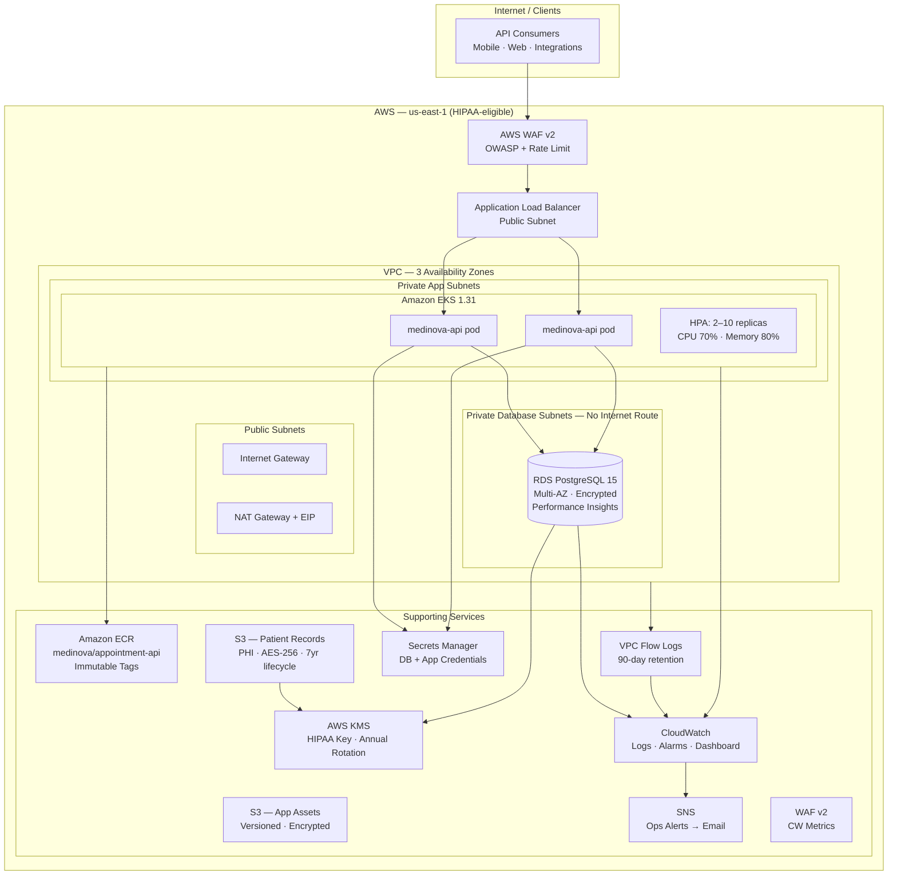
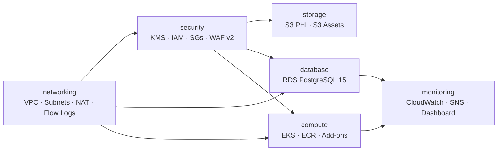
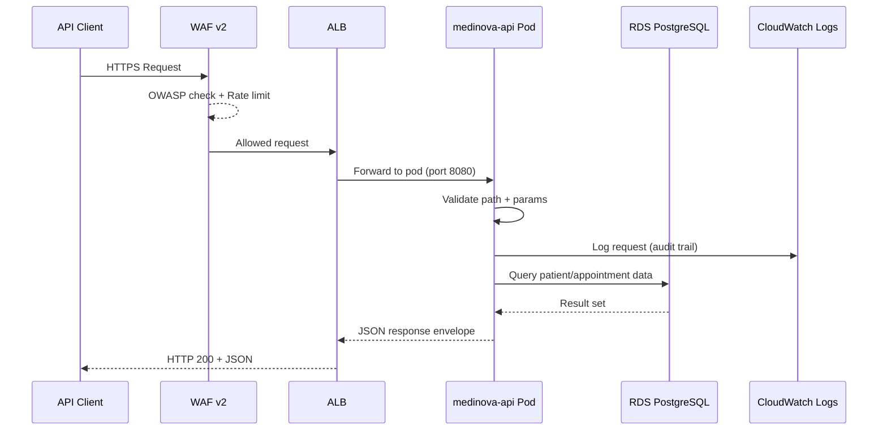
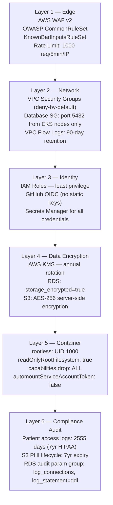
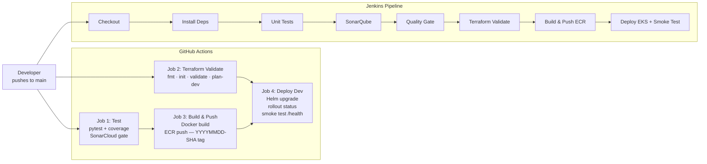
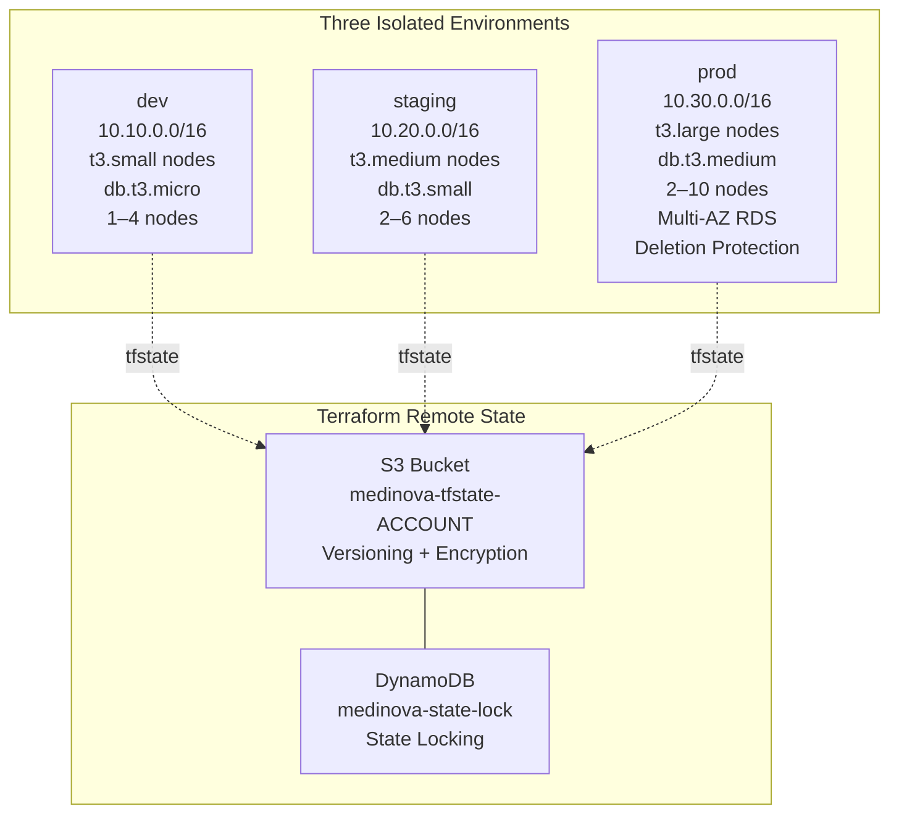

# MediNova Health Solutions

### Healthcare Appointment & Patient Management Platform

> *Smarter Healthcare, Closer to You*

**Company:** MediNova Health Solutions | **Domain:** medinova.health | **Cloud:** AWS (HIPAA-eligible)

---

## 1. Project Overview

**MediNova** is a cloud-native, HIPAA-aligned Healthcare Appointment & Patient Management Platform built on Amazon Web Services. It enables healthcare providers — hospitals, clinics, and individual practitioners — to digitise appointment booking, patient record management, doctor directory services, and clinical analytics through a secure, scalable REST API backend.

The platform is designed to serve as the data and services backbone for healthcare organisations seeking to modernise operations, reduce administrative overhead, and deliver a seamless patient-to-doctor experience across in-person and telemedicine channels.

| Attribute | Detail |
|-----------|--------|
| Platform Name | MediNova Appointment & Patient Management Platform |
| Company | MediNova Health Solutions |
| Industry | Healthcare / Digital Health |
| Deployment | Amazon Web Services — us-east-1 (HIPAA-eligible) |
| Architecture | Cloud-native microservice on Kubernetes |
| Compliance Target | HIPAA §164 (PHI data handling, audit retention) |
| API Standard | REST / JSON — stateless, versioned (`/api/v1/`) |

---

## 2. Business Problem

India's healthcare system faces a critical operational bottleneck: **the majority of appointment scheduling, patient record management, and doctor coordination is still handled through phone calls, paper registers, and fragmented software systems** that do not communicate with each other.

This results in:

- **Missed appointments** due to manual scheduling errors and lack of automated reminders
- **Fragmented patient history** — doctors lack access to prior records at the time of consultation
- **Operational inefficiency** — staff spend hours per day on coordination that should be automated
- **Security and compliance risk** — patient data stored in unencrypted spreadsheets, WhatsApp messages, and unprotected local systems
- **No analytics** — healthcare administrators cannot measure utilisation, cancellation rates, or revenue per specialisation
- **Telemedicine blind spot** — remote consultations are untracked and unaudited

MediNova addresses all of these gaps through a centrally managed, encrypted, auditable, cloud-hosted platform — giving patients, doctors, and administrators a single source of truth.

---

## 3. Objectives

### Primary Objectives
- Deliver a production-grade Healthcare Appointment & Patient Management API deployable on AWS
- Implement HIPAA-aligned data handling: encryption at rest and in transit, 7-year audit log retention, PHI data classification
- Provide a multi-environment infrastructure (dev / staging / prod) via Terraform IaC

### Technical Objectives
- Modular Terraform infrastructure (6 independent, composable modules)
- Container-first deployment: rootless Docker → Amazon ECR → Amazon EKS
- Automated CI/CD with zero long-lived AWS credentials (GitHub Actions OIDC)
- Horizontal Pod Autoscaling triggered by CPU and memory metrics
- Full observability: CloudWatch logs, alarms, operations dashboard, SNS alerts

### Business Objectives
- Reduce appointment no-shows through structured booking records and status tracking
- Enable telemedicine audit trails for regulatory compliance
- Provide 30-day analytics summaries to healthcare administrators for informed decision-making
- Support multi-city doctor directory with specialisation-level filtering

### Expected Outcomes
- A portfolio-grade, interview-ready DevOps project demonstrating end-to-end AWS infrastructure engineering
- A reusable Terraform module library applicable to any HIPAA-sensitive workload
- Documented deployment runbook usable by any operations team

---

## 4. Key Features

| Feature | Description | Business Benefit |
|---------|-------------|-----------------|
| Patient Management API | Register, retrieve, and filter patients by city and status | Single patient record accessible across all touchpoints |
| Doctor Directory | Doctor profiles with specialisation, availability slots, ratings, languages, and consultation fees | Patients find the right doctor instantly; reduces call centre load |
| Appointment Scheduling | Book, retrieve, and filter appointments by status, type, and patient | Eliminates scheduling conflicts; enables telemedicine and in-person tracking |
| Medical Records | Structured records with vitals, prescriptions, lab orders, and follow-up dates | Doctors access complete patient history at consultation time |
| 30-Day Analytics | Aggregate metrics: completion rate, telemedicine %, revenue, top specialisations | Administrators make evidence-based resource allocation decisions |
| HIPAA-Aligned Encryption | KMS-backed encryption for RDS and S3; AES-256 for all PHI at rest | Protects patient data from breaches; supports audit readiness |
| 7-Year Audit Retention | CloudWatch patient-access-audit log group with 2555-day retention | Meets HIPAA §164.530 record retention requirements |
| WAF v2 Protection | OWASP common rules + known-bad-inputs + rate limiting (1000 req/5min/IP) | Blocks SQL injection, XSS, and API abuse without code changes |
| VPC Flow Logs | All network traffic logged to CloudWatch with 90-day retention | Enables forensic analysis of lateral movement or data exfiltration attempts |
| EKS Autoscaling | HPA scales pods 2→10 on CPU >70% or Memory >80% | Platform handles traffic spikes without manual intervention |
| Rootless Containers | Pods run as UID 1000 with read-only filesystem and no Linux capabilities | Eliminates privilege escalation risk if a container is compromised |
| OIDC CI/CD Auth | GitHub Actions assumes AWS role via OIDC — no static keys stored in secrets | Eliminates long-lived credential exposure in CI/CD pipelines |
| Multi-Environment IaC | Separate tfvars for dev, staging, prod with tiered sizing and protection | Teams deploy safely to isolated environments without configuration drift |
| Secrets Manager Integration | DB credentials and app secrets stored in AWS Secrets Manager, not env vars | Prevents credentials from appearing in container logs or process lists |
| SonarCloud Quality Gate | Code quality analysis blocks deployments that fail coverage or bug thresholds | Enforces engineering standards before code reaches production |

---

## 5. Architecture Diagram

### Cloud Infrastructure Architecture



### Module Dependency Graph



### Request Flow



---

## 6. Tech Stack

### Backend

| Technology | Version | Purpose |
|------------|---------|---------|
| Python | 3.11 | Application runtime |
| Flask | 3.0.3 | REST API framework |
| Gunicorn | 22.0.0 | Production WSGI server |

### Testing & Quality

| Technology | Version | Purpose |
|------------|---------|---------|
| pytest | 8.2.2 | Unit test framework |
| pytest-cov | 5.0.0 | Code coverage measurement |
| SonarCloud | — | Static analysis + quality gate |

### Container & Registry

| Technology | Purpose |
|------------|---------|
| Docker | Rootless container build (UID 1000, read-only FS) |
| Amazon ECR | Private container registry — immutable tags, scan on push |

### Orchestration

| Technology | Version | Purpose |
|------------|---------|---------|
| Amazon EKS | 1.31 | Managed Kubernetes control plane |
| Helm | 3.x | Kubernetes application packaging and release management |
| Kubernetes HPA | autoscaling/v2 | CPU + memory-based horizontal autoscaling |

### Infrastructure as Code

| Technology | Version | Purpose |
|------------|---------|---------|
| Terraform | ≥ 1.6 | Cloud infrastructure provisioning |
| AWS Provider | ~5.30 | Terraform AWS resource definitions |
| S3 + DynamoDB | — | Terraform remote state + state locking |

### Cloud — AWS

| Service | Purpose |
|---------|---------|
| VPC | Isolated 3-tier network (public / private-app / private-database) |
| EKS | Managed Kubernetes — worker node group across 3 AZs |
| RDS PostgreSQL 15 | Patient data store — encrypted, Multi-AZ in prod, audit parameter group |
| Amazon ECR | Container image registry |
| S3 | PHI patient records (7yr) + application assets |
| KMS | HIPAA encryption key — annual rotation |
| Secrets Manager | Database and application credentials |
| WAF v2 | OWASP + rate limiting web application firewall |
| CloudWatch | Logs, alarms, operations dashboard |
| SNS | Ops alert email notifications |
| VPC Flow Logs | Network traffic audit trail |
| IAM | Least-privilege roles for EKS, nodes, CI/CD |

### CI/CD

| Technology | Purpose |
|------------|---------|
| GitHub Actions | Primary CI/CD — OIDC auth, 4-job pipeline |
| Jenkins | Secondary CI/CD — 8-stage declarative pipeline |

### Monitoring

| Tool | Purpose |
|------|---------|
| CloudWatch Logs | Application, API, and HIPAA audit log groups |
| CloudWatch Alarms | 5 alarms: API errors, CPU, memory, RDS CPU, RDS connections |
| CloudWatch Dashboard | Unified operations view — EKS metrics, RDS metrics, error logs, audit logs |
| SNS Email | Alert delivery to ops team |

---

## 7. Folder Structure

```text
Project 9/
│
├── terraform/                          # Root Terraform configuration
│   ├── providers.tf                    # AWS provider + default tags (Project, Company, HIPAA)
│   ├── backend.tf                      # S3 remote state + DynamoDB locking
│   ├── variables.tf                    # Validated input variables (HIPAA region enforcement)
│   ├── locals.tf                       # Computed values: name_prefix, is_production flags
│   ├── main.tf                         # Module orchestration — 6 modules wired together
│   ├── outputs.tf                      # VPC, EKS, RDS, ECR, S3, CloudWatch outputs
│   └── environments/
│       ├── dev/terraform.tfvars        # dev: 10.10.0.0/16, t3.small, db.t3.micro
│       ├── staging/terraform.tfvars    # staging: 10.20.0.0/16, t3.medium, db.t3.small
│       └── prod/terraform.tfvars       # prod: 10.30.0.0/16, t3.large, db.t3.medium, Multi-AZ
│
├── modules/                            # Reusable Terraform modules
│   ├── networking/                     # VPC, IGW, NAT, 3-tier subnets, route tables, flow logs
│   ├── security/                       # KMS, IAM roles, security groups, WAF v2
│   ├── compute/                        # EKS cluster, managed node group, ECR, 4 add-ons
│   ├── database/                       # RDS PostgreSQL 15, parameter group, enhanced monitoring
│   ├── storage/                        # S3 PHI bucket (HIPAA lifecycle) + app-assets bucket
│   └── monitoring/                     # CloudWatch log groups, 5 alarms, dashboard, SNS
│
├── app/                                # Healthcare Appointment API
│   ├── src/
│   │   └── main.py                     # Flask REST API — all endpoints and data models
│   ├── tests/
│   │   └── unit/
│   │       └── test_api.py             # 27 unit tests covering all endpoints and filters
│   ├── Dockerfile                      # Rootless Python 3.11-slim + Gunicorn
│   └── requirements.txt               # Flask, Gunicorn, pytest, pytest-cov, boto3
│
├── helm/medinova/                      # Helm chart for Kubernetes deployment
│   ├── Chart.yaml                      # Chart metadata — apiVersion v2, version 1.0.0
│   ├── values.yaml                     # Default values: replicas, HPA, security contexts, resources
│   └── templates/
│       ├── _helpers.tpl                # Template helpers: fullname, labels, selectorLabels
│       ├── deployment.yaml             # RollingUpdate, anti-affinity, tmp emptyDir, probes
│       ├── service.yaml                # ClusterIP — port 80 → 8080
│       └── hpa.yaml                    # autoscaling/v2 — CPU 70% + Memory 80%
│
├── kubernetes/base/                    # Raw Kubernetes manifests (non-Helm alternative)
│   ├── namespace.yaml                  # Namespace: medinova
│   ├── deployment.yaml                 # 2 replicas, rootless security context
│   ├── service.yaml                    # ClusterIP
│   └── hpa.yaml                        # HPA v2
│
├── scripts/
│   ├── validation/
│   │   └── validate_terraform.sh       # fmt check → init → validate (4-step)
│   ├── deployment/
│   │   ├── bootstrap_state.sh          # Create S3 + DynamoDB for remote state
│   │   └── deploy.sh                   # kubeconfig → helm upgrade → rollout status → smoke test
│   └── cleanup/
│       └── destroy.sh                  # Safety check (refuses prod) → helm uninstall → tf destroy
│
├── docs/
│   ├── architecture/ARCHITECTURE.md    # Component diagrams, network design, security layers
│   ├── guides/DEPLOYMENT_GUIDE.md      # Step-by-step deployment from bootstrap to prod
│   └── runbooks/OPERATIONS_RUNBOOK.md  # Incident response, scaling, backup/restore, WAF ops
│
├── .github/
│   └── workflows/
│       └── medinova-cicd.yml           # GitHub Actions — 4 jobs: test, tf-validate, build, deploy
│
├── Jenkinsfile                         # Jenkins declarative pipeline — 8 stages
├── sonar-project.properties           # SonarCloud project configuration
├── .coveragerc                         # pytest-cov configuration
├── .gitignore                          # Excludes .terraform/, .env, *.tfstate, .venv/
└── LICENSE                             # MIT License — MediNova Health Solutions
```

---

## 8. API Documentation

### API Overview

The MediNova REST API follows a versioned, stateless design. All responses use a consistent envelope format that includes a unique `request_id` (for distributed tracing), a Unix `timestamp`, and a `status` field.

**Base URL:** `http://localhost:8080` (local) | `https://api.medinova.health` (production)

**API Version:** `v1`

### Response Envelope

Every successful response returns:

```json
{
  "status": "success",
  "request_id": "a7f3d2c1-...",
  "timestamp": 1720000000,
  "data": { ... }
}
```

Every error response returns:

```json
{
  "status": "error",
  "request_id": "a7f3d2c1-...",
  "timestamp": 1720000000,
  "message": "Patient 'PAT-999' not found"
}
```

### Endpoints

| Method | Endpoint | Description | Query Parameters |
|--------|----------|-------------|-----------------|
| GET | `/` | Platform info — name, version, available services | — |
| GET | `/health` | Liveness probe — Kubernetes health check | — |
| GET | `/ready` | Readiness probe — Kubernetes startup gate | — |
| GET | `/api/v1/patients` | List all patients | `city`, `status` |
| GET | `/api/v1/patients/{id}` | Get single patient record | — |
| GET | `/api/v1/doctors` | List all doctors | `specialization`, `city` |
| GET | `/api/v1/doctors/{id}` | Get single doctor profile | — |
| GET | `/api/v1/appointments` | List all appointments | `status`, `type`, `patient_id` |
| GET | `/api/v1/appointments/{id}` | Get single appointment | — |
| GET | `/api/v1/medical-records` | List medical records | `patient_id` |
| GET | `/api/v1/medical-records/{id}` | Get single medical record with vitals and prescriptions | — |
| GET | `/api/v1/analytics/summary` | 30-day aggregate analytics | — |

### Request Examples

```bash
# Platform info
curl http://localhost:8080/

# Health check
curl http://localhost:8080/health

# List patients in Mumbai
curl "http://localhost:8080/api/v1/patients?city=Mumbai"

# Get specific patient
curl http://localhost:8080/api/v1/patients/PAT-001

# Filter doctors by specialization
curl "http://localhost:8080/api/v1/doctors?specialization=Cardiology"

# Filter telemedicine appointments
curl "http://localhost:8080/api/v1/appointments?type=telemedicine"

# Get medical record with vitals and prescriptions
curl http://localhost:8080/api/v1/medical-records/REC-001

# 30-day analytics summary
curl http://localhost:8080/api/v1/analytics/summary
```

### Response Examples

**`GET /api/v1/patients/PAT-001`**
```json
{
  "status": "success",
  "request_id": "c1a2b3d4-0000-0000-0000-000000000001",
  "timestamp": 1720960000,
  "data": {
    "patient": {
      "patient_id": "PAT-001",
      "name": "Rajesh Kumar",
      "age": 45,
      "gender": "Male",
      "blood_group": "O+",
      "city": "Mumbai",
      "medical_history": ["Hypertension", "Type 2 Diabetes"],
      "primary_doctor": "DR-001",
      "insurance_provider": "Star Health Insurance",
      "status": "active"
    }
  }
}
```

**`GET /api/v1/medical-records/REC-001`**
```json
{
  "status": "success",
  "data": {
    "record": {
      "record_id": "REC-001",
      "patient_id": "PAT-001",
      "diagnosis": "Hypertensive Heart Disease — Stable",
      "vitals": {
        "blood_pressure": "138/88 mmHg",
        "heart_rate": "76 bpm",
        "spo2": "98%",
        "weight": "82 kg"
      },
      "prescriptions": [
        {"medicine": "Amlodipine 5mg", "dosage": "1 tablet daily", "duration": "30 days"}
      ],
      "lab_tests_ordered": ["Lipid Profile", "HbA1c", "ECG"],
      "follow_up_date": "2024-08-15"
    }
  }
}
```

### Error Handling

| HTTP Status | Scenario |
|-------------|----------|
| 200 | Request succeeded |
| 404 | Resource not found (patient, doctor, appointment, record) |
| 405 | HTTP method not allowed on endpoint |
| 500 | Internal server error (logged to CloudWatch) |

---

## 9. Security Implementation

### Defence-in-Depth Architecture



### Security Controls Detail

| Control | Implementation | Standard |
|---------|---------------|----------|
| Encryption at rest — DB | `storage_encrypted = true` + KMS key | HIPAA §164.312(a)(2)(iv) |
| Encryption at rest — S3 | AES-256 SSE + all public access blocked | HIPAA §164.312(a)(2)(iv) |
| Encryption in transit | TLS enforced at ALB; RDS in VPC only | HIPAA §164.312(e)(2)(ii) |
| PHI data classification | RDS and S3 tagged `DataClass=PHI, Compliance=HIPAA` | HIPAA §164.308 |
| Audit log retention | CloudWatch 2555 days; S3 lifecycle 7yr | HIPAA §164.530(j) |
| Credential management | AWS Secrets Manager — never in env vars or code | NIST SP 800-57 |
| Network isolation | Database subnets have no internet route (no NAT, no IGW) | CIS AWS Benchmark |
| OWASP protection | WAF v2 AWSManagedRulesCommonRuleSet blocks SQLi, XSS | OWASP Top 10 |
| Rate limiting | 1000 requests per 5 minutes per IP — blocks API abuse | OWASP API Top 10 |
| Key rotation | KMS `enable_key_rotation = true` — annual automatic | NIST SP 800-57 |
| No static CI/CD keys | GitHub Actions OIDC — `sts:AssumeRoleWithWebIdentity` | AWS Security Best Practices |
| Privileged container prevention | `allowPrivilegeEscalation: false`, `runAsNonRoot: true` | CIS Kubernetes Benchmark |

---

## 10. CI/CD Pipeline

### Pipeline Architecture



### GitHub Actions — 4 Jobs

| Job | Trigger | What it does |
|-----|---------|-------------|
| `test` | Push to main/develop, PR to main | Install deps → pytest with coverage → SonarCloud quality gate |
| `terraform-validate` | Push to main (after test passes) | fmt check → init -backend=false → validate → plan dev |
| `build-push` | Push to main (after test passes) | OIDC auth → ECR login → docker build → push with tag `YYYYMMDD-SHORTSHA` |
| `deploy-dev` | After terraform-validate AND build-push | EKS kubeconfig → Helm upgrade → rollout status → pod smoke test |

### Jenkins Pipeline — 8 Stages

| Stage | Action |
|-------|--------|
| Checkout | `checkout scm` |
| Install Dependencies | `pip install -r app/requirements.txt` |
| Unit Tests | `pytest --cov=src --cov-report=xml` |
| SonarQube Analysis | `sonar-scanner` with coverage report |
| Quality Gate | `waitForQualityGate abortPipeline: true` |
| Terraform Validate | `fmt -check` + `init -backend=false` + `validate` |
| Build & Push to ECR | `docker build` + `docker push` to ECR |
| Deploy to EKS + Smoke Test | `helm upgrade --install` + `kubectl rollout status` + health assertion |

### Image Tagging Strategy

Images are tagged as `YYYYMMDD-SHORTSHA` (e.g., `20241215-a1b2c3d`) ensuring:
- Chronological sortability
- Unique, immutable reference per commit
- ECR image tag immutability enforced at registry level

---

## 11. Deployment Architecture

### Infrastructure Overview



### Environment Comparison

| Attribute | dev | staging | prod |
|-----------|-----|---------|------|
| VPC CIDR | 10.10.0.0/16 | 10.20.0.0/16 | 10.30.0.0/16 |
| EKS Node Type | t3.small | t3.medium | t3.large |
| EKS Min / Max Nodes | 1 / 4 | 2 / 6 | 2 / 10 |
| DB Instance | db.t3.micro | db.t3.small | db.t3.medium |
| DB Storage | 20 GB gp3 | 50 GB gp3 | 100 GB gp3 |
| DB Multi-AZ | No | No | Yes |
| DB Backup Retention | 3 days | 7 days | 14 days |
| Performance Insights | 7 days | 7 days | 731 days |
| KMS Deletion Window | 7 days | 7 days | 30 days |
| Deletion Protection | No | No | Yes |
| Skip Final Snapshot | Yes | Yes | No |

### VPC 3-Tier Network Design

| Tier | Subnets | Internet Access | Hosts |
|------|---------|----------------|-------|
| Public | `/24` × 3 AZs | Internet Gateway (inbound + outbound) | ALB, NAT Gateway |
| Private App | `/24` × 3 AZs | NAT Gateway (egress only) | EKS worker nodes, API pods |
| Private Database | `/24` × 3 AZs | None — fully isolated | RDS PostgreSQL |

The database tier has no route table entry to the NAT Gateway or Internet Gateway — it is unreachable from the public internet by network design, not merely by security group.

### Terraform Module Architecture

| Module | Resources Provisioned |
|--------|----------------------|
| `networking` | VPC, 9 subnets (3×3 tiers), IGW, NAT GW, EIP, 3 route tables, VPC Flow Logs + IAM |
| `security` | KMS key + alias, 3 security groups, 4 IAM roles, Secrets access policy, WAF v2 |
| `compute` | ECR repository + lifecycle policy, EKS cluster (5 log types), node group, 4 add-ons |
| `database` | DB subnet group, PostgreSQL 15 parameter group (audit), RDS instance, enhanced monitoring IAM |
| `storage` | S3 patient-records (PHI, versioning, encryption, lifecycle, access logging), S3 app-assets |
| `monitoring` | SNS topic + email sub, 3 CloudWatch log groups, 5 alarms, operations dashboard |

---

## 12. Monitoring & Logging

### CloudWatch Log Groups

| Log Group | Retention | Classification | Purpose |
|-----------|-----------|---------------|---------|
| `/medinova/{env}/application` | Configurable (default 90d) | Internal | General application logs |
| `/medinova/{env}/appointment-api` | Configurable (default 90d) | Internal | API request/response logs |
| `/medinova/{env}/patient-access-audit` | **2555 days (7 years)** | PHI-Audit · HIPAA | Patient data access audit trail |
| `/medinova/{env}/vpc-flow-logs` | 90 days | Security | Network traffic forensics |
| RDS CloudWatch logs | Managed by RDS | PHI-Audit | postgresql + upgrade logs |

### CloudWatch Alarms

| Alarm | Metric | Threshold | Period | Action |
|-------|--------|-----------|--------|--------|
| `api-high-error-rate` | ALB HTTPCode_Target_5XX_Count | > 10 in 5 min | 5 min | SNS → email |
| `node-cpu-high` | EC2 CPUUtilization | > 80% | 2 min × 3 | SNS → email |
| `node-memory-high` | CWAgent mem_used_percent | > 85% | 2 min × 3 | SNS → email |
| `rds-cpu-high` | RDS CPUUtilization | > 75% | 5 min × 2 | SNS → email |
| `rds-connections-high` | RDS DatabaseConnections | > 100 | 5 min × 2 | SNS → email |

### Operations Dashboard

The CloudWatch dashboard `medinova-{env}-operations` contains:
- EKS node CPU utilisation — time series
- RDS CPU + database connections — time series
- Appointment API error log — live query (last 100 ERROR events)
- Patient access audit log — live query (last 50 events)

---

## 13. Installation & Setup

### Prerequisites

| Tool | Minimum Version |
|------|----------------|
| Python | 3.11 |
| Terraform | 1.6 |
| AWS CLI | 2.13 |
| kubectl | 1.28 |
| Helm | 3.12 |
| Docker | 24 |

### Local Development (No AWS Account Required)

```bash
# 1. Clone the repository
git clone https://github.com/Skillfyme-R/DevOps-Capstone-Projects.git
cd "DevOps-Capstone-Projects/Project 9/app"

# 2. Create virtual environment
python3 -m venv .venv
source .venv/bin/activate        # macOS/Linux
# .venv\Scripts\activate         # Windows

# 3. Install dependencies
pip install -r requirements.txt

# 4. Start the API server
ENVIRONMENT=dev APP_VERSION=1.0.0 python src/main.py

# 5. Test in browser or terminal
curl http://localhost:8080/health
curl http://localhost:8080/api/v1/patients
curl "http://localhost:8080/api/v1/doctors?specialization=Cardiology"
curl "http://localhost:8080/api/v1/appointments?type=telemedicine"

# 6. Run test suite
pytest tests/unit/ -v --cov=src
```

### Docker Build

```bash
cd "Project 9/app"
docker build -t medinova-api:1.0.0 .
docker run -p 8080:8080 -e ENVIRONMENT=dev -e APP_VERSION=1.0.0 medinova-api:1.0.0
curl http://localhost:8080/health
```

### AWS Infrastructure Deployment

```bash
# Step 1: Bootstrap remote state (first time only)
bash scripts/deployment/bootstrap_state.sh

# Step 2: Update terraform/backend.tf with your account ID

# Step 3: Validate Terraform
bash scripts/validation/validate_terraform.sh

# Step 4: Deploy dev infrastructure
cd terraform
terraform init
terraform plan \
  -var-file="environments/dev/terraform.tfvars" \
  -var="db_master_password=YourSecurePassword" \
  -var="patient_records_bucket=medinova-dev-patient-records-ACCOUNT_ID" \
  -var="app_assets_bucket=medinova-dev-app-assets-ACCOUNT_ID"
terraform apply ...

# Step 5: Configure kubectl
aws eks update-kubeconfig --name medinova-dev-cluster --region us-east-1

# Step 6: Deploy application
bash scripts/deployment/deploy.sh dev 1.0.0
```

### Verification

```bash
# Check pods
kubectl get pods -n medinova

# Port-forward and test
kubectl port-forward -n medinova svc/medinova 8080:80
curl http://localhost:8080/health
curl http://localhost:8080/api/v1/analytics/summary
```

---

## 14. Challenges & Learnings

### Technical Challenges

| Challenge | Resolution |
|-----------|-----------|
| HIPAA log retention in Terraform | Used `retention_in_days = 2555` (7 years exactly) on the patient-access-audit log group; this is not a built-in CloudWatch preset and required explicit calculation |
| RDS audit logging without RDS Proxy | Configured PostgreSQL parameter group with `log_connections=1`, `log_disconnections=1`, `log_statement=ddl` — native audit without third-party tooling |
| EKS node autoscaling drift with Terraform | `ignore_changes = [scaling_config[0].desired_size]` in `aws_eks_node_group` lifecycle block prevents Terraform from overwriting HPA/cluster-autoscaler scaling decisions |
| Container writable filesystem constraint | Flask/Gunicorn needs a writable `/tmp`; resolved with `emptyDir` tmpfs volume mounted at `/tmp` while keeping `readOnlyRootFilesystem: true` |
| GitHub Actions OIDC trust policy | Required exact `StringLike` condition on `token.actions.githubusercontent.com:sub` scoped to `repo:medinova-health/*:*` to prevent other repos from assuming the role |
| Terraform backend bootstrap order | The S3 backend cannot be initialised before the bucket exists — implemented `bootstrap_state.sh` to create bucket and DynamoDB table as a pre-Terraform step |

### Architecture Challenges

| Challenge | Decision Made |
|-----------|--------------|
| Database isolation vs. connectivity | Chose fully isolated database subnets (no NAT route) rather than "private with NAT" — this means RDS patches apply through the maintenance window only, not ad-hoc, which is acceptable for HIPAA environments |
| Multi-AZ cost vs. availability | Multi-AZ enabled in prod only (derived via `locals.tf` `is_production` flag) — dev and staging use Single-AZ to reduce cost while keeping the same Terraform code |
| Helm vs. raw Kubernetes manifests | Provided both — `helm/medinova/` for production deployments and `kubernetes/base/` for teams that prefer raw YAML; Helm is the primary delivery mechanism |
| HPA metric selection | Used both CPU (70%) and memory (80%) in `autoscaling/v2` — CPU alone misses memory-bound workloads common in data-processing endpoints like analytics summary |

### Key Learnings

- Terraform `locals.tf` is the right place to centralise environment-specific logic — `is_production = var.environment == "prod"` propagated cleanly across 6 modules without repeating ternary expressions everywhere
- HIPAA compliance in IaC is not a checkbox — it requires tagging strategy (`DataClass=PHI`, `Compliance=HIPAA`), lifecycle policies, audit parameter groups, KMS integration, and network isolation working together
- The `autoscaling/v2` API for HPA is significantly more expressive than `v1` — the ability to specify separate CPU and memory targets in a single HPA object simplifies the deployment considerably
- OIDC-based CI/CD auth eliminates an entire class of credential rotation and secret scanning problems; the AWS `sts:AssumeRoleWithWebIdentity` flow with GitHub Actions is production-ready and free

---

## 15. Future Enhancements

| Enhancement | Business Impact |
|-------------|----------------|
| PostgreSQL connection pooling (PgBouncer sidecar) | Reduces RDS connection exhaustion under high HPA scale-out; allows more aggressive autoscaling |
| Redis-backed appointment availability cache | Eliminates repeated DB reads for doctor slot lookups; reduces latency for high-traffic booking flows |
| AWS Cognito for patient and doctor authentication | Enables secure multi-tenant access; supports MFA for PHI access — required for public-facing production |
| AWS App Mesh (service mesh) | Provides mTLS between services, traffic shaping, and retries without code changes |
| Amazon SNS + SES for appointment reminders | Automated patient reminders reduce no-show rate — directly increases revenue per clinic |
| SonarQube self-hosted with SAST | Enables IP-private code analysis; allows custom healthcare security rule sets |
| Terraform Cloud / Atlantis for PR-based apply | GitOps-style infrastructure changes with PR approvals before `terraform apply` runs |
| AWS GuardDuty | ML-based threat detection for EC2, EKS, and S3 — adds continuous monitoring layer above WAF |
| ArgoCD for GitOps application delivery | Replaces Helm CLI in CI/CD with declarative, auditable, pull-based Kubernetes deployments |
| Multi-region active-passive DR | RDS cross-region read replica + Route53 health-check failover for healthcare SLA requirements |
| OpenTelemetry instrumentation | Distributed tracing across API calls — accelerates incident root-cause analysis |
| Prescription management module | Enables e-prescriptions, pharmacy integration, and medication adherence tracking |

---

## License

Copyright © Learnsyte Learning Private Limited **(Skillfyme)**. All rights reserved.
